# NAS 跨叢集 rsync 同步系統 — 維運手冊（v3.16，zh-TW）

> **對象**：部署與維運此系統的 SRE / 維運人員。
> **版本**：v3.16。唯一權威來源是 `cross-cluster-rsync-guide-v3.16-consolidated.md`（以下簡稱 **guide**）。
> **語言**：說明使用繁體中文（台灣用語）；程式碼、指令、YAML、檔案路徑、環境變數名稱與 log 訊息一律保留英文原文。
> **相關文件**：v3.15 → v3.16 修了什麼、怎麼套用、怎麼驗證，見 [v3.15-to-v3.16-changes-and-verification.zh-TW.md](v3.15-to-v3.16-changes-and-verification.zh-TW.md)；操作情境（英文）見 [runbook](nas-sync-operations-runbook.md)；權威來源 [guide](../cross-cluster-rsync-guide-v3.16-consolidated.md)。

## 目錄

- [0. 文件說明](#0-文件說明)
- [1. 系統總覽](#1-系統總覽)
- [2. 核心概念](#2-核心概念)
- [3. 同步流程圖](#3-同步流程圖)
- [4. 如何使用](#4-如何使用)
- [5. K8s YAML 注意事項](#5-k8s-yaml-注意事項)
- [6. Troubleshooting](#6-troubleshooting)
- [7. 已知限制](#7-已知限制)
- [8. 參考](#8-參考)

---

## 0. 文件說明

### 0.1 版本與依據

- 本手冊對應 **v3.16**。guide 裡每個 fenced code block（shell script、Dockerfile、K8s / Istio manifest）都是可直接部署的正式程式，本手冊中所有 log 字串、預設值、exit code、路徑、YAML 欄位皆以這些程式碼為準。
- 「guide §X」指 guide 的章節號（例如 guide §8.5 是 `dispatch-sync.sh`）；「本手冊 X.Y」指本檔自己的章節。
- 若本手冊與 guide 不一致，**以 guide 為準**，並請回報修正本手冊。
- 本手冊不修改任何腳本或 manifest；要改 guide 請依 `CLAUDE.md` 的規則（不得重新編號章節、改 script 後須跑 `scripts/check-guide.sh` 與 `scripts/test-guide-behavior.sh`）。

### 0.2 與其他文件的關係

| 文件 | 角色 | 什麼時候看 |
|---|---|---|
| [`cross-cluster-rsync-guide-v3.16-consolidated.md`](../cross-cluster-rsync-guide-v3.16-consolidated.md) | **參考（reference）**：每個檔案、每個旗標、為什麼這樣寫 | 要複製腳本 / manifest、要確認某個行為的原始依據 |
| [`nas-sync-operations-runbook.md`](nas-sync-operations-runbook.md) | **程序（procedure）**：情境式 S0–S14（greenfield、bulk seed、新增 target、斷線復原、退役、升級、tuning、唯讀來源） | 「我現在要做 X，依序做什麼」 |
| [`superpowers/specs/2026-10-01-v316-review-fixes-design.md`](superpowers/specs/2026-10-01-v316-review-fixes-design.md) | **v3.16 為什麼這樣改**：每個 finding 的重現方式與設計；§11 已知限制 | 想理解 lock、generation、SIGTERM 設計的原因 |
| [`reviews/2026-07-22-nas-sync-architecture-review.md`](reviews/2026-07-22-nas-sync-architecture-review.md) | 架構審查：為何選 rsync、替代方案、mtime 偵測的極限、v3.15 的 16 項修正 | 想理解整體架構選型 |
| **本手冊** | **營運導向的全貌**：架構與元件、核心概念、流程圖、使用方式、K8s YAML 注意事項、參數表、排錯手冊 | 日常維運、值班、新人 onboarding |

本手冊與 runbook 互補：runbook 回答「這個情境下依序做什麼」，本手冊回答「這個系統怎麼運作、每個欄位為什麼存在、出事時怎麼判斷」。對於 runbook 已有完整步驟的情境，本手冊只摘要並連結，不重複貼上全部指令。

### 0.3 慣例

| 項目 | 值 |
|---|---|
| rsync daemon port | `8787` |
| Namespace | `ea-pmc`（兩個叢集都一樣） |
| kubectl context | `--context cluster-b` = 來源（source）側叢集；`--context cluster-a` = 某個 target 側叢集。**請換成你自己的 context 名稱**；多 target 時例如 `cluster-c` |
| 刪除政策 | **target 端永遠不刪除**：target 上獨有的檔案一律保留。**禁止**在任何 rsync 指令加入 rsync 的刪除選項。rename 後留下的孤兒副本是已知且接受的代價（本手冊第 7 章） |
| 日誌 | console-only：只能用 `kubectl logs` 看；Job pod 超出 history limit 後 log 就消失，所以另有 status file（本手冊 2.3） |
| Image | `${REGISTRY}/nas-sync-server:3.16`（Cluster B）、`${REGISTRY}/nas-sync-client:3.16`（Cluster A） |
| 容器內腳本路徑 | client：`/userapp/scripts/*.sh`；server image 的 generator：`/userapp/scripts/*.sh`，rsyncd 入口：`/entrypoint.sh` |
| 來源 NFS 掛載點 / 目標 NFS 掛載點 | `/mnt/nas-source`（Cluster B pod）/ `/mnt/nas-target`（Cluster A pod） |

**標記說明**：本手冊絕大部分內容直接來自 guide 的程式碼或文字。少數段落帶有以下標記，請注意可信度：

- **（推論）**：從程式碼閱讀推得，guide 沒有明說，`scripts/test-guide-behavior.sh` 也未涵蓋。
- **（通用行為）**：Kubernetes / Istio / rsync / 作業系統的通用行為，不是 guide 的內容，本手冊撰寫時未在實際叢集驗證。

### 0.4 快速入口

| 我想… | 去哪裡 |
|---|---|
| 了解整個系統長什麼樣子 | 1.2–1.3 |
| 知道某個物件（CronJob / ConfigMap / script）是做什麼的 | 1.4 元件表 |
| 第一次部署 | 4.1，再配合 runbook S1 |
| 手動跑一次同步 / 切換模式 / 看 status file | 4.3 |
| 新增一個 target | 4.4，再配合 runbook S4 |
| 大量初始資料 seed | 4.5，再配合 runbook S2、S3 |
| 查某個環境變數的預設值與錯誤時的行為 | 4.6 |
| 改 YAML 前想知道有哪些坑 | 第 5 章 |
| Job 失敗 / 沒在跑 / 資料不對 | 第 6 章（6.4 有決策樹） |
| 某個機制為什麼這樣設計（lock、generation、SIGTERM） | 3.4、3.5、3.6 與 spec |

### 0.5 本手冊不涵蓋

- NAS 儲存設備本身（NFS export、權限、容量）的維運，只列出與本系統相關的檢查項目（guide §3、runbook S0）。
- Istio 控制面與 ingress gateway 本身的維運，只涵蓋本系統相關的物件（guide §5.6–§5.8）。
- 修改 guide 內容的流程（見 `CLAUDE.md`）。

---

## 1. 系統總覽

### 1.1 系統做什麼

這是一套**單向（NAS B → NAS A）**的跨叢集檔案複寫系統：Cluster B 上的 rsync daemon 透過 Istio Gateway 對外提供唯讀的 `nas-data` module，每個 target 叢集（Cluster A、C、D …）用 CronJob 或 Deployment 以 **pull** 的方式把資料拉回自己的 NAS。一個來源可以同時餵給多個 target，每個 target 以 `CLIENT_ID` 區分。

設計前提（guide 開頭與 `CLAUDE.md`）：

- 規模：約 **740 萬個資料夾**、變動率約 **0.17%**，所以日常用「只同步變動檔案」的 `incremental`，再用每週全量 `parallel` reconcile 補齊 mtime 看不到的變化。
- 目標端**不刪除**；rsync 一律加 `--partial-dir=.rsync-partial`，被中斷的傳輸不會在目標端留下截斷的同名檔案。
- 所有 client 只有**一個 image**，行為由環境變數選擇（本手冊 2.1）。

### 1.2 架構圖（ASCII）

```
   NAS B (source)                                   NAS A (target)      NAS C, NAS D ... (more targets)
   10.90.220.155:/PMCenterData                      10.19.192.228:/srv/nfs/data
        |  NFS (rw*)                                      ^  NFS (rw, via PVC)
        v                                                 |
 +------------------------------+   rsync :8787 pull   +--------------------------------+
 | CLUSTER B  (cluster-b)       | <------------------- | CLUSTER A  (cluster-a)         |
 |                              |   via Istio Gateway  |  one cluster per target        |
 |  nas-sync-server  Deployment |   + VirtualService   |                                |
 |    rsyncd :8787              |                      |  nas-sync-client    CronJob    |
 |  nas-sync-manifest  CronJob  |                      |    incremental, every 2h       |
 |    writes clients/<id>/      |                      |  nas-sync-reconcile CronJob    |
 |  nas-sync-chunks    CronJob  |                      |    parallel, weekly (REQUIRED) |
 |    writes common/chunks/     |                      |  nas-sync-verify    CronJob    |
 |  ConfigMap nas-sync-clients  |                      |    dry-run, monthly            |
 |    (registry of CLIENT_IDs)  |                      |  nas-sync-client-deploy        |
 +------------------------------+                      |    Deployment, bulk seed       |
                                                       +--------------------------------+
   * rw is required for incremental (manifests) and chunked parallel (chunk lists):
     both are written into .nas-sync-state/ on the source NAS.
```

### 1.3 架構圖（mermaid）

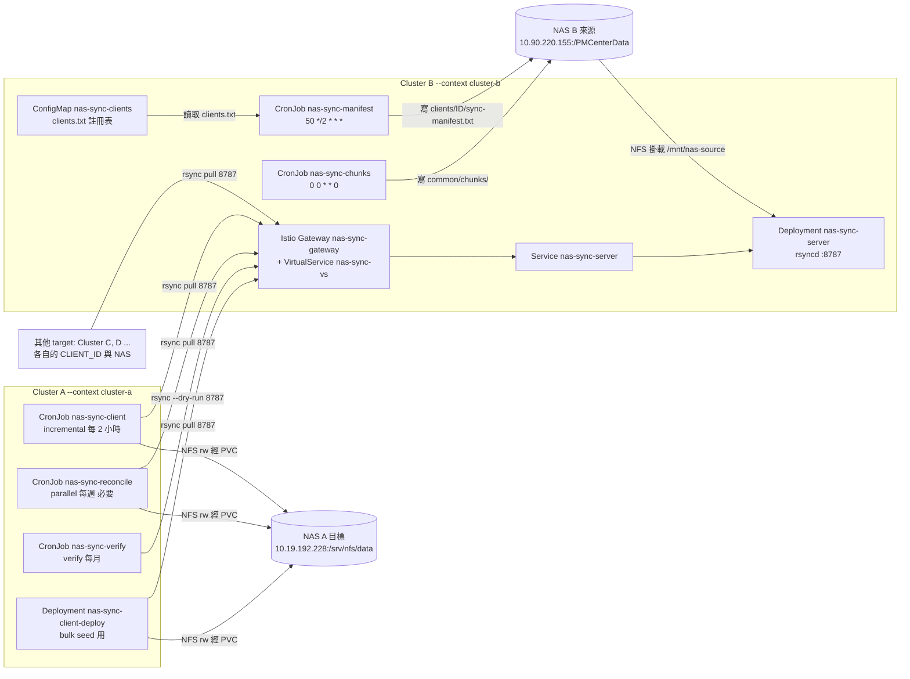

讀圖重點：

- 資料路徑：client pod → Istio ingress gateway（Cluster B，TCP 8787）→ `VirtualService` → `Service nas-sync-server` → rsyncd → `/mnt/nas-source`（NAS B）。
- 控制 / 狀態路徑：兩個 generator CronJob **直接掛載 NAS B**，把 manifest 與 chunk 清單寫進 `.nas-sync-state/`；client 再透過**同一個 rsyncd** 把這些檔案抓回來。所以 server 端 `rsyncd.conf` 的 `exclude =` **不可**加入 `.nas-sync-state/`（guide §5.2、§9A.1）。
- 每個 target 的執行結果寫在**自己的 NAS A**（`.nas-sync-status/`），與其他 target 完全無關。

### 1.4 元件表（對應 guide §14 File Checklist 的每一項）

**Cluster B（source，`--context cluster-b`）**

| 物件 | 叢集 | 種類 | Image | Script / guide § | 用途 |
|---|---|---|---|---|---|
| `ea-pmc`（`namespace.yaml`） | B | Namespace | — | §5.1 | 兩個叢集共用的 namespace 名稱 |
| `rsyncd-config`（`configmap-rsyncd.yaml`） | B | ConfigMap | — | §5.2 | `rsyncd.conf`：`[nas-data]` module、`read only = yes`、`reverse lookup = no`、server 端 exclude |
| `rsync-secrets`（`secret-password.yaml`） | B | Secret | — | §5.3 | `rsyncd.secrets`，格式 `syncuser:密碼` |
| `nas-sync-server`（`deployment-server.yaml`） | B | Deployment | `nas-sync-server:3.16` | `/entrypoint.sh`（§4.2）；§5.4 | 常駐的 rsync daemon，掛載 NAS B 於 `/mnt/nas-source` |
| `nas-sync-server`（`service.yaml`） | B | Service（ClusterIP） | — | §5.5 | 對叢集內與 VirtualService 暴露 8787 |
| `nas-sync-gateway`（`gateway.yaml`） | B | Istio Gateway | — | §5.6 | 在非 route 的 ingressgateway 上開 TCP 8787 |
| `nas-sync-vs`（`virtualservice.yaml`） | B | Istio VirtualService | — | §5.7 | 把 gateway 的 8787 路由到 `nas-sync-server` Service |
| ingressgateway Service 加 port 8787 | B（`istio-system`） | `kubectl patch`（非檔案） | — | §5.8 | 讓外部 IP 的 8787 真的有 listener；容易忘記，Istio 升級後可能消失 |
| `nas-sync-clients`（`cronjob-manifests.yaml` 前半） | B | ConfigMap | — | §6.1、§6.2 | **client 註冊表** `clients.txt`：`<client_id> <lookback_hours>` |
| `nas-sync-manifest`（`cronjob-manifests.yaml` 後半） | B | CronJob，`50 */2 * * *` | `nas-sync-server:3.16`（重用 server image） | `generate-manifests.sh`（§4.3）、`nas-sync-state-lock.sh`（§4.7） | 一次掃描，為每個 client 產生 per-client manifest（僅 `incremental` 需要） |
| `nas-sync-chunks`（`cronjob-chunks.yaml`） | B | CronJob，`0 0 * * 0` | `nas-sync-server:3.16` | `generate-chunks.sh`（§4.6）、`nas-sync-state-lock.sh`（§4.7） | 一次掃描，切成 `CHUNK_COUNT` 份等量清單供 reconcile 使用（選用，沒有時 reconcile 退回頂層資料夾切分） |
| `Dockerfile`（server） | B（建置） | 建置檔 | — | §4.4 | `dos2unix` + 用 `tr` 檢查 CRLF 的建置防線；複製 4 支 script |
| `entrypoint.sh` | B | script | — | §4.2 | 檢查 `rsyncd.conf` / `rsyncd.secrets`、記錄是否為 mountpoint、`exec rsync --daemon --no-detach` |
| `generate-manifests.sh` | B | script | — | §4.3 | manifest 產生器（見 3.1） |
| `generate-chunks.sh` | B | script | — | §4.6 | chunk 產生器（見 3.2.1） |
| `nas-sync-state-lock.sh` | B | script（被 source） | — | §4.7 | NFS `mkdir` lock + heartbeat（見 3.4） |

**Cluster A（target，`--context cluster-a`；每個 target 各一份）**

| 物件 | 叢集 | 種類 | Image | Script / guide § | 用途 |
|---|---|---|---|---|---|
| `ea-pmc`（`namespace.yaml`） | A | Namespace | — | §9A.1 | 同上 |
| `nas-a-target-pv`（`nas-target-pv.yaml`） | A | PersistentVolume（cluster-scoped） | — | §9A.1 | 靜態 NFS PV 指向 NAS A，`Retain`、`storageClassName: ""` |
| `nas-a-target-pvc`（`nas-target-pvc.yaml`） | A | PersistentVolumeClaim | — | §9A.1 | 以 `volumeName` 綁定上面的 PV；所有 client pod 都掛它 |
| `rsync-exclude-config`（`configmap-exclude.yaml`） | A | ConfigMap | — | §9A.1 | `rsync-exclude.txt`：sync 與 verify **共用**的 client 端 exclude |
| `rsync-password`（`secret-password.yaml`） | A | Secret | — | §9A.1 | `rsync.password`，**只有密碼**（與 server 的 `user:密碼` 格式不同） |
| `nas-sync-client`（`cronjob-client.yaml`） | A | CronJob，`0 */2 * * *` | `nas-sync-client:3.16` | §9A.2 | 例行同步，預設 `SYNC_MODE=incremental` |
| `nas-sync-reconcile`（`cronjob-reconcile.yaml`） | A | CronJob，`0 2 * * 0` | `nas-sync-client:3.16` | §9A.4 | **必要**的每週全量 `parallel` reconcile |
| `nas-sync-verify`（`cronjob-verify.yaml`） | A | CronJob，`0 12 1 * *` | `nas-sync-client:3.16` | §9A.5 | 每月 `--dry-run` 差異偵測 |
| `nas-sync-client-deploy`（`deployment-client.yaml`） | A | Deployment | `nas-sync-client:3.16` | §10B.1 | 長時間 bulk seed（無 `activeDeadlineSeconds`），不 quit sidecar |
| `Dockerfile`（client） | A（建置） | 建置檔 | — | §8.8 | 安裝 rsync / cron / tini / flock / perl 等；`ENTRYPOINT ["tini", "-g", "--", ".../run-with-sidecar-quit.sh"]` |
| `nas-sync-client.sh` | A | script | — | §8.2 | `standard` 模式：單一 rsync |
| `nas-sync-parallel.sh` | A | script | — | §8.3 | `parallel` 模式：chunk 路徑 + 頂層資料夾 fallback |
| `nas-sync-incremental.sh` | A | script | — | §8.4 | `incremental` 模式：只同步 manifest 內的檔案 |
| `nas-sync-verify.sh` | A | script | — | §8.10 | `verify` 模式：`--dry-run`，不傳輸 |
| `dispatch-sync.sh` | A | script | — | §8.5 | 依 `SYNC_MODE` 派工，並**寫 status file** |
| `run-with-sidecar-quit.sh` | A | script | — | §8.6 | CronJob 的 ENTRYPOINT 包裝：跑同步，再 quit Istio sidecar |
| `entrypoint-deployment.sh` | A | script | — | §8.7 | Deployment 的入口：初始同步 + cron 迴圈 + 收尾（drain） |
| `nas-sync-lib.sh` | A | script（被 source） | — | §8.11 | `list_top_dirs`、`wait_child`、`term_trap_install`、`check_term` |

---

## 2. 核心概念

### 2.1 三個正交的軸：K8s 型別 × `SYNC_MODE` × `CLIENT_ID`

Client 是**同一個 image**，行為由三個彼此獨立的選擇決定，可自由組合：

| 軸 | 決定什麼 | 選項 | 在哪裡設定 |
|---|---|---|---|
| **K8s 型別** | 容器怎麼活著 | **CronJob**：預設 ENTRYPOINT 執行 `run-with-sidecar-quit.sh`（同步一次，之後 quit sidecar 讓 Job pod 能結束）<br>**Deployment**：`command:` 覆寫為 `entrypoint-deployment.sh`（先做一次不限時的初始同步，再由內部 cron 迴圈執行；sidecar 永遠不 quit） | manifest 的 `kind` 與 `command:` |
| **`SYNC_MODE`** | 跑哪一種演算法（由 `dispatch-sync.sh` 派工） | `standard` → `nas-sync-client.sh`<br>`parallel` → `nas-sync-parallel.sh`<br>`incremental` → `nas-sync-incremental.sh`<br>`verify` → `nas-sync-verify.sh`<br>未知值 → WARN 後退回 `standard` | 環境變數 `SYNC_MODE`（image 預設 `standard`） |
| **`CLIENT_ID`** | 這個 target 是誰：選擇 `.nas-sync-state/clients/<CLIENT_ID>/` 的 manifest | 必須與 Cluster B 的 `clients.txt` 其中一行**完全一致** | 環境變數 `CLIENT_ID` |

要點：

- `SYNC_MODE` 可以直接在線上物件改（`kubectl patch` / `kubectl edit`），**不需要重建 image**（4.3）。
- 只有 `incremental` 真的使用 `CLIENT_ID` 去選 manifest；其他模式只把它寫進 status file 與 log（`client=`）。但 Deployment 型別一律建議設定 `CLIENT_ID`，否則切到 `incremental` 時每次都會退化成全量同步（guide §8.7）。
- 因為 `/userapp/scripts/dispatch-sync.sh` 是所有模式共同的入口，**每個模式都自動獲得 status file**（2.3）。
- 新增一個 target = 在註冊表加一行 + 該 target 自己叢集裡的物件，來源端的 daemon、gateway、generator 完全不用動（4.4）。

CronJob 與 Deployment 的行程鏈：

```
CronJob   :  tini -g -- run-with-sidecar-quit.sh  ->  dispatch-sync.sh  ->  nas-sync-<mode>.sh  ->  rsync
Deployment:  tini -g -- entrypoint-deployment.sh  ->  (initial) flock dispatch-sync.sh -> nas-sync-<mode>.sh -> rsync
                                                  ->  cron -f  ->  (each tick) flock dispatch-sync.sh -> ...
```

### 2.2 來源 NAS 上的 state 目錄（`.nas-sync-state/`）

`STATE_DIR` 預設是 `${SOURCE_PATH}/.nas-sync-state`，也就是 NAS B 上的 `/PMCenterData/.nas-sync-state/`。它由 Cluster B 的 generator 寫入、由 client 透過 rsyncd 讀取；client 端的 exclude file 含 `.nas-sync-state/`，所以它**永遠不會被複寫到 target**；兩個 generator 的 `find` 也用 `-path "$STATE_DIR" -prune` 排除它。

```
/PMCenterData/.nas-sync-state/            (STATE_DIR；在 pod 內是 /mnt/nas-source/.nas-sync-state/)
├── clients/
│   └── <CLIENT_ID>/                      每個註冊的 target 一個目錄
│       ├── sync-manifest.txt             變動檔案清單：相對路徑，一行一個（檔案與 symlink）
│       ├── manifest.meta                 generated_at= / window_threshold_epoch= / file_count=
│       ├── sync-manifest.txt.tmp.<RUN_ID>   （暫存，發布前）
│       └── manifest.meta.tmp.<RUN_ID>       （暫存，發布前）
├── common/                               與 target 無關，所有 target 共用
│   ├── chunks/
│   │   ├── chunk-g<epoch>-000.txt ...    CHUNK_COUNT 份（預設 24），檔名含 generation
│   │   └── chunks.meta                   generated_at= / generation= / chunk_count= / total_files=
│   ├── .chunks.tmp.<RUN_ID>/             （暫存，發布前）
│   └── .chunks.old.<RUN_ID>/             （換代時暫存舊版，隨後刪除）
└── locks/
    ├── manifests.lock/                   generate-manifests.sh 的 lock：內有 owner、heartbeat
    ├── chunks.lock/                      generate-chunks.sh 的 lock：內有 owner、heartbeat
    ├── <name>.lock.stale.<RUN_ID>/       （被取代但放不回去的 lock，下一個拿到 lock 的 run 會清掉）
    └── .probe.<RUN_ID>                   （量測 NAS 時鐘用的暫存探針檔）
```

各檔案的內容（範例值僅供示意）：

```
# clients/nas-a/manifest.meta        （lookback 6h：window_threshold_epoch = generated_at - 21600）
generated_at=1759420800
window_threshold_epoch=1759399200
file_count=1534

# common/chunks/chunks.meta
generated_at=1759420800
generation=g1759420800
chunk_count=24
total_files=7412330

# locks/manifests.lock/owner
run_id=nas-sync-manifest-29xxxxx-abcde-123-1759420800
host=nas-sync-manifest-29xxxxx-abcde
pid=7
started=1759420800
```

說明：

- **manifest 只列檔案與 symlink**（`find ... \( -type f -o -type l \)`），不列目錄；mtime 比 `NOW - lookback_hours * 3600` 新的才會列入。**無狀態**：沒有任何 marker 檔，每次都重新計算視窗（guide §4.3、§6.2）。
- **chunk 檔名含 generation**（`chunk-<gen>-NNN.txt`，`<gen>` = `g` + 產生時的 epoch 秒）。client 抓到的清單必須是**同一代**，否則視為不一致（3.2.2）。**不要**回到固定的 chunk 檔名。
- `manifest.meta` 的 `generated_at` 是 **walk 開始時**的時間，但發布發生在 walk **結束**；所以 `lookback_hours` 必須大於 walk 時間（guide §6.2，見 2.4）。
- lock 目錄的 `heartbeat` 檔 mtime 是 lock 的「時鐘」；年齡一律以 **NAS 時鐘**量測（touch 探針檔再讀其 mtime），不拿 pod 時鐘比對 NAS mtime（3.4）。

### 2.3 目標 NAS 上的 status file（`.nas-sync-status/`）

`dispatch-sync.sh`（guide §8.5）在每次執行結束時，把結果寫到**該 target 自己的 NAS** 的 `${LOCAL_NAS_PATH}/.nas-sync-status/`（預設 `/mnt/nas-target/.nas-sync-status/`；可用 `STATUS_DIR` 覆寫）：

| 檔案 | 何時寫入 | 意義 |
|---|---|---|
| `last-run` | **每次**執行結束（成功、失敗、被中斷都寫） | 最近一次嘗試的結果 |
| `last-success` | 只有 `RC` 為 0 時 | 最近一次成功。被 SIGTERM 中斷的 run 的 `RC` 是 143，**永遠不會**寫 `last-success` |

格式（單行，以空白與 `=` 分隔）：

```
ts=2026-10-04T02:00:00Z mode=incremental client=nas-a exit=0 elapsed=128s host=nas-sync-client-29xxxxxx-abcde
ts=2026-10-04T02:07:31Z mode=parallel client=nas-a exit=143 elapsed=451s host=nas-sync-reconcile-29xxxxxx-abcde interrupted=TERM
```

| 欄位 | 說明 |
|---|---|
| `ts` | UTC 時間 |
| `mode` | 實際使用的模式（未知 `SYNC_MODE` 退回 `standard` 後會顯示 `standard`） |
| `client` | `CLIENT_ID`，未設定時為 `none` |
| `exit` | 這次 run 的 exit code（本手冊 6.1）。被中斷時為 `143` |
| `elapsed` | 秒 |
| `host` | pod 名稱（`hostname`） |
| `interrupted=TERM` | **v3.16 新增**，僅在 run 被 SIGTERM 中斷時附加（deadline、node drain、rollout、`kubectl delete`）。rsync 已把 partial 存進 `.rsync-partial/`，下一輪會接續 |

判讀規則（guide §8.5、§13）：

- `last-success` 比 **2 倍 CronJob 週期**更舊 → 要調查。
- `last-run` 比 `last-success` 新 → 最近一次嘗試失敗，看它的 `exit=`。
- 兩個檔案都不存在 → 還沒有 run 完成、`STATUS_ENABLED` 不是 `true`、或 target NAS 不可寫（那樣同步本身也會壞）。
- 寫 status 失敗**永遠不會**改變同步結果，只會在 log 留下 `WARN: could not write …/last-run (sync result unaffected)` 或 `WARN: could not create … (sync result unaffected)`。
- CronJob-only 的 target 沒有常駐 pod 可以 `exec`，要用「用完即棄」pod 掛 PVC 來讀（4.3）。

### 2.4 建議的每 target 排程，以及 reconcile 為什麼是「必要」

**每個 target 建議的排程**（guide §12、§9A.2/§9A.4/§9A.5；Cluster B 兩個 generator 是所有 target 共用的）：

| 用途 | K8s 型別 | `SYNC_MODE` | 排程 | 物件 | guide § |
|---|---|---|---|---|---|
| 初始大量 seed | Deployment | `parallel` | 啟動即同步（無時間限制），之後內部 cron 依 `CRON_SCHEDULE`（預設 `0 */2 * * *`） | `nas-sync-client-deploy` | §10B |
| 例行同步 | CronJob | `incremental` | `0 */2 * * *` | `nas-sync-client` | §9A.2 |
| **每週 reconcile（必要）** | CronJob | `parallel` | `0 2 * * 0`（週日 02:00，多 target 要錯開） | `nas-sync-reconcile` | §9A.4 |
| 每月 verify | CronJob | `verify` | `0 12 1 * *`（每月 1 日 12:00） | `nas-sync-verify` | §9A.5 |
| （Cluster B）manifest 產生器 | CronJob | — | `50 */2 * * *` | `nas-sync-manifest` | §6.1 |
| （Cluster B）chunk 產生器 | CronJob | — | `0 0 * * 0`（週日 00:00，約在 reconcile 前 2 小時） | `nas-sync-chunks` | §6.3 |

時序（例行）：generator 在每個偶數小時的 `:50` 跑，client 在 `:00` 跑，所以 client 讀到的是剛發布的 manifest。若反過來，client 讀到的 manifest 就是兩小時前的。

```
 週一~週六   每 2 小時:   :50  nas-sync-manifest 產生 manifest   ->   :00  nas-sync-client incremental 拉取
 週日       00:00  nas-sync-chunks 產生 chunk 清單     ->   02:00  nas-sync-reconcile parallel 全量補齊（用新 chunk）
 每月 1 日  12:00  nas-sync-verify 差異偵測（transfers nothing）
```

多 target 時（runbook S5）：把各 target 的 reconcile 錯開（例如週日、週二、週四），避免 N 個全量掃描同時打 source NAS。chunk 是 target 無關的，一次每週就夠；但 client 的 `CHUNK_MAX_AGE` 預設 86400（24 小時），reconcile 錯開到週二、週四時 chunk 會「過期」而退回頂層資料夾切分，此時要把 `CHUNK_MAX_AGE` 調高（runbook 建議 `604800`），否則就是退回慢速路徑（不會失敗）。

**為什麼 reconcile 是必要的，不是選配**（guide §12.1）：`incremental` 傳送的路徑正是 manifest 內的路徑，而 manifest 是「`find -type f -o -type l` 依 mtime 過濾」的結果。下列變化對它**完全不可見**，只有每週的 `parallel` reconcile 能補：

| 來源端的變化 | manifest 為什麼看不到 | 在 reconcile 之前 target 的狀態 |
|---|---|---|
| 檔案搬移 / 改名（rename） | 同一檔案系統內 `mv` 保留 mtime，新路徑不會進 manifest | 新路徑缺少；且因為不刪除，舊路徑還在，target 出現**重複副本** |
| 新增空目錄 | manifest 只列檔案與 symlink | 目錄缺少 |
| 目錄權限 / 擁有者變更 | 目錄從不列入 | 保留舊 metadata |
| 內容變了但 mtime 被保留（`touch -r`、某些還原工具） | 沒有 metadata 變化可偵測 | 內容過期；`meta` 模式的 verify 也看不到，要 `VERIFY_MODE=checksum` |
| 任一端的無聲損毀 | 沒有 metadata 變化 | 同上，只有 checksum tier 看得到 |
| 變動發生在該 client 的 `lookback_hours` 之外（例如 client 停機超過 lookback） | 超出視窗 | 缺少，直到 reconcile；見 runbook S8 |

三個控制手段的分工：`incremental`（每 2 小時，便宜）抓新增與修改；`parallel` reconcile（每週，一次成對全量掃描）抓上表全部；`verify`（每月，成對掃描但不傳輸）告訴你前兩者是否真的有效。**拿掉 reconcile，第一列（rename）就會默默變成你的整套策略；拿掉 verify，你就沒有任何證據證明這一切有效。**

> **孤兒副本是永久的**：沒有任何模式會刪除舊路徑上殘留的副本（刪除不傳播是刻意的政策）。想清理只能用 `--dry-run` 比對列出、人工審核後手動刪除；**絕不可**加入 rsync 的刪除選項。
>
> **（推論）空目錄與 chunk 路徑**：guide §12.1 把「新增空目錄」列為由 reconcile 修復；但 chunk 清單是 `find ... \( -type f -o -type l \)` 的輸出，只含檔案與 symlink，因此走 chunk 路徑時空目錄並不在任何清單內。是否會被建立取決於 rsync 對 `--files-from` 的處理，guide 與 behavior suite 都沒有驗證。需要確認時，用 `verify` 或讓 reconcile 走 fallback（頂層資料夾切分用 `-r`，會帶出空目錄）比對。

---

## 3. 同步流程圖

本章每個小節都包含：流程圖、編號說明、以及該流程在 guide 的哪個 § / 哪支 script。圖中的 log 字串與 exit code 皆取自 guide 的程式碼。

### 3.1 `incremental`：manifest 產生 → client 抓取 → `--files-from`

`incremental` 分成兩半：Cluster B 的 generator 每 2 小時產生 per-client manifest，Cluster A 的 client 只拉 manifest 裡列出的檔案。

#### 3.1.1 Cluster B：`generate-manifests.sh`（CronJob `nas-sync-manifest`，`50 */2 * * *`）

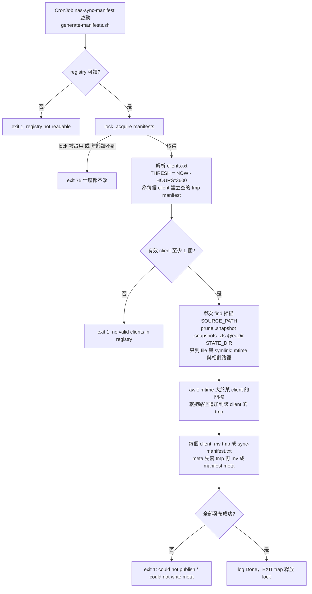

1. **讀 registry**：`REGISTRY_FILE`（預設 `/userapp/config/clients.txt`，由 `nas-sync-clients` ConfigMap 以 `subPath` 掛入）不可讀 → `ERROR: registry … not readable`，exit 1。
2. **取得 `manifests` lock**（3.4）。拿不到就 exit 75，**不碰任何檔案**。
3. **清理上次當機遺留的暫存**：`sync-manifest.txt.tmp*`、`manifest.meta.tmp*`（因為持有 lock，所以安全）。
4. **解析 registry**：忽略空行與 `#` 註解；`lookback_hours` 不是純數字 → `WARN: bad lookback for '<id>' ('<hours>') — skipping`，只跳過該行；數字以 `10#` 當十進位讀（`08` = 8、`010` = 10，而不是八進位）。每個有效 client 得到門檻 `THRESH = NOW - HOURS * 3600`，並建立空的 tmp manifest。沒有任何有效 client → `ERROR: no valid clients in registry`，exit 1。
5. **一次 `find` 掃描**（不論有多少 client）：以名稱在**每一層**修剪 `.snapshot`、`.snapshots`、`.zfs`、`@eaDir`，並修剪 `STATE_DIR`；只輸出 `-type f` 與 `-type l`（`%T@ %P`：浮點 epoch mtime 與相對路徑）。
6. **awk 扇出**：對每一行，凡 `mtime > 該 client 的門檻` 就把路徑追加到該 client 的 tmp 檔。**這就是「無狀態回溯視窗」**：每一輪都是「最近 N 小時內變動過的檔案」，不依賴上一輪是否被消費，視窗彼此重疊，所以漏跑一輪的 client 下一輪就會補上。
7. **原子發布**：`mv -f tmp sync-manifest.txt`，meta 先寫到 `manifest.meta.tmp.<RUN_ID>` 再 `mv` 成 `manifest.meta`（欄位 `generated_at` / `window_threshold_epoch` / `file_count`）。任何一步失敗記 `ERROR: could not publish …` 或 `ERROR: could not write …/manifest.meta`，最後 `exit 1`（v3.15 即使 `mv` 失敗也記 "wrote"）。reader 永遠不會看到寫到一半的 manifest 或 meta。
8. 所有暫存名稱都帶 `RUN_ID`（`${HOSTNAME}-$$-${NOW}`），避免 `$$` 在不同容器重複。

**位置**：`generate-manifests.sh` = guide §4.3；registry 與 CronJob = §6.1、§6.2；lock = §4.7。

#### 3.1.2 Cluster A：`nas-sync-incremental.sh`

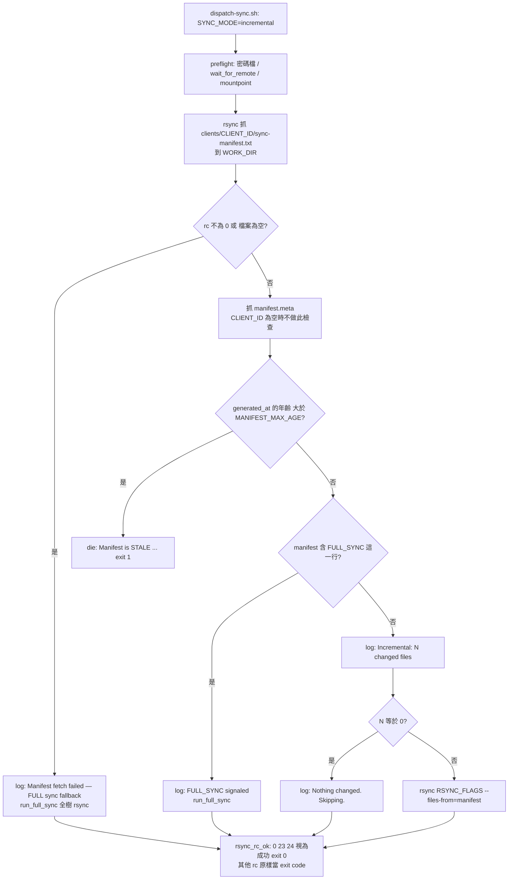

1. **preflight**（所有 mode script 共通）：`Password file not readable`、`wait_for_remote`（`nc -z -w 10`，最多 `PREFLIGHT_RETRIES` 次、每次間隔 `PREFLIGHT_WAIT` 秒，每次失敗 log `Remote not reachable yet (attempt i/N) — sidecar may still be starting`）、`timeout 10 mountpoint -q "$LOCAL_NAS_PATH"`（失敗 `Local NAS not mounted`）。
2. **抓 manifest**：`rsync -a --password-file=… "${REMOTE_URL}/${MANIFEST_NAME}" "$MANIFEST_LOCAL"`。這一次抓取**沒有** `--exclude-from`，所以 client exclude 裡的 `.nas-sync-state/` 不會擋到它；但 server 的 `rsyncd.conf` `exclude =` 一旦含 `.nas-sync-state/`，這裡就會失敗並退化為全量同步（guide §9A.1）。`MANIFEST_NAME` 預設 `.nas-sync-state/clients/${CLIENT_ID}/sync-manifest.txt`。
3. **FULL sync fallback**：判斷條件是 `[ "$FETCH_RC" -ne 0 ] || [ ! -s "$MANIFEST_LOCAL" ]`，也就是**抓取失敗，或抓到的檔案大小為 0**，都會 log `Manifest fetch failed (rc=N) — FULL sync fallback` 並對整棵樹做一次 rsync（`run_full_sync`，與 `standard` 模式同旗標）。常見原因：`CLIENT_ID` 沒設、沒註冊、拼錯，或 generator 還沒替該 client 寫過 manifest（guide §13）。**（已對照程式碼確認，v3.15 起就是如此）**：回溯視窗內完全沒有變動時，generator（§4.3）照樣以 `: >` 建立空的暫存檔再 `mv` 發布，所以 client 抓到的 manifest 大小為 0，會走同一條路徑並顯示 `rc=0`；`Nothing changed. Skipping.` 這一行只有在 manifest 內全是空白行時才會出現，v3.16 generator 不會產生那樣的檔案。因此看到 `Manifest fetch failed (rc=0)` 時，不要先假設是網路問題，要先看 `manifest.meta` 的 `file_count`（`file_count=0` 代表視窗內沒有變動）。
4. **stale-manifest 守門**（`META_NAME` 非空時才做，也就是有 `CLIENT_ID`）：抓 `manifest.meta`，算 `AGE = now - generated_at`，記錄 `Manifest generated ${AGE}s ago`；若 `AGE > MANIFEST_MAX_AGE`（預設 86400）→ `die "Manifest is STALE (…s > …s) — the generator CronJob on Cluster B has stopped. …"`，exit 1。這是**刻意讓 Job 失敗**，否則 client 會一直重複同步一份舊 manifest 並回報成功。meta 抓不到 → `WARN: manifest.meta unavailable — cannot verify generator freshness`，繼續執行。
5. **`FULL_SYNC` 標記**：manifest 內有一行 `FULL_SYNC` 就做全量同步。**v3.16 的 generator 不會寫這一行**（程式碼只在 client 端處理它，屬歷史相容路徑）。
6. **增量傳輸**：`CHANGED=$(grep -vc '^$' …)`，log `Incremental: N changed files`；`rsync $RSYNC_FLAGS --files-from="$MANIFEST_LOCAL" "${REMOTE_URL}/" "${LOCAL_NAS_PATH}/"`。`RSYNC_FLAGS` 為 `-a --whole-file --partial --partial-dir=.rsync-partial --timeout=$RSYNC_TIMEOUT --password-file=… [--exclude-from=…]`。
7. **rc 處理**：`rsync_rc_ok` 把 `0`、`24`（log `NOTE: rc=24 …`）、`23`（log `WARN: rc=23 …`）都視為成功，其他 rc 原樣成為 script 的 exit code。最後 log `=== COMPLETE: rsync_rc=$RC exit=$SYNC_EXIT, ${DUR}s ===`（fallback 路徑為 `=== COMPLETE: mode=full-fallback rsync_rc=… exit=…, …s ===`）。
8. `CLIENT_ID` 為空：log `WARN: CLIENT_ID is empty — using the pre-v3.14 single-target manifest path. …`，改抓 `.nas-sync-state/sync-manifest.txt`（v3.14+ server 上不存在），每次都會退化為全量同步，且不做 stale 檢查。
9. 每一步之間都有 `check_term`，SIGTERM 會在下一個步驟前停止（3.5）。

**位置**：`nas-sync-incremental.sh` = guide §8.4；`dispatch-sync.sh` = §8.5；`MANIFEST_MAX_AGE` 驗證規則見 4.6。

### 3.2 `parallel` / reconcile：chunk 產生與換代 → client 抓取 → worker

#### 3.2.1 Cluster B：`generate-chunks.sh`（CronJob `nas-sync-chunks`，`0 0 * * 0`）

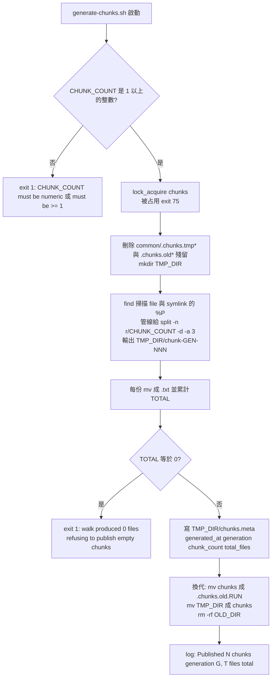

1. `GEN="g${NOW}"`（`g` + epoch 秒），所有 chunk 檔名為 `chunk-<GEN>-NNN.txt`，`chunks.meta` 記錄 `generation=`。
2. `split -n r/N` 以**輪詢（round-robin）**切分，可以在 pipe 上運作（不必預先知道總數），並把任何目錄熱點平均分散到各 chunk；它**永遠建立剛好 N 個檔案**（樹很小時有些是空的）。
3. `TOTAL=0` 時拒絕發布空 chunk（`ERROR: walk produced 0 files — refusing to publish empty chunks`，exit 1）。
4. **換代（swap）有兩個 `mv`**：先把舊的 `chunks/` 改名成 `.chunks.old.<RUN_ID>`，再把新目錄改名成 `chunks/`。兩個 `mv` 之間有一小段時間**沒有 chunks 目錄**：剛好在這段時間開始的 client fetch 會失敗並 fallback，無害。
5. 磁碟成本：7.4M 路徑時 chunk 清單合計數百 MB（在來源 NAS 上，client 端 exclude 已排除，不會被複寫）。不再使用 chunked reconcile 時，可到 server pod 內 `rm -rf /mnt/nas-source/.nas-sync-state/common/chunks` 回收。

**為什麼要 generation（v3.16 的核心修正）**：rsync sender 傳每個檔案時會**依路徑重新解析**，所以若 fetch 進行到一半時剛好換代，固定檔名會讓 client 以 **rc=0** 收到「新舊混合」的 chunk 集合（實測約 22% 的樹不在任何一份清單內，而且正好是 reconcile 要補的新增 / 改名路徑）。改用 generation 檔名後，舊檔名會「消失」，fetch 因此以 **rc 24（vanished）** 失敗，client 重試或 fallback，**不可能收到混合集合**。v3.15 的 client 因為本來就把 rc≠0 視為 fallback，所以不必升級也受保護；`chunk-*.txt` 仍可比對新檔名，所以可以先升級來源端。

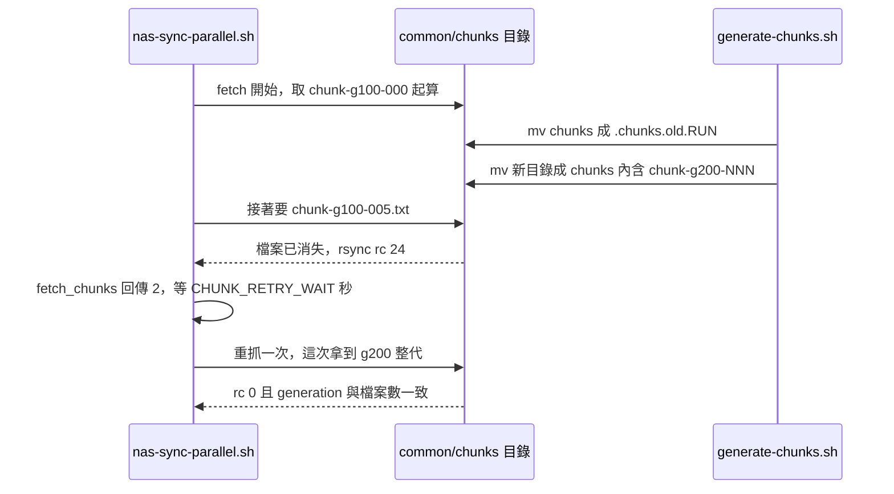

**位置**：`generate-chunks.sh` = guide §4.6；CronJob = §6.3；lock = §4.7。

#### 3.2.2 Cluster A：`nas-sync-parallel.sh`

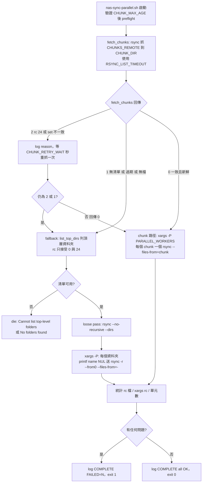

1. **抓 chunk 清單**：`rsync -a --timeout="$RSYNC_LIST_TIMEOUT" --password-file=… "${REMOTE_URL}/${CHUNKS_REMOTE}/" "${CHUNK_DIR}/"`（預設 `CHUNKS_REMOTE=.nas-sync-state/common/chunks`）。這個 metadata rsync 用 `RSYNC_LIST_TIMEOUT`（預設 300 秒的**閒置**時間，不是總時間），而不是資料傳輸用的 `RSYNC_TIMEOUT`（14400），所以死掉的連線幾分鐘內就會失敗並 fallback，而不是卡到 Job deadline。
2. **`fetch_chunks` 的判定**（回傳 0 = 可用、1 = 不可用要 fallback、2 = 不一致值得重試）：
   - rc 24 → `Chunk files vanished mid-fetch (rc=24): the server is publishing a new generation`（2）。
   - rc≠0 或沒有 `chunks.meta` → `No chunk lists available (rc=N)`（1）。
   - `generated_at` 缺失或 `AGE > CHUNK_MAX_AGE` → `Chunks are stale (age=…s > …s)`（1）。
   - `chunks.meta` 沒有 `generation=`（v3.15 server 寫的集合，例如 rollback 後，或升級後在第一次 v3.16 chunk run 之前）→ `WARN: chunks.meta has no generation (…)`，**仍然使用**（`chunk-*.txt`，等同 v3.15 的驗收標準）。
   - 有 generation：`chunk-<gen>-*.txt` 的數量必須等於 `chunk_count`，且所有 `chunk-*.txt` 的總數也必須等於這個數字，否則 `Chunk set inconsistent (generation …: N of M chunks, K chunk files in total)`（2）。
   - 數量為 0 → `chunks.meta present but no chunk files`（1）。
3. **重試一次**：回傳 2 時 log `<reason> — retrying once in ${CHUNK_RETRY_WAIT}s`，睡 `CHUNK_RETRY_WAIT`（預設 30）秒後重抓；再不行就 fallback，log `<reason> — falling back to top-level split`。成功時 log `Using N server-generated chunks (generation=…, age=…s, … files total)`。
4. **chunk 路徑**：`find … -name "$CHUNK_GLOB" -print0 | sort -z` 寫入 `CHUNK_LIST`，再以 **背景** `xargs -0 -n 1 -P "$PARALLEL_WORKERS" bash -c 'sync_one_chunk "$1"'` 執行；每個 worker 執行 `rsync $RSYNC_FLAGS --files-from="$chunk" "${REMOTE_URL}/" "${LOCAL_NAS_PATH}/"`，輸出前綴為 `[chunk-…]`，log 有 `[worker] START / DONE chunk-… (rc=…, …s)`。chunk 數（預設 24）刻意大於 worker 數（6），讓快的 worker 持續領新工作。
5. **fallback（頂層資料夾切分）**：
   - `list_top_dirs`（`nas-sync-lib.sh`）用 `rsync --list-only -8 --timeout="${RSYNC_LIST_TIMEOUT:-300}" … --exclude-from=…` 列出遠端頂層目錄，輸出以 NUL 分隔。**只接受 rc 0 與 24**；其他（包含 23）→ `die "Cannot list top-level folders (rsync rc=N)"`（exit 1）。原因：rc 24 代表某個項目在列出時消失了，它已不存在，不會漏資料；rc 23 代表某個仍存在的項目讀不到，會從清單中缺席，而且沒有 worker 會同步它。所以這裡**不能**走把 23 當成功的 `rsync_rc_ok`。
   - 沒有任何資料夾 → `die "No folders found"`（常見於 daemon 看到的是空目錄，7 章）。
   - **loose pass**：`rsync $RSYNC_FLAGS --no-recursive --dirs …`，只處理頂層的零散檔案、symlink 與頂層目錄本身（空殼，之後由 worker 填滿）。必須明寫 `--no-recursive`，因為 `-a` 隱含 `-r`，單用 `--dirs` 會把整棵樹序列化同步一遍（v3.15 的缺陷）。結果記在 `rc/loose`。
   - **worker**：`printf '%s\0' "$name" | rsync $RSYNC_FLAGS -r --from0 --files-from=- …`。資料夾名稱**絕不**放進遠端路徑（daemon 會對遠端路徑做 glob 展開：`a[1]/` 會從 `a1/` 提供；名稱還可能含空白、引號、CJK 或換行）。`-r` 必須明寫，因為在 `--files-from` 之下 `-a` 並不隱含 `-r`。`--from0` 必須放在 `$RSYNC_FLAGS` **之後**，否則 `--exclude-from` 會被改成以 NUL 分隔讀取而讓所有 exclude 失效。
   - 此路徑 `export LC_ALL=C`：名稱是位元組不是字元（bash 5.2 在 UTF-8 locale 下 `read -d ''` 會在以 UTF-8 起始位元組結尾的名稱（舊 Big5/MS950 名稱常見）之後遺失下一筆）。副作用：log 內的非 ASCII 資料夾名稱會顯示成八進位跳脫（資料本身不受影響）。
6. **收尾統計**：逐一讀 `RC_DIR` 的 rc 檔，用 `rsync_rc_ok`（此腳本內 0、23、24 都算成功）判斷；再證明「每個單元都有跑」：`XARGS_RC` 必須為 0（否則加 `xargs(rc=N)`），rc 檔數必須等於預期單元數（否則加 `only-N-of-M-units-reported`）。有任何問題 → `ERROR: N problem(s) across M chunks|folders: …`、`=== COMPLETE: M chunks, …s, FAILED=N ===`、exit 1；否則 `=== COMPLETE: M chunks, …s, all OK ===`、exit 0。v3.15 只信 rc 檔，所以 xargs 因資料夾名稱含引號而提前中止時仍會回報 all OK。
7. **SIGTERM**：trap 只設旗標並建立 `STOP_FILE`（`$WORK_DIR/stop`）；已經在跑的 rsync 自己收到 TERM、把 partial 存進 `.rsync-partial/`，尚未開始的單元發現 `STOP_FILE` 就 log `[worker] SKIP … (SIGTERM received — not started)` 並記 rc 143，最後 script `exit 143`（3.5）。xargs 以 `( trap '' TERM; exec xargs … ) &` 在**背景**執行並忽略 TERM，這樣 trap 才能立即觸發，而 xargs 繼續等待執行中的 worker。

**位置**：`nas-sync-parallel.sh` = guide §8.3；`list_top_dirs` 等 helper = §8.11；CronJob（reconcile）= §9A.4；Deployment（bulk seed）= §10B.1。

### 3.3 `verify`：`--dry-run` 差異偵測

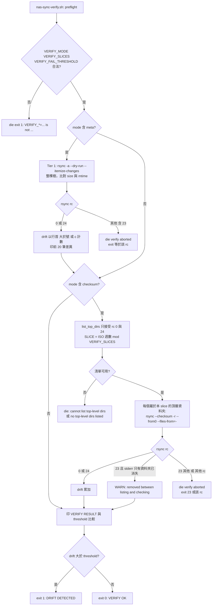

1. **只比對，不傳輸、不刪除**：旗標是 `-a --dry-run --itemize-changes --timeout=…`（刻意**沒有** `--whole-file`、`--partial`）。與 sync 使用**同一份** `EXCLUDE_FILE`，所以被排除的檔案不會算成 drift；若讓兩者設定分歧，要相應提高 `VERIFY_FAIL_THRESHOLD`。
2. **設定驗證（在 preflight 之後、任何比對之前）**：
   - `VERIFY_MODE` 必須是 `meta`、`checksum`、`both`，否則 `die "VERIFY_MODE='…' is not meta, checksum or both"`（exit 1）。
   - 只有 mode 不是 `meta` 時才檢查 `VERIFY_SLICES`：必須是正整數，否則 `die "VERIFY_SLICES='…' is not a positive integer"`。
   - `VERIFY_FAIL_THRESHOLD` 必須是非負整數，否則 `die "VERIFY_FAIL_THRESHOLD='…' is not a non-negative integer"`。
   - 全部以 `10#` 當十進位讀。**壞設定一律失敗，不會 fallback**：否則打錯字會變成「什麼都沒比對卻 `VERIFY OK`」。
3. **Tier 1（`meta` 或 `both`）**：整棵樹 `size + mtime` 比對，輸出寫入暫存檔；`count_drift` 計算行首為 `>` 或 `c` 的 itemize 行。rc 只接受 **0 與 24**：
   - rc 24（掃描中項目消失）在 live 來源上是正常的。
   - **rc 23 不接受**：某個存在的目錄讀不到，裡面的東西完全沒被比對，`drift=0` 會是假的保證。log `ERROR: rsync failed during metadata verify (rc=N)`、印 stderr 前 20 行，`die "verify aborted" N`，所以 **exit code 就是 rsync 的 rc**（unreadable → 23，閒置逾時 → 30，…）。
   - log `Tier 1: drift=N of M entries compared`（`M` 實際是輸出的行數，是差異行而不是總比對數；spec §11 記載此標籤具誤導性但無害）。
4. **Tier 2（`checksum` 或 `both`）**：每次只 byte-level 比對**一個輪替 slice**。`SLICE = (ISO 週數) mod VERIFY_SLICES`；頂層資料夾以 `cksum` 雜湊後 `mod VERIFY_SLICES == SLICE` 的才屬於本次 slice（資料夾名稱以原始位元組雜湊）。`VERIFY_SLICES=13` 時一次涵蓋約 1/13 的頂層資料夾，每週跑一次約一季涵蓋完整（runbook S7）。slice 只取決於週數，不取決於你何時排程。
   - 清單用 `list_top_dirs`，rc 只接受 0 與 24，否則 `die "Tier 2: cannot list top-level dirs (rsync rc=N)" N`；清單為空 → `die "Tier 2: no top-level dirs listed"`。
   - 名稱計數必須對得起來（`Tier 2: read N of M listed top-level dirs — a name was lost while parsing the list`、`Tier 2: checked N of M dirs in this slice — …`），否則 `die`。
   - 每個資料夾：`printf '%s\0' "$d" | rsync $BASE_FLAGS --checksum -r --from0 --files-from=- …`，stderr 存檔而非丟棄。rc 0 / 24 OK；**rc 23 只有在 stderr 內容「只有」`link_stat … failed: No such file or directory`（外加 rsync 自己的 `rsync error:` 行與 daemon 的 `[Receiver] read error: Connection reset`）時才容忍**，代表該資料夾在列出之後被移除，log `WARN: <d> was removed between listing and checking — skipped`（`<d>` 是 `printf '%q'` 的輸出，不加引號）；其他 23 → `ERROR: rc=23 checking …: part of it could not be read, so it was not byte-checked`、exit 23；其他 rc → `ERROR: rsync failed checking … (rc=N)`、exit N。
   - 這個「已消失資料夾」的白名單比對的是 rsync 3.2.7（兩個 image 的版本）的訊息文字（spec §11）。
5. **結果**：固定輸出一行可被監控抓取的 `VERIFY RESULT mode=… drift=… checked=… elapsed=…s threshold=…`；`drift > threshold` → `ERROR: DRIFT DETECTED: N > threshold T`、`ERROR: Nothing was transferred (dry-run). Run the reconcile (§9A.4) to repair.`、exit 1；否則 `=== VERIFY OK: drift=N within threshold ===`、exit 0。
6. **exit code 總結**：`0` OK；`1` drift 超過門檻 / 設定不合法 / 名稱計數 die；`23` 有來源目錄讀不到；其他 = rsync 自己的 rc；`143` 被 SIGTERM 中斷。失敗在抵達結果行之前時**沒有** `VERIFY RESULT` 行。
7. 排程建議：放在每週 reconcile **之後**，樹處於靜止狀態時，非零結果才是真的 drift；在 reconcile 之前跑只是在量測一週的正常變動。
8. 限制：verify **看不到被清空的來源**（daemon 服務一個空目錄時 `meta` 模式沒有東西可比，回報 `drift=0`；7 章）。

**位置**：`nas-sync-verify.sh` = guide §8.10；CronJob = §9A.5；排錯 = guide §13「Drift detected」。

### 3.4 Generator lock：NFS `mkdir` lock + heartbeat

為什麼需要：`concurrencyPolicy: Forbid` 只阻止 CronJob controller 自己重疊**排程**的 run，**不是鎖**；手動 `kubectl create job --from=cronjob/…`（runbook S1、S2、S4、S9 都用）或 Job 換 pod 仍會與排程 run 重疊，兩個重疊的 generator 會撕裂 manifest、發布寫到一半的 chunk 集合。為什麼不用 `flock`：pod 在不同 node 上，`nolock` 的 NFS 掛載上 `flock` 只在本機有效且不會提示。`mkdir` 在任何 NFS 版本都是原子的。

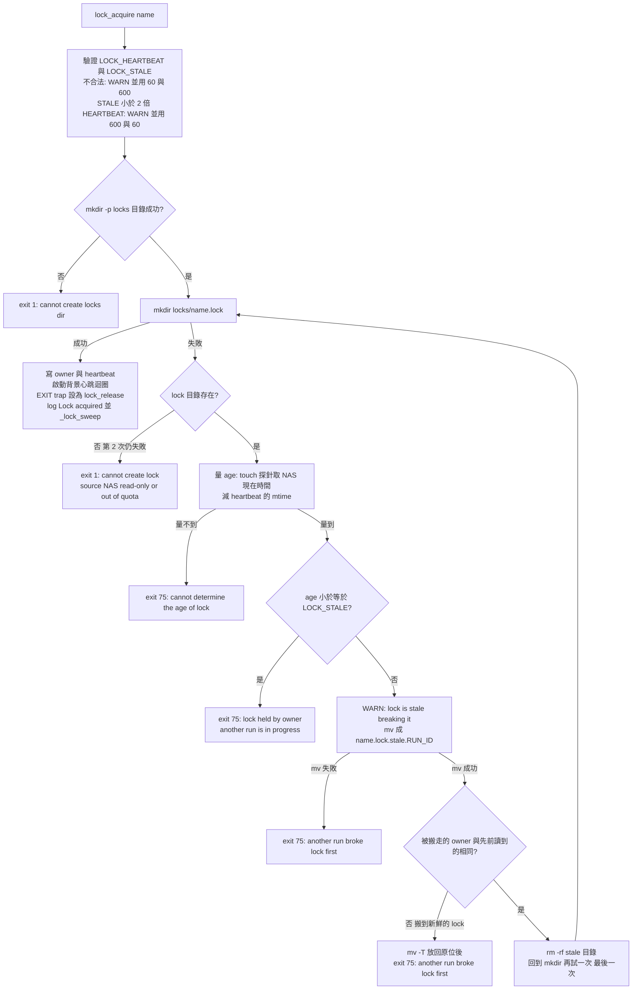

1. **參數驗證**：`LOCK_HEARTBEAT`（預設 60）、`LOCK_STALE`（預設 600）必須是正整數，否則 `WARN: LOCK_HEARTBEAT='…' is not a positive integer — using 60`（`LOCK_STALE` 對應 `using 600`）；之後以 `10#` 當十進位讀（`LOCK_STALE=08` 在 v3.15 會讓 `$(( ))` 出錯而**在沒有 lock 的狀況下繼續跑**）。`LOCK_STALE` 必須至少是 `LOCK_HEARTBEAT` 的 2 倍（活著的 holder 的 heartbeat 最多有一個間隔那麼舊），否則 `WARN: LOCK_STALE=… must be at least 2 x LOCK_HEARTBEAT=… — using 600 and 60`。
2. **`mkdir "${STATE_DIR}/locks/<name>.lock"`**：成功就寫 `owner`（`run_id`、`host`、`pid`、`started`）、`touch heartbeat`、啟動背景心跳迴圈（每 `LOCK_HEARTBEAT` 秒 touch 一次；失敗只 WARN `lock heartbeat touch failed …; retrying in …s`，不會終止迴圈；迴圈會用 `kill -0 $$` 在父行程消失後自行結束，避免孤兒行程讓死掉的 lock 永遠看起來新鮮）、`trap lock_release EXIT`、log `Lock '<name>' acquired (run_id=…)`，再執行 `_lock_sweep`。
3. **失敗時先分辨原因**：
   - 目錄不存在（沒有東西占用這個名字）→ 重試一次，第二次仍失敗 → `ERROR: cannot create lock '<name>' (…) — source NAS read-only or out of quota? This run did nothing.`，**exit 1**（沒有持有 lock，所以不是 75）。
   - 目錄存在 → 量年齡。**年齡一律用 NAS 時鐘**：在 `locks/` 內 `touch .probe.<RUN_ID>`，取它的 mtime 當「現在」再刪除，減去 `heartbeat` 檔的 mtime（只有在 `heartbeat` 不存在時，也就是 holder 在 `mkdir` 與第一次 touch 之間死掉，才改用 lock 目錄自己的 mtime；其他任何 `stat` 失敗都視為「未知」）。
     - **量不到**（探針 touch 失敗、或既有 heartbeat 的 `stat` 失敗：stale handle、I/O error）→ **fail closed**：`ERROR: cannot determine the age of lock '<name>' (… owner […]) — treating it as held; this run did nothing. Check the source NAS: full, over quota, read-only or a stale mount.`，**exit 75**。絕不打破一個量不到年齡的 lock。
     - **age ≤ `LOCK_STALE`** → `ERROR: lock '<name>' held by [owner…] (heartbeat Ns ago) — another run is in progress; this run did nothing. Re-run after it finishes.`，**exit 75**。
     - **age > `LOCK_STALE`**（holder 已死：SIGKILL、node 遺失、`activeDeadlineSeconds`）→ `WARN: lock '<name>' is stale (heartbeat Ns ago > 600s; owner […]) — breaking it`；`mv` 把它改名為 `<name>.lock.stale.<RUN_ID>`（rename 是原子的，只有一個競爭者會成功；失敗 → `ERROR: another run broke lock '<name>' first; this run did nothing`，exit 75）。再確認被搬走的 `owner` 與先前讀到的相同；不同代表搬到的是別人剛取得的**新鮮** lock，要 `mv -T` 放回去並 exit 75（放不回去時依情況移除或保留 `.stale.` 目錄並 WARN）；相同才 `rm -rf` 並再 `mkdir` 一次（最後一次）。第二輪又發現 stale → 打破但不重取，`ERROR: could not take lock '<name>'; this run did nothing`，exit 75。
4. **`lock_release`（EXIT trap）**：停止心跳迴圈；只有 lock 的 `owner` 仍是自己的 `run_id` 才 `rm -rf`（lock 可能已被當成 stale 打破）。
5. **`_lock_sweep <name>`**：持有 lock 後，清掉**這個名稱**的 `<name>.lock.stale.*`，條件是該目錄的 heartbeat 年齡超過 `LOCK_STALE`（被取代的 lock 不會再有 heartbeat）；較年輕的、年齡量不到的、其他名稱的、以及 `<name>.lock` 本身都不動。清掉時 log `Removed the leftover displaced lock '…' (heartbeat Ns old)`。
6. **為什麼用 heartbeat 而不是固定 TTL**：一次 walk 合法地可以跑到 `activeDeadlineSeconds`（24 小時）；足以涵蓋它的固定 TTL 會讓一個當機的 run 擋住 2 小時一次的 manifest job 一整天。heartbeat 讓當機的 run 在 10 分鐘後就失效。
7. **exit 75 與 K8s Job**：exit 75（`EX_TEMPFAIL`）代表「這次沒有做事」，pod 失敗，Job 會依 `backoffLimit` 重試：**manifest Job 沒有設 `backoffLimit`，K8s 預設 6；chunk Job 設為 1**（guide §13）。所以只有在 lock 一直擋到最後一次重試時 Job 才會顯示 Failed；每次重試都會再多一行 `held by`。要避免手動 run 又重試進第二次 walk，確認 lock 被占用後就刪除那個手動 Job。
8. **generator pod 沒有信號處理**：Cluster B 的 Job pod 以 `/bin/bash` 當 PID 1，沒有 SIGTERM 處理（spec §11）。被 `kubectl delete` 或 deadline 殺掉的 run 不會執行 `lock_release`，lock 會一直留到 heartbeat 超過 `LOCK_STALE`（600 秒）後被下一個 run 打破。**絕不要在 heartbeat 還新鮮時手動刪 lock**：那代表有 run 還在寫。
9. 兩個 job 各有自己的 lock（`manifests`、`chunks`），**彼此之間沒有鎖**：它們寫入的路徑不相交，各自的 `find` 也都跳過 `STATE_DIR`；代價只是週日兩邊同時掃描時 NAS metadata 負載加倍（guide §6.3 的 v3.16 note）。

**位置**：`nas-sync-state-lock.sh` = guide §4.7；兩個 generator 在 §4.3、§4.6 `source` 它並呼叫 `lock_acquire manifests` / `lock_acquire chunks`；排錯 = guide §13「Generator Job Failed」。

### 3.5 CronJob 路徑上的 SIGTERM（graceful shutdown）

原則（guide §8.11）：**只有一個地方發出訊號，其餘每個有子行程的 shell 都等待**。如果任何一層 shell 比它的子行程先結束，tini（PID 1）也會結束，kernel 就會對 rsync 送 SIGKILL，在目標端留下 `.<name>.XXXXXX` 暫存檔，而且因為不使用刪除選項，沒有任何後續 run 會清掉它（v3.15 的缺陷）。

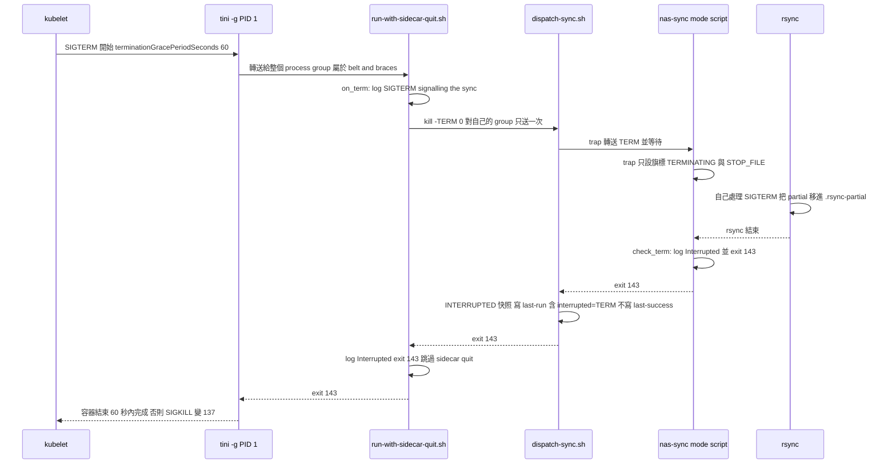

1. kubelet 對容器 PID 1（`tini`）送 SIGTERM，並開始倒數 `terminationGracePeriodSeconds`（所有 client manifest 都明寫 `60`）。
2. `tini -g` 把訊號轉送給整個 process group；但**正確性不依賴它**：即使沒有 `-g`，下面的鏈也會工作（spec 的矩陣有驗證）。
3. **wrapper（`run-with-sidecar-quit.sh`，§8.6）**：`trap on_term TERM INT`。`on_term` 有防重入旗標 `GOT_TERM`，log `SIGTERM — signalling the sync, waiting for rsync to stop cleanly`，然後 **`kill -TERM 0` 只送一次**（對自己的 process group），之後以 `wait_child` 等待 dispatcher。
4. **dispatcher（`dispatch-sync.sh`，§8.5）**：mode script 在背景執行，trap 記錄 `GOT_TERM=1` 並對 `CHILD` 轉送 TERM，然後 `wait_child` 等待——**絕不 `exec` mode script**（status 要在它結束後才寫）。若 TERM 在 fork 之前或 `CHILD=$!` 之前抵達，會在取得 `CHILD` 後補送。
5. **mode script（§8.2–§8.4、§8.10）**：`term_trap_install` 的 trap 只設 `TERMINATING=1`（並在設了 `STOP_FILE` 時建立該檔）。bash 在**前景 rsync 結束之後**才執行 trap，所以 rsync（它自己會處理 SIGTERM）有時間把 partial 檔案移進 `.rsync-partial/`；之後 `check_term` 記錄 `Interrupted (SIGTERM) — stopping after the current step` 並 `exit 143`，不會開始下一步。
6. dispatcher 的 `wait_child` 取得 143，把 `INTERRUPTED` **只讀一次**（避免遲到的 TERM 造成一行寫 `exit=0`、另一行寫 interrupted），隨即 `trap '' TERM INT` 讓遲到的 group TERM 不會殺掉 `date`、`hostname`、`mv`；若 mode script 竟回傳 0，`RC` 仍被改成 143。log `Mode <mode> finished: exit=143 elapsed=…s (interrupted by SIGTERM)`，寫 `last-run`（尾巴附 ` interrupted=TERM`），**不寫** `last-success`，`exit 143`。
7. wrapper 看到 `GOT_TERM`：log `=== Interrupted: exit 143 ===` 後直接 `exit 143`，**不做 sidecar quit**（pod 正在刪除，kubelet 自己會停掉 `istio-proxy`）。
8. 如果 TERM 在 sync 已經結束、進入 sidecar quit 階段才抵達，wrapper 已換上 `trap 'exit "$SYNC_EXIT"' TERM INT`：不會再送 group TERM（那會打到 curl / nc / pilot-agent），並以**同步本身的 exit code** 結束，所以一個已成功完成的 sync 不會被報成 143（Failed pod）。
9. 若 `nas-sync-lib.sh` 遺失，wrapper 會 log 並定義一個單純 `wait` 的 `wait_child`，**仍然會 quit sidecar**（dispatcher 會立刻 exit 1，sync 不會執行）；否則 `istio-proxy` 繼續跑、Job pod 會永遠 `NotReady`。
10. 超過 60 秒 → kubelet 對容器 SIGKILL，exit code 137。這代表有一層沒有在寬限期內結束（例如 NFS 寫入卡住）。

**位置**：guide §8.5、§8.6、§8.11；CronJob 的 `terminationGracePeriodSeconds: 60` = §9A.2、§9A.4、§9A.5。

### 3.6 Deployment entrypoint 生命週期與 drain

Deployment 用 `command: ["tini", "-g", "--", "/userapp/scripts/entrypoint-deployment.sh"]` 取代預設 ENTRYPOINT，sidecar 永遠不 quit。

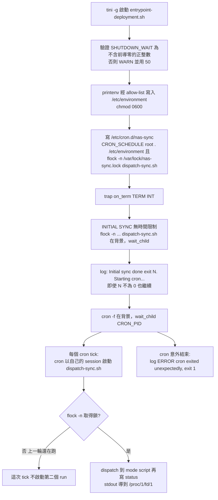

1. **啟動**：驗證 `SHUTDOWN_WAIT`（`^[1-9][0-9]*$`，否則 `WARN: SHUTDOWN_WAIT='…' is not a positive integer — using 50`）；log `=== NAS Sync Client v3.16 (Deployment, SYNC_MODE=…) ===`、`Cron: …`、`Client: …`。
2. **env allow-list**：`printenv | grep -E '^(REMOTE_|LOCAL_|SYNC_|RSYNC_|EXCLUDE_|CHECK_|TZ|PARALLEL_|MANIFEST_|CLIENT_ID|VERIFY_|CHUNK_|STATUS_|PREFLIGHT_)'` 改寫成 `VAR="value"` 存到 `/etc/environment`（`0600`）。cron 啟動的 run 不繼承容器的環境變數，只拿得到這份 allow-list；v3.14 漏了 `CLIENT_ID`，導致 cron run 的 `incremental` 退回舊路徑、每一輪都是全量同步。**（推論）** `CHUNKS_REMOTE`（開頭是 `CHUNKS_`，不符合 `CHUNK_`）與 `META_NAME` 不在 allow-list 內，只設在 Deployment env 的話只有初始同步看得到；詳見 5.11。
3. **cron 設定**：只寫 `/etc/cron.d/nas-sync`（v3.14 另外跑 `crontab` 造成每個 tick 都有錯誤）。那一行是 `${CRON_SCHEDULE} root . /etc/environment && flock -n /var/lock/nas-sync.lock /userapp/scripts/dispatch-sync.sh > /proc/1/fd/1 2>/proc/1/fd/2`。
4. **初始同步**：`flock -n /var/lock/nas-sync.lock /userapp/scripts/dispatch-sync.sh &`，`wait_child` 等它；**沒有時間限制**（bulk seed 可跑數日）。結束後 log `Initial sync done (exit N). Starting cron...`，**不論 N 是多少都會啟動 cron**，所以要看 `N` 與 status file 才知道 seed 是否真的成功。
5. **cron**：`cron -f &`，`wait_child "$CRON_PID"`。**不 `exec cron`**：entrypoint（bash）整個 pod 生命週期都是 tini 的子行程，才有能力在 SIGTERM 時停 cron 並通知每個 run。cron 給每個 job **自己的 session**，所以 `tini -g` 碰不到 cron 啟動的 run（v3.15 因此在 pod 被刪除或 rollout 時把它們 SIGKILL 掉）。
6. **overlap 防護**：`flock -n` 失敗就立即結束，該次 tick 不會啟動第二個 run（該 tick 在 pod log 不會有 run 的輸出）。**（推論）** 鎖檔 `/var/lock/nas-sync.lock` 在容器自己的檔案系統內，只在**同一個 pod 內**有效；Deployment rollout 期間新舊 pod 並存時（guide 未設定 `strategy`，採 K8s 預設的 RollingUpdate，（通用行為））兩個 pod 的 run 可能同時寫同一個 PVC。
7. 若 cron 非預期結束 → `ERROR: cron exited unexpectedly (rc=N) — exiting so the pod restarts`，`exit 1`（會殺掉執行中的 run；與 v3.15 相同的已知限制）。

**收尾（drain）**：

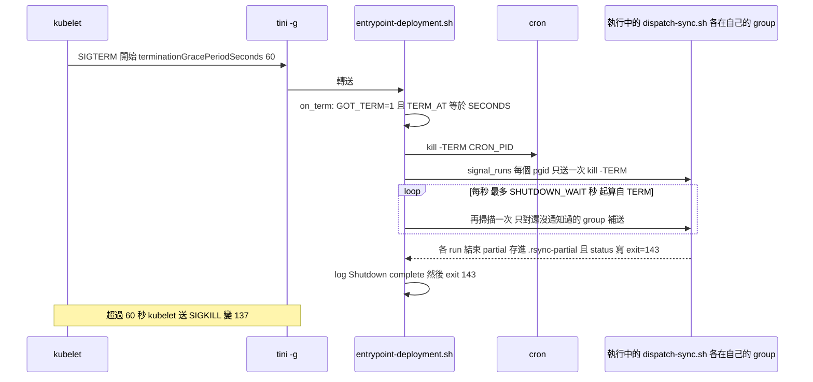

1. `on_term`：有重入防護；記 `TERM_AT=$SECONDS`；log `SIGTERM — stopping cron, signalling in-flight sync runs`；`kill -TERM "$CRON_PID"`；`signal_runs`。
2. **`signal_runs` 找出所有在跑的 run**：`ps -eo pgid=,args= | awk '/\/userapp\/scripts\/dispatch-sync\.sh/ {print $1}' | sort -u`，也就是 `dispatch-sync.sh` 行程的 process group id（初始同步屬於 entrypoint 自己的 group，cron 啟動的各有自己的 group）。**每個 group 只送一次 TERM**（`SIGNALLED` 記錄）：rsync 在存 partial 的過程（close、mkdir `.rsync-partial`、rename）收到第二個 TERM 會跳過存檔。
3. **`drain_and_exit`**：以 bash 的 `$SECONDS` 從 `TERM_AT` 起算，最多 `SHUTDOWN_WAIT` 秒（預設 50）；每秒 `sleep 1` 後再呼叫 `signal_runs`，用來攔住「第一次掃描之後才被 cron 啟動」的 run。時間到仍有 run → `WARN: a sync is still running after ${SHUTDOWN_WAIT}s — it will be SIGKILLed`；最後 `=== Shutdown complete ===`、`exit 143`。
4. **所有啟動點都有 `GOT_TERM` 檢查**：啟動初始同步前（不要在 TERM 之後才開始一個無時限的 sync）、`flock … &` 之後（TERM 剛好落在兩者之間時，以 `kill -TERM 0` 補送；初始同步屬於 entrypoint 自己的 group，不依賴 `ps` 是否已看得到它）、啟動 cron 之前與之後（補送給 `CRON_PID`）。
5. **`SHUTDOWN_WAIT` 與 `terminationGracePeriodSeconds`**：kubelet 從送出 SIGTERM 起算 `terminationGracePeriodSeconds: 60`；entrypoint 從收到 TERM 起算 `SHUTDOWN_WAIT`（50）。**`SHUTDOWN_WAIT` 必須小於 grace period**，留下的餘量讓 entrypoint 與 tini 自己能正常結束。要調高就兩個一起調高，並維持 `SHUTDOWN_WAIT` 較小。drain 超時時 entrypoint 退出、tini 退出、kernel 殺掉剩下的行程，所以那個 run 會在傳輸中途被 SIGKILL。
6. 手動以 `kubectl exec … dispatch-sync.sh` 啟動的 sync 不保證會被 pod 刪除可靠地停止（spec §11）。

**位置**：`entrypoint-deployment.sh` = guide §8.7；`command:` 與 grace period = §10B.1。

---

## 4. 如何使用

本章的指令都明確指定 `--context`（`cluster-b` = 來源側、`cluster-a` = 某個 target 側）與 `-n ea-pmc`。以下 bash 區塊中的 `${REGISTRY}`、`${ISTIO_EXTERNAL_IP}`、`$POD` 等變數請先自行設定。

### 4.1 首次部署順序

順序來自 guide §14「Deploy Order」。**順序很重要**：來源端必須先在服務，target 才拉得到；target 的 CronJob 若先部署，會直接失敗。完整的逐步情境（含 Windows CRLF、各步驟的「done when」）見 [runbook S1](nas-sync-operations-runbook.md#s1--greenfield-first-source--first-target)，前置檢查見 [runbook S0](nas-sync-operations-runbook.md#s0--prerequisites--values-worksheet)。

| 步驟 | 動作 | guide § |
|---|---|---|
| 1 | 寫好 server 的 4 支 script 與 Dockerfile，建置並推送 server image `:3.16` | §4.2、§4.3、§4.6、§4.7、§4.4、§4.5 |
| 2 | 部署 Cluster B 的 server 與 Istio 物件，並替 ingressgateway 補上 8787 | §5 |
| 3 | （只有用 `incremental`）部署註冊表 + manifest CronJob | §6.1、§6.2 |
| 3b | （只有用 chunked reconcile）部署 chunk CronJob | §6.3 |
| 4 | 驗證 Cluster B | §7 |
| 5 | 寫好 client 的 8 支 script 與 Dockerfile，建置並推送 client image `:3.16` | §8.2–§8.7、§8.10、§8.11、§8.8、§8.9 |
| 6 | 部署 Cluster A 共用資源（namespace、PV、PVC、exclude、password） | §9A.1 |
| 7 | 擇一：CronJob（`cronjob-client.yaml`）或 Deployment（`deployment-client.yaml`），設定 `SYNC_MODE` | §9A.2 / §10B.1 |
| 8 | 部署 reconcile CronJob（**必要**） | §9A.4 |
| 9 | 部署 verify CronJob | §9A.5 |
| 10 | 驗證與測試 | §11 |
| 11 | 多 target：每個額外 target 重複 6–10，使用不同的 `CLIENT_ID` | §9A.3 |

```bash
# ---- Cluster B（來源側）----
kubectl --context cluster-b apply -f cluster-b/namespace.yaml
kubectl --context cluster-b apply -f cluster-b/configmap-rsyncd.yaml
kubectl --context cluster-b apply -f cluster-b/secret-password.yaml
kubectl --context cluster-b apply -f cluster-b/deployment-server.yaml
kubectl --context cluster-b apply -f cluster-b/service.yaml
kubectl --context cluster-b apply -f cluster-b/gateway.yaml
kubectl --context cluster-b apply -f cluster-b/virtualservice.yaml

# 在非 route 的 ingressgateway Service 補上 8787（guide §5.8；容易忘記。先確認還沒有，重複 add 會產生重複的 port）
INGRESS_SVC=istio-ingressgateway-nonroute     # ◄ MODIFY
kubectl --context cluster-b get svc $INGRESS_SVC -n istio-system -o jsonpath='{range .spec.ports[*]}{.name}:{.port}{"\n"}{end}' | grep 8787 \
  || kubectl --context cluster-b patch svc $INGRESS_SVC -n istio-system --type='json' -p='[
  {"op":"add","path":"/spec/ports/-","value":{"name":"tcp-rsync","port":8787,"targetPort":8787,"protocol":"TCP"}}
]'

# 註冊表 + manifest CronJob（只有用 incremental）；chunk CronJob（只有用 chunked reconcile）
kubectl --context cluster-b apply -f cluster-b/cronjob-manifests.yaml
kubectl --context cluster-b apply -f cluster-b/cronjob-chunks.yaml

# 驗證 Cluster B（guide §7）
kubectl --context cluster-b get pods -n ea-pmc -l app=nas-sync,role=server
kubectl --context cluster-b exec deployment/nas-sync-server -n ea-pmc -c nas-sync-server -- \
  rsync --list-only rsync://localhost:8787/nas-data/ | head
ISTIO_EXTERNAL_IP=$(kubectl --context cluster-b get svc $INGRESS_SVC -n istio-system \
  -o jsonpath='{.status.loadBalancer.ingress[0].ip}')
nc -zv ${ISTIO_EXTERNAL_IP} 8787        # 必須從叢集 B 之外連得通

# 強制先跑一次 manifest，不要等排程（失敗時看 6.2 的 lock 一節）
kubectl --context cluster-b create job --from=cronjob/nas-sync-manifest bootstrap -n ea-pmc
kubectl --context cluster-b wait --for=condition=complete job/bootstrap -n ea-pmc --timeout=7200s
kubectl --context cluster-b exec deployment/nas-sync-server -n ea-pmc -c nas-sync-server -- \
  sh -c 'for d in /mnt/nas-source/.nas-sync-state/clients/*/; do \
    echo "$d: $(wc -l < "$d/sync-manifest.txt" 2>/dev/null || echo MISSING) files"; done'
```

```bash
# ---- Cluster A（target 側）。REMOTE_HOST 一律填 Cluster B 的 Istio external IP ----
kubectl --context cluster-a apply -f cluster-a/namespace.yaml
kubectl --context cluster-a apply -f cluster-a/nas-target-pv.yaml      # cluster-scoped PV 指向 NAS A
kubectl --context cluster-a apply -f cluster-a/nas-target-pvc.yaml
kubectl --context cluster-a apply -f cluster-a/configmap-exclude.yaml
kubectl --context cluster-a apply -f cluster-a/secret-password.yaml
# 停：PVC 必須是 Bound 才能繼續（Pending = PV / NFS 設定有誤，runbook S0）
kubectl --context cluster-a get pvc nas-a-target-pvc -n ea-pmc

# 資料量大 -> 先做 bulk seed（4.5）。資料量小才直接部署例行三件組：
kubectl --context cluster-a apply -f cluster-a/cronjob-client.yaml
kubectl --context cluster-a apply -f cluster-a/cronjob-reconcile.yaml   # 必要，guide §9A.4
kubectl --context cluster-a apply -f cluster-a/cronjob-verify.yaml
```

**驗收（runbook S1 Phase 4，五項全部成立才算完成）**：

1. 手動建一個 Job（4.3）後，pod 進入 `Completed`，**不是**卡在 `NotReady`（那代表 sidecar 沒被 quit）。
2. log 出現 `client=nas-a` 與 `Incremental: N changed files`，**沒有** `FULL sync fallback`。
3. log 結尾是 `=== COMPLETE: rsync_rc=0 exit=0 … ===`。
4. status file 存在（用 4.3 的 throw-away pod 讀）。
5. shebang 乾淨：`head -1 /userapp/scripts/dispatch-sync.sh | cat -A` 顯示 `#!/bin/bash$`（沒有 `^M`）。

guide §11 另有 v3.15 與 v3.16 的進階檢查（chunk 路徑、chunk fallback、stale-generator 守門、generator lock、`generation=`、graceful shutdown、behavior suite），升級或大改後建議全部跑一遍。

### 4.2 建置與推送兩個 image

**建置順序**：先寫好所有檔案再 build。Server：先寫 §4.6（`generate-chunks.sh`）與 §4.7（`nas-sync-state-lock.sh`），再 §4.5；Client：先寫 §8.10（verify）與 §8.11（lib），再 §8.9。Dockerfile 會 `COPY` 所有 script，少一個就 `docker build` 失敗。

**CRLF 是最常見的靜默殺手**：腳本 shebang 內的 `\r` 會讓 tini 報 `exec … No such file or directory`。Dockerfile 在建置時 `dos2unix`，並**用 `tr` 數 CR 位元組**，只要還有任何 CR 就讓建置失敗（`RUN` 用的是 dash，`$'\r'` 在 dash 不是 CR，所以 v3.12–v3.15 用文字去 grep 的守衛從未生效）。在 Windows 上更要在 build 之前先清一次。

```bash
# Cluster B 的 server image（guide §4.5）
cd cluster-b/scripts
sed -i 's/\r$//' entrypoint.sh generate-manifests.sh generate-chunks.sh nas-sync-state-lock.sh 2>/dev/null || true
docker build -t ${REGISTRY}/nas-sync-server:3.16 .
docker push ${REGISTRY}/nas-sync-server:3.16

# Cluster A 的 client image（guide §8.9）
cd ../../cluster-a/scripts
sed -i 's/\r$//' *.sh 2>/dev/null || true
docker build -t ${REGISTRY}/nas-sync-client:3.16 .
docker push ${REGISTRY}/nas-sync-client:3.16
```

**驗證 shebang**：K8s 的 `command:` 會取代 image 的 ENTRYPOINT，所以用 throw-away pod 檢查最準（guide §11 的指令，一字不改）：

```bash
kubectl run shebang --rm -it --restart=Never -n ea-pmc --image=${REGISTRY}/nas-sync-client:3.16 --command -- sh -c 'head -1 /userapp/scripts/dispatch-sync.sh | cat -A'
# 預期：#!/bin/bash$   （結尾是 ^M 代表 CRLF 守衛失效，重建）
```

**在本機用 `docker run` 檢查時請加 `--entrypoint`（通用行為）**：client image 的 `ENTRYPOINT` 是 `["tini", "-g", "--", "/userapp/scripts/run-with-sidecar-quit.sh"]`，`docker run IMAGE sh -c …` 這樣寫會把 `sh -c …` 當成參數交給 wrapper，而不是執行 `sh`（guide §8.9 的 sanity check 與 §13 的 `docker run … head -1 …` 都是這種寫法）。要在本機檢查請寫成下面這樣；server image 的 `ENTRYPOINT ["/entrypoint.sh"]` 同理。這點未在本環境以 docker 實測。

```bash
docker run --rm --entrypoint sh ${REGISTRY}/nas-sync-client:3.16 -c 'head -1 /userapp/scripts/dispatch-sync.sh | cat -A; ls /userapp/scripts/'
```

throw-away pod 的限制：它沒有 Istio opt-out annotation，若 namespace 會自動注入 sidecar，pod 可能不會自己結束（spec §11，未在叢集驗證）。

### 4.3 日常操作

#### 4.3.1 手動執行一次（不等排程）

```bash
# Cluster A：client / reconcile / verify（名稱自訂；跑完要刪）
kubectl --context cluster-a create job --from=cronjob/nas-sync-client manual-$(date +%s) -n ea-pmc
kubectl --context cluster-a create job --from=cronjob/nas-sync-reconcile repair-$(date +%s) -n ea-pmc
kubectl --context cluster-a create job --from=cronjob/nas-sync-verify drift-$(date +%Y%m%d) -n ea-pmc

# 找到 pod 並看 log（client pod 有 istio-proxy sidecar，一定要 -c nas-sync-client）
POD=$(kubectl --context cluster-a get pods -n ea-pmc -l job-name=manual-XXXX -o jsonpath='{.items[0].metadata.name}')
kubectl --context cluster-a get pod $POD -n ea-pmc -w
kubectl --context cluster-a logs -f $POD -n ea-pmc -c nas-sync-client

# Cluster B：generator（手動 run 會與排程 run 競爭 lock，exit 75 的處理見 6.2）
kubectl --context cluster-b create job --from=cronjob/nas-sync-manifest reg-now -n ea-pmc
kubectl --context cluster-b create job --from=cronjob/nas-sync-chunks chunks-now -n ea-pmc
```

注意：

- `create job --from` 會**繞過** `concurrencyPolicy: Forbid`。Cluster A 的 client 沒有 lock，手動 run 可能與排程 run 同時寫同一個 PVC，所以跑之前先看有沒有 Job 正在跑（4.3.5）。Cluster B 的 generator 則由 §4.7 的 lock 保護（但會 exit 75）。
- Job 跑完要自己刪（`kubectl delete job <name> -n ea-pmc`），否則名稱會佔用；`kubectl wait --for=condition=complete` 遇到 **Failed** 的 Job **不會**提早返回，只會等到 `--timeout`（runbook 的做法是 Ctrl-C 後 `kubectl get job <name>` 確認）。可改用 `kubectl wait --for=condition=failed job/<name>` 並行等待（通用行為）。

#### 4.3.2 切換 `SYNC_MODE`（不重建 image）

`SYNC_MODE` 是環境變數，直接改線上物件，**下一次排程 run 生效**（Deployment 則會 rollout 重啟 pod）。

```bash
# 最簡單（互動式編輯）
kubectl --context cluster-a edit cronjob nas-sync-client -n ea-pmc

# 先查 SYNC_MODE 在 env 陣列的位置：輸出的行號減 1 就是 index（此指令為通用 kubectl，未在叢集驗證）
kubectl --context cluster-a get cronjob nas-sync-client -n ea-pmc \
  -o jsonpath='{range .spec.jobTemplate.spec.template.spec.containers[0].env[*]}{.name}{"\n"}{end}' | grep -n SYNC_MODE

# 以 JSON patch 修改（guide §12 的寫法）。guide 出貨的 CronJob manifest 中 SYNC_MODE 的 index 是 1
kubectl --context cluster-a patch cronjob nas-sync-client -n ea-pmc --type='json' \
  -p='[{"op":"replace","path":"/spec/jobTemplate/spec/template/spec/containers/0/env/1/value","value":"parallel"}]'

# Deployment（deployment-client.yaml）的 env 多了 CRON_SCHEDULE，SYNC_MODE 的 index 是 2，路徑也不同
kubectl --context cluster-a patch deployment nas-sync-client-deploy -n ea-pmc --type='json' \
  -p='[{"op":"replace","path":"/spec/template/spec/containers/0/env/2/value","value":"parallel"}]'

# 立即驗證：手動 run 後看第一行 log（[dispatch] Mode: parallel）
kubectl --context cluster-a create job --from=cronjob/nas-sync-client modecheck -n ea-pmc
kubectl --context cluster-a logs -n ea-pmc -l job-name=modecheck -c nas-sync-client | head -5
```

模式切換的陷阱（runbook S6）：

- 切到 `incremental`：Cluster B 必須有 generator CronJob 在跑，**且**這個 target 已註冊在 `clients.txt`，`CLIENT_ID` 要完全一致。
- 切到 `parallel`：要有 CPU。`PARALLEL_WORKERS=6` 搭配 `cpu: 1000m` 的 limit 會互相搶。
- `incremental` **永遠不會**幫新 target 做初始 seed。冷的 target 直接切到 `incremental`，只會把 manifest 大小的內容同步到空的樹上；要先 bulk（4.5）。
- 打錯 `SYNC_MODE` 不會失敗：dispatcher 只會 `WARN: unknown SYNC_MODE '…' — falling back to standard` 然後跑 `standard`（status file 的 `mode=standard` 會洩漏這件事）。

#### 4.3.3 讀 status file（CronJob-only 的 target）

CronJob-only 的 target 沒有常駐 pod 可以 `exec`，要用「用完即棄」pod 掛載 target PVC 來讀。以下是 guide §13「Is the sync even running?」的指令，**逐字複製**（`claimName` 換成這個 target 自己的 PVC；要指定叢集時，只需在 `kubectl` 後面插入 `--context cluster-a`，其餘一字不改）：

```bash
kubectl run tmp-status --rm -it --restart=Never --image=busybox -n ea-pmc \
  --overrides='{"spec":{"volumes":[{"name":"nas","persistentVolumeClaim":{"claimName":"nas-a-target-pvc"}}],"containers":[{"name":"tmp-status","image":"busybox","command":["sh","-c","cat /mnt/.nas-sync-status/last-run /mnt/.nas-sync-status/last-success"],"volumeMounts":[{"name":"nas","mountPath":"/mnt"}]}]}}'
```

回傳兩行：先 `last-run`，再 `last-success`。判讀見 2.3。有常駐 pod（Deployment pod，或 CronJob pod 執行中）時可直接 exec：

```bash
kubectl --context cluster-a exec $POD -n ea-pmc -c nas-sync-client -- \
  sh -c 'cat /mnt/nas-target/.nas-sync-status/last-run; cat /mnt/nas-target/.nas-sync-status/last-success'
```

#### 4.3.4 讀 log

```bash
# client / reconcile / verify 的 Job pod 帶有 role 標籤（jobTemplate 與 pod template 都有）
kubectl --context cluster-a logs -n ea-pmc -l role=client --tail=200 -c nas-sync-client
kubectl --context cluster-a logs -n ea-pmc -l role=reconcile --tail=100 -c nas-sync-client
kubectl --context cluster-a logs -n ea-pmc -l role=verify --tail=200 -c nas-sync-client | grep 'VERIFY RESULT'

# Deployment（bulk seed）
kubectl --context cluster-a logs -f deployment/nas-sync-client-deploy -n ea-pmc -c nas-sync-client

# Cluster B：server 與 generator（generator 的 container 名稱是 manifest-gen / chunk-gen，沒有 sidecar）
kubectl --context cluster-b logs deployment/nas-sync-server -n ea-pmc -c nas-sync-server --tail=50
# 最新一個 manifest Job 的名稱（依 owner CronJob 篩選；§6 的 jobTemplate 沒有 role 標籤）
MANIFEST_JOB=$(kubectl --context cluster-b get jobs -n ea-pmc --sort-by=.metadata.creationTimestamp \
  -o jsonpath='{range .items[?(@.metadata.ownerReferences[0].name=="nas-sync-manifest")]}{.metadata.name}{"\n"}{end}' | tail -n 1)
kubectl --context cluster-b logs job/$MANIFEST_JOB -n ea-pmc
```

`--tail=N` 搭配 `-l` 時要明講，因為用 selector 時 kubectl 預設只印 10 行（通用行為）。Console-only logging 的代價：Job pod 一旦超出 `successfulJobsHistoryLimit` / `failedJobsHistoryLimit`（manifest、chunk、client、reconcile 為 3，verify 為 6）就被清掉，log 也跟著消失，這就是 status file 存在的原因。

#### 4.3.5 依 owner CronJob 列出 Jobs

Cluster B 兩個 generator 的 jobTemplate **沒有 role 標籤**（標籤只在 CronJob 本身），所以不能用 `-l role=manifest` 找它們的 Job；改用 owner（CronJob）查，排程產生與 `create job --from` 產生的 Job 都會指向它。以下為 guide §13 的指令（Cluster B 的 `ea-pmc` 沒有其他 Job）：

```bash
kubectl --context cluster-b get jobs -n ea-pmc --sort-by=.metadata.creationTimestamp \
  -o custom-columns=NAME:.metadata.name,CRONJOB:.metadata.ownerReferences[0].name,SUCCEEDED:.status.succeeded,FAILED:.status.failed
# 只看單一 generator：後面接  | grep -E 'CRONJOB|nas-sync-manifest'  （或 nas-sync-chunks；CRONJOB 是為了保留標題列）
```

升級前確認沒有在跑的 generator（guide 遷移附錄）：

```bash
kubectl --context cluster-b get jobs -n ea-pmc -o custom-columns=NAME:.metadata.name,ACTIVE:.status.active
# 每一列的 ACTIVE 都必須是 <none>
```

#### 4.3.6 暫停 / 恢復 CronJob

下列為標準 kubectl（通用行為，guide 只在 §11 檢查 7 提到「suspend」而沒有給指令）：`suspend` 只擋之後的排程，已經在跑的 Job 不受影響。

```bash
kubectl --context cluster-b patch cronjob nas-sync-manifest -n ea-pmc -p '{"spec":{"suspend":true}}'
kubectl --context cluster-b patch cronjob nas-sync-manifest -n ea-pmc -p '{"spec":{"suspend":false}}'
kubectl --context cluster-b get cronjob -n ea-pmc            # SUSPEND 欄
```

暫停 generator 超過 `MANIFEST_MAX_AGE`（預設 24 小時）後，client 會以 `Manifest is STALE` 失敗，這是刻意的（guide §11 v3.15 檢查 7）。暫停某個 target 的 client 之前，先想好 `lookback_hours`（2.4 / 4.4）。

### 4.4 新增一個 target

新增 target = **註冊表加一行** + **該 target 自己叢集裡的物件**。Cluster B 的 rsync daemon、gateway、generator 都不用動，其他 target 完全不受影響（targets 之間沒有共用的寫入狀態）。完整情境見 [runbook S4](nas-sync-operations-runbook.md#s4--onboard-an-additional-target-while-others-are-live)；原始步驟在 guide §9A.3。

順序要點：**先註冊**（讓它的 manifest 開始累積），**但 bulk 做完才啟動它的 incremental CronJob**，否則 incremental 會對一棵還不存在的樹打補丁。

```bash
# 1. 註冊：在 cluster-b/cronjob-manifests.yaml 的 data.clients.txt 加一行（例如 nas-c   6），重新 apply
#    lookback_hours = 該 client 拉取週期 x 2~3（2 小時 CronJob -> 6；每天一次 -> 48）
kubectl --context cluster-b apply -f cluster-b/cronjob-manifests.yaml
#    手動跑一次 generator，確認有為新 client 產生 manifest
kubectl --context cluster-b create job --from=cronjob/nas-sync-manifest reg-nas-c -n ea-pmc
kubectl --context cluster-b wait --for=condition=complete job/reg-nas-c -n ea-pmc --timeout=7200s
kubectl --context cluster-b exec deployment/nas-sync-server -n ea-pmc -c nas-sync-server -- \
  ls -la /mnt/nas-source/.nas-sync-state/clients/nas-c/

# 2. target 共用資源：複製 guide §9A.1，PV/PVC 指向這個 target 自己的 NAS（namespace 一樣是 ea-pmc）
kubectl --context cluster-c apply -f cluster-c/namespace.yaml
kubectl --context cluster-c apply -f cluster-c/nas-target-pv.yaml
kubectl --context cluster-c apply -f cluster-c/nas-target-pvc.yaml
kubectl --context cluster-c apply -f cluster-c/configmap-exclude.yaml
kubectl --context cluster-c apply -f cluster-c/secret-password.yaml
kubectl --context cluster-c get pvc -n ea-pmc                      # 必須是 Bound

# 3. bulk seed：複製 §10B.1，SYNC_MODE=parallel、CLIENT_ID=nas-c，完成後刪除（4.5）
kubectl --context cluster-c apply -f cluster-c/deployment-client.yaml
#    ... 等初始同步完成 ...
kubectl --context cluster-c delete -f cluster-c/deployment-client.yaml

# 4. 例行三件組：三個 manifest 的 CLIENT_ID 都是 nas-c，REMOTE_HOST 與其他 target 相同（同一個 Istio external IP）
kubectl --context cluster-c apply -f cluster-c/cronjob-client.yaml
kubectl --context cluster-c apply -f cluster-c/cronjob-reconcile.yaml
kubectl --context cluster-c apply -f cluster-c/cronjob-verify.yaml

# 5. 補上 bulk 期間的空窗：立刻跑一次 reconcile
kubectl --context cluster-c create job --from=cronjob/nas-sync-reconcile post-bulk -n ea-pmc
```

要點：

- **client CronJob 排在 generator 之後**：generator 在 `:50`，client 在 `:00`，client 才讀得到剛發布的 manifest（guide §9A.3 步驟 4）。
- **錯開 reconcile 排程**（runbook S5）：不同 target 用不同的星期或小時，避免 N 個全量掃描同時打 source NAS；錯開超過 24 小時時，把 `CHUNK_MAX_AGE` 調高。
- 在 S4 中，若 `reg-nas-c` 這個手動 Job 遇到 exit 75（`lock 'manifests' held by …`），代表有一個在你修改 registry 之前就開始的 run 正在掃描，它的 manifest **不含** nas-c；Job 會自行重試（重試會讀新的 registry），若最後 Failed，等該 run 結束、刪除 Job 後再重跑。
- 退役 target 的順序相反（runbook S10）：**先停 client，再從註冊表移除**；反過來的話 client 下一次 run 找不到 manifest，會對一個即將除役的 target 做全量同步。

### 4.5 Bulk seed，然後切換到 CronJob

一棵大樹的第一次同步需要數小時到數日。CronJob 有 `activeDeadlineSeconds`（client 是 86400），會在傳輸中途被殺；所以用 **Deployment**：沒有時間限制、不 quit sidecar（guide §10B、[runbook S1](nas-sync-operations-runbook.md#s1--greenfield-first-source--first-target) 的 Phase 3、[runbook S2](nas-sync-operations-runbook.md#s2--initial-bulk-seed)）。

```bash
# 1. 複製 §10B.1 deployment-client.yaml，設定 SYNC_MODE=parallel、CLIENT_ID（incremental 必填）、PARALLEL_WORKERS（要放得進 CPU limit）
kubectl --context cluster-a apply -f cluster-a/deployment-client.yaml
kubectl --context cluster-a logs -f deployment/nas-sync-client-deploy -n ea-pmc -c nas-sync-client

# 2.（建議，超大樹）先產 chunk，讓 worker 拿到平衡的切片而不是整個頂層資料夾
kubectl --context cluster-b create job --from=cronjob/nas-sync-chunks seed-chunks -n ea-pmc
kubectl --context cluster-b wait --for=condition=complete job/seed-chunks -n ea-pmc --timeout=14400s
#    之後 bulk 的 log 應出現  Using 24 server-generated chunks (generation=…, age=…s, … files total)
#    若出現 falling back to top-level split：chunk 缺失或過期，無害，只是比較慢
```

**怎麼知道 bulk 真的結束了**（而不是 pod 還活著）：`COMPLETE` 行與 status file 兩個都要看。注意：初始同步結束後 entrypoint 會**不論成敗**都啟動 cron（`Initial sync done (exit N)`），所以要確認 `N` 為 0。

```bash
kubectl --context cluster-a logs deployment/nas-sync-client-deploy -n ea-pmc -c nas-sync-client | grep "COMPLETE"
#   預期： === COMPLETE: N chunks, …s, all OK ===
kubectl --context cluster-a exec deployment/nas-sync-client-deploy -n ea-pmc -c nas-sync-client -- \
  cat /mnt/nas-target/.nas-sync-status/last-success
```

**切換成例行 CronJob**（guide §10B.2、[runbook S3](nas-sync-operations-runbook.md#s3--cut-over-bulk--routine)）：

```bash
kubectl --context cluster-a delete deployment nas-sync-client-deploy -n ea-pmc
kubectl --context cluster-a apply -f cluster-a/cronjob-client.yaml
kubectl --context cluster-a apply -f cluster-a/cronjob-reconcile.yaml     # 必要
kubectl --context cluster-a apply -f cluster-a/cronjob-verify.yaml

# 補空窗：bulk 期間來源端的變動只有落在 lookback_hours 內才會被 incremental 抓到。多日 bulk 搭配 6 小時 lookback 會留下一個洞，立刻跑一次 reconcile 補起來
kubectl --context cluster-a create job --from=cronjob/nas-sync-reconcile post-bulk -n ea-pmc
kubectl --context cluster-a wait --for=condition=complete job/post-bulk -n ea-pmc --timeout=172800s
```

完成條件：post-bulk reconcile 完成，且一次 verify 回報 `drift=0`（runbook S7）。**不要**把 Deployment 留著當永久方案，除非你就是要這樣。

### 4.6 完整參數表（tunables）

下表列出**每一個**被 script 讀取的環境變數（以 `${VAR:-default}` 為準），含預設值、設定位置、作用、以及值不合法時的行為。K8s `env:` 的值優先於 Dockerfile `ENV`（通用行為）。

設定位置縮寫：**DF-B** = server Dockerfile `ENV`（§4.4）；**DF-A** = client Dockerfile `ENV`（§8.8）；**YAML** = manifest 的 `env:`（括號內為哪些 manifest：`C` = `cronjob-client`、`R` = `cronjob-reconcile`、`V` = `cronjob-verify`、`D` = `deployment-client`）；**script** = 只有 script 內的預設值，不在 Dockerfile 與任何出貨 manifest 內（要改就在 manifest 加 `env:`）。

#### A. Cluster B：server、generator、lock

| 變數 | 預設值 | 設定位置 | 作用 | 值不合法時 |
|---|---|---|---|---|
| `RSYNC_PORT` | `8787` | DF-B；`deployment-server.yaml` env | rsync daemon 的監聽 port（`entrypoint.sh`） | 無驗證，直接給 `rsync --daemon --port=` |
| `TZ` | `Asia/Taipei` | DF-B；`deployment-server.yaml` env（兩個 generator CronJob 沒有另設，沿用 image 的 `ENV`） | 時區（影響 log 時間） | 無驗證 |
| `SOURCE_PATH` | `/mnt/nas-source` | script；`cronjob-manifests`、`cronjob-chunks` env | generator 掃描的來源目錄 | 無驗證 |
| `STATE_DIR` | `${SOURCE_PATH}/.nas-sync-state` | script；兩個 CronJob env | state 目錄（manifest、chunks、locks）。唯讀來源時可指向另一個可寫的掛載（runbook S14） | 無驗證；不可寫 → `cannot create … (source NAS writable?)`，exit 1 |
| `REGISTRY_FILE` | `/userapp/config/clients.txt` | script；`cronjob-manifests` env | 註冊表路徑（由 ConfigMap `subPath` 掛入） | 不可讀 → `ERROR: registry … not readable`，exit 1 |
| 註冊表 `lookback_hours` | 無（每個 client 一行 `<id> <hours>`） | ConfigMap `nas-sync-clients` 的 `clients.txt` | 該 client 的回溯視窗（小時） | 非純數字 → `WARN: bad lookback for '<id>' ('<hours>') — skipping`，**只跳過該行**；前導零以十進位讀（`08` = 8）；全部無效 → exit 1。**（spec §11）** 16 位數以上會溢位、不會 WARN（見第 7 章） |
| `CHUNK_COUNT` | `24` | script；`cronjob-chunks` env（`"24"`） | chunk 清單份數；應**大於** `PARALLEL_WORKERS` | 非數字 → `ERROR: CHUNK_COUNT must be numeric`；小於 1 → `ERROR: CHUNK_COUNT must be >= 1`；皆 **exit 1**，什麼都不做 |
| `LOCK_HEARTBEAT` | `60` | script（lock library；目前出貨 manifest 皆未設定） | heartbeat 更新間隔（秒） | 非正整數 → `WARN … using 60`，退回預設；前導零以十進位讀 |
| `LOCK_STALE` | `600` | script（同上） | heartbeat 超過此秒數就視為 holder 已死，可打破 | 非正整數 → `WARN … using 600`；小於 `2 x LOCK_HEARTBEAT` → `WARN … using 600 and 60`（兩者都退回預設） |
| `RUN_ID` / `HOSTNAME` | `${HOSTNAME:-unknown}-$$-${NOW}` | 由 script 與 K8s 提供 | 暫存檔名與 lock owner 的識別；不是 tunable，列出供對照 | — |

#### B. Cluster A：所有 mode script 共通

| 變數 | 預設值 | 設定位置 | 作用 | 值不合法時 |
|---|---|---|---|---|
| `REMOTE_HOST` | `nas-sync.cluster-b.example.com`（script 預設）；DF-A 同值 | DF-A；YAML（C R V D，值為 `ISTIO_EXTERNAL_IP_HERE` ◄ MODIFY） | rsync daemon 位址（Cluster B 的 Istio external IP） | 無驗證；填錯 → `Remote not reachable …` |
| `REMOTE_PORT` | `8787` | DF-A；YAML（C R V D） | daemon port | 同上 |
| `REMOTE_MODULE` | `nas-data` | DF-A；YAML（C R V D） | rsyncd module 名稱 | 無驗證 |
| `REMOTE_USER` | `syncuser` | DF-A；YAML（C R V D） | rsync 帳號 | 無驗證；密碼錯 → rsync 驗證失敗（rc 5，通用行為） |
| `LOCAL_NAS_PATH` | `/mnt/nas-target` | DF-A；YAML（C R V D） | target NAS 掛載點，同時是 `STATUS_DIR` 的預設根目錄 | 非掛載點 → `ERROR: Local NAS not mounted`，exit 1 |
| `RSYNC_PASSWORD_FILE` | `/userapp/config/rsync.password` | DF-A；YAML（C R V D） | client 密碼檔（Secret `subPath` 掛入，內容**只有密碼**） | 不可讀 → `ERROR: Password file not readable`，exit 1 |
| `EXCLUDE_FILE` | `/userapp/config/rsync-exclude.txt` | DF-A；YAML（C R V D） | client 端 exclude（sync 與 verify 共用）；檔案不存在則不加 `--exclude-from` | 不存在 → **靜默略過 exclude**（`[ -f … ]`），`.nas-sync-state/` 等會被複製 |
| `RSYNC_TIMEOUT` | `14400` | DF-A；YAML（C R V D） | 資料傳輸的 rsync `--timeout`（**閒置**秒數，不是總時間） | 無驗證，直接傳給 rsync，由 rsync 處理 |
| `PREFLIGHT_RETRIES` | `10` | DF-A（script 預設相同） | `wait_for_remote` 嘗試次數 | 無驗證。**（推論）** 非數字時迴圈的 `[ ]` 比較出錯為 false，迴圈不執行，直接 `ERROR: Remote not reachable after … attempts`（失敗，不是靜默通過） |
| `PREFLIGHT_WAIT` | `6` | DF-A（script 預設相同） | 每次嘗試的間隔秒數 | 無驗證，直接給 `sleep` |
| `TZ` | `Asia/Taipei` | DF-A；YAML（C R V D） | 時區 | 無驗證 |
| `CLIENT_ID` | 空 | YAML（C R V D；`"nas-a"` ◄ MODIFY） | 選擇 manifest（incremental）；寫入 status 與 log | 空 → 在 `incremental` 下 `WARN: CLIENT_ID is empty — …`，走 legacy 路徑並退化為全量；在其他模式只是 `client=none` |
| `SYNC_MODE` | `standard`（DF-A；dispatcher 預設） | DF-A；YAML（C R V D；`incremental`/`parallel`/`verify`/`standard`） | 選演算法 | 未知值 → `WARN: unknown SYNC_MODE '…' — falling back to standard`，跑 `standard` |
| `SYNC_DIRECTION` | `pull` | DF-A；YAML（C D） | **只有 `standard`（`nas-sync-client.sh`）會讀**；`pull` 或其他 | 不是 `pull` 的任何值（含拼錯）都走 push 分支；daemon 是 `read only = yes`，所以會失敗，而不是改寫來源 |
| `LC_ALL` | 在 `parallel` 與 `verify` 內強制為 `C` | script（`export LC_ALL=C`） | 把資料夾名稱當位元組處理；會覆蓋你設的 `LANG`/`LC_ALL` | 不是 tunable；副作用是 log 內非 ASCII 資料夾名稱顯示成八進位跳脫 |

#### C. 各 mode 專用

| 變數 | 預設值 | 設定位置 | 作用 | 值不合法時 |
|---|---|---|---|---|
| `PARALLEL_WORKERS` | `6` | DF-A；YAML（C R D） | `parallel` 的 `xargs -P` 並行數；**不可超過 CPU limit 核心數**（`4000m` 搭 6 可以，`1000m` 會互搶） | 無驗證。**（推論）** 非法值使 xargs 失敗，run 以 `xargs(rc=N)` 與單元數不符失敗收場；GNU xargs 的 `-P 0` 代表**不限制**（通用行為）會同時啟動全部單元 |
| `RSYNC_LIST_TIMEOUT` | `300` | script（DF-A 與出貨 manifest 皆未設） | chunk 清單抓取與 `list_top_dirs` 的 rsync `--timeout`（閒置秒數） | 無驗證，直接給 rsync；逾時 → rc 30（見 6.2） |
| `CHUNK_MAX_AGE` | `86400` | DF-A | chunk 清單超過此年齡就視為過期、退回頂層切分 | 非「非負整數」→ `WARN: CHUNK_MAX_AGE='…' is not a non-negative integer — using 86400`，守門**保持開啟**；`0` 合法但意味著幾乎永遠過期 |
| `CHUNKS_REMOTE` | `.nas-sync-state/common/chunks` | script | chunk 清單在 module 內的路徑 | 無驗證；抓不到 → `No chunk lists available (rc=…)` 後 fallback |
| `CHUNK_RETRY_WAIT` | `30` | script | chunk 集合不一致或換代中時，重抓前等待的秒數 | 無驗證，直接給 `sleep` |
| `MANIFEST_MAX_AGE` | `86400` | DF-A | manifest 超過此年齡 → `Manifest is STALE`，Job 失敗 | 非「非負整數」→ `WARN: MANIFEST_MAX_AGE='…' is not a non-negative integer — using 86400`，守門保持開啟 |
| `MANIFEST_NAME` | `.nas-sync-state/clients/${CLIENT_ID}/sync-manifest.txt`（`CLIENT_ID` 空時為 `.nas-sync-state/sync-manifest.txt`） | script | manifest 在 module 內的路徑 | 無驗證；抓不到 → `FULL sync fallback` |
| `META_NAME` | `.nas-sync-state/clients/${CLIENT_ID}/manifest.meta`（`CLIENT_ID` 空時為空字串，即不做 stale 檢查） | script | `manifest.meta` 路徑 | 抓不到 → `WARN: manifest.meta unavailable — …`，繼續 |
| `VERIFY_MODE` | `meta` | DF-A；YAML（V；`"meta"`） | `meta` / `checksum` / `both` | 其他值 → `die`（exit 1）：`VERIFY_MODE='…' is not meta, checksum or both` |
| `VERIFY_SLICES` | `13` | DF-A；YAML（V；`"13"`） | checksum tier 的 slice 數；每次約涵蓋 1/N 的頂層資料夾 | 只有 mode 含 checksum 才檢查：非正整數 → `die`（exit 1）；前導零以十進位讀 |
| `VERIFY_FAIL_THRESHOLD` | `0` | DF-A；YAML（V；`"0"`） | drift 超過此值才讓 Job 失敗；有已知基線差異時調到略高於它 | 非負整數以外 → `die`（exit 1） |

#### D. Dispatcher、wrapper、Deployment entrypoint

| 變數 | 預設值 | 設定位置 | 作用 | 值不合法時 |
|---|---|---|---|---|
| `STATUS_ENABLED` | `true` | DF-A | 是否寫 status file | **只有字面值 `true` 會寫**；其他任何值（`True`、`1`、`false`）都停用，沒有 WARN |
| `STATUS_DIR` | `${LOCAL_NAS_PATH}/.nas-sync-status` | script | status file 目錄 | 無法建立 → `WARN: could not create … (sync result unaffected)`，不影響同步結果 |
| `ISTIO_ADMIN_HOST` | `127.0.0.1` | DF-A | sidecar admin 位址（wrapper） | 無驗證 |
| `ISTIO_ADMIN_PORT` | `15020` | DF-A | sidecar admin port | 連不上 → `No sidecar admin port — skipping quit` |
| `SIDECAR_QUIT_ENABLED` | `true` | DF-A；YAML（C R V；`"true"`；Deployment 沒設） | CronJob wrapper 結束後是否 quit sidecar | **只有字面值 `true` 才 quit**；其他值 → wrapper 直接 `exit`，sidecar 不會被關，**Job pod 會卡在 `NotReady`** |
| `SIDECAR_QUIT_TIMEOUT` | `10` | DF-A | 每種 quit 方法（curl / wget / pilot-agent / `/dev/tcp`）的逾時秒數 | 無驗證 |
| `CRON_SCHEDULE` | `0 */2 * * *` | DF-A；YAML（D；`"0 */2 * * *"`） | Deployment 內部 cron 的排程 | 無驗證，直接寫進 `/etc/cron.d/nas-sync`；不合法的行由 cron 處理（通用行為） |
| `SHUTDOWN_WAIT` | `50` | script（DF-A 與出貨 manifest 皆未設） | drain 的最長等待秒數，從收到 TERM 起算；**必須小於 `terminationGracePeriodSeconds`**（60） | 不是「不含前導零的正整數」→ `WARN: SHUTDOWN_WAIT='…' is not a positive integer — using 50` |
| `CHECK_CONNECTIVITY` | `true` | DF-A | **沒有任何 script 讀取它**（歷史遺留）；它只因為 `CHECK_` 前綴而在 cron allow-list 內 | 無作用 |

#### E. 會進入 cron 啟動的 run 的環境變數

Deployment 的 cron 啟動的 run **不繼承**容器環境，只拿到 `entrypoint-deployment.sh` 寫入 `/etc/environment` 的 allow-list：

```
^(REMOTE_|LOCAL_|SYNC_|RSYNC_|EXCLUDE_|CHECK_|TZ|PARALLEL_|MANIFEST_|CLIENT_ID|VERIFY_|CHUNK_|STATUS_|PREFLIGHT_)
```

- 涵蓋：`REMOTE_*`、`LOCAL_NAS_PATH`、`SYNC_MODE`、`SYNC_DIRECTION`、`RSYNC_TIMEOUT`、`RSYNC_PASSWORD_FILE`、`RSYNC_LIST_TIMEOUT`、`EXCLUDE_FILE`、`TZ`、`PARALLEL_WORKERS`、`MANIFEST_MAX_AGE`、`MANIFEST_NAME`、`CLIENT_ID`、`VERIFY_*`、`CHUNK_MAX_AGE`、`CHUNK_RETRY_WAIT`、`STATUS_ENABLED`、`STATUS_DIR`、`PREFLIGHT_*`。
- **不涵蓋**：`CRON_SCHEDULE`、`SHUTDOWN_WAIT`（entrypoint 自己讀）、`ISTIO_ADMIN_*`、`SIDECAR_QUIT_*`（Deployment 路徑不用）、`LC_ALL`/`LANG`、`PATH`。**（推論）** 另外 `CHUNKS_REMOTE`（前綴是 `CHUNKS_` 而非 `CHUNK_`）與 `META_NAME` 也不符合，若只設在 Deployment 的 env，只有初始同步看得到，cron 啟動的 run 看不到。
- 新增 tunable 並希望 Deployment 的 cron run 也生效時，**變數名稱要符合上述前綴**，否則就像 v3.14 漏掉 `CLIENT_ID` 一樣會悄悄失效。env 變更要重新啟動 pod（`/etc/environment` 只在 entrypoint 啟動時產生一次）。
- 值會被包成 `VAR="value"`，值內含雙引號或 `$` 會破壞這個格式（**推論**）。

### 4.7 日誌導讀

三層 log 的前綴不同，先看前綴再看內容：

| 前綴 / 標記 | 來自 | 代表 |
|---|---|---|
| `[wrapper]`（時間戳後） | `run-with-sidecar-quit.sh` | `=== Wrapper start (SYNC_MODE=…) ===`、`Sync exited: N`、`Quitting istio-proxy...`、`[1] curl OK`（方法 1~4）、`Sidecar quit signal sent`、`Sidecar gone after Ns`、`=== Final exit: N ===` |
| `[dispatch]` | `dispatch-sync.sh` | `Mode: <mode>`、`Mode <mode> finished: exit=N elapsed=Ns`（被中斷時尾巴有 `(interrupted by SIGTERM)`） |
| `=== NAS SYNC (<mode>) … ===` / `=== NAS VERIFY (mode=…) client=… ===` | mode script | 模式開始；`OK Pre-flight` 表示 preflight 通過 |
| `=== COMPLETE: … ===` | mode script | `standard` / `incremental`：`rsync_rc=… exit=…`；`parallel`：`N chunks, …s, all OK`（fallback 路徑為 `N folders`）或 `FAILED=N` |
| `[worker] START / DONE / SKIP` | `parallel` 的 worker | 每個 chunk / 資料夾的開始、結束（含 rc 與秒數）、因 SIGTERM 而略過 |
| `[chunk-…]` / `[folder#N]` | `parallel` 的 rsync 輸出 | 該單元的 rsync 輸出行 |
| `VERIFY RESULT mode=… drift=… checked=… elapsed=…s threshold=…` | `verify` | 單行可被監控抓取的結果 |
| `Lock '<name>' acquired (run_id=…)` | generator | 取得 lock |

---

## 5. K8s YAML 注意事項

本章走過 guide 中**每一份** YAML manifest（§5、§6、§9A、§10B 與 Istio 物件）。每一份都說明：是什麼、重要欄位（引用 guide 的實際 YAML 行）、為什麼重要、常見錯誤。最後 5.11 是跨物件的檢查清單，以及所有 CronJob 參數的對照表。

引用的 YAML 行與 guide 逐字相同（縮排也相同）；`# …` 表示省略的部分。所有檔案名稱是 guide §14 的建議檔名，Cluster B 的物件在 `cluster-b/`，Cluster A 的在 `cluster-a/`。

### 5.1 Cluster B 基礎物件：Namespace、`rsyncd-config`、`rsync-secrets`

**Namespace（`namespace.yaml`，guide §5.1；Cluster A 的 `namespace.yaml` 內容相同，§9A.1）**

```yaml
metadata:
  name: ea-pmc
  labels:
    app: nas-sync
```

兩個叢集都用 `ea-pmc`，本手冊與 guide 所有指令的 `-n ea-pmc` 都依賴它；`app: nas-sync` 是之後 `-l app=nas-sync` 查詢用的標籤。

**ConfigMap `rsyncd-config`（`configmap-rsyncd.yaml`，guide §5.2）**：整份 `rsyncd.conf`。

```yaml
    max connections = 20
    timeout = 600
    reverse lookup = no
# …
        read only = yes
        auth users = syncuser
        secrets file = /etc/rsyncd.secrets
        hosts allow = *
        # Do NOT add .nas-sync-state/ here — the client fetches the manifest from it.
        exclude = .snapshot/ .snapshots/ .zfs/ @Recently-Snapshot/ @Recycle/ #recycle/ @eaDir/ @tmp/
```

| 欄位 | 為什麼重要 | 常見錯誤 |
|---|---|---|
| `reverse lookup = no` | Istio 讓連線的來源位址變成 `127.0.0.6`，daemon 對它做反向 DNS 查詢會卡住（DNS stall）；關掉就好 | 拿掉它 → 每個連線開頭卡很久，甚至逾時 |
| `read only = yes` | module 對 client 是唯讀：client 的 push（`SYNC_DIRECTION` 不是 `pull`）一定失敗，來源資料不會被改寫 | 以為可以改成 `no` 來支援 push；本系統是單向 pull |
| `exclude = …` | **server 端**排除 NAS 內部目錄（snapshot、回收桶、`@eaDir` 等） | **絕不可把 `.nas-sync-state/` 加進來**：client 要從這個 module 抓 manifest 與 chunk；加了之後 `incremental` 會無聲退化為全量同步。client 端的排除由 `rsync-exclude.txt`（§9A.1）處理 |
| `max connections = 20` | 每個 rsync 連線（含 `parallel` 的每個 worker、chunk 抓取、清單、manifest 抓取）都佔一個連線；超過上限的連線會被 daemon 拒絕（通用行為）。**（推論）** 多個 target 同時跑 `PARALLEL_WORKERS=6` 的 reconcile 就可能逼近 20 | 多 target 的 reconcile 排程重疊；錯開排程（runbook S5）或調降 workers |
| `timeout = 600` | daemon 端的 I/O 閒置逾時（600 秒）。依 `rsyncd.conf(5)`，它會**覆蓋** client 要求的較大 `--timeout`（通用行為，guide 未討論）；所以 client 的 `RSYNC_TIMEOUT=14400` 在 daemon 端實際上不會比 600 秒長 | 把「連線閒置超過 10 分鐘就被 daemon 斷開」當成網路問題；見 6.2 的逾時一節 |
| `hosts allow = *` | daemon 層不限制來源 IP，存取控制只靠 `auth users` + secrets 與網路層（firewall、gateway） | 以為 daemon 有 IP 白名單 |
| `use chroot = no`、`uid = root` | 讓 daemon 以 root 讀取整個 NAS 掛載 | 來源 NAS 若 `root_squash`，讀不到的目錄會變成 rc 23（見 6.1、7） |

**Secret `rsync-secrets`（`secret-password.yaml`，guide §5.3）**

```yaml
stringData:
  rsyncd.secrets: |
    syncuser:YourSecurePassword123!
```

- 格式是 `帳號:密碼`；在 `deployment-server.yaml` 以 `subPath` 掛到 `/etc/rsyncd.secrets`，`defaultMode: 0600`（rsync daemon 要求 secrets 檔不可被其他人讀取，通用行為）。
- **client 端的 Secret `rsync-password` 內容只有密碼本身**（兩個格式不同）。把 `syncuser:密碼` 整行貼進 client 的 Secret 是常見錯誤，驗證會失敗。
- guide 內的密碼 `YourSecurePassword123!` 是**範例**，正式部署必須換掉，且不要把真實密碼 commit 進版本控制。
- 以 `subPath` 掛載的 Secret **不會**在執行中的 pod 更新（5.11）：改密碼後要 `kubectl --context cluster-b rollout restart deployment/nas-sync-server -n ea-pmc`。

### 5.2 Deployment `nas-sync-server`（`deployment-server.yaml`，guide §5.4）

```yaml
          image: your-registry.example.com/nas-sync-server:3.16    # ◄ MODIFY
          imagePullPolicy: Always
          ports:
            - name: tcp-rsync
              containerPort: 8787
              protocol: TCP
# …
            - name: nas-source
              mountPath: /mnt/nas-source
# …
            - name: rsyncd-config
              mountPath: /etc/rsyncd.conf
              subPath: rsyncd.conf
              readOnly: true
# …
          livenessProbe:
            tcpSocket:
              port: 8787
            initialDelaySeconds: 10
            periodSeconds: 30
# …
        - name: nas-source
          nfs:
            server: "10.90.220.155"          # ◄ MODIFY
            path: "/PMCenterData"            # ◄ MODIFY
            readOnly: false                  # false if incremental writes manifest here
# …
        - name: rsync-secrets
          secret:
            secretName: rsync-secrets
            defaultMode: 0600
```

| 欄位 | 為什麼重要 | 常見錯誤 |
|---|---|---|
| `image …:3.16`、`imagePullPolicy: Always` | 以 tag 控制版本，rollback = 改 tag（無狀態遷移） | 忘記改 `your-registry.example.com`；tag 與 client 不一致（不一定壞，但難排錯） |
| `name: tcp-rsync` | port 名稱以 `tcp-` 開頭，Istio 才會把它當 TCP 而不是猜測協定（通用行為：Istio 依 port 名稱前綴選協定） | 把名稱改成沒有協定前綴的字串 |
| NFS `readOnly: false` | **`incremental` 與 chunked `parallel` 需要 rw**：manifest 與 chunk 清單由 generator 寫進來源 NAS 的 `.nas-sync-state/`。注意這個 Deployment 自己只讀；真正寫入的是兩個 CronJob 的掛載（同樣要 `readOnly: false`）。只用 `standard` / `parallel`（fallback）/ `verify` 時可唯讀（runbook S14） | 以為 daemon 的 `read only = yes` 與 NFS 掛載的 `readOnly` 是同一件事（兩者不同） |
| `subPath` + `readOnly: true` | 單檔掛載，不蓋掉整個 `/etc`；唯讀掛載不會被 `chmod` | 改 ConfigMap / Secret 後沒重啟 pod，以為已生效 |
| probes 是 `tcpSocket: 8787` | 只證明 port 在聽 | **它檢查不出 NFS 掛載遺失**：掛載消失時 daemon 還是會服務一個空目錄（`entrypoint.sh` 只在啟動時記一個 `WARN NAS not detected as mountpoint`，不會停止 daemon）。這是 7 章「verify 看不到被清空的來源」的來源 |
| `replicas: 1` | 單一 daemon；`max connections = 20` 是它的天花板 | 擴成多副本而沒有考慮 NFS 與連線分配（guide 未涵蓋） |
| resources：`requests` 256Mi / 100m，`limits` 2Gi / 1000m | daemon 本身很輕 | 多 target 同時大量連線時 CPU 被節流（**推論**） |

啟動時值得看一眼 log：`OK NAS mounted at /mnt/nas-source`；若看到 `WARN NAS not detected as mountpoint`，代表 daemon 在沒有真實 NFS 掛載下啟動。

### 5.3 Istio 物件：Service、Gateway、VirtualService、ingressgateway patch

**Service `nas-sync-server`（`service.yaml`，§5.5）**：`type: ClusterIP`，port 名稱 `tcp-rsync`，`port: 8787`，`targetPort: 8787`，`selector` 為 `app: nas-sync` + `role: server`。錯誤：selector 與 Deployment 的 pod labels 不一致 → `kubectl get endpoints nas-sync-server -n ea-pmc` 沒有 endpoint。

**Gateway `nas-sync-gateway`（`gateway.yaml`，§5.6）**

```yaml
  selector:
    istio: ingressgateway-nonroute            # ◄ MODIFY
  servers:
    - port:
        number: 8787
        name: tcp-rsync
        protocol: TCP
      hosts:
        - "*"
```

- `selector` 必須與你的**非 route ingressgateway** pod 的標籤一致（`INGRESS_GW_SELECTOR`，guide §3）。標籤不符 → gateway 沒有任何 listener，client 一律連不上。
- `protocol: TCP`：rsync 不是 HTTP。

**VirtualService `nas-sync-vs`（`virtualservice.yaml`，§5.7）**

```yaml
  hosts:
    - "*"
  gateways:
    - nas-sync-gateway
  tcp:
    - match:
        - port: 8787
      route:
        - destination:
            host: nas-sync-server.ea-pmc.svc.cluster.local
            port:
              number: 8787
```

- TCP 路由以 **port 8787** 比對（TCP 沒有 host header 可用），再導向 Service 的 FQDN。`gateways` 要引用上面的 Gateway 名稱。
- 錯誤：FQDN 的 namespace / service 名稱打錯 → 連得上 gateway 但後面沒有東西（連線被重設）。

**ingressgateway Service 補 port（`kubectl patch`，§5.8）**

```bash
kubectl patch svc $INGRESS_SVC -n istio-system --type='json' -p='[
  {"op":"add","path":"/spec/ports/-","value":{"name":"tcp-rsync","port":8787,"targetPort":8787,"protocol":"TCP"}}
]'
```

- Gateway 資源只描述 listener；**gateway 的 Service 本身也要有 8787 這個 port**，外部 IP 的 8787 才會通。這一步是 kubectl patch，不是檔案，**最容易被漏掉**（runbook S1 特別標註），Istio 升級後也可能消失（runbook S9）。
- `add … /spec/ports/-` 是附加；重複執行會產生重複的 port 而被 API 拒絕（通用行為），執行前先 `kubectl get svc $INGRESS_SVC -n istio-system -o jsonpath='{range .spec.ports[*]}{.name}:{.port}{"\n"}{end}' | grep 8787`（guide §7）。
- `INGRESS_SVC=istio-ingressgateway-nonroute` 要依實際環境修改。

### 5.4 ConfigMap `nas-sync-clients` + CronJob `nas-sync-manifest`（`cronjob-manifests.yaml`，guide §6.1、§6.2）

同一個檔案兩份文件，`kubectl apply -f` 一次套用兩者（所以改註冊表也是重新 apply 這個檔案）。

```yaml
  clients.txt: |
    # <client_id>  <lookback_hours>
# …
    nas-a   6
    nas-c   6
    nas-d   48
```

註冊表是「有哪些 target」的**唯一真相**。每個非註解行 `<client_id> <lookback_hours>`；`client_id` 必須與該 target client 的 `CLIENT_ID` 完全一致；`lookback_hours` = 該 client 拉取週期 × 2–3（例如 2 小時 CronJob → `6`；每日一次 → `48`），並且**必須大於 generator 自己的 walk 時間**（它在 walk 開始時取門檻、結束時才發布，所以只有 1 倍週期會漏變動）。client 停機超過其 lookback 的變動，要等每週 reconcile 才補得回來（runbook S8）。

```yaml
  schedule: "50 */2 * * *"
  concurrencyPolicy: Forbid
  successfulJobsHistoryLimit: 3
  failedJobsHistoryLimit: 3
  jobTemplate:
    spec:
      activeDeadlineSeconds: 86400
      template:
        metadata:
          annotations:
            sidecar.istio.io/inject: "false"
# …
              image: your-registry.example.com/nas-sync-server:3.16   # ◄ reuse server image
              command: ["/bin/bash", "/userapp/scripts/generate-manifests.sh"]
# …
                - name: clients-registry
                  mountPath: /userapp/config/clients.txt
                  subPath: clients.txt
                  readOnly: true
          restartPolicy: Never
# …
                readOnly: false                  # REQUIRED: manifests are written here
```

| 欄位 | 為什麼重要 | 常見錯誤 |
|---|---|---|
| `schedule: "50 */2 * * *"` | 比最頻繁的 client（`0 */2 * * *`）早 10 分鐘，client 讀到剛發布的 manifest | 把順序反過來 → 每個 client 讀兩小時前的 manifest |
| `concurrencyPolicy: Forbid` | 只阻止 controller 重疊自己的**排程** run | 以為它是鎖；手動 `create job --from` 會繞過，靠的是 §4.7 的 lock |
| 沒有 `backoffLimit` | 採 K8s 預設 **6**；exit 75（lock 被占用）會被重試，重試之間有遞增的延遲（guide §13） | 手動 Job 遇到 `held by` 後忘了刪，它會一直重試進第二次 walk |
| `activeDeadlineSeconds: 86400` | walk 超過 24 小時就被殺；generator pod 是 bash PID 1，沒有 SIGTERM 處理，lock 會留到 heartbeat 過期（≤ 10 分鐘） | walk 時間逼近 deadline（記得 NAS 上的 `.snapshot` 剪枝，§4.3） |
| `sidecar.istio.io/inject: "false"` | generator 不需要網格，也沒有 sidecar-quit 包裝，不注入就不會因 sidecar 而卡 `NotReady`（**推論**） | 拿掉它而 namespace 自動注入 → Job pod 完成後 `NotReady` 掛住 |
| `command: ["/bin/bash", …]` | 取代 image 的 ENTRYPOINT（`/entrypoint.sh`），否則會去啟動 rsync daemon | 刪掉 `command` |
| `subPath: clients.txt` + `readOnly: true` | 單檔掛載 registry。CronJob 每次 run 都是新 pod，會讀到**當下**的 ConfigMap，所以改註冊表不需要重啟任何東西 | — |
| NFS `readOnly: false` | **REQUIRED**：manifest 寫進來源 NAS | 唯讀 → `Read-only file system`，lock 都拿不到（`cannot create …`，exit 1） |
| 沒有 `resources:` | 這份 manifest 沒設 requests / limits | 在有 ResourceQuota 的 namespace 可能被拒絕（通用行為） |
| `restartPolicy: Never` | 失敗由 Job 建新 pod 重試，而不是原地重啟 | — |

### 5.5 CronJob `nas-sync-chunks`（`cronjob-chunks.yaml`，guide §6.3）

```yaml
  schedule: "0 0 * * 0"
  concurrencyPolicy: Forbid
  startingDeadlineSeconds: 3600
# …
      activeDeadlineSeconds: 86400
      backoffLimit: 1
# …
              command: ["/bin/bash", "/userapp/scripts/generate-chunks.sh"]
              env:
                - name: SOURCE_PATH
                  value: "/mnt/nas-source"
                - name: STATE_DIR
                  value: "/mnt/nas-source/.nas-sync-state"
                - name: CHUNK_COUNT
                  value: "24"      # ◄ more chunks than workers, so fast workers keep pulling
# …
                readOnly: false                  # REQUIRED: chunk lists are written here
```

- **選用**：沒有它，reconcile 仍會退回頂層資料夾切分（較慢但會完成）。
- `schedule` 約在 reconcile（`0 2 * * 0`）前 2 小時。**chunk 的 walk 必須在 reconcile 開始前完成**，否則 reconcile 啟動時看到的還是上週的集合（年齡超過 `CHUNK_MAX_AGE`，`Chunks are stale`，退回 fallback）。多 target 把 reconcile 錯開到數天之後，也會因此過期，要調高 client 的 `CHUNK_MAX_AGE`（4.6）。
- `startingDeadlineSeconds: 3600`：controller 錯過排程超過 1 小時就放棄那一次。
- `backoffLimit: 1`：lock 被占用（exit 75）只會重試 1 次，然後顯示 Failed。
- `CHUNK_COUNT: "24"` 應**大於** `PARALLEL_WORKERS`；調整後下一次 run 才會生效。
- 週日 00:00 這個 job 會與 `:50` 的 manifest run 同時掃描：安全（兩者寫入的路徑不相交、各拿各的 lock），但 NAS metadata 負載加倍；若在意就把 chunk 排程搬到安靜的時段，但仍要在 reconcile 之前結束（guide §6.3 的 v3.16 note）。
- 有 `resources:`（requests 512Mi / 200m，limits 2Gi / 1000m）；chunk 清單寫入量約數百 MB（7.4M 路徑）。
- NFS `readOnly: false` 同樣是 **REQUIRED**。

### 5.6 Cluster A 共用物件（`namespace.yaml`、PV、PVC、`rsync-exclude-config`、`rsync-password`，guide §9A.1）

**PV `nas-a-target-pv`（`nas-target-pv.yaml`）**：靜態 NFS PV，**cluster-scoped（沒有 namespace）**。

```yaml
  persistentVolumeReclaimPolicy: Retain   # NEVER reclaim/delete NAS data if the PVC is removed
  storageClassName: ""             # "" = static binding; do NOT use a dynamic StorageClass here
  mountOptions:                    # optional — tune/remove to match NAS A's NFS server
    - hard
    - nfsvers=4.1                  # ◄ MODIFY to 3 if NAS A only serves NFSv3
# …
  nfs:
    server: "10.19.192.228"        # ◄ MODIFY — NAS A IP
    path: "/srv/nfs/data"          # ◄ MODIFY — NAS A export path
    readOnly: false                # target is written by the rsync pull (NOT read-only)
```

- `Retain`：PVC 被刪除時**不會**回收 / 刪除 NAS 上的資料。
- `capacity.storage: 100Ti` 只是名義值（NFS 忽略它，K8s 要求有值）；要 ≥ 你真實的 NAS A 大小，PVC 的 request 不可超過它。
- 常見錯誤：export 對 worker node 的 ACL 沒開（不只是你的筆電）；export 是 `ro`（第一次寫入 `Read-only file system`）；`root_squash` 讓寫入變成 `nobody` 而無法建檔；`nfsvers=4.1` 與 NAS 只支援 NFSv3 不符（PV `Pending` 或 mount 失敗）。（guide §3、runbook S0）

**PVC `nas-a-target-pvc`（`nas-target-pvc.yaml`）**

```yaml
  accessModes: [ReadWriteMany]
  storageClassName: ""             # "" + volumeName below = bind to the static PV,
  volumeName: nas-a-target-pv      #   never the cluster's default StorageClass
```

- 以 `volumeName` 綁定上面的 PV；`storageClassName: ""` 避免被叢集預設 StorageClass 動態配置。部署後**一定要確認 `Bound`**：`kubectl --context cluster-a get pvc nas-a-target-pvc -n ea-pmc`。
- 每個 target 在**自己的叢集**用自己的 PV / PVC；名稱可以相同（runbook S4、S10 在 `cluster-c` 也用 `nas-a-target-pvc`），但 `claimName` 必須與該叢集的 PVC 一致。

**ConfigMap `rsync-exclude-config`（`configmap-exclude.yaml`）**

```yaml
    .rsync-partial/
    .nas-sync-state/
    .nas-sync-status/
    # --- OPINIONATED: these discard REAL source data. Review before deploying. ---
    *.tmp
    *.bak
    .DS_Store
    Thumbs.db
    .git/
```

- 這份檔案由 **sync 與 verify 共用**（`EXCLUDE_FILE`），所以被排除的檔案不會被算成 drift。
- `.nas-sync-state/` 一定要留在**client 端**的 exclude（否則 `standard` / `parallel` / 全量同步會把 state 複製到 target），同時**不能**出現在 server 的 `exclude =`。`.nas-sync-status/` 讓它不被 push 方向同步與 verify 納入；`.rsync-partial/` 是 partial dir。
- **最後一組會丟掉真實資料**：`*.tmp`、`*.bak`、`.git/`、`Thumbs.db`、`.DS_Store` 對備份合理，但這是**複寫** target：來源若合法持有這些檔案，NAS A 永遠不會收到，而且看起來與同步失敗沒有差別。部署前要刻意決定。
- 若某個項目永久讀不到且不該被複寫（例如 root-squash 下 mode 700 的 `lost+found`），把它加進這份檔案，sync 與 verify 才都會略過它（guide §13「Drift detected」）。

**Secret `rsync-password`（`secret-password.yaml`）**

```yaml
stringData:
  rsync.password: "YourSecurePassword123!"
```

只有密碼，必須與 server `rsyncd.secrets` 冒號後面的內容一致；以 `defaultMode: 0400` 掛載（rsync client 要求密碼檔不可被其他人讀，通用行為）。範例密碼要換掉。

### 5.7 CronJob `nas-sync-client`（`cronjob-client.yaml`，guide §9A.2）

```yaml
  schedule: "0 */2 * * *"
  concurrencyPolicy: Forbid
  startingDeadlineSeconds: 600
  successfulJobsHistoryLimit: 3
  failedJobsHistoryLimit: 3
  jobTemplate:
    metadata:
      labels:
        app: nas-sync
        role: client
    spec:
      activeDeadlineSeconds: 86400
      backoffLimit: 2
      template:
        metadata:
          labels:
            app: nas-sync
            role: client
          annotations:
            proxy.istio.io/config: '{"holdApplicationUntilProxyStarts": true}'
        spec:
          terminationGracePeriodSeconds: 60
          containers:
            - name: nas-sync-client
              image: your-registry.example.com/nas-sync-client:3.16   # ◄ MODIFY
              imagePullPolicy: Always
# …
                - name: SYNC_MODE
                  value: "incremental"          # ◄ standard | parallel | incremental
                - name: CLIENT_ID
                  value: "nas-a"                 # ◄ MODIFY — must match a registry line (§6.2); used by incremental
                - name: PARALLEL_WORKERS
                  value: "6"                     # used if SYNC_MODE=parallel
                - name: REMOTE_HOST
                  value: "ISTIO_EXTERNAL_IP_HERE"  # ◄ MODIFY
# …
                - name: SIDECAR_QUIT_ENABLED
                  value: "true"
# …
              resources:
                requests:
                  memory: "512Mi"
                  cpu: "500m"
                limits:
                  memory: "4Gi"                  # more for parallel/large file lists
                  cpu: "4000m"                   # 4 cores for parallel workers
          restartPolicy: Never
# …
                claimName: nas-a-target-pvc       # ◄ MODIFY
```

| 欄位 | 為什麼重要 | 常見錯誤 |
|---|---|---|
| `startingDeadlineSeconds: 600` | controller 若在排程時間後 10 分鐘內仍無法啟動，該次就略過 | 叢集忙碌時漏跑一次，要靠 `lookback_hours` 的重疊補回 |
| `proxy.istio.io/config … holdApplicationUntilProxyStarts` | **必要**。沒有它，app container 與 `istio-proxy` 同時啟動，第一次對 gateway 的 `nc -z` 會在 proxy 還在載入設定時失敗，Job 以假的 `Remote not reachable` 死掉，`backoffLimit` 又重跑整個同步。script 另有 `PREFLIGHT_RETRIES` 重試，兩者合起來涵蓋「叢集政策禁止此 annotation」的情況 | 漏掉這個 annotation；cluster 政策把它剝掉卻沒調 `PREFLIGHT_RETRIES` / `PREFLIGHT_WAIT` |
| `terminationGracePeriodSeconds: 60` | 給 rsync 乾淨停止的時間（3.5） | 刪掉它回到預設 30 秒，NFS 較慢時 rsync 可能被 SIGKILL |
| `backoffLimit: 2` | 失敗最多共 3 次嘗試（1 次 + 2 次重試），每次重試都是**整個同步重跑**；`activeDeadlineSeconds` 從 Job 開始起算，涵蓋所有重試 | 把 `backoffLimit` 調很大，失敗的 incremental 會重複全量 fallback |
| `activeDeadlineSeconds: 86400` | 例行 incremental 只搬差異，24 小時足夠；被超過會以 SIGTERM 中斷（status 為 `interrupted=TERM`） | 用此 CronJob 做 bulk seed → 被中途殺掉（bulk 要用 Deployment） |
| 沒有 `command:` | 使用 image 預設 ENTRYPOINT（wrapper，跑完會 quit sidecar） | 在 CronJob 加 `command:` 覆寫成其他 script → 不會 quit sidecar，pod 卡 `NotReady` |
| `SYNC_MODE` 的 index | 在這份 manifest 是 env 陣列第 1 項（`TZ` 是第 0 項），`kubectl patch` 的路徑依賴它（4.3.2） | 在自己改過 env 順序的 manifest 上套用 guide 的 patch 指令 |
| `CLIENT_ID` | 要與註冊表一行**完全一致**；`incremental` 用它選 manifest | 沒設 / 沒註冊 / 拼錯 → `Manifest fetch failed … FULL sync fallback`（成功但極貴） |
| `REMOTE_HOST: "ISTIO_EXTERNAL_IP_HERE"` | 每個 target 都填 Cluster B 的 Istio external IP | 留著 placeholder |
| `resources` | `parallel` 模式需要核心數；limit 4Gi 給大型檔案清單 | `PARALLEL_WORKERS` 大於 CPU limit 的核心數；記憶體不足 → OOMKilled（容器 exit 137，通用行為） |
| `restartPolicy: Never` | 失敗 pod 保留（受 history limit 限制）供讀 log | — |
| `claimName: nas-a-target-pvc` | 必須是這個 target 叢集中**已 Bound** 的 PVC | 名稱不符 → pod `Pending` |
| subPath 掛載 exclude / password | 單檔掛載；CronJob 每次是新 pod，會讀當下的 ConfigMap / Secret | — |

註：manifest 內 `SYNC_MODE` 的註解只寫「standard \| parallel \| incremental」，dispatcher 其實也接受 `verify`（`cronjob-verify.yaml` 就是用它）。

### 5.8 CronJob `nas-sync-reconcile`（`cronjob-reconcile.yaml`，guide §9A.4）— **必要**

與 `cronjob-client.yaml` 的差異（實際 YAML）：

```yaml
  name: nas-sync-reconcile              # ◄ differs from nas-sync-client
# …
  schedule: "0 2 * * 0"                 # ◄ Sunday 02:00 — stagger per target
  concurrencyPolicy: Forbid
  startingDeadlineSeconds: 3600
# …
      activeDeadlineSeconds: 172800     # 48h
      backoffLimit: 1
# …
                - name: SYNC_MODE
                  value: "parallel"              # ◄ full pass, uses chunks if fresh (§8.3)
                - name: CLIENT_ID
                  value: "nas-a"                 # ◄ MODIFY — same id as this target's client
                - name: PARALLEL_WORKERS
                  value: "6"                     # ◄ must fit the CPU limit below
# …
              resources:
                requests:
                  memory: "1Gi"
                  cpu: "1000m"
                limits:
                  memory: "8Gi"
                  cpu: "4000m"
```

- 除了 guide 標出的欄位（名稱、`schedule`、`SYNC_MODE: parallel`、`role: reconcile` 標籤），實際上還有：`activeDeadlineSeconds` 172800（48 小時）、`backoffLimit` 1、`startingDeadlineSeconds` 3600、較大的 `resources`，且**沒有** `SYNC_DIRECTION` env。其餘（Istio annotation、`terminationGracePeriodSeconds: 60`、volumes、`SIDECAR_QUIT_ENABLED`）與 client 相同。
- 7.4M 資料夾的全量 reconcile 可能跑很多小時。**`activeDeadlineSeconds` 要明顯大於實際執行時間**，否則 K8s 會在健康的傳輸中途殺掉 Job（status 為 `interrupted=TERM`，下一輪才能接續）。`backoffLimit: 1` 代表最多 2 次嘗試，兩次共用同一個 48 小時預算。
- **每個 target 一份、排程要錯開**（runbook S5），避免 N 個全量掃描同時打 source NAS；錯開超過 24 小時時，同步調高 `CHUNK_MAX_AGE`。
- `PARALLEL_WORKERS` 要放得進 CPU limit（`4000m` 對 6 可以）。
- `CLIENT_ID` 在 `parallel` 模式只用來標記 status 與 log，但請與該 target 的 client 保持一致。

### 5.9 CronJob `nas-sync-verify`（`cronjob-verify.yaml`，guide §9A.5）

```yaml
  schedule: "0 12 1 * *"                # ◄ monthly, 1st at 12:00 (after Sunday's reconcile)
  concurrencyPolicy: Forbid
  startingDeadlineSeconds: 3600
  successfulJobsHistoryLimit: 6         # keep a longer drift history than a sync job
  failedJobsHistoryLimit: 6
# …
      activeDeadlineSeconds: 172800     # 48h — a full metadata walk is not fast
      backoffLimit: 0                   # a drift failure is a RESULT, not a flake: never retry
# …
                - name: SYNC_MODE
                  value: "verify"
                - name: VERIFY_MODE
                  value: "meta"                  # ◄ meta | checksum | both
                - name: VERIFY_SLICES
                  value: "13"                    # checksum tier: 1/13 of the tree per run
                - name: VERIFY_FAIL_THRESHOLD
                  value: "0"                     # ◄ raise if a known baseline drift exists
                - name: CLIENT_ID
                  value: "nas-a"                 # ◄ MODIFY — labels the status file only
# …
                limits:
                  memory: "8Gi"          # a whole-tree file list is held in memory
                  cpu: "2000m"
```

| 欄位 | 為什麼重要 | 常見錯誤 |
|---|---|---|
| `backoffLimit: 0` | drift 失敗是**結果**，不是偶發錯誤，絕不重試（重試只會重複一次昂貴的全樹掃描並得到同一個結果） | 改成 > 0 |
| `successfulJobsHistoryLimit: 6` / `failedJobsHistoryLimit: 6` | 保留較長的 drift 歷史（一般同步 job 是 3） | — |
| `VERIFY_*` | 見 4.6：非法值 → exit 1 且**沒有** `VERIFY RESULT` 行；`VERIFY_SLICES` 只在 mode 含 `checksum` 時檢查 | 打錯 `VERIFY_MODE` |
| `VERIFY_FAIL_THRESHOLD` | `0` = 任何 drift 都失敗。有已知基線差異時調到略高於它；**不要習慣忽略紅燈** | 因為 exclude 清單不一致而長期紅燈 |
| `schedule` | 放在週日 reconcile 之後（樹處於靜止）。在 reconcile 之前跑只是在量一週的正常變動 | 排在 reconcile 之前 |
| `limits.memory: 8Gi` | 整棵樹的檔案清單放在記憶體 | 調太小 → OOMKilled（137） |
| `terminationGracePeriodSeconds: 60`、Istio annotation | 與 client 相同（本 manifest 同樣有） | — |

讀最近一次結果：`kubectl --context cluster-a logs -n ea-pmc -l role=verify --tail=200 -c nas-sync-client | grep 'VERIFY RESULT'`。Job 失敗但沒有結果行 → 不是 drift：exit 23（來源有目錄讀不到）、exit 1（`VERIFY_*` 設定不合法），或連線 / 掛載問題（6.1、6.2）。

### 5.10 Deployment `nas-sync-client-deploy`（`deployment-client.yaml`，guide §10B.1）

```yaml
  replicas: 1
# …
        proxy.istio.io/config: '{"holdApplicationUntilProxyStarts": true}'
    spec:
      terminationGracePeriodSeconds: 60
      containers:
        - name: nas-sync-client
          image: your-registry.example.com/nas-sync-client:3.16   # ◄ MODIFY
          # Override ENTRYPOINT: use deployment entry (initial sync + cron loop).
          # Keep tini as PID 1; the entrypoint itself handles SIGTERM (§8.7).
          command: ["tini", "-g", "--", "/userapp/scripts/entrypoint-deployment.sh"]
          imagePullPolicy: Always
          env:
            - name: TZ
              value: "Asia/Taipei"
            - name: CRON_SCHEDULE
              value: "0 */2 * * *"
            # ===== SELECT SYNC MODE HERE =====
            - name: SYNC_MODE
              value: "standard"               # ◄ standard | parallel | incremental | verify
            - name: CLIENT_ID
              value: "nas-a"                  # ◄ MODIFY — REQUIRED for incremental.
# …
      restartPolicy: Always
```

| 欄位 | 為什麼重要 | 常見錯誤 |
|---|---|---|
| `command: ["tini", "-g", "--", …]` | K8s 的 `command:` **取代** image 的 ENTRYPOINT，所以要自己保留 `tini` 當 PID 1；entrypoint 自己處理 SIGTERM（3.6） | 只寫 `command: ["/userapp/scripts/entrypoint-deployment.sh"]` → 沒有 tini，殭屍行程與訊號行為都不對（通用行為） |
| `CLIENT_ID` | 用 `incremental` 時**必填**；v3.14 漏掉導致每一輪都是全量同步 | 沒設 |
| `terminationGracePeriodSeconds: 60` | 涵蓋 `SHUTDOWN_WAIT`（50）加餘量 | 調高 `SHUTDOWN_WAIT` 卻沒調它 |
| 沒有 `activeDeadlineSeconds` | 初始同步不限時，所以適合 bulk seed | — |
| `restartPolicy: Always` + 初始同步 | **（推論）** 每次容器（重新）啟動，entrypoint 都會**先做一次初始同步**：pod 因 OOM、node drain、rollout 或 cron 異常結束而重啟時，`parallel` 模式會再做一次完整 reconcile | 以為重啟只會恢復 cron |
| 沒有 `SIDECAR_QUIT_ENABLED` | Deployment pod 刻意**不** quit sidecar | 對 Deployment 設 quit |
| env 的 `SYNC_MODE` index | 這裡是第 **2** 項（多了 `CRON_SCHEDULE`），patch 路徑是 `/spec/template/spec/containers/0/env/2/value`（4.3.2） | 套用 CronJob 的 index 1 → 改錯變數 |
| 沒有 `strategy:` | **（通用行為）** 採 K8s 預設 RollingUpdate：rollout 時新 pod 會在舊 pod 結束前啟動，而 `/var/lock/nas-sync.lock` 只在單一 pod 內有效，兩個 pod 的 run 可能同時寫同一個 PVC | 在 bulk 進行中改 manifest 觸發 rollout |

Deployment 的用途是 bulk seed（切換方法見 4.5），或是你刻意要的永久常駐方案。

### 5.11 跨切面檢查清單

改任何 YAML 之前，把下面逐項過一遍。

**A. 所有 CronJob / Deployment 的參數對照**

| 物件 | `schedule` | `startingDeadlineSeconds` | `activeDeadlineSeconds` | `backoffLimit` | history 成功/失敗 | `terminationGracePeriodSeconds` | Istio | resources（requests → limits） |
|---|---|---|---|---|---|---|---|---|
| `nas-sync-manifest`（B） | `50 */2 * * *` | 未設 | 86400 | **未設（K8s 預設 6）** | 3 / 3 | 未設（K8s 預設 30） | `sidecar.istio.io/inject: "false"` | 未設 |
| `nas-sync-chunks`（B） | `0 0 * * 0` | 3600 | 86400 | **1** | 3 / 3 | 未設 | `sidecar.istio.io/inject: "false"` | 512Mi / 200m → 2Gi / 1000m |
| `nas-sync-client`（A） | `0 */2 * * *` | 600 | 86400 | 2 | 3 / 3 | 60 | `holdApplicationUntilProxyStarts` | 512Mi / 500m → 4Gi / 4000m |
| `nas-sync-reconcile`（A） | `0 2 * * 0` | 3600 | 172800 | 1 | 3 / 3 | 60 | `holdApplicationUntilProxyStarts` | 1Gi / 1000m → 8Gi / 4000m |
| `nas-sync-verify`（A） | `0 12 1 * *` | 3600 | 172800 | **0** | **6 / 6** | 60 | `holdApplicationUntilProxyStarts` | 1Gi / 500m → 8Gi / 2000m |
| `nas-sync-client-deploy`（A，Deployment） | 內部 `CRON_SCHEDULE` | — | 無 | — | — | 60 | `holdApplicationUntilProxyStarts` | 512Mi / 500m → 4Gi / 4000m |
| `nas-sync-server`（B，Deployment） | — | — | — | — | — | 未設 | 無（依 namespace 注入設定） | 256Mi / 100m → 2Gi / 1000m |

四個 CronJob 的 `concurrencyPolicy` 都是 `Forbid`。

**B. 逐項檢查**

1. **`proxy.istio.io/config: '{"holdApplicationUntilProxyStarts": true}'` 必須出現在每一個 client pod template**（`nas-sync-client`、`nas-sync-reconcile`、`nas-sync-verify`、`nas-sync-client-deploy` 共 4 處）。漏掉 → 冷啟動時假的 `Remote not reachable`。檢查：`kubectl --context cluster-a get pod $POD -n ea-pmc -o jsonpath='{.metadata.annotations}' | tr ',' '\n' | grep proxy.istio.io`（guide §13）。若叢集政策禁止此 annotation，就調高 `PREFLIGHT_RETRIES` / `PREFLIGHT_WAIT`（預設 10 × 6 秒 = 約一分鐘容忍）。
2. **Job pod 必須 quit sidecar**：CronJob 路徑由 `run-with-sidecar-quit.sh` 對 `/quitquitquit` 送 POST（四種 fallback：curl → wget → pilot-agent → bash `/dev/tcp`），所以 `SIDECAR_QUIT_ENABLED` 必須是字面值 `true`；否則 pod 在同步結束後永遠 `NotReady`。Deployment pod **刻意不** quit。Cluster B 的 generator 則靠 `sidecar.istio.io/inject: "false"` 完全不注入。
3. **`terminationGracePeriodSeconds: 60` 與 `SHUTDOWN_WAIT`（50）**：只有 Deployment 有 `SHUTDOWN_WAIT`，必須**小於** grace period；調高時兩個一起調，並維持 `SHUTDOWN_WAIT` 較小（3.6）。CronJob 路徑只靠這 60 秒。
4. **`activeDeadlineSeconds`**：client 86400、reconcile / verify 172800、manifest / chunks 86400。要大於實際執行時間加餘量；超過就被 SIGTERM 中斷（client 類：`interrupted=TERM`；generator：沒有信號處理，lock 留 ≤ 10 分鐘）。
5. **`backoffLimit` 與 exit 75**：exit 75（generator 的 lock 被占用，或 lock 年齡讀不到）會讓 pod 失敗，**Job 會重試**：manifest Job 沒設 `backoffLimit`（K8s 預設 6，重試間隔遞增），chunk Job 設為 1。所以只有 lock 一直擋到最後一次重試，Job 才會顯示 Failed。手動 run 確認被擋後就刪那個 Job。`verify` 的 `backoffLimit: 0` 則是刻意不重試。
6. **`concurrencyPolicy: Forbid` 不是鎖**：它只阻止 controller 重疊自己的排程 run；`kubectl create job --from=cronjob/…` 會繞過它。Cluster B generator 靠 §4.7 的 lock；Cluster A 的 client 在 CronJob 路徑**沒有**任何互斥（Deployment 路徑才有 per-pod 的 `flock`）。
7. **ConfigMap / Secret 的 `subPath` 掛載不會在執行中的 pod 更新**（通用行為）。受影響的是長時間執行的 pod：`nas-sync-server`（`rsyncd.conf`、`rsyncd.secrets`：`kubectl --context cluster-b rollout restart deployment/nas-sync-server -n ea-pmc`）與 `nas-sync-client-deploy`（exclude、password；改 env 同樣需要重新啟動）。CronJob 每次 run 是新 pod，會拿到當下的內容，所以改 `nas-sync-clients` 或 `rsync-exclude-config` 不必重啟任何東西。
8. **來源掛載 `readOnly: false`**：`nas-sync-manifest`、`nas-sync-chunks` 的 NFS volume 都標了 REQUIRED；`nas-sync-server` 的 volume 也寫 `false`。只有刻意走唯讀來源時（runbook S14）才改成 `true`，而且就不能部署這兩個 CronJob。
9. **PVC 名稱與 `◄ MODIFY` placeholder**：部署前全部替換 `your-registry.example.com`（所有 image）、`ISTIO_EXTERNAL_IP_HERE`（所有 `REMOTE_HOST`）、`10.90.220.155` / `/PMCenterData`（NAS B，server Deployment 與兩個 generator）、`10.19.192.228` / `/srv/nfs/data`（NAS A，PV）、`istio: ingressgateway-nonroute`（Gateway selector）、`INGRESS_SVC`、`CLIENT_ID: "nas-a"`、`claimName: nas-a-target-pvc`（4 份 client manifest 都要與 PVC 一致）、`100Ti`（PV / PVC 容量）、`nfsvers=4.1`、以及兩個 Secret 內的範例密碼。
10. **`tini -g` ENTRYPOINT 與 Deployment `command:`**：image 預設 `ENTRYPOINT ["tini", "-g", "--", "/userapp/scripts/run-with-sidecar-quit.sh"]`（CronJob 直接用）；Deployment 要用 `command:` 覆寫成 `["tini", "-g", "--", "/userapp/scripts/entrypoint-deployment.sh"]`，**保留 tini**。自 v3.16 起 `-g` 是 belt and braces，正確性不依賴它。
11. **會進入 cron run 的環境變數（§8.7 allow-list）**：只有符合 `^(REMOTE_|LOCAL_|SYNC_|RSYNC_|EXCLUDE_|CHECK_|TZ|PARALLEL_|MANIFEST_|CLIENT_ID|VERIFY_|CHUNK_|STATUS_|PREFLIGHT_)` 的變數會寫進 `/etc/environment`。新增 tunable 要符合這些前綴，且改了 env 要重啟 pod（4.6 E）。
12. **image tag**：兩個 image 都是 `:3.16`、`imagePullPolicy: Always`。升級或 rollback 都只是改 tag（無狀態遷移）；來源端先升，再逐一升 target（runbook S11）。升級 v3.15 → v3.16 前要確認沒有在跑的 generator Job（4.3.5）。
13. **資源與並行數**：`PARALLEL_WORKERS` ≤ CPU limit 核心數；`CHUNK_COUNT` 大於 `PARALLEL_WORKERS`；`max connections = 20` 是所有 target 共用的上限。
14. **標籤與查詢**：client / reconcile / verify 的 Job 與 pod 都有 `app: nas-sync` + `role: …`；Cluster B 的 generator Job 沒有 role 標籤，要用 owner 查（4.3.5）。Deployment pod 另有 `mode: deployment`。
15. **`kubectl apply -f cronjob-manifests.yaml`** 同時套用註冊表與 CronJob；改註冊表就是重新 apply 這個檔案。

---

## 6. Troubleshooting

建議的排錯順序：**先看 status file**（2.3、4.3.3）判斷「是剛壞還是一直壞」，再看 Job / pod 狀態，最後才讀 log。6.4 有決策樹；本章的 log 字串都與 guide 的程式碼一字不差。本章標有 **（推論）** / **（通用行為）** 的內容請另外驗證。

### 6.1 Exit code 對照表

Exit code 會出現在：pod 的 container 狀態（`Error`）、wrapper 的 `Sync exited: N` 與 `=== Final exit: N ===`、dispatcher 的 `Mode <mode> finished: exit=N`，以及 status file 的 `exit=N`。

| Exit | 由誰產生 | 意義與後續 |
|---|---|---|
| **0** | 所有 script | 成功。對**傳輸**類 script（`standard`、`incremental`、`parallel` 的 worker）而言，rsync 的 rc **0、23、24** 都映射成 0（`rsync_rc_ok`）。verify 的 `VERIFY OK`、generator 的 `Done.` 也是 0 |
| **1** | `die` 的預設值與明確的 `exit 1` | 見下方「exit 1 的來源」。Job 失敗，依 `backoffLimit` 重試 |
| **23** | `verify` | 來源有目錄讀不到（`opendir … Permission denied`、I/O error），該部分**沒有被比對**。tier 1：`die "verify aborted" 23`；tier 2：`ERROR: rc=23 checking …`，`die "verify aborted" 23`。**不是 drift**，沒有 `VERIFY RESULT` 行。傳輸類 script 的 rc 23 只是 `WARN`，映射成 0 |
| **24** | （不會當作 exit code） | 「來源檔案在傳輸中消失」，live 來源上正常。傳輸映射成 0；清單與 verify 也接受 24 |
| **30** | rsync 本身 | 閒置逾時（沒有資料超過 `--timeout`）。在 `standard` / `incremental` 原樣成為 exit code；verify 的 tier 1 與 tier 2 清單以 `die … $RC` 帶出；`parallel` 的 chunk 抓取遇到 30 則記 `No chunk lists available (rc=30)` 後 fallback |
| **75** | 兩個 generator（`nas-sync-state-lock.sh`） | `EX_TEMPFAIL`：lock 被占用、lock 年齡讀不到、或搶打破 stale lock 時輸了、或打破後仍沒取得。**這個 run 什麼都沒做**。Job 會依 `backoffLimit` 重試（manifest 預設 6、chunks 為 1） |
| **143** | `check_term`、`drain_and_exit`、dispatcher、wrapper | 128 + SIGTERM：被 SIGTERM 中斷（deadline、node drain、rollout、`kubectl delete`）。status 記 `exit=143 … interrupted=TERM`，**永遠不會**寫 `last-success`；partial 檔案保留在 `.rsync-partial/` |
| **137** | kubelet / kernel（不是 script） | 128 + SIGKILL：寬限期（60 秒）內沒結束被強制殺掉，或容器 **OOMKilled**（通用行為）。SIGKILL 不會執行任何 trap，**不會**寫 status、generator 的 lock 也不會釋放（留到 heartbeat 過期） |
| 其他 rsync rc | rsync 本身，經 `standard` / `incremental` / full fallback 原樣透傳 | 例如 1（參數 / 語法）、5（啟動 client-server 協定失敗，常見於密碼驗證失敗）、10（socket I/O）、11（檔案 I/O，例如 NAS A 滿了）、12（資料流錯誤）、20（收到訊號）、30、35。見 rsync(1) 的 EXIT VALUES（通用行為）。`standard` / `incremental` 的 `exit=` 就是這個 rc |
| 2 | **guide 的 script 不會主動回傳 2** | 只可能是 rsync 自己的 rc 2（協定不相容，通用行為）透傳 |
| 126 / 127 | shell（不是 script 的邏輯） | script 無法執行（例如 CRLF 的 shebang）。CRLF 時容器根本起不來，log 是 `tini exec … No such file or directory`；確切 exit code guide 未記載 |

**exit 1 的來源**（全部是「沒做事或做壞了」，看該行 `ERROR:`）：

| 位置 | 訊息 |
|---|---|
| `entrypoint.sh`（server） | `ERROR: /etc/rsyncd.conf not found`、`ERROR: /etc/rsyncd.secrets not found` |
| `generate-manifests.sh` | `ERROR: registry … not readable`、`ERROR: nas-sync-state-lock.sh not found next to this script (§4.7)`、`ERROR: no valid clients in registry`、`ERROR: could not publish …` / `ERROR: could not write …/manifest.meta`（最後 `exit 1`） |
| `generate-chunks.sh` | `ERROR: CHUNK_COUNT must be numeric`、`ERROR: CHUNK_COUNT must be >= 1`、`ERROR: cannot create … (source NAS writable?)`、`ERROR: walk produced 0 files — refusing to publish empty chunks`、`ERROR: cannot rotate old chunks`、`ERROR: cannot publish chunks` |
| `nas-sync-state-lock.sh` | `ERROR: cannot create …/locks (source NAS writable?)`、`ERROR: cannot create lock '<name>' (…) — source NAS read-only or out of quota? This run did nothing.`（沒有持有 lock，所以不是 75） |
| 所有 client mode script | `nas-sync-lib.sh not found (§8.11)`、`Password file not readable`、`Remote not reachable after N attempts`、`Local NAS not mounted`、`Cannot create <WORK_DIR>` |
| `nas-sync-incremental.sh` | `Manifest is STALE (…)` |
| `nas-sync-parallel.sh` | `Cannot list top-level folders (rsync rc=N)`、`No folders found`、有任何失敗的單元（`FAILED=N`） |
| `nas-sync-verify.sh` | `VERIFY_MODE='…' is not meta, checksum or both`、`VERIFY_SLICES='…' is not a positive integer`、`VERIFY_FAIL_THRESHOLD='…' is not a non-negative integer`、`Tier 2: no top-level dirs listed`、名稱計數對不起來的兩個 `Tier 2: read N of M …` / `Tier 2: checked N of M …`、`DRIFT DETECTED` |
| `dispatch-sync.sh`、`entrypoint-deployment.sh` | `nas-sync-lib.sh not found (§8.11)`；Deployment 另有 `ERROR: cron exited unexpectedly (rc=N) — exiting so the pod restarts` |
| Dockerfile（建置期） | `ERROR: CRLF in <file>` / `ERROR: CRLF detected in <file>`：建置失敗 |

### 6.2 症狀 → 可能原因 → 檢查什麼 → 修復

下表依元件分組。指令中的 `$POD`、`$JOB` 為你要查的 pod / Job；叢集 context 請依實際調整。

#### A. 啟動、連線、掛載（client）

| 症狀 / log 字串 | 可能原因 | 檢查什麼 | 修復 |
|---|---|---|---|
| `Remote not reachable yet (attempt i/N) — sidecar may still be starting`，最後 `ERROR: Remote not reachable after 10 attempts`（verify 的版本沒有 `— sidecar may still be starting` 尾巴） | (1) **Istio sidecar 啟動競態**：app 在 `istio-proxy` 載入完設定前就 `nc`。(2) 來源側掛了：**所有** target 同時出現。(3) `REMOTE_HOST` 填錯、8787 沒開在 ingressgateway、防火牆。(4) `PREFLIGHT_RETRIES` 不是數字（**推論**：比較出錯 → 迴圈不跑 → 直接失敗） | `grep 'sidecar may still be starting'` 看是否有重試；檢查 pod annotation 是否含 `holdApplicationUntilProxyStarts`；若全部 target 一起壞 → 來源側（runbook S9）；從叢集外 `nc -zv ${ISTIO_EXTERNAL_IP} 8787` | 補上 §9A.2 的 annotation；政策禁止時調高 `PREFLIGHT_RETRIES` / `PREFLIGHT_WAIT`（預設 10 × 6 秒）；來源側：server pod、NFS 掛載、gateway port、Gateway / VirtualService（runbook S9 的 `Connection refused 8787` 清單） |
| `ERROR: Password file not readable` | Secret `rsync-password` 沒掛載、`subPath` 或 `RSYNC_PASSWORD_FILE` 路徑不符 | `kubectl describe pod` 看 volumes / mounts | 修正 volume / mount；Secret 內只放密碼 |
| `ERROR: Local NAS not mounted` | PVC 沒 Bound（PV / NFS 不符）、NFS 卡住（`timeout 10 mountpoint -q` 10 秒內沒回應）、`LOCAL_NAS_PATH` 與掛載點不一致 | `kubectl get pvc nas-a-target-pvc -n ea-pmc`；`kubectl describe pod` 的 events | 修 PV 的 `nfsvers` / export ACL / `rw`（runbook S0）；確認 `LOCAL_NAS_PATH` |
| 容器起不來，log 是 `tini exec … No such file or directory` | **CRLF**：script shebang 內有 `\r` | 用 4.2 的 shebang 檢查（`cat -A` 結尾是 `^M`） | 清掉 CRLF（`sed -i 's/\r$//'`）後重 build；Dockerfile 的 CRLF 守衛會讓這種 image 建置失敗，除非守衛被繞過 |
| Pod 卡 `NotReady`，Job 不結束 | **sidecar 沒被 quit** | `kubectl logs $POD -n ea-pmc -c nas-sync-client \| grep "\[wrapper\]"`：有沒有 `Quitting istio-proxy...`、`Sidecar quit signal sent`；是 `No sidecar admin port — skipping quit` 或 `WARN: all quit methods failed` | 確認 `SIDECAR_QUIT_ENABLED` 是字面值 `true`；確認 `ISTIO_ADMIN_PORT`（15020）；緊急手動 quit：`kubectl exec $POD -n ea-pmc -c istio-proxy -- curl -X POST http://127.0.0.1:15020/quitquitquit`（guide §13） |
| Pod 一直 `Pending` | PVC 未 Bound、資源不足、ResourceQuota | `kubectl describe pod $POD -n ea-pmc` | 見 PVC 一列；調整 resources |
| `WARN: unknown SYNC_MODE '…' — falling back to standard` | `SYNC_MODE` 打錯 | status 的 `mode=standard` | 改正 `SYNC_MODE`（4.3.2） |

#### B. `incremental` / manifest

| 症狀 / log 字串 | 可能原因 | 檢查什麼 | 修復 |
|---|---|---|---|
| `Manifest fetch failed (rc=N) — FULL sync fallback`（**成功但極貴**：對整棵樹做一次完整 rsync） | (1) `CLIENT_ID` 沒設（v3.14 Deployment 的 env allow-list 曾漏掉它）。(2) `CLIENT_ID` 沒註冊或與註冊表不一致。(3) generator 沒替該 client 寫過 manifest。(4) server 的 `exclude =` 含了 `.nas-sync-state/`。(5) `rc=0`：抓取成功但 manifest **大小為 0**（回溯視窗內沒有任何變動；§4.3 會發布空檔），條件是 `[ ! -s … ]`。已對照程式碼確認，屬 v3.15 起就有的行為，見第 7 節 | (1)(2)(3) 用 runbook S12 的三個指令：client env 的 `CLIENT_ID`、`kubectl --context cluster-b get configmap nas-sync-clients -n ea-pmc -o yaml \| grep -A20 clients.txt`、`ls -la …/clients/<CLIENT_ID>/`；看 `manifest.meta` 的 `file_count`（(5) 時為 0） | 註冊並重新 apply `cronjob-manifests.yaml`，等下一次 generator；新 target 另需一次性 `parallel` bootstrap（`incremental` 永遠不會 seed）；`rc≠0` 時查 server `exclude` |
| `ERROR: Manifest is STALE (Ns > Ns) — the generator CronJob on Cluster B has stopped. …` | generator 停了：CronJob 被 suspend、來源 NFS 變唯讀、registry 壞掉、walk 超過 `activeDeadlineSeconds`、lock 一直擋住 | `kubectl --context cluster-b get cronjob nas-sync-manifest -n ea-pmc`；列 Jobs（4.3.5）並讀最新一個的 log | 修好 generator，下一次 client run 自動恢復。這個失敗是**刻意的**，否則 client 會對一份凍結的 manifest 報成功。generator 停超過 `lookback_hours` 要跑 reconcile（runbook S8） |
| `WARN: manifest.meta unavailable — cannot verify generator freshness` | meta 抓不到 | `ls …/clients/<id>/` | 通常與上一列同因；只是警告，仍會繼續同步 |
| `WARN: CLIENT_ID is empty — using the pre-v3.14 single-target manifest path. …` | `CLIENT_ID` 為空 | env | 設 `CLIENT_ID`（每次都會是全量同步） |
| `FULL_SYNC signaled (first run for this client)` | manifest 內有 `FULL_SYNC` 行 | — | v3.16 generator 不會產生；只出現在舊資料 / 手動編輯 |
| `WARN: MANIFEST_MAX_AGE='…' is not a non-negative integer — using 86400` | 值不是整數秒（`24h`、`1.5`、`-5`） | env | 改為整數秒；在 v3.16 之前，壞值會讓守門關掉 |
| 同步成功但新檔案一直沒出現 | rename、空目錄、超出 lookback、mtime 被保留（§12.1） | status 正常；用 verify 比對 | 跑 reconcile，再跑 verify；調高 `lookback_hours`（runbook S8） |
| target 上同時有新舊兩個路徑 | rename 後舊路徑殘留（不刪除是政策，孤兒副本永久存在） | — | 用 `--dry-run` 列出並人工審核後手動刪除；**不要**加刪除選項（第 7 章） |

#### C. `parallel` / chunk

| 症狀 / log 字串 | 可能原因 | 檢查什麼 | 修復 |
|---|---|---|---|
| `No chunk lists available (rc=N) — falling back to top-level split` | chunk job 從沒跑過、`.nas-sync-state/common/chunks/` 讀不到、來源掛載不可寫導致 chunk job 失敗；`rc=30` = 抓取閒置超過 `RSYNC_LIST_TIMEOUT`（預設 300 秒） | `kubectl --context cluster-a logs -n ea-pmc -l role=reconcile --tail=100 -c nas-sync-client \| grep -E 'Chunk\|chunks\|falling back\|retrying'` | 跑 chunk job（§6.3）、確認來源掛載 `readOnly: false`；`rc=30` 查連線，必要時調高 `RSYNC_LIST_TIMEOUT` |
| `Chunks are stale (age=Ns > Ns) — falling back to top-level split` | chunk job 連續失敗、或 reconcile 排程與 chunk 排程相隔超過 `CHUNK_MAX_AGE` | 列出 chunk Jobs（4.3.5，加 `grep -E 'CRONJOB\|nas-sync-chunks'`）並讀最新 log；看 `chunks.meta` 的 `generated_at` | 修 chunk job；多 target 錯開排程時調高 `CHUNK_MAX_AGE`（建議 `604800`） |
| `Chunk files vanished mid-fetch (rc=24): the server is publishing a new generation — retrying once in 30s` | fetch 與 chunk job 換代重疊（v3.16 的預期行為） | — | 不用處理：client 等 `CHUNK_RETRY_WAIT` 後重抓一次，用新的一代；再失敗才 fallback |
| `Chunk set inconsistent (generation …: N of M chunks, K chunk files in total) — retrying once in 30s` | 同上，由 generation 檢查攔下；或 chunk 發布被中斷 | 若每週重複 → chunk job 與 reconcile 太近 | 把 chunk 排程提早；或 re-run chunk job |
| `WARN: chunks.meta has no generation (set written by a v3.15 server: …)` | 集合由 v3.15 server 寫的（rollback，或升級後第一次 v3.16 chunk run 之前） | `cat …/chunks.meta` 沒有 `generation=` | 只是警告，仍會使用；在 v3.16 image 上跑一次 chunk job：`kubectl --context cluster-b create job --from=cronjob/nas-sync-chunks chunks-now -n ea-pmc` |
| `chunks.meta present but no chunk files` | v3.15 格式的集合在發布中途被中斷 | — | 重跑 chunk job，下一輪自癒 |
| `WARN: CHUNK_MAX_AGE='…' is not a non-negative integer — using 86400` | 值不是整數秒 | env | 改為整數秒 |
| `ERROR: Cannot list top-level folders (rsync rc=N)`（exit 1，沒有 COMPLETE 行） | fallback 的頂層清單失敗：**rc 23** = 某個項目讀不到（寧可失敗也不用一份缺項目的清單）；rc 30 = 逾時；rc 5 / 10 / 12 = 驗證 / 連線問題 | 看該行之前 rsync 的錯誤訊息 | rc 23：修來源的讀取權限，或把該項目加進 `rsync-exclude.txt`；其餘查連線與密碼 |
| `ERROR: No folders found` | daemon 看到的是空目錄：來源 NFS 掛載遺失（server 在沒掛載下啟動，只記 `WARN NAS not detected as mountpoint`） | `kubectl --context cluster-b logs deployment/nas-sync-server … --tail=50`；`kubectl --context cluster-b exec … -- sh -c 'timeout 10 df -h /mnt/nas-source'` | 修好 NFS 掛載並重啟 server pod；target 沒有任何東西被刪（沒有刪除選項） |
| `ERROR: N problem(s) across M chunks\|folders: … (rc=…) … xargs(rc=N) … only-N-of-M-units-reported`，`=== COMPLETE: …, FAILED=N ===` | 有單元失敗（rc 不是 0 / 23 / 24）、xargs 提早中止、或有單元沒有回報 | log 內各 `[chunk-…]` / `[folder#N]` 前綴的錯誤行 | 依各單元的 rc 處理（6.1）；`PARALLEL_WORKERS` 是否合法 |
| `[worker] SKIP … (SIGTERM received — not started)` | 收到 SIGTERM，尚未開始的單元被略過 | status 為 `exit=143 … interrupted=TERM` | 正常的中斷行為（3.5） |

#### D. `verify`

| 症狀 / log 字串 | 可能原因 | 檢查什麼 | 修復 |
|---|---|---|---|
| `VERIFY RESULT mode=… drift=N …` 且 `ERROR: DRIFT DETECTED: N > threshold T`，Job Failed | N 大於 `VERIFY_FAIL_THRESHOLD`。**什麼都沒傳輸**（`--dry-run`） | `kubectl --context cluster-a logs -n ea-pmc -l role=verify --tail=300 -c nas-sync-client \| grep -E 'VERIFY RESULT\|^(>\|c)' \| head -30` | (1) 是真 drift 還是被排除的檔案？verify 與 sync 共用 `EXCLUDE_FILE`，若兩邊分歧就會出現。(2) 修復：`kubectl create job --from=cronjob/nas-sync-reconcile repair-$(date +%s) -n ea-pmc` 後再跑 verify 確認回到 0。(3) reconcile 後仍有 drift：多半是單邊排除，或 NAS A 拒絕寫入；看 `last-run` 與 `last-success`。(4) 有已知基線就把 `VERIFY_FAIL_THRESHOLD` 設到略高於它，不要忽略紅燈 |
| Job Failed、**exit 23**、沒有 `VERIFY RESULT` 行；`ERROR: rsync failed during metadata verify (rc=23)` 或 `ERROR: rc=23 checking <dir>: part of it could not be read, so it was not byte-checked` | 來源有目錄**讀不到**（`opendir … Permission denied`、I/O error），那部分沒被比對，`drift=0` 不能代表什麼。**不是 drift** | log 會列出資料夾（tier 2）或 rsync 的錯誤行（tier 1，前 20 行） | 修 NAS B 上 rsync daemon 使用者的讀取權限，再重跑。若該項目永久讀不到且不該複寫（例如 root-squash 下 mode 700 的 `lost+found`），加進 `rsync-exclude.txt`（`rsync-exclude-config` ConfigMap），sync 與 verify 就都會略過。**v3.15 → v3.16 升級後，原本綠色的月度 verify 可能因此變紅**；排除不會複製它，資料要到 NAS A 就得修權限 |
| Job Failed、exit 1，error 行含 `VERIFY_MODE='…'` / `VERIFY_SLICES='…'` / `VERIFY_FAIL_THRESHOLD='…'` | 設定不合法（verify 在比對前先檢查，因為打錯字否則會以 `VERIFY OK` 收場卻什麼都沒比） | 該 CronJob 的 env | 更正 §9A.5 的值並重跑 |
| `Tier 2: no top-level dirs listed` / `Tier 2: cannot list top-level dirs (rsync rc=N)` | 來源在清單當下是空的 / 清單失敗 | 同 `No folders found` | 同 `No folders found` |
| `WARN: <dir> was removed between listing and checking — skipped`（資料夾名稱以 `printf '%q'` 輸出） | 資料夾在列出後、檢查前被移除 | — | 正常，只是略過 |
| `VERIFY OK` 但你懷疑來源是空的 | **verify 看不到被清空的來源**（第 7 章） | 看 server pod 啟動 log 有沒有 `WARN NAS not detected as mountpoint`；下游症狀是 `No folders found` 或 `Manifest fetch failed … FULL sync fallback` | 修 server 的 NFS 掛載 |

#### E. generator 與 lock（Cluster B）

| 症狀 / log 字串 | 可能原因 | 檢查什麼 | 修復 |
|---|---|---|---|
| `ERROR: lock '<name>' held by [run_id=… host=… pid=… started=…] (heartbeat Ns ago) — another run is in progress; this run did nothing. Re-run after it finishes.`，exit 75 | 同一個 generator 另一個 run 正在掃描（常見：手動 `create job --from` 與排程重疊）。**N ≤ 600 = 活著的 run** | 4.3.5 列 Jobs；`ls -la …/locks/`、`cat …/locks/*/owner`（`host=` 是持有者的 pod 名稱） | 等它結束再重跑。手動 Job 要刪（它會重試進第二次 walk）。S4 情境：在你改 registry 之前就開始的 run 不含新 client，等它結束再重跑 |
| `ERROR: cannot determine the age of lock '<name>' (… owner […]) — treating it as held; this run did nothing. Check the source NAS: full, over quota, read-only or a stale mount.`，exit 75 | 量不到 lock 年齡（NAS 時鐘探針的 `touch` 或 `stat` 失敗）→ **fail closed**。懷疑的是 NAS，不是第二個 run | 在 server pod：`timeout 10 df -h /mnt/nas-source`；是否滿、超額、唯讀、stale mount | 先修 NAS，再重跑 |
| `WARN: lock '<name>' is stale (heartbeat Ns ago > 600s; owner […]) — breaking it` | 上一個 run 死了（SIGKILL、node 遺失、deadline）；本 run 正在打破它 | — | 正常的自癒；**heartbeat 還新鮮時不要手動刪 lock** |
| `ERROR: another run broke lock '<name>' first; this run did nothing` / `ERROR: could not take lock '<name>'; this run did nothing`，exit 75 | 兩個 run 搶一個 stale lock，這個輸了 | — | 重跑 |
| `ERROR: cannot create lock '<name>' (…) — source NAS read-only or out of quota? This run did nothing.` / `ERROR: cannot create …/locks (source NAS writable?)`，exit **1** | 來源 NAS 唯讀、滿、超額（還沒有 lock 目錄，所以不是 75） | NFS volume 是否 `readOnly: false`；NAS 空間 | 修好後重跑 |
| `<name>.lock.stale.<run id>` 目錄留在 `locks/` | 被取代但放不回去的 lock | `ls -la …/locks/` | 不用處理：下一個取得該 lock 的 run 在其 heartbeat 超過 `LOCK_STALE` 後清掉（`Removed the leftover displaced lock '…'`） |
| `WARN: LOCK_HEARTBEAT='…' is not a positive integer — using 60` / `WARN: LOCK_STALE='…' … using 600` / `WARN: LOCK_STALE=… must be at least 2 x LOCK_HEARTBEAT=… — using 600 and 60` | 設定不合法 | env | 更正；注意壞值 v3.15 會讓 job 在沒有 lock 的狀況下跑 |
| `WARN: lock heartbeat touch failed (…); retrying in 60s` | 暫時性的 NFS 錯誤 | — | 單次無害；持續出現就查 NAS |
| `ERROR: registry … not readable` / `ERROR: no valid clients in registry` / `WARN: bad lookback for '<id>' ('<hours>') — skipping` | ConfigMap 沒掛載或改名 / 全部行都壞或被註解 / 單行格式錯 | `kubectl --context cluster-b get configmap nas-sync-clients -n ea-pmc -o yaml` | 重新 apply §6.1；格式是 `<id> <hours>` |
| `ERROR: walk produced 0 files — refusing to publish empty chunks` | 來源掃不到任何檔案（例如 NFS 掛載遺失） | server / job pod 的掛載 | 修掛載；舊的 chunk 集合維持不變 |
| generator Job 被 `activeDeadlineSeconds` 殺掉 | walk 超過預算（`.snapshot` 剪枝失效？來源負載？） | Job 的 events：`DeadlineExceeded`（通用行為） | 提高 deadline，或查 `.snapshot` 剪枝（§4.3）；被殺的 run 的 lock 留到 heartbeat 過期 |

#### F. 中斷與收尾

| 症狀 / log 字串 | 可能原因 | 檢查什麼 | 修復 |
|---|---|---|---|
| status 的 `last-run` 結尾是 `exit=143 … interrupted=TERM` | pod 在同步中被停止：`activeDeadlineSeconds`、node drain、Deployment rollout（例如改了 `SYNC_MODE`）、`kubectl delete`。v3.16 起 rsync 乾淨停止，partial 在 `.rsync-partial/`，下一輪接續 | 這是哪個 CronJob；反覆發生 → 該次 run 超出 `activeDeadlineSeconds` | 提高 `activeDeadlineSeconds`（§9A.2、§9A.4、§9A.5）或加速同步（runbook S13） |
| Deployment log 出現 `WARN: a sync is still running after 50s — it will be SIGKILLed`（數字是 `SHUTDOWN_WAIT`） | drain 超時：run 還在停止中，等待時間到了，entrypoint 退出後該 run 在傳輸中途被 SIGKILL（`.<name>.XXXXXX` 暫存檔可能殘留） | 要在 pod 終止時或你的 log 收集系統讀，因為被刪除的 pod 的 log 會消失 | 同時調高 `SHUTDOWN_WAIT` 與 `terminationGracePeriodSeconds`，維持 `SHUTDOWN_WAIT` 較小 |
| `SIGTERM — signalling the sync, waiting for rsync to stop cleanly` → `Interrupted (SIGTERM) — stopping after the current step` → `=== Interrupted: exit 143 ===` | 正常的 graceful shutdown（3.5） | — | — |
| `SIGTERM — stopping cron, signalling in-flight sync runs` → `=== Shutdown complete ===` | Deployment 正常收尾（3.6） | — | — |
| `ERROR: cron exited unexpectedly (rc=N) — exiting so the pod restarts` | cron 非預期結束；entrypoint 以 exit 1 讓 pod 重啟（會殺掉執行中的 run，且重啟會再跑一次初始同步） | `kubectl describe pod`；`CRON_SCHEDULE` 是否合法 | 查 cron 失敗原因；與 v3.15 相同的已知限制 |
| `WARN: could not write …/last-run (sync result unaffected)` / `WARN: could not create … (sync result unaffected)` | target NAS 不可寫或 `STATUS_DIR` 有問題 | 掛載是否 rw | 同步結果不受影響；但通常同步本身也會有問題 |

#### G. Job 層級

| 症狀 | 可能原因 | 檢查什麼 | 修復 |
|---|---|---|---|
| **Job 重試後仍 Failed** | `backoffLimit` 用完（client 2、reconcile 1、verify 0、manifest 預設 6、chunks 1），或 `activeDeadlineSeconds` 到了 | `kubectl describe job $JOB -n ea-pmc`（Events 有 `BackoffLimitExceeded` / `DeadlineExceeded`，通用行為）；`restartPolicy: Never` 所以每次嘗試各留一個 pod：`kubectl get pods -n ea-pmc -l job-name=$JOB` | 逐一讀各 pod 的 log，找第一個 `ERROR:`；依 6.1 與上表處理 |
| **`kubectl wait --for=condition=complete` 一直不返回** | 該 Job 已經 **Failed**，`complete` 條件永遠不會成立，`wait` 只會等到 `--timeout` | `kubectl get job $JOB -n ea-pmc` | Ctrl-C 後查 Job 狀態（runbook S1、S4、S9 的註解）；可改用 `kubectl wait --for=condition=failed`（通用行為） |
| **Job 顯示 Failed，但 sync log 看起來沒問題** | 看 `COMPLETE` 行的 rc：`rsync_rc=24` / `23` 在傳輸中是**正常**，被映射成 `exit=0`。若 `exit=` 是別的非零值才是真失敗 | `kubectl logs $POD -n ea-pmc -c nas-sync-client \| tail -3`，例如 `=== COMPLETE: rsync_rc=24 exit=0, 3812s ===` | rc=23 且項目很多通常是讀取來源的權限問題。**清單與 verify 對 23 更嚴格**（見上） |
| 同步很慢 | 模式不適合 | — | 改 `incremental`（需有 manifest job）或 `parallel`；`parallel` 要確認 CPU limit 容得下 `PARALLEL_WORKERS`（runbook S13） |
| `Connection refused 8787` | server / Service / ingressgateway / 防火牆 | 見 6.3「來源側」 | runbook S9 |
| 長時間執行的傳輸以 rc=30、rc=12 / 10 或 `Connection reset by peer` 失敗 | **（通用行為，guide 未涵蓋）** 路徑上有三個獨立的逾時：rsync client `--timeout`（`RSYNC_TIMEOUT` 14400、metadata 的 `RSYNC_LIST_TIMEOUT` 300）、daemon 的 `timeout = 600`、以及 Envoy / Istio 的 TCP idle timeout（Envoy tcp_proxy 預設 1 小時，可由 DestinationRule 的 `connectionPool.tcp.idleTimeout` 調整，未在本環境驗證） | **rc=30** = rsync 自己判定閒置逾時（`RSYNC_LIST_TIMEOUT` 會讓 chunk 抓取與頂層清單在約 5 分鐘內失敗並 fallback / 停止，而不是卡到 Job deadline）。**rc=12 / 10 / `Connection reset`** 且發生在閒置之後 = 中間的 proxy 或 daemon 先斷線 | metadata 逾時：調高 `RSYNC_LIST_TIMEOUT`（它是**閒置**秒數，不是總時間）；資料傳輸被中間層斷線：比對 daemon 的 `timeout = 600` 與 mesh 的 idle timeout，視需要調整（超出本手冊範圍，請先在你的叢集驗證） |

### 6.3 診斷指令速查（copy-paste）

**總覽**

```bash
kubectl --context cluster-b get pods,cronjob,jobs -n ea-pmc
kubectl --context cluster-a get pods,cronjob,jobs,pvc -n ea-pmc
kubectl --context cluster-a get cronjob -n ea-pmc            # SUSPEND、LAST SCHEDULE、ACTIVE
```

**一個失敗的 Job / pod**

```bash
kubectl --context cluster-a describe job $JOB -n ea-pmc                         # Events：重試與失敗原因
kubectl --context cluster-a get pods -n ea-pmc -l job-name=$JOB                  # 每次嘗試一個 pod
kubectl --context cluster-a logs $POD -n ea-pmc -c nas-sync-client | grep -E 'ERROR|WARN|COMPLETE'
kubectl --context cluster-a logs $POD -n ea-pmc -c nas-sync-client | grep '\[wrapper\]'   # sidecar quit 的過程
kubectl --context cluster-a describe pod $POD -n ea-pmc                           # Exit Code、OOMKilled、events
```

**Pod 的 Istio 設定與 CLIENT_ID**

```bash
# proxy-start gate 是否在 pod 上（預期 {"holdApplicationUntilProxyStarts": true}）
kubectl --context cluster-a get pod $POD -n ea-pmc -o jsonpath='{.metadata.annotations}' | tr ',' '\n' | grep proxy.istio.io
# 是否有重試（v3.15+ 行為）
kubectl --context cluster-a logs $POD -n ea-pmc -c nas-sync-client | grep 'sidecar may still be starting'
# CLIENT_ID 是否設定且正確
kubectl --context cluster-a get cronjob nas-sync-client -n ea-pmc \
  -o jsonpath='{.spec.jobTemplate.spec.template.spec.containers[0].env}' | tr ',' '\n' | grep -A1 CLIENT_ID
# 緊急手動 quit sidecar
kubectl --context cluster-a exec $POD -n ea-pmc -c istio-proxy -- curl -X POST http://127.0.0.1:15020/quitquitquit
```

**來源側（Cluster B：server、gateway）**

```bash
kubectl --context cluster-b get pods -n ea-pmc -l app=nas-sync,role=server
kubectl --context cluster-b logs deployment/nas-sync-server -n ea-pmc -c nas-sync-server --tail=50
kubectl --context cluster-b exec deployment/nas-sync-server -n ea-pmc -c nas-sync-server -- ss -tlnp | grep 8787
kubectl --context cluster-b exec deployment/nas-sync-server -n ea-pmc -c nas-sync-server -- \
  rsync --list-only rsync://localhost:8787/nas-data/ | head
kubectl --context cluster-b get endpoints nas-sync-server -n ea-pmc
kubectl --context cluster-b get svc $INGRESS_SVC -n istio-system | grep 8787
nc -zv ${ISTIO_EXTERNAL_IP} 8787
kubectl --context cluster-b exec deployment/nas-sync-server -n ea-pmc -c nas-sync-server -- \
  sh -c 'timeout 10 df -h /mnt/nas-source'
```

**manifest、chunk、lock（Cluster B）**

```bash
# 註冊表與每個 client 的 manifest
kubectl --context cluster-b get configmap nas-sync-clients -n ea-pmc -o yaml | grep -A20 clients.txt
kubectl --context cluster-b exec deployment/nas-sync-server -n ea-pmc -c nas-sync-server -- \
  sh -c 'for d in /mnt/nas-source/.nas-sync-state/clients/*/; do \
    echo "$d: $(wc -l < "$d/sync-manifest.txt" 2>/dev/null || echo MISSING) files"; done'
kubectl --context cluster-b exec deployment/nas-sync-server -n ea-pmc -c nas-sync-server -- \
  cat /mnt/nas-source/.nas-sync-state/clients/$CLIENT_ID/manifest.meta
# chunk 集合與 generation（預期 generated_at、generation=g…、chunk_count=24、total_files）
kubectl --context cluster-b exec deployment/nas-sync-server -n ea-pmc -c nas-sync-server -- \
  cat /mnt/nas-source/.nas-sync-state/common/chunks/chunks.meta
# lock：目錄與 owner（host= 是持有者的 pod 名稱）
kubectl --context cluster-b exec deployment/nas-sync-server -n ea-pmc -c nas-sync-server -- \
  sh -c 'ls -la /mnt/nas-source/.nas-sync-state/locks/; cat /mnt/nas-source/.nas-sync-state/locks/*/owner'
# heartbeat 年齡的粗略目測（拿 pod 時鐘比 NAS mtime，僅供參考；script 本身用 NAS 時鐘）
kubectl --context cluster-b exec deployment/nas-sync-server -n ea-pmc -c nas-sync-server -- \
  sh -c 'for d in /mnt/nas-source/.nas-sync-state/locks/*.lock; do echo "$d heartbeat age: $(( $(date +%s) - $(stat -c %Y "$d/heartbeat") ))s"; done'
# generator 的 Jobs（依 owner CronJob）與最新一個的 log
kubectl --context cluster-b get jobs -n ea-pmc --sort-by=.metadata.creationTimestamp \
  -o custom-columns=NAME:.metadata.name,CRONJOB:.metadata.ownerReferences[0].name,SUCCEEDED:.status.succeeded,FAILED:.status.failed
# 最新一個 manifest Job 的名稱（依 owner CronJob 篩選；§6 的 jobTemplate 沒有 role 標籤）
MANIFEST_JOB=$(kubectl --context cluster-b get jobs -n ea-pmc --sort-by=.metadata.creationTimestamp \
  -o jsonpath='{range .items[?(@.metadata.ownerReferences[0].name=="nas-sync-manifest")]}{.metadata.name}{"\n"}{end}' | tail -n 1)
kubectl --context cluster-b logs job/$MANIFEST_JOB -n ea-pmc
```

**Target 側：status、PVC、log**

```bash
kubectl --context cluster-a get pvc nas-a-target-pvc -n ea-pmc
# status file：用 4.3.3 的 throw-away pod（逐字複製 guide §13）；有常駐 pod 時：
kubectl --context cluster-a exec $POD -n ea-pmc -c nas-sync-client -- \
  sh -c 'cat /mnt/nas-target/.nas-sync-status/last-run; cat /mnt/nas-target/.nas-sync-status/last-success'
kubectl --context cluster-a logs -n ea-pmc -l role=client --tail=200 -c nas-sync-client | grep -E 'COMPLETE|Incremental:|FULL sync fallback'
kubectl --context cluster-a logs -n ea-pmc -l role=reconcile --tail=100 -c nas-sync-client | grep -E 'Chunk|chunks|falling back|retrying'
kubectl --context cluster-a logs -n ea-pmc -l role=verify --tail=200 -c nas-sync-client | grep 'VERIFY RESULT'
```

### 6.4 決策樹：「同步沒有在動 / 結果不對」時怎麼查

**第一張：從 status file 出發**

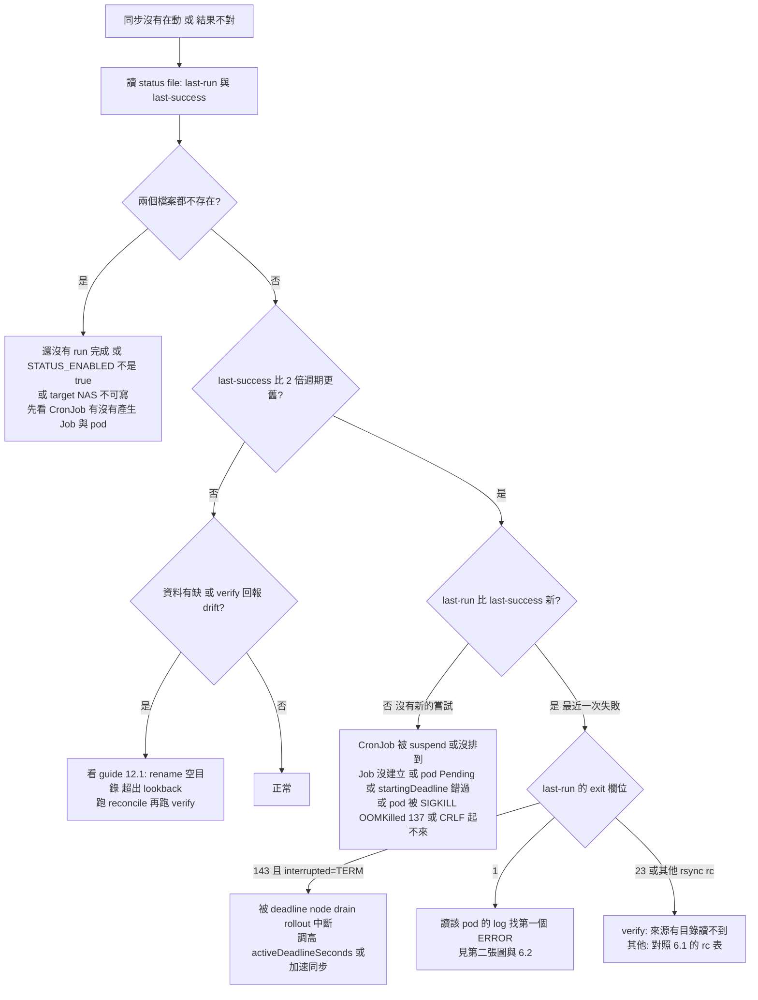

**第二張：log 內第一個 ERROR / WARN 之後**

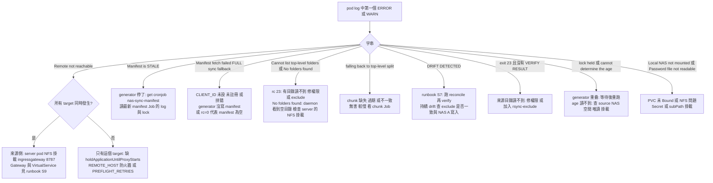

---

## 7. 已知限制

以下來自 guide §12.1 與 spec §11（已記錄、刻意不修的限制），以及本手冊撰寫時由程式碼推得的項目（有標記）。

**偵測能力的限制（guide §12.1）**

1. **mtime 偵測的盲區**：rename / 搬移、新增空目錄、目錄 metadata 變更、mtime 被保留的內容變更、任一端的無聲損毀、超出 `lookback_hours` 的變動，`incremental` 全都看不到；只有每週 `parallel` reconcile 能補（2.4 有完整表格）。reconcile 是**必要的補償控制**，不是選配。
2. **孤兒副本是永久的**：因為刪除永遠不傳播，rename 之後留在舊路徑的副本不會被任何模式移除；數月的重整後 target 會累積這類副本。要清理只能用 `--dry-run` 比對列出、人工審核後手動刪除，**絕不可**加入 rsync 的刪除選項。
3. **verify 看不到被清空的來源**：verify 比較的是 rsync daemon 對外提供的內容，且從不移除 target 上獨有的檔案。若 daemon 服務的是空目錄（例如 server 的 NFS 掛載遺失，daemon 服務掛載點底下的空目錄），預設的 `meta` 模式沒有東西可比，回報 `drift=0`（`VERIFY OK`）。`checksum` / `both` 只在清單當下來源就是空的才會以 `Tier 2: no top-level dirs listed` 停止；若在清單之後才變空，每個 slice 資料夾都被當成「已移除」（WARN、略過），最後仍是 `VERIFY OK`。server 沒有任何防護：`entrypoint.sh` 只在啟動時用 `mountpoint` 檢查一次並只記一個 `WARN NAS not detected as mountpoint`，不會停止 daemon，執行中也不再檢查掛載。target 不會有任何損失（sync 從不移除 target 獨有的檔案），但綠色的 verify 對一個已變空的來源**什麼也證明不了**。請留意 server pod 啟動 log 的那個 WARN；下游症狀是 `parallel` fallback 的 `No folders found`，以及 `incremental` 的 `Manifest fetch failed (rc=…) — FULL sync fallback`。manifest 的 `file_count=0` **不是可靠的徵兆**：安靜的回溯視窗也會是 0，且 generator pod 是直接掛載 NAS。

**spec §11 記載的限制**

4. verify 的「N entries compared」只計入被 itemize 的（有差異的）行；標籤有誤導性但無害。
5. 把既有重複的 helper（`rsync_rc_ok`、`wait_for_remote`）搬進 lib 不在 v3.16 範圍。
6. **Cluster B 的 generator pod 以 `/bin/bash` 當 PID 1、沒有訊號處理**：deadline 或刪除造成的 kill 會留下 lock，由 heartbeat 過期（`LOCK_STALE`，600 秒）自癒。
7. manifest 與 chunk 兩個 job 之間**沒有共用 lock**（會讓 2 小時一次的 manifest 排在數小時的 chunk walk 後面；寫入路徑不相交）。代價是週日兩者同時掃描時 NAS metadata 負載加倍。
8. `lookback_hours` 超過約 2.56e15（16 位數以上）時 `HOURS * 3600` 超過 2^63，在 `$(( ))` 內**無聲溢位、沒有 WARN**：多半變成遙遠的未來門檻（該 client 的 manifest 永遠是空的），某些值（例如 18 個 9）變成負數（整棵樹）；每週 reconcile 會補償。
9. verify 的「資料夾已消失」白名單比對的是 **rsync 3.2.7**（兩個 image 的版本）的訊息文字；在別的 rsync 版本上，已消失的資料夾會以「part of it could not be read」失敗（下方 20 行 stderr 會顯示真正原因）。
10. cron 若非預期結束，§8.7 的 entrypoint 以 exit 1 讓 pod 重啟，會殺掉執行中的 run（與 v3.15 相同）。
11. 本手冊與 guide 中的 `kubectl run … --rm -it` throw-away pod **沒有 Istio opt-out annotation**；若 namespace 會自動注入 sidecar，它們可能不會自己結束（未在叢集驗證）。
12. 以 `kubectl exec … dispatch-sync.sh` 手動在執行中的 pod 內啟動的 sync，不保證會被 pod 刪除可靠地停止（`on_term` 以 `dispatch-sync.sh` 的命令列找 run 並對其 process group 送訊號，但 exec 出來的行程的 group 在 pod 的 PID namespace 內可能顯示為 0；CronJob pod 內的 wrapper 只對自己的 group 送訊號）。最壞情況是 run 在寬限期結束時隨容器被殺，與 v3.15 每個 run 的遭遇相同。
13. 收到 TERM 後，每個排隊中的 parallel 單元仍會 fork 一個 `bash -c` 來記 `SKIP` 與 rc 143，但不會啟動 rsync（約每單元 0.75 ms；chunk 路徑約 24 個單元）。
14. §8.4 在 `FULL_SYNC` 分支的 `run_full_sync` 之前多做了一次 `check_term`，多餘但無害。
15. 兩個 run 在幾毫秒內同時清除或打破同一個被取代的 lock 時，可能都記下 "Removed …"，或打破者記「another run holds the name」而實際上「held by」更準確；沒有狀態被破壞。

**本手冊從程式碼推得、guide 未明述的項目（建議在你的環境確認）**

16. **空 manifest 會觸發 FULL sync fallback（已對照程式碼確認，v3.15 起即如此，v3.16 未修）**：generator（§4.3）對沒有變動的視窗仍以 `: >` + `mv` 發布 0 位元組的 `sync-manifest.txt`，而 `nas-sync-incremental.sh` 以 `[ ! -s "$MANIFEST_LOCAL" ]` 判斷，抓取成功但 manifest 大小為 0（回溯視窗內完全沒有變動）也會走 `Manifest fetch failed (rc=0) — FULL sync fallback`。`Nothing changed. Skipping.` 只有 manifest 內全是空白行才會出現，而 v3.16 的 generator 不會產生那樣的檔案。對 7.4M 資料夾的樹，這代表一個完全安靜的視窗會讓該輪變成全量比對：rsync 以大小與 mtime 比較，沒變的檔案不會重傳，資料不會出錯，但要走完整棵樹的檔案清單，正是 `incremental` 想省掉的成本。修正方向（尚未實作）：client 端把「抓取成功但為空」與「抓取失敗」分開，前者記 `Nothing changed. Skipping.`。
17. **（推論）chunk 路徑與空目錄**：chunk 清單只含檔案與 symlink；chunk 路徑下空目錄是否會被 reconcile 建立，guide 與 behavior suite 都沒有驗證（2.4）。
18. **（推論）Deployment 的 `flock` 只在單一 pod 內有效**，且 `restartPolicy: Always` 下每次容器重啟都會再跑一次初始同步（5.10）。
19. **`CHUNKS_REMOTE`、`META_NAME` 不在 Deployment cron 的 env allow-list**（已對照 §8.7 的 `grep -E` 確認：清單有 `CHUNK_`、`MANIFEST_`，沒有 `CHUNKS_`、`META_`）。只有在 Deployment 上改了這兩個變數時才有影響：初始同步看得到，cron 啟動的 run 看不到（4.6 E）。
20. `CHECK_CONNECTIVITY` 在 Dockerfile（§8.8）設定但沒有任何 script 讀取（已確認）。
21. **guide §8.9 的 sanity check 與 §13 的 CRLF 檢查寫成 `docker run --rm IMAGE sh -c …` / `docker run --rm IMAGE head …`**：client image 的 ENTRYPOINT 是 `tini -g -- run-with-sidecar-quit.sh`，而 wrapper 不使用自己的參數，所以這兩行實際上會啟動 wrapper（嘗試一次同步），而不是執行 `sh`／`head`。請改用本手冊 4.2 的 `--entrypoint` 寫法（已對照 §8.8、§8.6 確認）。
22. `rsyncd.conf` 的 `timeout = 600`、`max connections = 20` 對 client 行為的影響，以及 Istio / Envoy 的 TCP idle timeout，是 rsync / Istio 的通用行為，guide 未討論（5.1、6.2）。

---

## 8. 參考

**guide**（`../cross-cluster-rsync-guide-v3.16-consolidated.md`；章節以 § 標示，不使用易變的錨點）

| § | 內容 | 本手冊對應 |
|---|---|---|
| §1、§2 | 元件如何配合、架構 | 1、2.1 |
| §3 | 前置條件、要替換的值 | 0.3、5.6 |
| §4.2–§4.7 | server image 的 script（entrypoint、manifest、chunks、lock）、Dockerfile、build | 3.1.1、3.2.1、3.4、4.2 |
| §5.1–§5.8 | namespace、rsyncd、secret、server Deployment、Service、Gateway、VirtualService、patch | 5.1–5.3 |
| §6.1–§6.3 | 註冊表、manifest CronJob、chunk CronJob | 5.4、5.5 |
| §7 | 驗證 Cluster B | 4.1 |
| §8.2–§8.7、§8.10、§8.11 | client script（standard、parallel、incremental、dispatch、wrapper、Deployment entry、verify、lib） | 3.1.2、3.2.2、3.3、3.5、3.6 |
| §8.8、§8.9 | client Dockerfile、build & push | 4.2 |
| §9A.1–§9A.5 | PV / PVC / exclude / secret、client、新增 target、reconcile、verify CronJob | 5.6–5.9、4.4 |
| §10B.1、§10B.2 | Deployment、切換成 CronJob | 5.10、4.5 |
| §11 | 驗證與測試（v3.15 / v3.16 檢查） | 4.1 |
| [§12](../cross-cluster-rsync-guide-v3.16-consolidated.md#12-choosing-sync-mode)、[§12.1](../cross-cluster-rsync-guide-v3.16-consolidated.md#121-what-incremental-mode-cannot-see) | 選擇模式、incremental 看不到什麼 | 2.4、7 |
| [§13](../cross-cluster-rsync-guide-v3.16-consolidated.md#13-troubleshooting) | Troubleshooting | 第 6 章 |
| [§14](../cross-cluster-rsync-guide-v3.16-consolidated.md#14-file-checklist) | File Checklist、Deploy Order、What This Consolidates | 1.4、4.1 |

**runbook**（[`nas-sync-operations-runbook.md`](nas-sync-operations-runbook.md)）

| 情境 | 內容 | 本手冊 |
|---|---|---|
| [S0](nas-sync-operations-runbook.md#s0--prerequisites--values-worksheet) | 前置條件與值的工作表 | 4.1 |
| [S1](nas-sync-operations-runbook.md#s1--greenfield-first-source--first-target) | 從零建立第一個 source 與 target | 4.1 |
| [S2](nas-sync-operations-runbook.md#s2--initial-bulk-seed)、[S3](nas-sync-operations-runbook.md#s3--cut-over-bulk--routine) | 初始 bulk seed、切換到例行 | 4.5 |
| [S4](nas-sync-operations-runbook.md#s4--onboard-an-additional-target-while-others-are-live) | 新增 target（其他 target 持續運作） | 4.4 |
| [S5](nas-sync-operations-runbook.md#s5--steady-state) | 穩態、排程與錯開 | 2.4 |
| [S6](nas-sync-operations-runbook.md#s6--change-sync-mode-on-a-live-object) | 線上切換模式 | 4.3.2 |
| [S7](nas-sync-operations-runbook.md#s7--drift-check) | drift 檢查 | 3.3、6.2 D |
| [S8](nas-sync-operations-runbook.md#s8--client-outage-recovery) | client 斷線復原 | 2.4、6.2 B |
| [S9](nas-sync-operations-runbook.md#s9--source-side-failure) | 來源側故障 | 6.2、6.3 |
| [S10](nas-sync-operations-runbook.md#s10--retire-a-target) | 退役 target | 4.4 |
| [S11](nas-sync-operations-runbook.md#s11--version-upgrade) | 版本升級 | 5.11 |
| [S12](nas-sync-operations-runbook.md#s12--triage-decision-tree) | 排錯決策樹 | 6.4 |
| [S13](nas-sync-operations-runbook.md#s13--tuning) | tuning | 4.6 |
| [S14](nas-sync-operations-runbook.md#s14--read-only-source) | 來源唯讀 | 5.2、5.11 |

**其他文件**

- [`superpowers/specs/2026-10-01-v316-review-fixes-design.md`](superpowers/specs/2026-10-01-v316-review-fixes-design.md)：v3.16 設計。§4（generation 與 lock）、§5（資料夾名稱與 verify）、§6（訊號與 status）、§7（錯誤處理總表）、§8（相容性與 rollout）、§10（behavior suite 的測試案例）、§11（已知限制）。
- [`reviews/2026-07-22-nas-sync-architecture-review.md`](reviews/2026-07-22-nas-sync-architecture-review.md)：架構選型、替代方案、mtime 偵測的限制。
- `../scripts/check-guide.sh`、`../scripts/test-guide-behavior.sh`：只在你要修改 guide 時使用（靜態檢查與 runtime behavior suite）。
- `../CLAUDE.md`：修改 guide 的規則（不重新編號章節、新 script 要改四處、不加刪除選項）。
