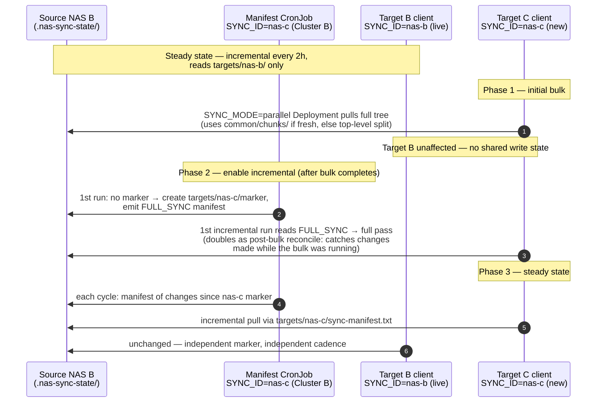

# v3.15 Guide Hardening Implementation Plan

> **For agentic workers:** REQUIRED SUB-SKILL: Use superpowers:subagent-driven-development (recommended) or superpowers:executing-plans to implement this plan task-by-task. Steps use checkbox (`- [ ]`) syntax for tracking.

**Goal:** Add four hardening capabilities (verify mode, chunked parallel reconcile, sync status file, SYNC_ID multi-target state layout) plus a multi-target scenarios section to `cross-cluster-rsync-guide-v3.13-consolidated.md`, per the approved spec `docs/superpowers/specs/2026-07-05-rsync-hardening-v315-design.md`.

**Architecture:** This is a **documentation repo** — the guide's fenced code blocks ARE the deliverable. Every task edits the markdown guide; "tests" are consistency checks: extract each fenced shell script and run `bash -n`, grep for section-reference integrity, verify the §14 checklist and consolidates table list every artifact. There is no cluster to deploy against here.

**Tech Stack:** Markdown, bash (fenced), Kubernetes YAML (fenced), Mermaid (S2 diagram).

## Global Constraints

Copied from the spec + repo CLAUDE.md — every task implicitly includes these:

- **Guide file:** `cross-cluster-rsync-guide-v3.13-consolidated.md` (renamed to `...v3.15...` only in Task 8).
- **LF line endings only** in all fenced scripts. Never introduce CRLF (Windows host — check with `cat -A` if unsure).
- **Fixed conventions preserved:** port `8787`, namespace `ea-pmc`, NO `--delete` anywhere ever, console-only logging, `--whole-file`, placeholders `your-registry.example.com` / `ISTIO_EXTERNAL_IP_HERE` left intact with `◄ MODIFY` marks.
- **No section renumbering** of existing §§ (CLAUDE.md and cross-refs depend on §4.4, §8.8, §8.6 etc.). All new content uses NEW subsection numbers appended after existing ones (§4.6, §6.2, §6.3, §8.10, §9A.3, §15).
- **Source NAS state root** is `.nas-sync-state/` (existing). New layout inside it: `targets/<SYNC_ID>/` (per-target marker + `sync-manifest.txt` — note: **no leading dot** on the manifest filename; that matches the existing guide, the spec's `.sync-manifest.txt` spelling is superseded) and `common/chunks/` (shared).
- **Target NAS status root** is `.nas-sync-status/` (new, on NAS A).
- Every new script must be added to the corresponding Dockerfile COPY + dos2unix + CRLF-guard list AND to the §14 File Checklist AND (if a new capability) the consolidates table.
- Commit after each task. Never `git add -A` — always add the specific file(s) named in the task (the repo may contain other in-progress files).

**Scratchpad for verification:** use `C:\Users\leo01\AppData\Local\Temp\claude\...\scratchpad` (or any temp dir) — referred to below as `$SCRATCH`.

**Script-extraction helper** (used by several verify steps). Extracts the first ```bash fenced block that appears after a given header line, strips the fences, writes to a file:

```bash
extract_block() {  # $1=header-regex  $2=outfile  $3=guide-file
  awk -v hdr="$1" '
    $0 ~ hdr {found=1}
    found && /^```bash$/ {inb=1; next}
    inb && /^```$/ {exit}
    inb {print}
  ' "$3" > "$2"
}
```

Run it in Git Bash. Example: `extract_block '^### 4\.3 ' $SCRATCH/gen-manifest.sh cross-cluster-rsync-guide-v3.13-consolidated.md && bash -n $SCRATCH/gen-manifest.sh`.

---

### Task 0: Commit the pending v3.14 hunk (prerequisite)

**Files:**
- Modify: none (commit-only)

The working tree has an uncommitted v3.14 edit in the guide (§5.2 note + §5.4 mount comment). v3.15 commits must not mix with it.

- [ ] **Step 1: Confirm the pending diff is only the v3.14 hunk**

Run: `git diff --stat`
Expected: exactly `cross-cluster-rsync-guide-v3.13-consolidated.md | 7 ++++---` (±). If anything else appears, STOP and ask the user.

- [ ] **Step 2: Commit it**

```bash
git add cross-cluster-rsync-guide-v3.13-consolidated.md
git commit -m "v3.14: clarify manifest state lives on source NAS, drop stale [manifest] module note (5.2, 5.4)"
```

- [ ] **Step 3: Verify clean tree**

Run: `git status --short`
Expected: empty (or only files outside the guide).

---

### Task 1: SYNC_ID multi-target state layout (Addition 4)

**Files:**
- Modify: `cross-cluster-rsync-guide-v3.13-consolidated.md` — §4.3 (generate-manifest.sh), §6 intro + §6.1 (cronjob-manifest.yaml) + new §6.3, §8.4 (nas-sync-incremental.sh), §8.8 (Dockerfile ENV), §9A.2 (cronjob-client.yaml env)

**Interfaces:**
- Produces: env var `SYNC_ID` (default `default`) consumed by generator + client; state paths `STATE_ROOT=${SOURCE_PATH}/.nas-sync-state`, `STATE_DIR=${STATE_ROOT}/targets/${SYNC_ID}`; client manifest path `.nas-sync-state/targets/${SYNC_ID}/sync-manifest.txt`. Task 2 reuses `STATE_ROOT` and the `common/` convention; Task 7's scenarios describe this layout.

- [ ] **Step 1: Rewrite §4.3 `generate-manifest.sh` body**

Replace the entire fenced bash block under `### 4.3 File: `cluster-b/scripts/generate-manifest.sh`` with:

```bash
#!/bin/bash
#############################################
# Manifest Generator (Cluster B) — v3.15
# Lists files changed since last sync for
# incremental mode (--files-from on client).
# v3.15: per-target state under
#   .nas-sync-state/targets/<SYNC_ID>/
# (one source NAS can feed many targets;
#  each target gets its own marker+manifest)
#############################################
set +e

SYNC_ID="${SYNC_ID:-default}"
SOURCE_PATH="${SOURCE_PATH:-/mnt/nas-source}"
# State root lives ON the source NAS (no Kubernetes PVC): survives pod
# rescheduling and adds no new storage dependency (the NAS is already required).
STATE_ROOT="${STATE_ROOT:-${SOURCE_PATH}/.nas-sync-state}"
STATE_DIR="${STATE_DIR:-${STATE_ROOT}/targets/${SYNC_ID}}"
MARKER="${STATE_DIR}/last-sync-marker"
MARKER_CANDIDATE="${STATE_DIR}/last-sync-marker.candidate"
MANIFEST="${MANIFEST_PATH:-${STATE_DIR}/sync-manifest.txt}"

log() { echo "$(date '+%Y-%m-%d %H:%M:%S') - $1"; }

mkdir -p "$STATE_DIR"

# Hygiene: drop any orphan candidate left by a crashed previous run.
# Safe because the CronJob uses concurrencyPolicy: Forbid (no concurrent run).
rm -f "$MARKER_CANDIDATE"

log "========================================"
log "Manifest Generator v3.15"
log "  Source: $SOURCE_PATH | Target ID: $SYNC_ID"
log "  State:  $STATE_DIR"
log "========================================"

# Capture scan start time; files changed during scan caught next run
touch "$MARKER_CANDIDATE"

if [ ! -f "$MARKER" ]; then
    log "No marker — first run for target '$SYNC_ID'. Signaling FULL_SYNC."
    echo "FULL_SYNC" > "$MANIFEST"
else
    log "Generating changed-file list (newer than marker)..."
    # Prune the WHOLE state root, not just this target's dir — other targets'
    # markers/manifests and the shared chunks must never enter a manifest.
    find "$SOURCE_PATH" \
        -path "$SOURCE_PATH/.snapshot" -prune -o \
        -path "$STATE_ROOT" -prune -o \
        -type f -newer "$MARKER" -printf '%P\n' \
        > "$MANIFEST" 2>/dev/null
    CHANGED=$(wc -l < "$MANIFEST")
    log "Found $CHANGED changed files"
fi

mv "$MARKER_CANDIDATE" "$MARKER"
log "Manifest written to $MANIFEST. Done."
```

- [ ] **Step 2: Add a migration note directly under the §4.3 block-quote line**

Change the line `> Used only for `incremental` mode. Produces the changed-file list.` to:

```markdown
> Used only for `incremental` mode. Produces the changed-file list.
>
> **v3.15 layout change:** state moved from `.nas-sync-state/` root to
> `.nas-sync-state/targets/<SYNC_ID>/` so one source NAS can serve several
> target NASes, each with an independent marker. No migration needed: the
> first run under the new layout finds no marker and emits `FULL_SYNC`,
> which the client turns into a one-time full reconcile pass. Stale root-level
> `last-sync-marker` / `sync-manifest.txt` files can be deleted manually.
```

- [ ] **Step 3: Update §6.1 `cronjob-manifest.yaml`**

In the fenced YAML under `### 6.1 cronjob-manifest.yaml`, replace the `env:` list of the `manifest-gen` container:

```yaml
              env:
                - name: SYNC_ID
                  value: "default"                 # ◄ MODIFY per target (e.g. nas-a)
                - name: SOURCE_PATH
                  value: "/mnt/nas-source"
                # v3.15: state root on the source NAS; the script derives
                # targets/<SYNC_ID>/ under it. Set explicitly for clarity:
                - name: STATE_ROOT
                  value: "/mnt/nas-source/.nas-sync-state"
```

(This replaces the old `STATE_DIR` env — the script now derives `STATE_DIR` from `STATE_ROOT` + `SYNC_ID`.)

- [ ] **Step 4: Add new §6.3 — per-target manifest CronJobs**

Insert after the `kubectl apply -f cluster-b/cronjob-manifest.yaml` code block (still inside §6, before the `---` that precedes `## 7.`):

```markdown
### 6.3 Multiple targets: one manifest CronJob per target

Each pulling target needs its **own** manifest CronJob and `SYNC_ID` — a shared
marker would silently drop changes for any target that misses a cycle (see §15).
Copy `cronjob-manifest.yaml` once per target and change only:

```yaml
#   metadata.name: nas-sync-manifest-<SYNC_ID>     # e.g. nas-sync-manifest-nas-c
#   env SYNC_ID:   "<SYNC_ID>"                     # e.g. nas-c
#   schedule:      10 min before THAT target's client schedule
```

The generators are cheap relative to the sync itself, but each one is a full
metadata walk of the source tree — stagger their schedules a few minutes apart.
```

(Note: §6.2 is created by Task 2; using 6.3 here keeps numbering stable regardless of task order — if Task 2 hasn't run yet, a temporary 6.1→6.3 gap is fine and closes when Task 2 lands.)

- [ ] **Step 5: Update §8.4 `nas-sync-incremental.sh`**

In the fenced bash under `### 8.4`, change these two lines:

```bash
RSYNC_TIMEOUT="${RSYNC_TIMEOUT:-14400}"
MANIFEST_NAME="${MANIFEST_NAME:-.nas-sync-state/sync-manifest.txt}"
```

to:

```bash
RSYNC_TIMEOUT="${RSYNC_TIMEOUT:-14400}"
SYNC_ID="${SYNC_ID:-default}"
MANIFEST_NAME="${MANIFEST_NAME:-.nas-sync-state/targets/${SYNC_ID}/sync-manifest.txt}"
```

and change the banner comment line `# NAS Sync — INCREMENTAL mode` block to note the ID, i.e. replace:

```bash
#############################################
# NAS Sync — INCREMENTAL mode
# Sync only changed files from server manifest
#############################################
```

with:

```bash
#############################################
# NAS Sync — INCREMENTAL mode (v3.15)
# Sync only changed files from server manifest
# Manifest is per-target: targets/<SYNC_ID>/
#############################################
```

Also change the log line `log "=== NAS SYNC (incremental) ==="` to `log "=== NAS SYNC (incremental, target=$SYNC_ID) ==="`.

- [ ] **Step 6: Add `SYNC_ID` to the client Dockerfile ENV block (§8.8)**

After the line `ENV SYNC_MODE=standard` add:

```dockerfile
ENV SYNC_ID=default
```

- [ ] **Step 7: Add `SYNC_ID` env to §9A.2 `cronjob-client.yaml`**

Directly after the `SYNC_MODE` env entry (inside the `===== SELECT SYNC MODE HERE =====` block), add:

```yaml
                - name: SYNC_ID
                  value: "default"              # ◄ MODIFY per target; must match a §6 manifest CronJob
```

- [ ] **Step 8: Verify**

```bash
extract_block '^### 4\.3 ' $SCRATCH/gen-manifest.sh cross-cluster-rsync-guide-v3.13-consolidated.md && bash -n $SCRATCH/gen-manifest.sh && echo OK-4.3
extract_block '^### 8\.4 ' $SCRATCH/incremental.sh cross-cluster-rsync-guide-v3.13-consolidated.md && bash -n $SCRATCH/incremental.sh && echo OK-8.4
grep -c 'SYNC_ID' cross-cluster-rsync-guide-v3.13-consolidated.md
```
Expected: `OK-4.3`, `OK-8.4`, and SYNC_ID count ≥ 10.

- [ ] **Step 9: Commit**

```bash
git add cross-cluster-rsync-guide-v3.13-consolidated.md
git commit -m "v3.15: SYNC_ID multi-target state layout (targets/<id>/ marker+manifest, per-target manifest CronJobs)"
```

---

### Task 2: Chunk generator (server side)

**Files:**
- Modify: guide — new `### 4.6` (generate-chunks.sh), §4.4 Dockerfile, §4.5 build commands, new `### 6.2` (cronjob-chunks.yaml), §6 intro note

**Interfaces:**
- Consumes: `STATE_ROOT` convention from Task 1.
- Produces: on the source NAS, `.nas-sync-state/common/chunks/chunk-NNN.txt` (relative file paths, one per line) + `chunks.meta` containing `generated=<iso8601>`, `epoch=<unix>`, `chunks=<N>`, `total_files=<N>` — one `key=value` per line. Task 3's client parses `epoch=`.

- [ ] **Step 1: Insert new section `### 4.6 File: `cluster-b/scripts/generate-chunks.sh` (v3.15)`**

Insert AFTER the §4.5 Build & Push section's closing code fence (immediately before the `---` / `## 5.` boundary):

````markdown
### 4.6 File: `cluster-b/scripts/generate-chunks.sh` (v3.15)

> Used only for the client's **chunked parallel reconcile** (§8.3). Walks the
> full tree once, NFS-local, and splits it into equal-count chunk lists so the
> client's workers stay evenly loaded (no top-level-folder skew). Chunks are
> target-independent — one weekly walk serves every target. After adding this
> file, re-run the §4.5 build.

```bash
#!/bin/bash
#############################################
# Chunk Generator (Cluster B) — v3.15
# Full-tree file list split round-robin into
# CHUNK_COUNT equal-count lists for the
# client's chunked parallel reconcile
# (--files-from per worker).
# Shared by ALL targets: common/chunks/
#############################################
set +e

SOURCE_PATH="${SOURCE_PATH:-/mnt/nas-source}"
STATE_ROOT="${STATE_ROOT:-${SOURCE_PATH}/.nas-sync-state}"
CHUNK_DIR="${CHUNK_DIR:-${STATE_ROOT}/common/chunks}"
CHUNK_COUNT="${CHUNK_COUNT:-24}"
TMP_DIR="${CHUNK_DIR}.tmp"

log() { echo "$(date '+%Y-%m-%d %H:%M:%S') - $1"; }

log "========================================"
log "Chunk Generator v3.15"
log "  Source: $SOURCE_PATH | $CHUNK_COUNT chunks -> $CHUNK_DIR"
log "========================================"

# Hygiene: remove orphan tmp dir from a crashed run.
# Safe because the CronJob uses concurrencyPolicy: Forbid.
rm -rf "$TMP_DIR"
mkdir -p "$TMP_DIR"

START=$(date +%s)
log "Walking source tree (full file list)..."
# split -n r/N = round-robin, works on a pipe (no size needed)
find "$SOURCE_PATH" \
    -path "$SOURCE_PATH/.snapshot" -prune -o \
    -path "$STATE_ROOT" -prune -o \
    -type f -printf '%P\n' 2>/dev/null \
    | split -d -a 3 -n r/"$CHUNK_COUNT" - "$TMP_DIR/chunk-"

TOTAL=$(cat "$TMP_DIR"/chunk-* 2>/dev/null | wc -l)
if [ "$TOTAL" -eq 0 ]; then
    log "ERROR: walk produced 0 files — keeping previous chunks"
    rm -rf "$TMP_DIR"
    exit 1
fi

for f in "$TMP_DIR"/chunk-*; do mv "$f" "$f.txt"; done

{
    echo "generated=$(date -u '+%Y-%m-%dT%H:%M:%SZ')"
    echo "epoch=$(date +%s)"
    echo "chunks=$CHUNK_COUNT"
    echo "total_files=$TOTAL"
} > "$TMP_DIR/chunks.meta"

# Swap new chunks into place (clients fetch the whole dir in one rsync,
# so the worst case during the swap is one failed fetch -> client falls
# back to the top-level split)
rm -rf "${CHUNK_DIR}.old"
[ -d "$CHUNK_DIR" ] && mv "$CHUNK_DIR" "${CHUNK_DIR}.old"
mv "$TMP_DIR" "$CHUNK_DIR"
rm -rf "${CHUNK_DIR}.old"

DUR=$(( $(date +%s) - START ))
log "Wrote $CHUNK_COUNT chunks, $TOTAL files, ${DUR}s. Done."
```
````

- [ ] **Step 2: Add the script to the §4.4 server Dockerfile**

Change:

```dockerfile
COPY entrypoint.sh /entrypoint.sh
COPY generate-manifest.sh /userapp/scripts/generate-manifest.sh

# CRLF-safe: strip carriage returns, set executable
RUN dos2unix /entrypoint.sh /userapp/scripts/generate-manifest.sh \
    && chmod +x /entrypoint.sh /userapp/scripts/generate-manifest.sh

# Fail build if any CRLF remains
RUN for f in /entrypoint.sh /userapp/scripts/generate-manifest.sh; do \
```

to:

```dockerfile
COPY entrypoint.sh /entrypoint.sh
COPY generate-manifest.sh /userapp/scripts/generate-manifest.sh
COPY generate-chunks.sh /userapp/scripts/generate-chunks.sh

# CRLF-safe: strip carriage returns, set executable
RUN dos2unix /entrypoint.sh /userapp/scripts/generate-manifest.sh /userapp/scripts/generate-chunks.sh \
    && chmod +x /entrypoint.sh /userapp/scripts/generate-manifest.sh /userapp/scripts/generate-chunks.sh

# Fail build if any CRLF remains
RUN for f in /entrypoint.sh /userapp/scripts/generate-manifest.sh /userapp/scripts/generate-chunks.sh; do \
```

- [ ] **Step 3: Add the script to the §4.5 local CRLF-clean line**

Change `sed -i 's/\r$//' entrypoint.sh generate-manifest.sh 2>/dev/null || true` to
`sed -i 's/\r$//' entrypoint.sh generate-manifest.sh generate-chunks.sh 2>/dev/null || true`.

- [ ] **Step 4: Insert new section `### 6.2 cronjob-chunks.yaml (v3.15)`**

Insert after §6.1's `kubectl apply` block and BEFORE the §6.3 section added in Task 1 (if Task 1 already ran) — final order inside §6 must be 6.1, 6.2, 6.3:

````markdown
### 6.2 cronjob-chunks.yaml (v3.15)

> Only needed for the **chunked parallel reconcile** (§8.3). One shared job for
> all targets. Schedule it ~2h before the weekly reconcile client run.

```yaml
apiVersion: batch/v1
kind: CronJob
metadata:
  name: nas-sync-chunks
  namespace: ea-pmc
  labels:
    app: nas-sync
    role: chunks
spec:
  # Sunday 00:00 — 2h before the weekly reconcile client (Sunday 02:00, §12)
  schedule: "0 0 * * 0"
  concurrencyPolicy: Forbid
  successfulJobsHistoryLimit: 3
  failedJobsHistoryLimit: 3
  jobTemplate:
    spec:
      activeDeadlineSeconds: 86400
      template:
        metadata:
          annotations:
            sidecar.istio.io/inject: "false"   # try; if forced, harmless here
        spec:
          containers:
            - name: chunk-gen
              image: your-registry.example.com/nas-sync-server:3.15   # ◄ reuse server image
              command: ["/bin/bash", "/userapp/scripts/generate-chunks.sh"]
              env:
                - name: SOURCE_PATH
                  value: "/mnt/nas-source"
                - name: STATE_ROOT
                  value: "/mnt/nas-source/.nas-sync-state"
                - name: CHUNK_COUNT
                  value: "24"                  # > PARALLEL_WORKERS so fast workers keep pulling
              volumeMounts:
                - name: nas-source
                  mountPath: /mnt/nas-source
          restartPolicy: Never
          volumes:
            - name: nas-source
              nfs:
                server: "10.90.220.155"          # ◄ MODIFY
                path: "/PMCenterData"            # ◄ MODIFY
                readOnly: false                  # REQUIRED: chunks are written here
```

```bash
# Only if using chunked parallel reconcile:
kubectl apply -f cluster-b/cronjob-chunks.yaml
```
````

(The `:3.15` image tag is intentional — Task 8 bumps every image tag; if Task 8 hasn't run yet this one is simply already correct.)

- [ ] **Step 5: Update the §6 intro line**

Change `> **Only needed if you use `incremental` mode.** Skip if using `standard` or `parallel`.` to:

```markdown
> **§6.1/§6.3 are only needed for `incremental` mode; §6.2 only for the chunked
> parallel reconcile.** Skip what you don't use.
```

- [ ] **Step 6: Verify**

```bash
extract_block '^### 4\.6 ' $SCRATCH/gen-chunks.sh cross-cluster-rsync-guide-v3.13-consolidated.md && bash -n $SCRATCH/gen-chunks.sh && echo OK-4.6
grep -n 'generate-chunks.sh' cross-cluster-rsync-guide-v3.13-consolidated.md
```
Expected: `OK-4.6`; generate-chunks.sh appears in §4.4 (×3: COPY/dos2unix/loop), §4.5, §4.6, §6.2.

- [ ] **Step 7: Commit**

```bash
git add cross-cluster-rsync-guide-v3.13-consolidated.md
git commit -m "v3.15: server-side chunk generator (4.6) + weekly chunks CronJob (6.2), Dockerfile wiring"
```

---

### Task 3: Chunked parallel client (with fallback)

**Files:**
- Modify: guide — §8.3 (nas-sync-parallel.sh, full rewrite), §8.8 Dockerfile ENV

**Interfaces:**
- Consumes: `.nas-sync-state/common/chunks/{chunk-NNN.txt,chunks.meta}` from Task 2 (`epoch=` line).
- Produces: `CHUNK_MAX_AGE` env (default 86400). Fallback path = the v3.13 top-level split, unchanged.

- [ ] **Step 1: Replace the §8.3 fenced bash block entirely with:**

```bash
#!/bin/bash
#############################################
# NAS Sync — PARALLEL mode (v3.15)
# Preferred: N workers over server-generated
#   equal-count chunk lists (§4.6 / §6.2)
# Fallback:  N workers split by top-level
#   folder (v3.13 behavior) when chunks are
#   missing or stale — never blocks the run.
#############################################
set +e

REMOTE_HOST="${REMOTE_HOST:-nas-sync.cluster-b.example.com}"
REMOTE_PORT="${REMOTE_PORT:-8787}"
REMOTE_MODULE="${REMOTE_MODULE:-nas-data}"
REMOTE_USER="${REMOTE_USER:-syncuser}"
LOCAL_NAS_PATH="${LOCAL_NAS_PATH:-/mnt/nas-target}"
RSYNC_PASSWORD_FILE="${RSYNC_PASSWORD_FILE:-/userapp/config/rsync.password}"
EXCLUDE_FILE="${EXCLUDE_FILE:-/userapp/config/rsync-exclude.txt}"
RSYNC_TIMEOUT="${RSYNC_TIMEOUT:-14400}"
PARALLEL_WORKERS="${PARALLEL_WORKERS:-6}"
CHUNK_MAX_AGE="${CHUNK_MAX_AGE:-86400}"

CHUNK_REMOTE_DIR=".nas-sync-state/common/chunks"
CHUNK_LOCAL_DIR="/tmp/nas-sync-chunks"
FOLDER_LIST="/tmp/nas-sync-folders.txt"
FAILED_LIST="/tmp/nas-sync-failed.txt"
REMOTE_URL="rsync://${REMOTE_USER}@${REMOTE_HOST}:${REMOTE_PORT}/${REMOTE_MODULE}"

log() { echo "$(date '+%Y-%m-%d %H:%M:%S') - $1"; }
log_error() { echo "$(date '+%Y-%m-%d %H:%M:%S') - ERROR: $1" >&2; }
die() { log_error "$1"; exit "${2:-1}"; }

RSYNC_FLAGS="-a --whole-file --partial --timeout=$RSYNC_TIMEOUT"
RSYNC_FLAGS="$RSYNC_FLAGS --password-file=$RSYNC_PASSWORD_FILE"
[ -f "$EXCLUDE_FILE" ] && RSYNC_FLAGS="$RSYNC_FLAGS --exclude-from=$EXCLUDE_FILE"

START=$(date +%s)
log "=== NAS SYNC (parallel, $PARALLEL_WORKERS workers) ==="

[ -r "$RSYNC_PASSWORD_FILE" ] || die "Password file not readable"
nc -z -w 10 "$REMOTE_HOST" "$REMOTE_PORT" 2>/dev/null || die "Remote not reachable"
timeout 10 mountpoint -q "$LOCAL_NAS_PATH" 2>/dev/null || die "Local NAS not mounted"
log "OK Pre-flight"

rm -f "$FAILED_LIST"; touch "$FAILED_LIST"

# ---- Try chunked path (server-generated equal-count chunks, §4.6) ----
USE_CHUNKS=false
rm -rf "$CHUNK_LOCAL_DIR"; mkdir -p "$CHUNK_LOCAL_DIR"
rsync -a --password-file="$RSYNC_PASSWORD_FILE" \
    "${REMOTE_URL}/${CHUNK_REMOTE_DIR}/chunks.meta" "$CHUNK_LOCAL_DIR/chunks.meta" 2>/dev/null
if [ -f "$CHUNK_LOCAL_DIR/chunks.meta" ]; then
    GEN_EPOCH=$(grep '^epoch=' "$CHUNK_LOCAL_DIR/chunks.meta" | cut -d= -f2)
    AGE=$(( $(date +%s) - ${GEN_EPOCH:-0} ))
    if [ -n "$GEN_EPOCH" ] && [ "$AGE" -le "$CHUNK_MAX_AGE" ]; then
        log "Chunks fresh (age ${AGE}s <= ${CHUNK_MAX_AGE}s) — fetching chunk lists..."
        rsync -a --password-file="$RSYNC_PASSWORD_FILE" \
            "${REMOTE_URL}/${CHUNK_REMOTE_DIR}/" "$CHUNK_LOCAL_DIR/" 2>/dev/null \
            && USE_CHUNKS=true
    else
        log "Chunks stale (age ${AGE}s > ${CHUNK_MAX_AGE}s) — falling back to top-level split"
    fi
else
    log "No chunks.meta on server — falling back to top-level split"
fi

sync_one_chunk() {
    local chunk="$1" name s rc
    name=$(basename "$chunk" .txt)
    s=$(date +%s)
    echo "$(date '+%H:%M:%S') [worker] START $name ($(wc -l < "$chunk") files)"
    rsync $RSYNC_FLAGS --files-from="$chunk" "${REMOTE_URL}/" "${LOCAL_NAS_PATH}/" 2>&1 | sed "s/^/[$name] /"
    rc=${PIPESTATUS[0]}
    [ "$rc" -ne 0 ] && echo "$name" >> "$FAILED_LIST"
    echo "$(date '+%H:%M:%S') [worker] DONE  $name (rc=$rc, $(( $(date +%s) - s ))s)"
    return $rc
}

sync_one_folder() {
    local folder="$1" s rc
    s=$(date +%s)
    echo "$(date '+%H:%M:%S') [worker] START $folder"
    rsync $RSYNC_FLAGS "${REMOTE_URL}/${folder}/" "${LOCAL_NAS_PATH}/${folder}/" 2>&1 | sed "s/^/[$folder] /"
    rc=${PIPESTATUS[0]}
    [ "$rc" -ne 0 ] && echo "$folder" >> "$FAILED_LIST"
    echo "$(date '+%H:%M:%S') [worker] DONE  $folder (rc=$rc, $(( $(date +%s) - s ))s)"
    return $rc
}
export -f sync_one_chunk sync_one_folder
export REMOTE_URL LOCAL_NAS_PATH RSYNC_FLAGS FAILED_LIST

if [ "$USE_CHUNKS" = true ]; then
    CHUNK_TOTAL=$(ls "$CHUNK_LOCAL_DIR"/chunk-*.txt 2>/dev/null | wc -l)
    [ "$CHUNK_TOTAL" -gt 0 ] || die "chunks.meta present but no chunk files"
    log "Chunked reconcile: $CHUNK_TOTAL chunks, $PARALLEL_WORKERS workers"
    ls "$CHUNK_LOCAL_DIR"/chunk-*.txt | xargs -P "$PARALLEL_WORKERS" -I {} bash -c 'sync_one_chunk "$@"' _ {}
    RC=$?
    UNITS="$CHUNK_TOTAL chunks"
else
    log "Listing top-level folders..."
    rsync --list-only --password-file="$RSYNC_PASSWORD_FILE" "${REMOTE_URL}/" 2>/dev/null \
        | awk '$1 ~ /^d/ && $NF != "." {print $NF}' > "$FOLDER_LIST"
    FOLDER_COUNT=$(wc -l < "$FOLDER_LIST")
    log "Found $FOLDER_COUNT top-level folders"
    [ "$FOLDER_COUNT" -gt 0 ] || die "No folders found"

    log "Syncing top-level loose files..."
    rsync $RSYNC_FLAGS --dirs "${REMOTE_URL}/" "${LOCAL_NAS_PATH}/" 2>&1 | grep -v '^$'

    cat "$FOLDER_LIST" | xargs -P "$PARALLEL_WORKERS" -I {} bash -c 'sync_one_folder "$@"' _ {}
    RC=$?
    UNITS="$FOLDER_COUNT folders"
fi

FAILED=$(grep -c . "$FAILED_LIST" 2>/dev/null)
DUR=$(( $(date +%s) - START ))
if [ "$FAILED" -gt 0 ]; then
    log "FAILED UNITS: $(tr '\n' ' ' < "$FAILED_LIST")"
fi
log "=== COMPLETE: $UNITS, failed=$FAILED, ${DUR}s, rc=$RC ==="
[ "$FAILED" -gt 0 ] && exit 1
exit $RC
```

- [ ] **Step 2: Add a caveat note directly under the `### 8.3` heading line (before the code fence)**

```markdown
> **v3.15:** prefers server-generated equal-count chunks (§4.6/§6.2) so one
> oversized top-level folder can't serialize the reconcile; falls back to the
> v3.13 top-level split automatically. Note: the chunked path (like
> `incremental`) replicates *files* — empty directories are only created by
> the fallback/standard paths. Failed workers no longer abort the whole run;
> failures are collected and reported at the end (nonzero exit).
```

- [ ] **Step 3: Add ENV to §8.8 Dockerfile** — after `ENV PARALLEL_WORKERS=6` add:

```dockerfile
ENV CHUNK_MAX_AGE=86400
```

- [ ] **Step 4: Verify**

```bash
extract_block '^### 8\.3 ' $SCRATCH/parallel.sh cross-cluster-rsync-guide-v3.13-consolidated.md && bash -n $SCRATCH/parallel.sh && echo OK-8.3
grep -c 'delete' $SCRATCH/parallel.sh
```
Expected: `OK-8.3`; the `delete` grep must return 0 matches (no-delete invariant).

- [ ] **Step 5: Commit**

```bash
git add cross-cluster-rsync-guide-v3.13-consolidated.md
git commit -m "v3.15: chunked parallel reconcile in client (8.3) with top-level-split fallback"
```

---

### Task 4: Verify mode script + CronJob

**Files:**
- Modify: guide — new `### 8.10` (nas-sync-verify.sh), §8.8 Dockerfile (COPY + ENV), new `### 9A.3` (cronjob-verify.yaml)

**Interfaces:**
- Consumes: nothing new (rsyncd module, password file, exclude file — as all client scripts).
- Produces: `SYNC_MODE=verify` handled by Task 5's dispatcher; script path `/userapp/scripts/nas-sync-verify.sh`; env `VERIFY_MODE` (`meta|checksum|both`, default `meta`), `VERIFY_SLICES` (default 13), `VERIFY_FAIL_THRESHOLD` (default 0). Emits one machine-readable line: `VERIFY RESULT mode=<m> drift=<n> checked=<n> elapsed=<n>s`. Exit 0 iff drift ≤ threshold.

- [ ] **Step 1: Insert new section `### 8.10 File: `cluster-a/scripts/nas-sync-verify.sh` (v3.15)`**

Insert AFTER the §8.9 Build & Push section (immediately before the `---` / `## 9.` boundary):

````markdown
### 8.10 File: `cluster-a/scripts/nas-sync-verify.sh` (v3.15)

> **Drift detection only** — pure `--dry-run`, never transfers, never deletes.
> Turns "silent missed changes" into a visible, countable Job result.
> `meta` compares size+mtime across the whole tree (cheap: one metadata walk).
> `checksum` byte-compares a rotating 1/`VERIFY_SLICES` slice of top-level
> folders (full coverage after `VERIFY_SLICES` runs) — the only way to catch
> content changes that kept their mtime. Schedule right after the weekly
> reconcile, when the tree is at rest and expected drift is 0.
> Target-only extra files are never counted (and never touched): rsync without
> `--delete` does not even report them.

```bash
#!/bin/bash
#############################################
# NAS Sync — VERIFY mode (v3.15)
# Drift detection: --dry-run only.
#   VERIFY_MODE=meta      size+mtime, whole tree
#   VERIFY_MODE=checksum  byte compare, rotating slice
#   VERIFY_MODE=both      meta, then checksum slice
# Exit 0 iff drift <= VERIFY_FAIL_THRESHOLD.
#############################################
set +e

REMOTE_HOST="${REMOTE_HOST:-nas-sync.cluster-b.example.com}"
REMOTE_PORT="${REMOTE_PORT:-8787}"
REMOTE_MODULE="${REMOTE_MODULE:-nas-data}"
REMOTE_USER="${REMOTE_USER:-syncuser}"
LOCAL_NAS_PATH="${LOCAL_NAS_PATH:-/mnt/nas-target}"
RSYNC_PASSWORD_FILE="${RSYNC_PASSWORD_FILE:-/userapp/config/rsync.password}"
EXCLUDE_FILE="${EXCLUDE_FILE:-/userapp/config/rsync-exclude.txt}"
RSYNC_TIMEOUT="${RSYNC_TIMEOUT:-14400}"
VERIFY_MODE="${VERIFY_MODE:-meta}"
VERIFY_SLICES="${VERIFY_SLICES:-13}"
VERIFY_FAIL_THRESHOLD="${VERIFY_FAIL_THRESHOLD:-0}"

REMOTE_URL="rsync://${REMOTE_USER}@${REMOTE_HOST}:${REMOTE_PORT}/${REMOTE_MODULE}"
ITEMIZE_OUT="/tmp/verify-itemize.txt"
FOLDERS_OUT="/tmp/verify-folders.txt"

log() { echo "$(date '+%Y-%m-%d %H:%M:%S') - $1"; }
log_error() { echo "$(date '+%Y-%m-%d %H:%M:%S') - ERROR: $1" >&2; }
die() { log_error "$1"; exit "${2:-1}"; }

RSYNC_FLAGS="-a --whole-file --timeout=$RSYNC_TIMEOUT"
RSYNC_FLAGS="$RSYNC_FLAGS --password-file=$RSYNC_PASSWORD_FILE"
[ -f "$EXCLUDE_FILE" ] && RSYNC_FLAGS="$RSYNC_FLAGS --exclude-from=$EXCLUDE_FILE"

START=$(date +%s)
log "=== NAS VERIFY (mode=$VERIFY_MODE, dry-run only) ==="

[ -r "$RSYNC_PASSWORD_FILE" ] || die "Password file not readable"
nc -z -w 10 "$REMOTE_HOST" "$REMOTE_PORT" 2>/dev/null || die "Remote not reachable"
timeout 10 mountpoint -q "$LOCAL_NAS_PATH" 2>/dev/null || die "Local NAS not mounted"
log "OK Pre-flight"

DRIFT=0
CHECKED=0

# --- Tier 1: metadata verify (size+mtime, whole tree) ---
if [ "$VERIFY_MODE" = "meta" ] || [ "$VERIFY_MODE" = "both" ]; then
    log "Meta verify: whole-tree dry-run (size+mtime)..."
    rsync $RSYNC_FLAGS --omit-dir-times --dry-run --itemize-changes --stats \
        "${REMOTE_URL}/" "${LOCAL_NAS_PATH}/" 2>/dev/null > "$ITEMIZE_OUT"
    # Itemize lines start with an 11-char change string, e.g. ">f.st......".
    # Count only real content transfers/creates: first char <, >, or c.
    # Excludes attribute-only lines (leading '.') so directory mtime churn
    # does NOT register as drift (that would make verify cry wolf every run).
    # --omit-dir-times further suppresses dir-timestamp noise.
    META_DRIFT=$(grep -c '^[<>c]' "$ITEMIZE_OUT")
    CHECKED=$(grep '^Number of files:' "$ITEMIZE_OUT" | head -1 \
        | tr -d ',' | grep -o '[0-9]*' | head -1)
    log "Meta drift: $META_DRIFT of ${CHECKED:-?} entries. Sample:"
    grep '^[<>c]' "$ITEMIZE_OUT" | head -20
    DRIFT=$(( DRIFT + META_DRIFT ))
fi

# --- Tier 2: checksum verify (rotating slice of top-level folders) ---
if [ "$VERIFY_MODE" = "checksum" ] || [ "$VERIFY_MODE" = "both" ]; then
    WEEK=$(date +%V)
    SLICE=$(( 10#$WEEK % VERIFY_SLICES ))
    log "Checksum verify: slice $SLICE of $VERIFY_SLICES (ISO week $WEEK)..."
    rsync --list-only --password-file="$RSYNC_PASSWORD_FILE" "${REMOTE_URL}/" 2>/dev/null \
        | awk '$1 ~ /^d/ && $NF != "." {print $NF}' > "$FOLDERS_OUT"
    CS_DRIFT=0
    CS_FOLDERS=0
    while IFS= read -r folder; do
        H=$(printf '%s' "$folder" | cksum | awk '{print $1}')
        [ $(( H % VERIFY_SLICES )) -eq "$SLICE" ] || continue
        CS_FOLDERS=$(( CS_FOLDERS + 1 ))
        N=$(rsync $RSYNC_FLAGS --omit-dir-times --checksum --dry-run --itemize-changes \
            "${REMOTE_URL}/${folder}/" "${LOCAL_NAS_PATH}/${folder}/" 2>/dev/null \
            | grep -c '^[<>c]')
        [ "$N" -gt 0 ] && log "  DRIFT in $folder: $N items"
        CS_DRIFT=$(( CS_DRIFT + N ))
    done < "$FOLDERS_OUT"
    log "Checksum drift (slice $SLICE, $CS_FOLDERS folders): $CS_DRIFT"
    DRIFT=$(( DRIFT + CS_DRIFT ))
fi

DUR=$(( $(date +%s) - START ))
log "VERIFY RESULT mode=$VERIFY_MODE drift=$DRIFT checked=${CHECKED:-0} elapsed=${DUR}s"

if [ "$DRIFT" -gt "$VERIFY_FAIL_THRESHOLD" ]; then
    log_error "Drift $DRIFT exceeds threshold $VERIFY_FAIL_THRESHOLD — run a reconcile (SYNC_MODE=parallel)"
    exit 1
fi
log "OK: target matches source (within threshold $VERIFY_FAIL_THRESHOLD)"
exit 0
```
````

- [ ] **Step 2: Wire into the §8.8 client Dockerfile**

After the line `COPY nas-sync-incremental.sh    /userapp/scripts/` add:

```dockerfile
COPY nas-sync-verify.sh         /userapp/scripts/
```

(The dos2unix + CRLF-guard lines in §8.8 already glob `/userapp/scripts/*.sh` — no change needed there. The §8.9 local sed already globs `*.sh`.)

After `ENV CHUNK_MAX_AGE=86400` (added in Task 3) add:

```dockerfile
ENV VERIFY_MODE=meta
ENV VERIFY_SLICES=13
ENV VERIFY_FAIL_THRESHOLD=0
```

- [ ] **Step 3: Insert new section `### 9A.3 cronjob-verify.yaml (v3.15)`**

Insert after §9A.2's closing `kubectl` code block (before the `---` / `## 10.` boundary):

````markdown
### 9A.3 cronjob-verify.yaml (v3.15)

> Monthly drift check. `backoffLimit: 0` — a drift finding is a *result*, not
> a transient error; retrying would just repeat the same expensive walk.

```yaml
apiVersion: batch/v1
kind: CronJob
metadata:
  name: nas-sync-verify
  namespace: ea-pmc
  labels:
    app: nas-sync
    role: verify
spec:
  # 1st Sunday-adjacent: 04:00 on day 1 — after the weekly reconcile window
  schedule: "0 4 1 * *"
  concurrencyPolicy: Forbid
  startingDeadlineSeconds: 600
  successfulJobsHistoryLimit: 3
  failedJobsHistoryLimit: 3
  jobTemplate:
    metadata:
      labels:
        app: nas-sync
        role: verify
    spec:
      activeDeadlineSeconds: 86400
      backoffLimit: 0
      template:
        metadata:
          labels:
            app: nas-sync
            role: verify
        spec:
          containers:
            - name: nas-sync-verify
              image: your-registry.example.com/nas-sync-client:3.15   # ◄ MODIFY
              imagePullPolicy: Always
              env:
                - name: TZ
                  value: "Asia/Taipei"
                - name: SYNC_MODE
                  value: "verify"
                - name: VERIFY_MODE
                  value: "meta"                  # ◄ meta | checksum | both
                - name: VERIFY_SLICES
                  value: "13"
                - name: VERIFY_FAIL_THRESHOLD
                  value: "0"
                - name: REMOTE_HOST
                  value: "ISTIO_EXTERNAL_IP_HERE"  # ◄ MODIFY
                - name: REMOTE_PORT
                  value: "8787"
                - name: REMOTE_MODULE
                  value: "nas-data"
                - name: REMOTE_USER
                  value: "syncuser"
                - name: LOCAL_NAS_PATH
                  value: "/mnt/nas-target"
                - name: RSYNC_TIMEOUT
                  value: "14400"
                - name: RSYNC_PASSWORD_FILE
                  value: "/userapp/config/rsync.password"
                - name: EXCLUDE_FILE
                  value: "/userapp/config/rsync-exclude.txt"
                - name: SIDECAR_QUIT_ENABLED
                  value: "true"
              volumeMounts:
                - name: nas-target
                  mountPath: /mnt/nas-target
                - name: exclude-config
                  mountPath: /userapp/config/rsync-exclude.txt
                  subPath: rsync-exclude.txt
                  readOnly: true
                - name: rsync-password
                  mountPath: /userapp/config/rsync.password
                  subPath: rsync.password
                  readOnly: true
              resources:
                requests:
                  memory: "512Mi"
                  cpu: "500m"
                limits:
                  memory: "4Gi"
                  cpu: "2000m"
          restartPolicy: Never
          volumes:
            - name: nas-target
              persistentVolumeClaim:
                claimName: nas-a-target-pvc       # ◄ MODIFY
            - name: exclude-config
              configMap:
                name: rsync-exclude-config
            - name: rsync-password
              secret:
                secretName: rsync-password
                defaultMode: 0400
```

```bash
kubectl apply -f cluster-a/cronjob-verify.yaml
```
````

- [ ] **Step 4: Verify**

```bash
extract_block '^### 8\.10 ' $SCRATCH/verify.sh cross-cluster-rsync-guide-v3.13-consolidated.md && bash -n $SCRATCH/verify.sh && echo OK-8.10
grep -c 'dry-run' $SCRATCH/verify.sh          # expect >= 3
grep -c '\-\-delete' $SCRATCH/verify.sh       # MUST be 0
```

- [ ] **Step 5: Commit**

```bash
git add cross-cluster-rsync-guide-v3.13-consolidated.md
git commit -m "v3.15: verify mode — drift detection script (8.10) + monthly CronJob (9A.3)"
```

---

### Task 5: Dispatcher rewrite — verify case + status file

**Files:**
- Modify: guide — §8.5 (dispatch-sync.sh, full rewrite)

**Interfaces:**
- Consumes: `/userapp/scripts/nas-sync-verify.sh` (Task 4).
- Produces: on the TARGET NAS, `.nas-sync-status/last-run` and `.nas-sync-status/last-success`, single line `ts=<iso8601> mode=<m> exit=<rc> elapsed=<n>s host=<pod>`; env `STATUS_DIR` (default `${LOCAL_NAS_PATH}/.nas-sync-status`). Both the CronJob wrapper (§8.6) and Deployment entry (§8.7) call this dispatcher, so all modes get status for free — no changes needed in 8.6/8.7.

- [ ] **Step 1: Replace the §8.5 fenced bash block entirely with:**

```bash
#!/bin/bash
#############################################
# Dispatch — selects sync script by SYNC_MODE
# v3.15: adds verify mode; writes status
# files to the TARGET NAS after every run
# (best effort — never fails the sync).
#############################################
SYNC_MODE="${SYNC_MODE:-standard}"
LOCAL_NAS_PATH="${LOCAL_NAS_PATH:-/mnt/nas-target}"
STATUS_DIR="${STATUS_DIR:-${LOCAL_NAS_PATH}/.nas-sync-status}"

log() { echo "$(date '+%Y-%m-%d %H:%M:%S') [dispatch] $1"; }

run_mode() {
    case "$SYNC_MODE" in
        parallel)
            log "Mode: parallel"
            /userapp/scripts/nas-sync-parallel.sh
            ;;
        incremental)
            log "Mode: incremental"
            /userapp/scripts/nas-sync-incremental.sh
            ;;
        verify)
            log "Mode: verify"
            /userapp/scripts/nas-sync-verify.sh
            ;;
        standard|*)
            log "Mode: standard"
            /userapp/scripts/nas-sync-client.sh
            ;;
    esac
}

START=$(date +%s)
run_mode
RC=$?
DUR=$(( $(date +%s) - START ))

# Status files on the TARGET NAS. Atomic write via mv. A failure here must
# never change the sync result — warn and move on.
if mkdir -p "$STATUS_DIR" 2>/dev/null; then
    LINE="ts=$(date -u '+%Y-%m-%dT%H:%M:%SZ') mode=$SYNC_MODE exit=$RC elapsed=${DUR}s host=$(hostname)"
    if echo "$LINE" > "$STATUS_DIR/last-run.tmp" 2>/dev/null \
        && mv -f "$STATUS_DIR/last-run.tmp" "$STATUS_DIR/last-run" 2>/dev/null; then
        log "Status: $LINE"
    else
        log "WARNING: could not write $STATUS_DIR/last-run (sync result unaffected)"
    fi
    if [ "$RC" -eq 0 ]; then
        echo "$LINE" > "$STATUS_DIR/last-success.tmp" 2>/dev/null \
            && mv -f "$STATUS_DIR/last-success.tmp" "$STATUS_DIR/last-success" 2>/dev/null
    fi
else
    log "WARNING: cannot create $STATUS_DIR (sync result unaffected)"
fi

exit $RC
```

- [ ] **Step 2: Update the §8.5 block-quote line**

Change `> Central dispatcher — picks the sync script based on `SYNC_MODE`.` to:

```markdown
> Central dispatcher — picks the sync script based on `SYNC_MODE` (now
> including `verify`), then records `.nas-sync-status/last-run` and
> `last-success` on the target NAS. **Behavior change vs v3.13:** the mode
> script is no longer `exec`'d (the dispatcher must regain control to write
> status); the wrapper (§8.6) and Deployment entry (§8.7) see the same exit
> code as before. The status dir exists only on the target, so no exclude
> rules are needed — verify never reports target-only files.
```

- [ ] **Step 3: Verify**

```bash
extract_block '^### 8\.5 ' $SCRATCH/dispatch.sh cross-cluster-rsync-guide-v3.13-consolidated.md && bash -n $SCRATCH/dispatch.sh && echo OK-8.5
grep -c 'exec ' $SCRATCH/dispatch.sh    # expect 0 (no exec — dispatcher regains control)
grep -c 'verify' $SCRATCH/dispatch.sh   # expect >= 2
```

- [ ] **Step 4: Functional smoke test of the status logic (local)**

```bash
cd $SCRATCH && mkdir -p faketarget
SYNC_MODE=standard LOCAL_NAS_PATH=$SCRATCH/faketarget bash -c '
  # stub the mode script path by overriding run_mode via a copy
  sed "s|/userapp/scripts/nas-sync-client.sh|true|" dispatch.sh > dispatch-test.sh
  bash dispatch-test.sh'
cat $SCRATCH/faketarget/.nas-sync-status/last-run
cat $SCRATCH/faketarget/.nas-sync-status/last-success
```
Expected: both files exist; line contains `mode=standard exit=0`.

- [ ] **Step 5: Commit**

```bash
git add cross-cluster-rsync-guide-v3.13-consolidated.md
git commit -m "v3.15: dispatcher writes status files to target NAS + verify mode dispatch (8.5)"
```

---

### Task 6: Tests (§11), mode guidance (§12), troubleshooting (§13)

**Files:**
- Modify: guide — §11 (new test subsections), §12 (mode table + recommended block), §13 (three new entries)

**Interfaces:**
- Consumes: everything from Tasks 1–5 (names must match exactly: `nas-sync-verify`, `nas-sync-chunks`, `.nas-sync-status/last-success`, `targets/<SYNC_ID>/`).

- [ ] **Step 1: Append to §11 (after the "Verify No-Delete" subsection, before the `---`):**

````markdown
### Verify Mode (drift check) — v3.15

```bash
kubectl create job --from=cronjob/nas-sync-verify test-verify -n ea-pmc
kubectl logs job/test-verify -n ea-pmc -c nas-sync-verify -f | grep "VERIFY RESULT"
# At-rest tree → drift=0, Job Completed.
# Then prove it detects drift: touch a file on NAS B only, rerun:
kubectl exec deployment/nas-sync-server -n ea-pmc -c nas-sync-server -- \
  sh -c 'touch /mnt/nas-source/verify-canary.txt'
kubectl create job --from=cronjob/nas-sync-verify test-verify2 -n ea-pmc
# Expect: drift>=1 and Job shows Failed (that is the feature — drift is visible)
# Clean up the canary afterwards.
```

### Chunked Reconcile + Fallback — v3.15

```bash
# Chunked path: generate chunks, then run a reconcile
kubectl create job --from=cronjob/nas-sync-chunks test-chunks -n ea-pmc
kubectl logs job/test-chunks -n ea-pmc | tail -2       # expect "Wrote N chunks"
kubectl create job --from=cronjob/nas-sync-reconcile test-reconcile -n ea-pmc
kubectl logs job/test-reconcile -n ea-pmc -c nas-sync-client | grep -E "Chunked reconcile|chunk-"

# Fallback path: remove meta, rerun — must fall back, not fail
kubectl exec deployment/nas-sync-server -n ea-pmc -c nas-sync-server -- \
  rm -f /mnt/nas-source/.nas-sync-state/common/chunks/chunks.meta
kubectl create job --from=cronjob/nas-sync-reconcile test-fallback -n ea-pmc
kubectl logs job/test-fallback -n ea-pmc -c nas-sync-client | grep "falling back to top-level split"
```

### Status File — v3.15

```bash
# After ANY completed client job:
kubectl run status-check --rm -it --restart=Never -n ea-pmc \
  --image=your-registry.example.com/nas-sync-client:3.15 \
  --overrides='{"spec":{"containers":[{"name":"status-check","image":"your-registry.example.com/nas-sync-client:3.15","command":["cat","/mnt/nas-target/.nas-sync-status/last-run"],"volumeMounts":[{"name":"t","mountPath":"/mnt/nas-target"}]}],"volumes":[{"name":"t","persistentVolumeClaim":{"claimName":"nas-a-target-pvc"}}]}}'
# Expect: ts=... mode=... exit=0 elapsed=...s host=...
# Rule of thumb: last-success older than 2× the CronJob interval → investigate.
```

### Multi-Target Isolation — v3.15

```bash
# Two generators, two IDs → two independent markers
kubectl create job --from=cronjob/nas-sync-manifest test-m-default -n ea-pmc
# (with a second per-target CronJob nas-sync-manifest-nas-c, §6.3:)
kubectl create job --from=cronjob/nas-sync-manifest-nas-c test-m-nasc -n ea-pmc
kubectl exec deployment/nas-sync-server -n ea-pmc -c nas-sync-server -- \
  ls -la /mnt/nas-source/.nas-sync-state/targets/
# Expect: default/ and nas-c/, each with its own last-sync-marker.
# Isolation: touch a file, run ONLY default's manifest+sync cycle, then run
# nas-c's manifest — the touched file must still appear in nas-c's manifest.
```
````

- [ ] **Step 2: Update the §12 mode table** — replace the 3-row table with:

```markdown
| SYNC_MODE | When | Needs |
|-----------|------|-------|
| `standard` | Small datasets, simple, first bring-up | nothing extra |
| `parallel` | Large file count; reconcile | 4+ CPU cores; chunks CronJob (§6.2) for even load, else top-level fallback |
| `incremental` | 7.4M files, low change rate (your case) | per-target manifest CronJob (§6.1/§6.3) |
| `verify` | Prove target == source; monthly drift check | nothing extra (dry-run only) |
```

- [ ] **Step 3: Update the §12 recommended block** — replace the fenced block

```
Routine (every 2h):   CronJob + SYNC_MODE=incremental
Weekly reconcile:     CronJob + SYNC_MODE=parallel (Sunday 2 AM)
Initial bulk sync:    Deployment + SYNC_MODE=parallel (no time limit)
```

with:

```
Routine (every 2h):   CronJob + SYNC_MODE=incremental  (SYNC_ID per target)
Weekly reconcile:     CronJob + SYNC_MODE=parallel (Sunday 2 AM; chunks job Sunday 0 AM)
Monthly verify:       CronJob + SYNC_MODE=verify   (day 1, 4 AM — after a reconcile)
Initial bulk sync:    Deployment + SYNC_MODE=parallel (no time limit)
```

- [ ] **Step 4: Append three entries to §13 (before the `---` that precedes §14):**

````markdown
### Verify reports drift (Job `nas-sync-verify` Failed)

Expected when files changed since the last sync — check the timing first.
```bash
kubectl logs job/<verify-job> -n ea-pmc -c nas-sync-verify | grep "VERIFY RESULT"
# drift small + tree active  → rerun after the next reconcile completes
# drift persists after a reconcile → inspect the sample lines above the
#   RESULT line; a canary path there means real missed changes:
kubectl create job --from=cronjob/nas-sync-reconcile repair -n ea-pmc   # repair = reconcile
```

### Reconcile logs "falling back to top-level split"

Chunks missing or older than `CHUNK_MAX_AGE`. Harmless (v3.13 behavior), but
the run loses even load-balancing.
```bash
kubectl get cronjob nas-sync-chunks -n ea-pmc          # does it exist / last schedule?
kubectl logs job/<latest-chunks-job> -n ea-pmc         # walk failed? 0 files?
kubectl exec deployment/nas-sync-server -n ea-pmc -c nas-sync-server -- \
  cat /mnt/nas-source/.nas-sync-state/common/chunks/chunks.meta
```

### Status file stale (`last-success` older than 2× interval)

```bash
# Which run failed, and how?
kubectl get jobs -n ea-pmc --sort-by=.metadata.creationTimestamp | tail -5
kubectl logs job/<latest> -n ea-pmc -c nas-sync-client | tail -20
# No jobs at all → CronJob suspended/mis-scheduled:
kubectl get cronjob -n ea-pmc
```
````

- [ ] **Step 5: Verify**

```bash
grep -n 'test-verify\|test-chunks\|test-fallback\|VERIFY RESULT\|last-success' cross-cluster-rsync-guide-v3.13-consolidated.md | head
grep -n '| `verify` |' cross-cluster-rsync-guide-v3.13-consolidated.md
```
Expected: §11 tests, §12 verify row, §13 entries all present.

- [ ] **Step 6: Commit**

```bash
git add cross-cluster-rsync-guide-v3.13-consolidated.md
git commit -m "v3.15: test plan (§11), mode guidance (§12), troubleshooting entries (§13)"
```

---

### Task 7: §15 Multi-Target Scenarios + TOC

**Files:**
- Modify: guide — new `## 15. Multi-Target Scenarios (v3.15)` inserted between §14's end (after the consolidates table? NO — see below) and nothing; TOC.

**Placement decision:** the consolidates table (`## What This Consolidates`) is the guide's final unnumbered section and must stay last. Insert §15 BETWEEN `## 14. File Checklist`'s end (after the Deploy Order block) and `## What This Consolidates`.

- [ ] **Step 1: Add TOC entry** — after the line `14. [File Checklist](#14-file-checklist)` add:

```markdown
15. [Multi-Target Scenarios](#15-multi-target-scenarios-v315)
```

- [ ] **Step 2: Insert the section** (between §14 Deploy Order and `## What This Consolidates`, separated by `---`):

````markdown
## 15. Multi-Target Scenarios (v3.15)

One source NAS can feed several target NASes. Everything per-target lives under
`.nas-sync-state/targets/<SYNC_ID>/` on the source (marker + manifest) and
`.nas-sync-status/` on each target; only `common/chunks/` is shared.

### S1 — Single target

`SYNC_ID=default` everywhere. Behavior identical to v3.13/v3.14.

### S2 — Onboarding Target C while Target B is live

The ordering matters: create the `nas-c` manifest CronJob only **after** the
bulk completes — its first-run `FULL_SYNC` sentinel then doubles as the
post-bulk reconcile that catches everything changed *during* the multi-day bulk.



Operator checklist:

1. On Target C's cluster: apply namespace/PV/PVC/configmap/secret (§9A.1) and a
   bulk `parallel` **Deployment** (§10B) with its own target PVC.
2. Wait for bulk completion — watch `.nas-sync-status/last-success` on Target
   C's NAS (§8.5) and the Deployment logs.
3. Delete the bulk Deployment. On Cluster B: create `nas-sync-manifest-nas-c`
   (§6.3). On Target C's cluster: create the incremental client CronJob with
   `SYNC_ID=nas-c` (§9A.2).
4. First incremental run performs the FULL_SYNC reconcile pass (expected —
   §8.4 handles the sentinel).
5. Steady state. Optionally add Target C to the weekly reconcile + monthly
   verify schedules (staggered — see S3).

### S3 — Steady state with N targets

- One manifest CronJob per target (§6.3), schedules staggered a few minutes
  apart (each is a full metadata walk of the source).
- `common/chunks/` shared: ONE `nas-sync-chunks` job (§6.2) serves every
  target's reconcile.
- **Stagger the weekly reconciles** across days/hours — N simultaneous full
  walks would hammer the source NAS and the Istio gateway.

### S4 — A target misses cycles (know this failure mode)

The generator advances a target's marker every run **whether or not that
target's client consumed the manifest**. A client outage spanning one or more
cycles therefore loses those manifests' changes **until the weekly reconcile
repairs it** — the same at-least-once semantics v3.13 had with one target.
The monthly verify (§8.10) makes any residual drift visible; the status file
(§8.5) makes the outage itself visible. The weekly reconcile is a **required
compensating control**, not an optional extra.
````

- [ ] **Step 3: Verify**

```bash
grep -n '^## 15\.' cross-cluster-rsync-guide-v3.13-consolidated.md
grep -n 'mermaid' cross-cluster-rsync-guide-v3.13-consolidated.md
awk '/^## 15\./,0' cross-cluster-rsync-guide-v3.13-consolidated.md | grep -c '^## '   # expect 2 (§15 + consolidates)
```

- [ ] **Step 4: Commit**

```bash
git add cross-cluster-rsync-guide-v3.13-consolidated.md
git commit -m "v3.15: §15 multi-target scenarios (S1-S4) with S2 onboarding sequence diagram"
```

---

### Task 8: Bookkeeping — §14 checklist, consolidates table, version sweep, rename, CLAUDE.md

**Files:**
- Modify: guide (§14, consolidates table, title, image tags), `CLAUDE.md` (this repo's)
- Rename: `cross-cluster-rsync-guide-v3.13-consolidated.md` → `cross-cluster-rsync-guide-v3.15-consolidated.md`

- [ ] **Step 1: Update §14 Cluster B tree** — replace the fenced block with:

```
cluster-b/
├── namespace.yaml                  # 5.1
├── configmap-rsyncd.yaml           # 5.2  (reverse lookup = no)
├── secret-password.yaml            # 5.3
├── deployment-server.yaml          # 5.4  ← MODIFY registry, NAS IP
├── service.yaml                    # 5.5
├── gateway.yaml                    # 5.6  ← MODIFY selector
├── virtualservice.yaml             # 5.7
├── cronjob-manifest.yaml           # 6.1  (incremental only; one per target, 6.3)
├── cronjob-chunks.yaml             # 6.2  (chunked reconcile only, shared)
└── scripts/
    ├── Dockerfile                  # 4.4  (CRLF-safe)
    ├── entrypoint.sh              # 4.2
    ├── generate-manifest.sh       # 4.3  (incremental only; SYNC_ID-aware)
    └── generate-chunks.sh         # 4.6  (chunked reconcile only)

+ Patch non-route ingressgateway port 8787 (5.8)
```

- [ ] **Step 2: Update §14 Cluster A tree** — replace the fenced block with:

```
cluster-a/
├── namespace.yaml                  # 9A.1
├── nas-target-pv.yaml              # 9A.1  ← NFS PV → NAS A   (MODIFY IP/path/size)
├── nas-target-pvc.yaml             # 9A.1  ← binds nas-a-target-pvc to the PV
├── configmap-exclude.yaml          # 9A.1
├── secret-password.yaml            # 9A.1
├── cronjob-client.yaml             # 9A.2  ← k8s type 1: CronJob (SYNC_ID per target)
├── cronjob-verify.yaml             # 9A.3  ← monthly drift check
├── deployment-client.yaml          # 10B.1 ← k8s type 2: Deployment
└── scripts/
    ├── Dockerfile                  # 8.8  (CRLF-safe, all scripts)
    ├── nas-sync-client.sh         # 8.2  (standard)
    ├── nas-sync-parallel.sh       # 8.3  (parallel; chunked + fallback)
    ├── nas-sync-incremental.sh    # 8.4  (incremental; SYNC_ID-aware)
    ├── dispatch-sync.sh           # 8.5  (mode selector + status file)
    ├── run-with-sidecar-quit.sh   # 8.6  (CronJob wrapper)
    ├── entrypoint-deployment.sh   # 8.7  (Deployment entry)
    └── nas-sync-verify.sh         # 8.10 (verify — drift detection)
```

- [ ] **Step 3: Update §14 Deploy Order** — replace steps 3 and 8 and renumber:

```
1. Build & push server image v3.15           (Step 1)
2. Deploy Cluster B server + patch GW         (Step 2)
3. (incremental only) Manifest CronJob(s) — one per target (Step 3, 6.3)
4. (chunked reconcile) Chunks CronJob         (6.2)
5. Verify Cluster B                           (Step 4)
6. Build & push client image v3.15            (Step 5)
7. Deploy Cluster A shared resources          (9A.1)
8. Choose k8s type:
   • CronJob    → cluster-a/cronjob-client.yaml    (Step 6A)
   • Deployment → cluster-a/deployment-client.yaml (Step 6B)
   Set SYNC_MODE + SYNC_ID in whichever you deploy.
9. (recommended) Verify CronJob               (9A.3)
10. Verify & test                             (Step 7 + §11 v3.15 tests)
11. Onboarding more targets → follow §15 S2
```

- [ ] **Step 4: Extend the consolidates table** — change the header row `| Capability | Source Version | Status in v3.13 |` to `| Capability | Source Version | Status in v3.15 |` and append:

```markdown
| Verify mode (drift detection, dry-run) | v3.15 | ✓ (8.10, 9A.3) |
| Chunked parallel reconcile (fpart-style, shared chunks) | v3.15 | ✓ (4.6, 6.2, 8.3) |
| Sync status file on target NAS | v3.15 | ✓ (8.5) |
| SYNC_ID multi-target state layout | v3.15 | ✓ (4.3, 6.3, 8.4) |
| Multi-target scenarios + onboarding sequence | v3.15 | ✓ (§15) |
```

- [ ] **Step 5: Version sweep**

1. Title line 1: `# Cross-Cluster NAS Rsync — Consolidated Guide v3.13` → `... v3.15`.
2. Replace ALL image tags: every occurrence of `nas-sync-server:3.13` → `nas-sync-server:3.15` and `nas-sync-client:3.13` → `nas-sync-client:3.15` (build commands §4.5/§8.9, manifests §5.4/§6.1/§9A.2/§10B.1, troubleshooting §13, and the §6.2/§9A.3 blocks which already say 3.15).
3. Both Dockerfile `LABEL version="3.13"` → `"3.15"` (and the LABEL description lines mentioning version if any).
4. Do NOT bulk-replace the bare string `v3.13` elsewhere — historical references ("v3.13 behavior", consolidates Source Version column, §8.3 fallback note) must stay.

Run to check: `grep -n ':3\.13\|version="3\.13"' cross-cluster-rsync-guide-v3.13-consolidated.md` → expect 0 matches.

- [ ] **Step 6: Rename the file**

```bash
git mv cross-cluster-rsync-guide-v3.13-consolidated.md cross-cluster-rsync-guide-v3.15-consolidated.md
```

- [ ] **Step 7: Update this repo's `CLAUDE.md`**

In `CLAUDE.md` (the nassync one):
1. File table: `cross-cluster-rsync-guide-v3.13-consolidated.md` → `cross-cluster-rsync-guide-v3.15-consolidated.md`; description "Authoritative v3.13 reference. Consolidates all prior versions (v3.4–v3.12 …)" → "Authoritative v3.15 reference. Consolidates all prior versions (v3.4–v3.14 …)".
2. In "The Two Orthogonal Axes": add `verify` to the `SYNC_MODE` list: `- `verify` → `nas-sync-verify.sh` (drift detection — dry-run only, exits nonzero on drift)`.
3. In the same section, after the SYNC_MODE bullet list add: "A third small axis: `SYNC_ID` names the target when one source NAS feeds several target NASes — per-target manifest state lives under `.nas-sync-state/targets/<SYNC_ID>/` (§6.3, §15)."
4. Build commands: `:3.13` → `:3.15` (both lines).
5. Recommended-modes sentence: append "monthly `verify` CronJob" to the routine/reconcile/bulk list.

- [ ] **Step 8: Full consistency verification**

```bash
GUIDE=cross-cluster-rsync-guide-v3.15-consolidated.md
# 1. Every checklist § reference resolves to a real header:
for s in 4.2 4.3 4.4 4.6 5.1 5.2 5.3 5.4 5.5 5.6 5.7 6.1 6.2 6.3 8.2 8.3 8.4 8.5 8.6 8.7 8.8 8.10 9A.1 9A.2 9A.3 10B.1; do
  grep -q "^### $s\|^#### $s\|^### ${s} " "$GUIDE" || echo "MISSING HEADER: $s"
done
# 2. All shell blocks still parse:
for h in '^### 4\.2 ' '^### 4\.3 ' '^### 4\.6 ' '^### 8\.2 ' '^### 8\.3 ' '^### 8\.4 ' '^### 8\.5 ' '^### 8\.6 ' '^### 8\.7 ' '^### 8\.10 '; do
  extract_block "$h" $SCRATCH/chk.sh "$GUIDE" && bash -n $SCRATCH/chk.sh || echo "SYNTAX FAIL: $h"
done
# 3. No CRLF anywhere:
grep -c $'\r' "$GUIDE"        # expect 0
# 4. No --delete anywhere:
grep -n '\-\-delete' "$GUIDE" # expect 0 matches
# 5. Old tags gone:
grep -n ':3\.13' "$GUIDE"     # expect 0 matches
```
Expected: no `MISSING HEADER`, no `SYNTAX FAIL`, three zero-counts.

- [ ] **Step 9: Commit**

```bash
git add cross-cluster-rsync-guide-v3.15-consolidated.md CLAUDE.md
git commit -m "v3.15: file checklist + consolidates table + version sweep; rename guide to v3.15; CLAUDE.md sync"
```

---

## Task Order & Dependencies

0 → 1 → 2 → 3 → 4 → 5 → 6 → 7 → 8. Tasks 2–5 each depend on names/paths defined in earlier tasks (see Interfaces blocks); 6–8 are bookkeeping over the union. Do not reorder.
