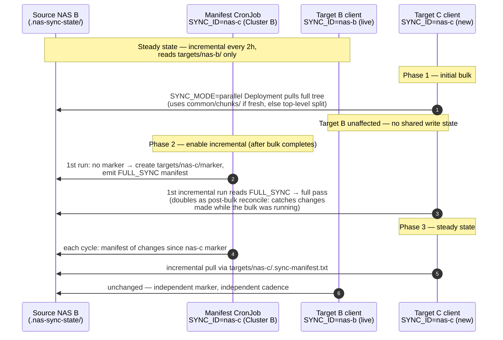

# v3.15 Design — Validate & Harden the Cross-Cluster Rsync Approach

> ## ⚠ SUPERSEDED — 2026-07-22
>
> **Delivered, but rebased.** This spec was written against **v3.13's** marker-based state
> model and targets the v3.13 filename. By the time it was implemented, **v3.14** had shipped a
> different multi-target design (`CLIENT_ID` + a `clients.txt` registry ConfigMap + a stateless
> lookback window, no marker files). The two are incompatible, so the spec was rebased onto
> v3.14 rather than executed as written:
>
> | This spec | Outcome |
> |---|---|
> | §3 alternatives analysis | **Still authoritative.** Cited by the review; not re-researched. |
> | §4 Addition 1 — verify mode | **Delivered** as guide §8.10 + §9A.5 |
> | §5 Addition 2 — chunked reconcile | **Delivered** as guide §4.6 + §6.3 + §8.3 |
> | §6 Addition 3 — status file | **Delivered** as guide §8.5 |
> | §7 Addition 4 — `SYNC_ID` per-target markers | **Dropped — superseded** by v3.14's registry, which solves the same problem with no source-side write state, one walk for all targets, and a tunable overlap window. Rationale: review §5. |
> | §8 scenarios S1–S4 | **Delivered and expanded** as `docs/nas-sync-operations-runbook.md` (S0–S14) |
>
> Read `docs/reviews/2026-07-22-nas-sync-architecture-review.md` for what actually shipped.
> Kept for its alternatives research and design rationale — do not implement from it directly.

**Date:** 2026-07-05
**Status:** Superseded 2026-07-22 — see the banner above
**Target:** `cross-cluster-rsync-guide-v3.13-consolidated.md` (layered after the in-flight v3.14 work lands)

## 1. Motivation

Pre-production due diligence: before running the v3.13/v3.14 design at real scale
(~7.4M folders, ~0.17% change rate), confirm whether a more powerful approach exists,
and address the two stated reliability worries:

1. **Silent missed changes** — the mtime-based manifest quietly skipping files, letting
   the target drift from the source unnoticed.
2. **Jobs failing/hanging** — CronJob failures that require babysitting or go unnoticed.

## 2. Constraints (confirmed with the user)

- **NAS access:** NFS exports only. No admin access to either NAS; everything must run
  as pods in the two Kubernetes clusters.
- **Network:** the Istio ingress gateway on port 8787 is the *only* permitted cross-site
  channel. Fixed policy; no direct route/VPN possible.
- **Encryption:** the cross-site link is trusted — cleartext rsyncd is acceptable.
- **Semantics:** one-way (NAS B → NAS A), deletions must never propagate, target-only
  files preserved. Intentional policy, not a deferral.
- **Multi-target:** the source NAS will feed **multiple target NASes** (multiple
  clients pulling). Any per-sync state recorded on the source NAS must be isolated
  per target — a single shared marker/manifest would make a target that misses a
  cycle silently lose those changes forever.

## 3. Evaluation verdict: keep the rsync architecture

Alternatives researched (2025–2026 state of the art) and why each is rejected:

| Alternative | Rejected because |
|---|---|
| ZFS send/receive, btrfs send, TrueNAS replication | Needs NAS admin access + matching filesystems + direct network path; produces an exact mirror (deletes propagate — violates no-delete). |
| Vendor replication (SnapMirror, Synology Snapshot Replication, QNAP RTRR/HBS) | Same: NAS admin + matched vendors + direct NAS-to-NAS path; snapshot-based ones are exact mirrors. |
| lsyncd / inotify-based real-time sync | inotify is kernel-local and cannot observe changes on an NFS mount (lsyncd issues #288, #401). Would have to run on NAS B itself. |
| Syncthing | Same inotify limitation over NFS → full periodic rescans of the whole tree; `ignoreDelete` is warned against by Syncthing's own docs; receive-only folders with extra local files stay permanently "out of sync". Worst fit. |
| rclone `copy --max-age --no-traverse` | Same change-detection cost class as the manifest, weaker POSIX metadata fidelity (ownership, hardlinks, symlinks), and time-window detection is gap-prone after failed runs where the marker-file approach self-heals. Lateral move. |
| Resilio Connect / Datadobi (commercial) | Real-time detection also degrades to scheduled scans over NFS; licensing cost only justified toward 100M+ files or minutes-level RPO. Named escape hatch, not needed now. |
| MinIO/object-storage replication | Requires re-architecting the application off NFS. |

**Conclusion:** at this intersection of constraints, the server-side `find -newer`
manifest + `--files-from` rsync pull is a sound, near-state-of-the-art design.
Change detection classes: (1) paired full walk, (2) single-side walk producing a change
list, (3) snapshot/event diff. Class 3 is fundamentally cheaper but every class-3 option
fails a hard constraint above. The current design is the right shape for class 2.
We therefore **keep the architecture and harden it** — three additions, no new
infrastructure, no new tools, no new images beyond rebuilding the existing two.

All fixed conventions are preserved: port 8787, namespace `ea-pmc`, no-delete,
console-only logging, `--whole-file`, CRLF guards, `SYNC_MODE` dispatch, state under
`.nas-sync-state/` on the source NAS.

A key topology fact shapes the design: **the client cannot walk the source tree
locally** — it only speaks rsyncd protocol through the Istio gateway. Any full source
walk (chunk generation, like manifest generation today) must run on Cluster B next to
the NFS mount. This is why fpart/fpsync are not used directly (they assume local/SSH
source access); their *chunking idea* is reimplemented server-side instead.

## 4. Addition 1 — Verify mode (`SYNC_MODE=verify`)

**Attacks:** silent missed changes.

A drift-*detection* pass that counts and reports differences without transferring.
Repair remains the reconcile's job; verify only reports.

Two tiers, selected by `VERIFY_MODE=meta|checksum|both` (default `meta`):

- **Tier 1 — metadata verify (cheap, default):** `rsync -a --dry-run --itemize-changes`
  over the whole tree. Compares size+mtime, transfers nothing. Catches everything the
  incremental could miss *except* mtime-preserved content changes. Cost ≈ one paired
  tree walk.
- **Tier 2 — sampled checksum verify (rotating slice):** each run picks a deterministic
  slice of top-level dirs — `hash(dirname) % VERIFY_SLICES == (week_number % VERIFY_SLICES)`
  — and runs `--checksum --dry-run` on that slice only. Each run pays ~1/`VERIFY_SLICES`
  of the full read cost; full-tree byte coverage takes `VERIFY_SLICES` runs (with the
  default of 13: one quarter at weekly cadence, ~13 months at the monthly default —
  run tier 2 weekly, or lower `VERIFY_SLICES`, if faster coverage is wanted). Catches
  mtime-preserved corruption. A full `--checksum` pass reads every byte on both NAS
  and is deliberately not the default.

**Behavior:**

- Output: one parseable result line, e.g.
  `VERIFY RESULT mode=meta drift=142 checked=7412330 elapsed=3812s`.
- Exit 0 if `drift <= VERIFY_FAIL_THRESHOLD` (default 0), else exit 1 → the Job shows
  `Failed` in `kubectl get jobs`, making drift visible instead of silent.
- Pure `--dry-run`: never transfers, never deletes.
- Scheduled monthly, placed right after the weekly reconcile completes (tree at rest,
  so expected drift ≈ 0).
- New script `nas-sync-verify.sh` in the client image + new CronJob manifest.

## 5. Addition 2 — Chunked parallel reconcile

**Attacks:** performance + skew (one oversized top-level directory serializing the
weekly reconcile under the current top-level-folder split).

**Server side — new `generate-chunks.sh` on Cluster B**, run by a new weekly CronJob
scheduled ~2h before the client's reconcile (same offset idea as the manifest's `:50`):

- Full `find` walk of the NFS mount (NFS-local, the cheapest place to walk), emitting
  relative paths.
- Splits the list by count into `CHUNK_COUNT` files (default 24 — deliberately more
  chunks than workers so fast workers keep pulling; fpart's core trick):
  `.nas-sync-state/common/chunks/chunk-000.txt … chunk-023.txt` + `chunks.meta`
  (chunk count, total files, generation timestamp). Chunks are target-independent
  (a pure split of the source tree), so they live under `common/` and are **shared
  by all targets** — one weekly walk serves every reconcile (see §7).
- Same safety idiom as the manifest generator: write to a temp dir, atomic `mv` into
  place, `concurrencyPolicy: Forbid`, orphan cleanup on start.

**Client side — `nas-sync-parallel.sh` upgraded:**

- First fetch `chunks.meta`. If present and fresh (within `CHUNK_MAX_AGE`, default 24h)
  → **chunked path**: `xargs -P $PARALLEL_WORKERS` over the chunk files, each worker
  running `rsync --files-from=chunk-NNN.txt`.
- If missing or stale → **fall back to the existing top-level split unchanged**
  (mirrors the manifest→FULL_SYNC fallback philosophy: a failed chunk job degrades to
  today's behavior, never breaks the reconcile).
- Per-worker failures don't abort the run; failed chunk numbers are collected, reported
  in the final status line, and the run exits nonzero if any chunk failed.

**Accepted trade-offs:** the weekly full walk on Cluster B is new load, but it replaces
client-side `--list-only` discovery over the wire and lands on the cheapest side.
Chunk lists at 7.4M+ entries total a few hundred MB on the source NAS; the guide notes
this and includes a cleanup line. Chunks live under `.nas-sync-state/` — already
writable, already client-excluded, no new mounts or PVCs.

## 6. Addition 3 — Sync status file

**Attacks:** jobs failing/hanging silently.

- `dispatch-sync.sh` gains a wrapper: after the mode script finishes, write
  `.nas-sync-status/last-run` on **NAS A** (the target mount — always writable,
  survives pods):
  `ts=2026-07-05T02:00:14Z mode=incremental exit=0 files=12483 elapsed=418s host=<pod>`
  plus `last-success` (updated only on exit 0). Atomic `mv` writes. Excluded from
  verify/reconcile comparisons.
- Written by the dispatcher, so all four modes (standard/parallel/incremental/verify)
  get it for free.
- §13 documents the staleness check —
  `cat /mnt/nas-target/.nas-sync-status/last-success` from any pod with the PVC —
  with the rule of thumb: older than 2× the CronJob interval = investigate.
- Stays inside the console-only-logging convention: no Prometheus/webhook dependency,
  but any external monitor can poll the file later.
- A status-write failure logs a warning but never fails the sync.

## 7. Addition 4 — Multi-target state layout (`SYNC_ID`)

**Attacks:** silent missed changes when one source NAS feeds multiple target NASes.

The manifest marker is *time-window state per target*: if Target 1 syncs a cycle that
Target 2 misses, a shared marker advances past changes Target 2 never received.
Source-side state is therefore restructured:

```
.nas-sync-state/
├── common/
│   └── chunks/            ← shared: chunk-000.txt…, chunks.meta (one walk serves all)
└── targets/
    └── <SYNC_ID>/         ← per-target: last-sync-marker, .sync-manifest.txt
```

- **`SYNC_ID` env var** (e.g. `nas-a`, `nas-c`) on both the manifest generator and the
  client; defaults to `default`, so a single-target deploy needs no extra config.
- **One manifest CronJob per target** on Cluster B — same `generate-manifest.sh`,
  different `SYNC_ID` + schedule aligned to that target's client cadence. Each target
  gets its own marker, so a missed cycle self-heals per target.
- Client fetches `targets/<SYNC_ID>/.sync-manifest.txt`; falls back to `FULL_SYNC` as
  today if its manifest is absent.
- Chunk generation remains a single shared CronJob writing to `common/` (chunks are a
  pure source-tree split, valid for every target).
- Status files live on each **target** NAS (§6), so they are per-target by
  construction — no change needed.

## 8. Multi-target operational scenarios

The guide gains a scenarios section (with the diagrams below) so operators know the
exact sequence for each situation. The interesting case: **Target B is live and has
completed its initial sync — how does a new Target C onboard without disturbing it?**

### S1 — Single target (unchanged)

`SYNC_ID=default` everywhere; behavior identical to v3.13/v3.14.

### S2 — Onboarding Target C while Target B is live

Three phases. The ordering matters: the manifest CronJob for `nas-c` is created only
**after** the bulk completes, so its first-run `FULL_SYNC` sentinel doubles as the
post-bulk reconcile that catches everything changed *during* the multi-day bulk.



Operator checklist form: (1) deploy Target C's PV/PVC + bulk `parallel` Deployment;
(2) wait for bulk completion (status file on Target C's NAS); (3) delete the bulk
Deployment, create the `nas-c` manifest CronJob and the `nas-c` incremental client
CronJob; (4) first incremental performs the FULL_SYNC reconcile pass; (5) steady state.

### S3 — Steady state with N targets

Each target has its own manifest CronJob + marker under `targets/<SYNC_ID>/`; all
share `common/chunks/`. **Stagger weekly reconciles** (different days/hours) so N
full walks don't hit the source NAS simultaneously.

### S4 — Target misses cycles (honest failure-mode note)

The generator advances a target's marker every run *whether or not the client
consumed the manifest*. A client outage spanning ≥1 cycle therefore loses those
manifests' changes until the **weekly reconcile** repairs it — same at-least-once
semantics as v3.13 single-target. The verify mode (§4) makes the interim drift
visible; the status file (§6) makes the outage itself visible. Documented in the
guide so operators know the reconcile is a required compensating control, not an
optional extra.

## 9. Error-handling summary

Every new path degrades to existing behavior:

| Failure | Result |
|---|---|
| Chunk job failed / chunks stale | Reconcile falls back to top-level split (today's behavior) |
| Verify finds drift | Job exits nonzero — visible, no data touched (dry-run only) |
| Status file write fails | Warning logged; sync outcome unaffected |
| Per-target manifest absent (new target, generator not yet run) | Client falls back to `FULL_SYNC` (existing behavior) |

No new failure mode can make replication worse than today.

## 10. Guide integration (self-referential bookkeeping)

| Artifact | Action |
|---|---|
| `nas-sync-verify.sh`, `generate-chunks.sh` | New sections; added to both Dockerfiles' COPY + dos2unix + CRLF-guard lists |
| `nas-sync-parallel.sh`, `dispatch-sync.sh` | Updated in place (chunked path + fallback; status-file wrapper) |
| `generate-manifest.sh`, `nas-sync-incremental.sh` | Updated in place: `SYNC_ID`-aware paths (`targets/<SYNC_ID>/`), default `default` |
| CronJob manifests | New: verify (monthly, Cluster A), chunk generator (weekly, Cluster B); manifest CronJob becomes a per-target template (`SYNC_ID` env); reconcile schedule note updated |
| §11 test plan | New test entries: verify run, chunked reconcile run, chunk-fallback case, status-file check |
| §13 troubleshooting | New entries: drift > 0, chunks stale/fallback triggered, status file stale |
| Multi-target scenarios section | New guide section: S1–S4 scenarios + the S2 onboarding sequence diagram (Mermaid) + operator checklist |
| §14 File Checklist | All new scripts/manifests listed with section numbers |
| "What This Consolidates" table | New capability rows tagged v3.15 |
| Filename/version | Follows whatever v3.14 does at landing; v3.15 additions recorded in the consolidates table either way |

All new fenced code blocks stay copy-paste-ready: valid shell/YAML, LF endings,
placeholders (`your-registry.example.com`, `ISTIO_EXTERNAL_IP_HERE`) intact and
marked `◄ MODIFY`.

## 11. Testing

Per §11 conventions (manual test jobs against real clusters):

1. `kubectl create job --from=cronjob/nas-sync-verify test-verify` — expect
   `VERIFY RESULT` line, exit 0 on an at-rest tree; then touch a file on NAS B only
   and expect drift ≥ 1 / exit 1.
2. Chunked reconcile: run chunk generator, then reconcile; confirm workers consume
   chunk files (log line names the chunk) and the run completes.
3. Fallback: delete `chunks.meta` on the source NAS, rerun reconcile; confirm it logs
   the fallback and uses the top-level split.
4. Status file: after any test job, confirm `.nas-sync-status/last-run` and
   `last-success` exist on NAS A with correct fields; confirm a forced-failure run
   updates `last-run` but not `last-success`.
5. Multi-target isolation: run two manifest generators with different `SYNC_ID`s;
   confirm independent markers under `targets/<id>/`, and that syncing target 1 does
   not advance target 2's marker (touch a file, sync target 1 only, then confirm
   target 2's next manifest still lists it).
6. CRLF guard: `head -1` each new script through `cat -A` — expect `#!/bin/bash$`.

## 12. Out of scope

- Transit encryption (user confirmed trusted link; if policy changes, TLS at the
  gateway or stunnel is the known path).
- Deletion propagation (intentionally unwanted).
- Commercial tools, object-storage re-architecture, NAS-native replication (blocked
  by constraints; documented above as conditions under which they'd win).
