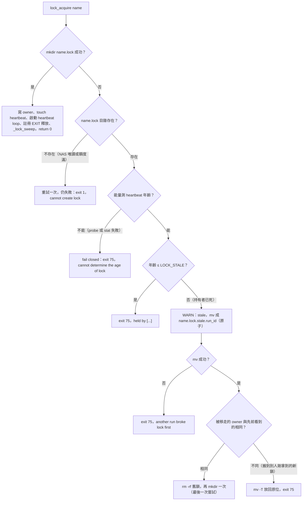
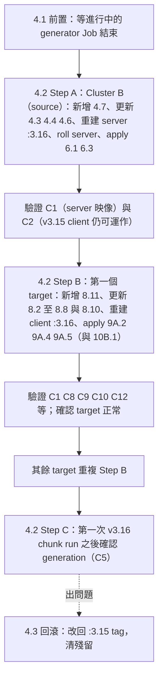

# v3.15 → v3.16 變更、修正與驗證說明（zh-TW）

> 適用範圍：`cross-cluster-rsync-guide-v3.15-consolidated.md` → `cross-cluster-rsync-guide-v3.16-consolidated.md`（Kubernetes + Istio 上的跨叢集 NAS rsync，NAS B → NAS A，一個來源對多個 target）。
> 這份文件的目的：讓你讀完之後清楚知道 (1) 每個問題是怎麼被修好的、(2) 要怎麼把修正套到你的環境、(3) 套用之後要怎麼確認它真的有效。
> 程式碼、指令、檔名、環境變數與 log 字串一律保持英文原文；說明使用繁體中文。
> **符號約定**：文中的 `§N.N` 一律指 **guide（v3.16，必要時註明 v3.15）的章節**；本文件自己的章節以「本文第 N 節」表示。`C1`–`C12` 是本文第 5.3 節的叢集驗收測試，`F1`–`F8`、`H1`–`H15` 是本文第 1、2 節的修正編號。
> 本文件不修改任何 guide 或 script，也不是 guide 的一部分；兩份 guide 才是權威來源。文中的「原文」區塊都是從 guide 逐行複製的片段。
> **相關文件**：v3.16 系統的日常操作、YAML 注意事項與 troubleshooting，見 [nas-sync-operations-manual.zh-TW.md](nas-sync-operations-manual.zh-TW.md)；權威來源 [guide v3.16](../cross-cluster-rsync-guide-v3.16-consolidated.md)、[guide v3.15](../cross-cluster-rsync-guide-v3.15-consolidated.md)、[spec](superpowers/specs/2026-10-01-v316-review-fixes-design.md)、[runbook](nas-sync-operations-runbook.md)。

## 目錄

- [0. 摘要](#0-摘要)
  - [0.1 v3.16 是什麼](#01-v316-是什麼)
  - [0.2 四則 reviewer comment：是不是真的、多嚴重、v3.16 怎麼解](#02-四則-reviewer-comment是不是真的多嚴重v316-怎麼解)
  - [0.3 相容性](#03-相容性)
- [1. 變更總表](#1-變更總表)
  - [1.1 原始 finding（F1–F8）](#11-原始-findingf1f8)
  - [1.2 後續強化（H1–H15）](#12-後續強化h1h15)
- [2. 每項修正詳述](#2-每項修正詳述)
  - [F1 — chunk 世代（generation）：fetch 與 swap 重疊會拿到新舊混合的 chunk set](#f1--chunk-世代generationfetch-與-swap-重疊會拿到新舊混合的-chunk-set)
  - [F2 — 同一個 generator 的兩次執行會互相踩壞（沒有鎖）](#f2--同一個-generator-的兩次執行會互相踩壞沒有鎖)
  - [F3 — verify tier 2 看不到名稱含空白、CJK、glob 字元的資料夾](#f3--verify-tier-2-看不到名稱含空白cjkglob-字元的資料夾)
  - [F4 — 頂層資料夾名稱以五種方式出錯（parallel fallback）](#f4--頂層資料夾名稱以五種方式出錯parallel-fallback)
  - [F5 — 「loose files」pass 其實是整棵樹的 serial 全量同步](#f5--loose-filespass-其實是整棵樹的-serial-全量同步)
  - [F6 — 任何路徑都沒有優雅關閉：rsync 在傳輸中途被 SIGKILL](#f6--任何路徑都沒有優雅關閉rsync-在傳輸中途被-sigkill)
  - [F7 — 被中斷的 run 沒有留下任何紀錄](#f7--被中斷的-run-沒有留下任何紀錄)
  - [F8 — 兩個 generator job 在週日的 NAS metadata 負載重疊](#f8--兩個-generator-job-在週日的-nas-metadata-負載重疊)
  - [H1 — 鎖：量不到年齡時 fail closed（exit 75）；建不了鎖時 exit 1](#h1--鎖量不到年齡時-fail-closedexit-75建不了鎖時-exit-1)
  - [H2 — 鎖：heartbeat 要撐過暫時性 NFS 錯誤，且不能比持有者活得更久](#h2--鎖heartbeat-要撐過暫時性-nfs-錯誤且不能比持有者活得更久)
  - [H3 — 鎖：被誤搬走的新鎖不能遺失，被擱置的舊鎖要被清掉](#h3--鎖被誤搬走的新鎖不能遺失被擱置的舊鎖要被清掉)
  - [H4 — 設定值要驗證並以十進位解讀：`LOCK_*` 與 registry 的 `lookback_hours`](#h4--設定值要驗證並以十進位解讀lock_-與-registry-的-lookback_hours)
  - [H5 — Dockerfile 的 CRLF 防線在 dash 下從來不會觸發](#h5--dockerfile-的-crlf-防線在-dash-下從來不會觸發)
  - [H6 — `log()` 不能用 `$(date)`：bash 5.2 會在第二個被 trap 的訊號到達時中止該命令](#h6--log-不能用-datebash-52-會在第二個被-trap-的訊號到達時中止該命令)
  - [H7 — wrapper：缺少 library 或在 sidecar quit 階段被 TERM 時，仍要正確收尾](#h7--wrapper缺少-library-或在-sidecar-quit-階段被-term-時仍要正確收尾)
  - [H8 — parallel：收到 TERM 後，排隊中的單位不得開始執行](#h8--parallel收到-term-後排隊中的單位不得開始執行)
  - [H9 — TERM 落在 pre-flight 或 fork 前後的空窗；`wait_child` 要回報正確結束碼](#h9--term-落在-pre-flight-或-fork-前後的空窗wait_child-要回報正確結束碼)
  - [H10 — Deployment entrypoint：TERM 與 launch 之間的空窗、每個 run 只送一次 TERM、drain 期限](#h10--deployment-entrypointterm-與-launch-之間的空窗每個-run-只送一次-termdrain-期限)
  - [H11 — 頂層清單只接受 rc 0 與 24；chunk fetch 與清單都要有 idle timeout](#h11--頂層清單只接受-rc-0-與-24chunk-fetch-與清單都要有-idle-timeout)
  - [H12 — verify：rc 23 不再被當成「比對完了」](#h12--verifyrc-23-不再被當成比對完了)
  - [H13 — verify：影響比對內容的設定在一開始就驗證](#h13--verify影響比對內容的設定在一開始就驗證)
  - [H14 — `MANIFEST_MAX_AGE` / `CHUNK_MAX_AGE`：非數字會讓過期防線悄悄失效](#h14--manifest_max_age--chunk_max_age非數字會讓過期防線悄悄失效)
  - [H15 — 名稱是位元組不是字元：`LC_ALL=C`、不用 `grep`、清單與 slice 的對帳](#h15--名稱是位元組不是字元lc_allc不用-grep清單與-slice-的對帳)
- [3. 檔案層級變更清單](#3-檔案層級變更清單)
  - [3.1 Cluster B（server 與 generator）](#31-cluster-bserver-與-generator)
  - [3.2 Cluster A（client，兩種 k8s type 共用同一個 image）](#32-cluster-aclient兩種-k8s-type-共用同一個-image)
  - [3.3 兩個新檔案與「四處同步」規則](#33-兩個新檔案與四處同步規則)
  - [3.4 兩份 image 要做的事（彙整）](#34-兩份-image-要做的事彙整)
- [4. 升級與回滾](#4-升級與回滾)
  - [4.1 前置條件](#41-前置條件)
  - [4.2 升級步驟](#42-升級步驟)
  - [4.3 新的 `terminationGracePeriodSeconds`](#43-新的-terminationgraceperiodseconds)
  - [4.4 升級過程中的混合狀態](#44-升級過程中的混合狀態)
  - [4.5 「no generation」WARN 的視窗](#45-no-generationwarn-的視窗)
  - [4.6 verify 升級後可能變紅（預期行為）](#46-verify-升級後可能變紅預期行為)
  - [4.7 回滾](#47-回滾)
- [5. 驗證計畫（如何確認修正後真的可以 work）](#5-驗證計畫如何確認修正後真的可以-work)
  - [5.1 本機靜態驗證：`scripts/check-guide.sh`](#51-本機靜態驗證scriptscheck-guidesh)
  - [5.2 本機執行期驗證：`scripts/test-guide-behavior.sh`](#52-本機執行期驗證scriptstest-guide-behaviorsh)
  - [5.3 叢集驗收測試](#53-叢集驗收測試)
  - [5.4 驗收清單（go / no-go）](#54-驗收清單go--no-go)
- [6. 已知限制與未修項目](#6-已知限制與未修項目)
  - [6.1 設計上的限制（recorded, not fixed）](#61-設計上的限制recorded-not-fixed)
  - [6.2 尚未在真實叢集驗證的事項](#62-尚未在真實叢集驗證的事項)
  - [6.3 文件上的小瑕疵（不影響行為）](#63-文件上的小瑕疵不影響行為)
  - [6.4 v3.16 尚未修正的已知問題（撰寫本文件時對照程式碼發現）](#64-v316-尚未修正的已知問題撰寫本文件時對照程式碼發現)
- [7. 參考](#7-參考)

---

## 0. 摘要

### 0.1 v3.16 是什麼

v3.16 是針對 2026-10 四則 reviewer comment 做出的修正版。做法是：先把每一則 comment **用 v3.15 guide 自己的 script 原文實測**（本機 rsync 3.2.7 daemon——與 image 同版、tini 以 PID 1 執行於獨立 PID namespace——等同 container、Debian cron），再修。實測的結果不只確認或推翻了四則 comment，還找到另外的缺陷，整理成 **8 個 finding（F1–F8）**；後續的審查輪次（含最後一波 W1–W4）又補了 **15 項強化（H1–H15）**。

本版的內容：

- 新增兩個檔案：§4.7 `nas-sync-state-lock.sh`（Cluster B generator 的鎖）與 §8.11 `nas-sync-lib.sh`（Cluster A 的共用函式庫）。
- 修改的段落：§4.2–§4.6、§5.4（只有 image tag）、§6.1、§6.3、§8.2–§8.8、§8.9、§8.10、§9A.2、§9A.4、§9A.5、§10B.1，以及 §11、§13、§14、「What This Consolidates」與新增的升級附錄。
- 新增一套**執行期行為測試** `scripts/test-guide-behavior.sh`，並在 `scripts/check-guide.sh` 增加第 10 節（v3.16 靜態回歸檢查）。
- 沒有重新編號任何既有章節；沒有啟用 rsync 的 delete 選項（target 上獨有的檔案仍然一律保留）。

### 0.2 四則 reviewer comment：是不是真的、多嚴重、v3.16 怎麼解

嚴重度沿用 spec 的定義：**H** = 悄悄得到錯的結果；**M** = 錯或慢，但看得到；**L** = 潛伏或只有成本。

| # | Comment（摘要） | 結論（是不是真的） | 嚴重度 | v3.16 的解法（guide §） |
|---|---|---|---|---|
| 1 | §8.3 頂層切分的 awk 沒濾掉 `..`；`$NF` 讓含空白的名稱被截斷 | `..`：**不成立**（rsync 的檔案清單從不出現 `..`，`--list-only` 只會列出 `.`）。`$NF` 截斷：**成立，而且比描述的更廣**——實測有五種錯誤（F4），verify tier 2 也受同樣影響（F3） | H（F3、F4）；目前被 F5 蓋住，只修 F5 會變成無聲的資料遺漏 | `list_top_dirs`（§8.11）→ NUL 分隔 → `--files-from --from0`（§8.3、§8.10）；top-level pass 改 `--no-recursive --dirs`（F5）；xargs rc 與單位數對帳 |
| 2 | `dispatch-sync.sh` 沒有 `exec`、沒有 trap，SIGTERM 到不了 mode script 的清理 trap | **結論成立，機制不同**：`tini -g` 其實會把 SIGTERM 送到整個 process group；真正的問題是 wrapper 沒有 trap 立刻結束 → tini（PID 1）結束 → kernel 對其餘行程送 SIGKILL，rsync 在傳輸中途被殺 | M（F6、F7）：留下永遠不會被清掉的 `.<name>.XXXXXX` 暫存檔、trap 沒跑、status 沒寫 | 「一個地方發訊號、其餘全部等待」：§8.6 wrapper、§8.5 dispatcher、§8.2–§8.4 與 §8.10 的 mode script、§8.7 Deployment entrypoint、§8.11 函式庫，加上 §9A.2、§9A.4、§9A.5、§10B.1 的 `terminationGracePeriodSeconds: 60`。**不能 `exec`**：dispatcher 要在 mode script 結束後寫 status |
| 3 | §4.6 的兩個 `mv` 之間有一段 `CHUNK_DIR` 不存在的空窗 | 空窗本身**無害**（那段時間的 fetch 失敗後走 fallback）；但「最壞只是失敗一次」是**錯的**：跨越 swap 的 fetch 會以 rc=0 收到新舊混合的 chunk set | H（F1）：實測 22.4 % 的路徑不在任何一份 chunk 裡 | chunk 檔名帶世代 `chunk-<gen>-NNN.txt`、`chunks.meta` 記錄 `generation=`（§4.6）；client 檢查同一世代、數量正確、必要時重試一次再 fallback（§8.3） |
| 4 | `generate-manifests.sh` 與 `generate-chunks.sh` 共用 `$STATE_ROOT`，兩者之間沒有鎖 | **跨 job 是安全的**（寫入集合不相交，實測輸出與單獨執行逐檔一致，只是 NAS metadata 負載加倍：F8）。**真正的缺陷是同一個 job 兩份同時跑**：`concurrencyPolicy: Forbid` 只擋 controller 自己的排程，不是鎖，`kubectl create job --from=cronjob/…` 會繞過它 | H（F2）；F8 為 L | NFS `mkdir` 鎖 + heartbeat（§4.7，被 §4.3、§4.6 `source`）；每個 run 的暫存檔名帶 `RUN_ID`；不加跨 job 的共用鎖，§6.3 加註說明 |

### 0.3 相容性

下列結論以 guide 的升級附錄（「Also required when coming from v3.15 → v3.16」）、spec §8 與 runbook S11 為依據，並對照過程式碼；**沒有**在真實叢集上實際做過升級與回滾（見本文第 6 節）。

- **Rolling upgrade**：source 端（Cluster B）先升，再一個 target，再其餘 target。**v3.16 的 server 繼續服務 v3.15 的 client**：chunk 檔名 `chunk-g<epoch>-NNN.txt` 仍然符合 v3.15 client 的 `chunk-*.txt`；跨越 swap 的 fetch 現在會以 rc 24 失敗，而 v3.15 client 本來就把 rc≠0 當成 fallback，所以不升級也受到保護。manifest 的格式沒變。
- **v3.16 client 搭配 v3.15 寫的 chunk set**（回滾之後，或正常升級後到第一次 v3.16 chunk run 之前）：`chunks.meta` 沒有 `generation=`，client 記一行 WARN 後照 v3.15 的規則接受它。
- **不需要任何 state 搬移**。`.nas-sync-state/` 內的既有檔案格式都沒變；v3.16 只在 source NAS 新增 `.nas-sync-state/locks/`（v3.15 完全忽略它，它在 `.nas-sync-state/` 之下，所以也不會被複製到 target）。
- **回滾 = 改 image tag**，兩個方向都不需要搬 state（`:3.16` → `:3.15`）。回滾後要手動清理的殘留見本文第 4.7 節。
- 升級前提：先讓進行中的 generator Job 跑完（v3.15 的 generator 不拿鎖，會與第一個 v3.16 run 重疊）。
- 升級後會有兩個**預期中的行為變化**，不是新故障：月度 `verify` 可能第一次變紅（它現在會對讀不到的來源項目 exit 23）；以前被悄悄吞掉的無效 `VERIFY_*` 設定現在會讓 verify exit 1 並指名那個設定。見本文第 4.6 節。

---

## 1. 變更總表

> 欄位說明：
> - **靜態** = `bash scripts/check-guide.sh` 第 10 節（或第 9 節）的 label；
> - **suite** = `bash scripts/test-guide-behavior.sh` 的 case 名稱與 check label（`…` 表示每次執行會變的數字）；
> - **叢集** = 本文第 5.3 節的叢集驗收測試編號（C1–C12）。
> - 「性質」：**既有** = v3.15 就有的缺陷；**新碼** = v3.16 新增的程式碼（鎖、函式庫、關閉路徑）在發布前被審查修正的部分。
> - 各列只列代表性的 label；完整清單在本文第 2 節對應小節。

### 1.1 原始 finding（F1–F8）

| ID | v3.15 的問題與生產影響 | 修正摘要 | guide § / 檔案 | 如何驗證 |
|---|---|---|---|---|
| F1 | chunk fetch 與 server 的 swap 重疊時，以 rc=0 收到新舊混合的 chunk set；約 22 % 路徑未被 reconcile 涵蓋，無任何錯誤訊息 | chunk 檔名 `chunk-<gen>-NNN.txt`、`chunks.meta` 記 `generation=`；client 驗證同一世代與數量，rc 24／不一致時等 `CHUNK_RETRY_WAIT` 重試一次再 fallback | §4.6 `generate-chunks.sh`、§8.3 `nas-sync-parallel.sh`（+§4.7、§8.11） | 靜態 `F1: chunk files carry their generation`；suite `swap`：`client never accepted a mixed set (retried or used one generation)`；叢集 C5、C6 |
| F2 | 同一個 generator 的兩個 run 重疊（`kubectl create job --from` 繞過 `Forbid`）：manifest 路徑被截斷、重複行、`file_count=0`；chunk set 發布到一半 | §4.7 NFS `mkdir` 鎖 + heartbeat；held → `exit 75`；暫存檔名帶 `RUN_ID`；`manifest.meta` 原子改名；殘留只在持鎖時清 | §4.7（新）、§4.3、§4.6、§4.4、§6.1、§6.3 | 靜態 `F2: a held lock exits 75, the second run does nothing`；suite `lock`：`manifests: overlapping second run exits 75, first succeeds (rcA=0 rcB=75)`；叢集 C3、C4 |
| F3 | verify tier 2 對含空白／CJK／glob 字元的資料夾是瞎的：同大小同 mtime 的壞檔仍 `VERIFY OK` | 清單改 `list_top_dirs`；每個資料夾以 `--files-from --from0` 比對；stderr 存檔；名稱數與 slice 大小對帳 | §8.10 `nas-sync-verify.sh`、§8.11（新） | 靜態 `F3/F4: verify passes folder names via --files-from`；suite `names`：`verify tier 2 detects silent corruption in '資料', 'My folder', 'a[1]' (drift=3, rc=1)`；叢集 C7 |
| F4 | parallel fallback 的資料夾名稱五種錯誤：`$NF` 截斷、`\#ooo` 跳脫、xargs 遇 `'` 中止、daemon 對遠端路徑 glob 展開（`a[1]/` 傳成 `a1`）、`.nas-sync-state/` 被複製；rc 23 被當成功 | §8.11 `list_top_dirs`（`-8`、exclude、`LC_ALL=C sed` + `perl`）；worker 用 `--files-from --from0 -r`；xargs rc 與 rc 檔數對帳 | §8.11（新）、§8.3、§8.8 | 靜態 `F4: v3.15 $NF folder parser is gone`；suite `names`：`sync machinery (.nas-sync-state) is not replicated`；叢集 C7 |
| F5 | 「loose files」pass 是 `-a --dirs`，`-a` 隱含 `-r`，所以是整棵樹的 serial 全量同步（也蓋住了 F4）；rc 被 `grep` 吞掉 | `--no-recursive --dirs`；rc 以 `PIPESTATUS[0]` 取回並計為單位 `loose` | §8.3 | 靜態 `F5: top-level pass is non-recursive`；suite `loose`：`top-level pass does NOT recurse (v3.15: -a implied -r → full serial sync)`；叢集 C7 |
| F6 | pod 被停止時（deadline、drain、rollout、delete）wrapper/entrypoint 無 trap 立刻結束 → tini 結束 → kernel SIGKILL rsync：孤兒 `.<name>.XXXXXX`、trap 未跑、status 未寫；cron 的 run 在獨立 session，連 `tini -g` 都送不到 | 一個地方發訊號、其餘等待：wrapper `kill -TERM 0` 一次；dispatcher 轉送並等待（不 `exec`）；mode script 只設旗標；Deployment entrypoint 不再 `exec cron`，逐一通知各 run 的 process group；`terminationGracePeriodSeconds: 60` | §8.5、§8.6、§8.7、§8.2–§8.4、§8.10、§8.11、§8.8、§9A.2、§9A.4、§9A.5、§10B.1 | 靜態 `F6: wrapper signals its process group`、`F6: entrypoint does not exec cron`、`F6: grace period on all 4 client pod specs`；suite `signal`：`tini -g standard: no orphan .<file>.XXXXXX temp file left in the target (found 0)`；`deploy`：`Deployment, initial sync: no orphan .<file>.XXXXXX temp file left in the target (found 0)`；叢集 C8、C9 |
| F7 | 被中斷的 run 沒有任何紀錄，`last-run` 仍是上一次的結果 | dispatcher 讀一次 `GOT_TERM`；RC 至少 143；`last-run` 加 ` interrupted=TERM`；不寫 `last-success` | §8.5 | 靜態 `F7: status records interruptions`；suite `signal`：`tini -g standard: status file records the interruption`；叢集 C8 |
| F8 | chunk job 與 manifest job 在週日重疊，NAS metadata 負載加倍（正確性沒問題） | 不加共用鎖（刻意）；§6.3 加註、§6.1/§6.3 YAML 加註解 | §6.1、§6.3（只有文件／註解） | 無自動化檢查（文件與設計決定） |

### 1.2 後續強化（H1–H15）

| ID | 性質 | 問題與生產影響 | 修正摘要 | guide § / 檔案 | 如何驗證 |
|---|---|---|---|---|---|
| H1 | 新碼 | 量不到鎖的年齡時若當成「過期」會打破活鎖；NAS 唯讀時 mkdir 失敗不該回 75 | `_lock_age` 量不到就印空並 return 1 → fail closed `exit 75`；無鎖目錄且 mkdir 失敗 → `exit 1`；只有 heartbeat 檔不存在才退而用目錄 mtime | §4.7 | 靜態 `F2: an unreadable lock age exits 75 (fails closed)`；suite `lock`：`live lock is not broken when its age cannot be measured (exit 75) [rc=75]`；叢集 C3、C4 |
| H2 | 新碼 | heartbeat 一次 `touch` 失敗就停、持有者被殺後孤兒迴圈讓死鎖永遠新鮮、`sleep` 握住 stdout 使管線卡住 | touch 失敗只 WARN 重試；迴圈隨持有者 PID 結束；`sleep` 導向 `/dev/null` | §4.7 | suite `lock`：`a SIGKILLed holder's heartbeat loop stops (heartbeat … -> …)`；叢集 C3 |
| H3 | 新碼 | 搶過期鎖時可能搬走別人的新鎖，放回失敗留下永遠不會被清的 `*.lock.stale.*` | 放回失敗分兩種處理並 `exit 75`；`_lock_sweep` 只清本名稱且比 `LOCK_STALE` 舊的 | §4.7 | 靜態 `F2: _lock_sweep defined (displaced lock dirs pile up)`；suite `lock`：`the sweep is scoped to the lock name: jobx.lock.stale.* and other.lock.stale.* are untouched` |
| H4 | 新碼 + 既有 | `$(( ))` 把 `08` 當八進位：registry 一行寫 `08` 放棄整個迴圈、`010` 悄悄變 8 小時；`LOCK_STALE=08` 讓 job 不拿鎖執行 | `LOCK_*`、`lookback_hours` 驗證後以 `10#` 讀；`LOCK_STALE` ≥ 2 × `LOCK_HEARTBEAT` | §4.3、§4.7 | 靜態 `F2: LOCK_STALE read as decimal (08 is an octal error: no lock)`；suite `lock`：`registry lookback 010 means 10 hours, not octal 8 (rc=0, window=10h)`；叢集 C4、C12 |
| H5 | 既有 | Dockerfile 的 CRLF 防線在 dash 下從不觸發（`$'\r'` 不是 CR） | 改為 `tr -cd '\r' … \| wc -c` 數 CR 位元組，檢查整個檔案 | §4.4、§8.8 | 靜態 `Dockerfile §8.8: CRLF guard counts CR bytes with tr`；suite `build`：`§8.8 guard: a CRLF script FAILS the build under dash (rc=1)`；叢集 C1 |
| H6 | 新碼 | `log()` 用 `$(date)`：bash 5.2 在第二個被 trap 的訊號到達時中止該命令（pre-flight 迴圈約 0.7 %） | `printf '%(…)T'`，格式不變；§8.7 刻意保留 | §8.2–§8.6、§8.10 | suite `names`：`log() lines keep the 'YYYY-MM-DD HH:MM:SS - ' format`；`signal`：`SIGTERM during pre-flight, 25 runs under tini -g: 25/25 runs exited 143 with a valid status line`（無靜態 label） |
| H7 | 新碼 | 缺 `nas-sync-lib.sh` 時 wrapper 不 quit sidecar → pod 永遠 NotReady；quit 階段收到 TERM 把成功的同步報成 143 | 缺 library 仍 quit sidecar；同步後 `trap 'exit "$SYNC_EXIT"' TERM INT` | §8.6 | 靜態 `F6: wrapper keeps the sync exit code on a late TERM (not 143)`；suite `signal`：`wrapper without nas-sync-lib.sh still quits the sidecar and exits non-zero (rc=1)` |
| H8 | 新碼 | TERM 後 xargs 繼續啟動排隊中的單位，直到 SIGKILL（孤兒暫存檔、無 `interrupted=TERM`） | `STOP_FILE`：trap 建立，worker 先檢查並 `SKIP`、記 rc 143；xargs 放背景並忽略 TERM；`WORK_DIR` 先清 | §8.3、§8.11 | suite `signal`：`tini -g parallel: the 2 running units were stopped and the 2 queued ones skipped, not started (started=2, skipped=2)`（無靜態 label） |
| H9 | 新碼 | TERM 落在 pre-flight 或 fork 前後會漏掉；兩個 TERM 相繼到達使 `wait` 回錯誤碼（`exit=-1`、負的 elapsed，約 28 % 的 run） | pre-flight 後 `check_term`；fork 後重查 `GOT_TERM`；`wait_child` 重取真實結束碼；dispatcher 快照 `INTERRUPTED` 並 `trap '' TERM INT` | §8.2、§8.4、§8.5、§8.6、§8.11 | 靜態 `F6: wrapper passes on a TERM that landed before the fork`；suite `signal`：`SIGTERM during pre-flight, 25 runs under tini -g: 25/25 runs exited 143 with a valid status line`；叢集 C8（變形） |
| H10 | 新碼 | Deployment entrypoint 在 launch 前後的 TERM 窗口漏掉；對同一個 run 重送 TERM 會讓 rsync 跳過保存 partial；`SHUTDOWN_WAIT` 非正整數時 drain 被略過 | 每個 launch 前後各一個 `GOT_TERM` 檢查；`SIGNALLED` 每個 group 只送一次；`$SECONDS` 期限；`SHUTDOWN_WAIT` 驗證 | §8.7、§10B.1 | 靜態 `F6: §8.7 drain signals each run group once (a repeat TERM loses the partial)`；suite `deploy`：`Deployment, SIGTERM right at start: 10/10 runs stopped cleanly within 15 s`；叢集 C9 |
| H11 | 既有 | 頂層清單不看 rc：rc 23 讓不可讀資料夾從清單消失（沒人同步／比對）；fetch 與清單在連線死掉時卡到 Job deadline | 清單只接受 rc 0 與 24；`RSYNC_LIST_TIMEOUT`（預設 300）套用於 chunk fetch 與 `list_top_dirs` | §8.3、§8.10、§8.11 | 靜態 `F3/F4: parallel's top-level listing accepts rc 0/24 only`；suite `names`：`stalled daemon: chunk fetch and top-level listing time out (took 6s, rc=1)` |
| H12 | 既有 | verify 把 rc 23 當正常：讀不到的來源目錄仍 `drift=0 … VERIFY OK` | tier 1 只接受 0／24；tier 2 的 rc 23 僅在 stderr 有 `link_stat … No such file or directory`（資料夾在列出後消失）時容忍，否則 `exit 23` 並指名資料夾 | §8.10 | 靜態 `verify: tier 1 fails on rc 23 (unreadable dir not compared)`；suite `names`：`verify tier 1: a source directory the daemon cannot read fails the run (exit 23), no drift=0 / VERIFY OK (rc=23)`；叢集 C11 |
| H13 | 既有 | `VERIFY_MODE`/`VERIFY_SLICES`/`VERIFY_FAIL_THRESHOLD` 打錯字都以 `VERIFY OK` 結束（沒比對、或真的 drift 被吃掉） | tier 之前驗證；無效值 `die`（exit 1）；`10#` | §8.10 | 靜態 `verify: VERIFY_MODE validated (else a typo ends in VERIFY OK)`；suite `names`：`VERIFY_MODE=Both: verify fails ('is not meta, checksum or both') instead of running no tier and saying VERIFY OK (rc=1)`；叢集 C12 |
| H14 | 既有 | `MANIFEST_MAX_AGE`/`CHUNK_MAX_AGE` 非數字使過期防線悄悄關閉（負值則永遠觸發） | 非非負整數 → WARN 並用 86400；`10#` | §8.3、§8.4 | 靜態 `MANIFEST_MAX_AGE falls back to 86400 with a WARN`；suite `stale`：`CHUNK_MAX_AGE='abc': WARN naming the value, the default 86400 applies, the stale set is rejected and not used (rc=0)`；叢集 C12 |
| H15 | 新碼 | `grep` 在 UTF-8 locale 下悄悄丟掉非 UTF-8（Big5）名稱；`read -d ''` 遺失下一筆；`--from0` 放錯位置使 exclude 全部失效 | `export LC_ALL=C`；清單無 `grep` 階段；verify 名稱／slice 對帳；`--from0` 放在旗標之後 | §8.3、§8.10、§8.11 | suite `names`：`every folder synced with its own content under a UTF-8 locale (incl. non-UTF-8 names)`；叢集 C7（無靜態 label） |

---

## 2. 每項修正詳述

> 閱讀方式：每一小節都依「問題 → 根因 → 修正方式 → 如何套用 → 如何驗證」的順序。
> 「v3.15 / v3.16 原文」區塊是從兩份 guide 逐行複製的片段，只留下與該修正有關的行；完整的 v3.16 script 在標示的 § 內。
> 「如何套用」一律遵守同一條規則：**把該 § 的整個 v3.16 區塊整份複製過去取代舊檔**，不要手動 patch 單行，因為各 script 之間互相 source、互相引用 § 編號。
> 「如何驗證」的 check-guide label 與 suite check label 都與實際輸出逐字相同；suite label 中帶數字的部分（例如 `rc=0`）是 v3.16 通過時印出的值。
> `C1`–`C12` 是本文第 5.3 節的叢集驗收測試編號。

---

### F1 — chunk 世代（generation）：fetch 與 swap 重疊會拿到新舊混合的 chunk set

**問題**

- 每週的 reconcile（§9A.4）先從 server 抓一整個 `chunks/` 目錄，再讓 N 個 worker 各吃一份 `chunk-NNN.txt`。chunk job（§6.3）發布新的一組 chunk 時，是用兩次 `mv` 把整個目錄換掉。
- v3.15 的註解假設「最壞只是這次 fetch 失敗，client 退回 top-level split」。這個假設是錯的：fetch 進行到一半時發生 swap，client 會**以 rc=0** 收到「一部分舊檔 + 一部分新檔」。
- 原因是 rsync sender 傳每一個檔案時，都會依**路徑**重新解析一次；固定檔名 `chunk-000.txt` … 在新舊兩代都存在，swap 之後才輪到傳送的檔案就從新目錄讀取。
- 實測（spec §2 F1）：在 fetch 開始後 0.3 / 1.5 / 3.0 秒 swap，rc 每次都是 0，舊／新 chunk 數分別為 2/22、8/16、16/8。以 8 份舊 + 16 份新模擬，**22.4 %** 的路徑不在任何一份被抓取的 chunk 裡，其中包含 400 個新增／改名路徑中的 137 個，而這些恰好是 reconcile 要補的東西。
- 症狀：**沒有任何錯誤訊息**。log 是 `Using 24 server-generated chunks (age=…s, … files total)`，最後是 `=== COMPLETE: 24 chunks, …s, all OK ===`。只有事後 verify（若有跑、且在對的 tier）才會看到 drift。

**根因**

1. 固定檔名：新舊兩代的 chunk 同名，sender 的「依路徑重新解析」把兩代接在一起。
2. 客戶端只看 rc 與 `chunks.meta` 是否存在、是否新鮮，沒有任何一步能證明「這 24 份屬於同一代」。
3. 兩次 `mv` 之間確實有一個沒有 `chunks/` 的空窗，但那個空窗本身無害（fetch 失敗 → 退回 fallback）。真正的缺陷是「進行中的 fetch 跨越 swap」。

**修正方式**

Server 端（§4.6）：每次執行取一個世代 id，所有 chunk 檔以它命名，`chunks.meta` 記錄 `generation=`。swap 的程式碼本身沒變，只改了註解；因為舊檔名在 swap 後消失，跨越 swap 的 fetch 會得到 **rc 24（vanished）**，永遠不會是混合的 set。

v3.15 §4.6（原文）：

```text
| split -n "r/${CHUNK_COUNT}" -d -a 3 - "${TMP_DIR}/chunk-"
printf 'generated_at=%s\nchunk_count=%s\ntotal_files=%s\n' \
    "$NOW" "$CHUNK_COUNT" "$TOTAL" > "${TMP_DIR}/chunks.meta"
# Swap into place. Clients fetch the whole dir in one rsync, so the worst case during
# the swap is one failed fetch — the client then falls back to the top-level split (§8.3).
```

v3.16 §4.6（原文）：

```text
GEN="g${NOW}"
| split -n "r/${CHUNK_COUNT}" -d -a 3 - "${TMP_DIR}/chunk-${GEN}-"
printf 'generated_at=%s\ngeneration=%s\nchunk_count=%s\ntotal_files=%s\n' \
    "$NOW" "$GEN" "$CHUNK_COUNT" "$TOTAL" > "${TMP_DIR}/chunks.meta"
# the old names vanish instead: the fetch fails with rc 24, and the client retries or
# falls back. It can never receive a mixed set.
```

Client 端（§8.3）：只接受「同一代、完整」的 set。五個條件全部成立才用：fetch rc 為 0、`chunks.meta` 存在且新鮮、`generation` 非空、`chunk-<gen>-*.txt` 的數量等於 `chunk_count`、全部 `chunk-*.txt` 的數量也等於該數字。rc 24 或檢查失敗 → 記錄原因 → 等 `CHUNK_RETRY_WAIT`（新 env，預設 30 秒）→ 清空本機 chunk 目錄再 fetch 一次 → 仍失敗才退回 top-level split。worker 只吃 `chunk-${GEN}-*.txt`。

v3.15 §8.3（原文）：

```text
        NCHUNK=$(ls -1 "${CHUNK_DIR}"/chunk-*.txt 2>/dev/null | wc -l | tr -d ' ')
```

v3.16 §8.3（原文）：

```text
    if [ "$rc" -eq 24 ]; then
        CHUNK_REASON="Chunk files vanished mid-fetch (rc=24): the server is publishing a new generation"
        return 2
    fi
        CHUNK_GLOB="chunk-${CHUNK_GEN}-*.txt"
        NCHUNK=$(find "$CHUNK_DIR" -maxdepth 1 -name "$CHUNK_GLOB" | wc -l | tr -d ' ')
        if [ "$NCHUNK" != "$count" ] || [ "$n_all" != "$NCHUNK" ]; then
    log "$CHUNK_REASON — retrying once in ${CHUNK_RETRY_WAIT}s"
    sleep "$CHUNK_RETRY_WAIT"
```

為什麼這樣設計：不改 swap（改了也沒有更快、更安全），而是讓「錯誤的情況」從「rc=0 的混合」變成「rc≠0 的失敗」。v3.15 的 client 本來就把 rc≠0 當成 fallback，所以 **server 先升級、client 還是 v3.15 時也受到保護**；v3.15 的 `ls chunk-*.txt` 也仍然比對得到新檔名。

**如何套用**

| 要做的事 | 內容 |
|---|---|
| 取代的檔案 | Cluster B：§4.6 `generate-chunks.sh`（它會 `source` §4.7，所以 §4.7 也要在同一個 image 內）；Cluster A：§8.3 `nas-sync-parallel.sh`（它會 `source` §8.11） |
| 重建 image | server `:3.16`（§4.5）與 client `:3.16`（§8.9） |
| 重新 apply YAML | §6.3 `cronjob-chunks.yaml`、§9A.4 `cronjob-reconcile.yaml`（映像 tag；client 另有 `terminationGracePeriodSeconds`，見 F6） |
| 新的環境變數 | `CHUNK_RETRY_WAIT`（選用，預設 `30`）。Deployment 的 cron 環境白名單以 `CHUNK_` 開頭，會一併帶入 |
| 升級順序 | 可以 server 先升、client 後升（見本文第 4 節） |

**如何驗證**

- 靜態（`bash scripts/check-guide.sh`）：`F1: chunk files carry their generation`、`F1: chunks.meta records the generation`、`F1: client retries an inconsistent chunk set`、`F1: client counts only the chunk files of the generation in chunks.meta`、`F1: client syncs only the chunk files of that generation`。
- 執行期（`bash scripts/test-guide-behavior.sh --native --case swap`）：case `swap`，check label：`generation 1 published`、`reconcile covers every path despite the mid-fetch swap (missing=0, rc=0)`、`client never accepted a mixed set (retried or used one generation)`。這個 case 用 rsync shim 把 chunk fetch 限速到約 60 KB/s，在 fetch 進行中再跑一次 `generate-chunks.sh` 造成 swap。v3.15 下 `reconcile covers every path despite the mid-fetch swap` 與 `client never accepted a mixed set` 兩個都 FAIL（本文件作者實測 v3.15 印出 `missing=5839, rc=0`：rc 是 0，卻有 5839 個路徑沒被任何 chunk 涵蓋；缺少的數字隨時序而變），見本文第 5.2 節的負向對照。
- 叢集：C5（`chunks.meta` 內有 `generation=`、檔名為 `chunk-g<epoch>-NNN.txt`）、C6（reconcile 的 log 出現 `generation=`；與 chunk run 重疊時出現 `retrying once in 30s`）。

---

### F2 — 同一個 generator 的兩次執行會互相踩壞（沒有鎖）

**問題**

- `concurrencyPolicy: Forbid` 只阻止 CronJob controller 自己重疊**排程**的執行，**不是鎖**。runbook S1、S2、S4、S9 與 guide §11 都用 `kubectl create job --from=cronjob/…` 手動觸發，這會繞過 `concurrencyPolicy`；Job 換 pod 或 node 失聯時也可能同時存在兩個 pod。
- v3.15 的 manifest／chunk generator 用固定的暫存檔名（`sync-manifest.txt.tmp`、`.chunks.tmp`、`.chunks.old`），兩個重疊的 run 會寫到同一個檔案或目錄。
- 實測症狀（spec §2 F2）：
  - manifest：已發布的檔案內有被截斷的路徑（如 `158/f85`、`dd194/f47`）、重複的行；第二個 run 的 awk 還在對**已經發布**的檔案 append；`manifest.meta` 變成 `file_count=0`。
  - chunks：第二個 run 的 `rm -rf $TMP_DIR` 刪掉第一個 run 的成果，第一個 run 反而發布了第二個 run 寫到一半的目錄，`total_files=11778`（實際 20000）。
- 症狀：**沒有錯誤**；incremental 之後悄悄少同步一批檔案、reconcile 的 chunk 少一部分。

**根因**

1. 沒有任何互斥機制；`Forbid` 的保護範圍只有 controller 自己的排程。
2. 暫存檔名只有固定字串，沒有 per-run 的區別。
3. 清理（`rm -rf "$TMP_DIR" "$OLD_DIR"`）假設不會有第二個 run，所以會刪掉別人正在寫的東西。

**修正方式**

新增 §4.7 `nas-sync-state-lock.sh`，由 §4.3、§4.6 `source`。每個 job 一把自己的鎖（`manifests`、`chunks`），**兩個 job 之間沒有共用鎖**（見 F8）。

- 鎖是 NAS 上的目錄 `$STATE_DIR/locks/<name>.lock/`，內有 `owner`（run_id、host、pid、started）與 `heartbeat`（持有者每 `LOCK_HEARTBEAT` 秒 touch 一次，預設 60）。
- 用 `mkdir` 搶鎖，因為 `mkdir` 在所有 NFS 版本上都是原子的；**不用 `flock`**，因為不同 pod 在不同 node，NFS 以 `nolock` 掛載時 `flock` 會悄悄變成 node 本機鎖。
- 鎖被持有（heartbeat 年齡 ≤ `LOCK_STALE`，預設 600 秒）→ `exit 75`，什麼都不改，Job 顯示 Failed（如實表示這次沒有執行）。heartbeat 超過 `LOCK_STALE` → 持有者已死，下一個 run 以原子的 `mv` 把舊鎖移走後接手。不用固定 TTL，是因為一次 walk 合法地可以跑到 `activeDeadlineSeconds`（24 小時）。
- 年齡一律以 NAS 時鐘量測（在 `locks/` 下 touch 一個 probe 檔再讀它的 mtime），不拿 pod 時鐘與 NAS mtime 比較。
- 每個 run 的暫存檔名都帶 `RUN_ID`；`manifest.meta` 也改成「先寫暫存檔、再 `mv -f`」；殘留的暫存檔只在**持有鎖時**清理。

v3.15 §4.6（原文）：

```text
# Safe because the CronJob uses concurrencyPolicy: Forbid (no concurrent run).
rm -rf "$TMP_DIR" "$OLD_DIR"
```

v3.15 §4.3（原文）：

```text
    : > "${CLIENTS_DIR}/${CID}/sync-manifest.txt.tmp"
        "${CLIENTS_DIR}/${CLIENT_IDS[$i]}/sync-manifest.txt.tmp" >> "$AWK_CONF"
```

v3.16 §4.3（原文）：

```text
RUN_ID="${HOSTNAME:-unknown}-$$-${NOW}"
lock_acquire manifests
rm -f "${CLIENTS_DIR}"/*/sync-manifest.txt.tmp* "${CLIENTS_DIR}"/*/manifest.meta.tmp* 2>/dev/null
    : > "${CLIENTS_DIR}/${CID}/sync-manifest.txt.tmp.${RUN_ID}"
```

v3.16 §4.6（原文）：

```text
lock_acquire chunks
rm -rf "${STATE_DIR}/common"/.chunks.tmp* "${STATE_DIR}/common"/.chunks.old*
```

v3.16 §4.7（原文，鎖被持有時的出口）：

```text
LOCK_EXIT_HELD=75                        # EX_TEMPFAIL: "another run holds the lock", or its age is unknown
            log "ERROR: lock '${name}' held by [$(printf '%s' "$owner" | tr '\n' ' ')] (heartbeat ${age}s ago) — another run is in progress; this run did nothing. Re-run after it finishes."
            exit "$LOCK_EXIT_HELD"
```

`lock_acquire` 的決策流程（細節見 H1–H4）：



**如何套用**

| 要做的事 | 內容 |
|---|---|
| 新增檔案 | Cluster B：§4.7 `nas-sync-state-lock.sh`。新 script 的「四處同步」：§4.7 章節本身、§4.4 Dockerfile 的 `COPY nas-sync-state-lock.sh /userapp/scripts/nas-sync-state-lock.sh`、`dos2unix` 與 CRLF 防線兩份清單、§14 檔案清單 |
| 取代的檔案 | §4.3 `generate-manifests.sh`、§4.6 `generate-chunks.sh`、§4.4 `Dockerfile` |
| 重建 image | server `:3.16`（§4.5；`sed -i` 清 CRLF 的清單也要加上 `nas-sync-state-lock.sh`） |
| 重新 apply YAML | §6.1 `cronjob-manifests.yaml`、§6.3 `cronjob-chunks.yaml`（映像 tag；`concurrencyPolicy` 旁多了一段註解，行為不變） |
| 升級前提 | 先讓進行中的 generator Job 跑完（v3.15 的 generator 不拿鎖，會與第一個 v3.16 run 重疊），見本文第 4 節 |
| 可調參數 | `LOCK_HEARTBEAT`（預設 60）、`LOCK_STALE`（預設 600），都是 generator Job 的環境變數，選用 |

**如何驗證**

- 靜態：`F2: manifest generator takes the state-dir lock`、`F2: chunk generator takes the state-dir lock`、`F2: lock library is COPYed into the server image`、`F2: a held lock exits 75, the second run does nothing`、`F2: the held/unknown exit code is 75`。
- 執行期（`--case lock`）：`manifests: overlapping second run exits 75, first succeeds (rcA=0 rcB=75)`、`manifests: published manifest identical to a solo run`、`chunks: overlapping second run exits 75, first succeeds (rcA=0 rcB=75)`、`chunks: published chunk set identical to a solo run, meta total correct (meta=…)`、`stale lock (heartbeat 20 min old) is broken and the run proceeds (rc=0)`。後兩個「identical to a solo run」的 check 證明兩個 run 重疊後，發布出來的內容與單獨執行逐行一致（`meta=` 後面的數字是該次測試樹的檔案總數）。
- 叢集：C3（兩個手動 manifest Job，其中一個 exit 75）、C4（在真實 image 內以本機檔案系統驗證鎖的邊界情況）。
- 注意 Job 重試：`nas-sync-manifest` 沒有設 `backoffLimit`（Kubernetes 預設 6），exit 75 的 pod 會被 Job 重試；`nas-sync-chunks` 是 `backoffLimit: 1`。測完要立刻刪掉被擋下的那個 Job，否則它重試時可能變成第二次 walk。

---

### F3 — verify tier 2 看不到名稱含空白、CJK、glob 字元的資料夾

**問題**

- `VERIFY_MODE=checksum|both` 的 tier 2 用 byte 比對輪替的一個 slice。v3.15 用與 parallel fallback 同一行 awk 列出頂層資料夾，丟掉 rsync 的 stderr 與 rc，再把名稱接進遠端路徑 `${REMOTE_URL}/${d}/`。
- 於是名稱含空白（`My folder`）、CJK（`資料`）、glob 字元（`a[1]`）的資料夾要不就被截斷／跳脫成不存在的名字，要不就比對到別的資料夾，而且任何錯誤都被 `2>/dev/null` 吞掉。
- 實測（spec §2 F3）：把 `資料/`、`My folder/` 裡的檔案改成**同大小、同 mtime、內容不同**，verify 仍印 `drift=0 … VERIFY OK`；用 checksum 的 dry-run 直接比，找到 2 筆。
- 症狀：這是最糟的一種——**驗證工具給出假的「沒問題」**。這個缺陷平時就存在，不需要 F5 修好才會發作。

**根因**

1. 名稱解析用 `$NF`：在最後一個空白處截斷（F4a），非 ASCII 被 `--list-only` 跳脫成 `\#ooo`（F4b）。
2. 名稱放進遠端路徑，被 daemon 做 glob 展開（F4d）。
3. `2>/dev/null` 與沒有檢查 rc：rsync 失敗（路徑不存在、rc 23）也當成「比對完了，沒有差異」。

**修正方式**

- 清單來源改成 §8.11 的 `list_top_dirs`（見 F4），輸出 NUL 分隔的名稱；slice 的雜湊仍是對**原始 byte 名稱**做 `cksum`，所以一般名稱落在與 v3.15 相同的 slice，只有 v3.15 解析錯的名稱會換 slice。
- 每個資料夾用 `printf '%s\0' "$d" | rsync … --checksum -r --from0 --files-from=-` 比對，名稱不進遠端路徑；stderr 存檔而不是丟掉；rc 的處理見 H12。
- 對帳：讀進來的名稱數必須等於清單檔的 NUL 數（且不為 0），實際檢查的資料夾數必須等於 slice 大小，任何不符都 `die`。

v3.15 §8.10（原文）：

```text
    rsync --list-only --password-file="$RSYNC_PASSWORD_FILE" "${REMOTE_URL}/" 2>/dev/null \
        | awk '$1 ~ /^d/ && $NF != "." {print $NF}' > "${WORK_DIR}/topdirs.txt"
        rsync $BASE_FLAGS --checksum "${REMOTE_URL}/${d}/" "${LOCAL_NAS_PATH}/${d}/" \
            > "${WORK_DIR}/ck.out" 2>/dev/null
```

v3.16 §8.10（原文）：

```text
    list_top_dirs > "${WORK_DIR}/topdirs.bin"
        printf '%s\0' "$d" \
            | rsync $BASE_FLAGS --checksum -r --from0 --files-from=- "${REMOTE_URL}/" "${LOCAL_NAS_PATH}/" \
                > "${WORK_DIR}/ck.out" 2> "${WORK_DIR}/ck.err"
    [ "$NTOP" -eq "$NTOP_NUL" ] || die "Tier 2: read $NTOP of $NTOP_NUL listed top-level dirs — a name was lost while parsing the list"
```

**如何套用**

| 要做的事 | 內容 |
|---|---|
| 新增檔案 | Cluster A：§8.11 `nas-sync-lib.sh`（verify 與 parallel 都靠它列資料夾） |
| 取代的檔案 | §8.10 `nas-sync-verify.sh`、§8.8 `Dockerfile` |
| 重建 image | client `:3.16`（§8.9） |
| 重新 apply YAML | §9A.5 `cronjob-verify.yaml`（映像 tag 與 `terminationGracePeriodSeconds`） |
| 預期副作用 | 見 H12、H13：升級後第一次 verify 可能因為不可讀的來源項目或無效設定而失敗，這是修正生效，不是新故障 |

**如何驗證**

- 靜態：`F3/F4: verify passes folder names via --files-from`、`F3/F4: verify lists top-level dirs with it`、`F3/F4: the shared top-level lister is defined`、`F3/F4: library is COPYed into the client image`。
- 執行期（`--case names`）：`verify tier 2 on an in-sync tree: exit 0, drift=0 (rc=0)`、`verify tier 2 detects silent corruption in '資料', 'My folder', 'a[1]' (drift=3, rc=1)`。第二個 check 把三個資料夾裡的檔案改成同大小、同 mtime、不同內容，必須得到 `drift=3` 且 exit 1；v3.15 看不到（見本文第 5.2 節負向對照）。
- 叢集：C7（在 NAS B 建立特殊名稱資料夾，同步後以 checksum 模式跑 verify）。

---

### F4 — 頂層資料夾名稱以五種方式出錯（parallel fallback）

**問題**

parallel 模式在沒有可用 chunk 時（chunk job 沒跑、過期、不是同一代）會退回「依頂層資料夾切給 N 個 worker」。v3.15 的清單來源與派工方式在五個地方出錯，**reviewer 提到的 `$NF` 截斷只是其中一個**：

| 子項 | 現象（spec §2 F4 實測） |
|---|---|
| (a) `$NF` | 名稱在最後一個空白處截斷：`My folder` 變成 `folder` |
| (b) 跳脫 | container 沒有設定 `LANG`，`--list-only` 把非 ASCII 跳脫成 `\#ooo`：`資料` 變成 `\#350\#263…` |
| (c) xargs | GNU xargs 遇到名稱中的 `'` 會中止（`unmatched single quote`），其餘資料夾全部不派工 |
| (d) glob 展開 | **daemon 會對遠端路徑做 glob 展開**：`a[1]/` 實際傳的是 `a1` 的內容，`star*/` 傳的是 `starX`；實測 `a[1]/f.txt` 被 `a1/f.txt` 的內容覆蓋 |
| (e) 狀態目錄 | `.nas-sync-state/` 被列出來並複製到每個 target（exclude 對「傳輸根目錄」不生效）；實測複製了 25 個狀態檔 |

這些錯誤路徑的 rsync rc 都是 23，而 `rsync_rc_ok()` 把 23 當成功，所以整體仍顯示 `all OK`。

關於 reviewer 的另一個疑慮：**`..` 不成立**。rsync 的檔案清單不會出現 `..`，`--list-only` 只會列出 `.`（傳輸根目錄）。

補充：這個缺陷今天沒有造成資料遺漏，是被 F5 蓋住的——loose-files pass 因為 `-a` 隱含 `-r`，會先做一次完整的 serial 同步。**只修 F5 而不修 F4，就會變成無聲的資料遺漏**，所以兩者必須一起修。

**根因**

1. 名稱以文字流（awk 的欄位）處理，而不是以位元組處理。
2. 名稱被放進遠端路徑 `${REMOTE_URL}/${folder}/`，而 rsync daemon 會對遠端路徑做 glob 展開。
3. `sed "s/^/[$folder] /"` 把名稱插進 sed 程式本身；xargs 預設把引號當特殊字元。
4. `rsync_rc_ok()` 把 23 當成功，沒有任何「每個單位都有跑」的對帳。

**修正方式**

新增 §8.11 `nas-sync-lib.sh`，唯一的清單解析者是 `list_top_dirs`：

1. `rsync --list-only -8 --timeout=… --exclude-from=…`：`-8` 不跳脫高位元組；套用與同步相同的 exclude 檔，`.nas-sync-state`、`.git` 等就用同一套語意被濾掉（解決 (e)）。
2. `LC_ALL=C sed` 依固定欄位（權限、大小、日期、時間）取出「時間之後的全部」當名稱，所以空白、開頭空白、tab 都保留。
3. 一個 `perl` 階段丟掉 `.` 並只解碼 `\#ooo`，輸出 NUL 結尾的名稱。不用 `printf %b`，因為它會把名稱中字面的 `\n` 也變成換行。

worker 用 `printf '%s\0' "$name" | rsync … -r --from0 --files-from=-` 傳送，名稱**永遠不會**成為遠端路徑的一部分，所以不會被 glob 展開（解決 (d)）；`-r` 必須明寫，因為在 `--files-from` 之下 `-a` 不會隱含 `-r`。派工用 `xargs -0 -n 2`，每筆是 `index\0name\0`（解決 (c)）；log 前綴用 index，不再把名稱插進 sed（解決 (a)(b)）。最後有兩條對帳：xargs 的結束碼必須是 0，且 rc 檔的數量必須等於派出的單位數，否則整個 run 失敗。

v3.15 §8.3（原文）：

```text
        | awk '$1 ~ /^d/ && $NF != "." {print $NF}' > "$FOLDER_LIST"
    rsync $RSYNC_FLAGS "${REMOTE_URL}/${folder}/" "${LOCAL_NAS_PATH}/${folder}/" 2>&1 | sed "s/^/[$folder] /"
    xargs -P "$PARALLEL_WORKERS" -I {} bash -c 'sync_one_folder "$@"' _ {} < "$FOLDER_LIST"
```

v3.16 §8.11（原文）：

```text
    local args=(--list-only -8 --timeout="${RSYNC_LIST_TIMEOUT:-300}" --password-file="$RSYNC_PASSWORD_FILE")
    [ -f "$EXCLUDE_FILE" ] && args+=(--exclude-from="$EXCLUDE_FILE")
        | perl -ne 'chomp; next if $_ eq "."; s/\\#([0-7]{3})/chr(oct($1))/ge; print "$_\0"'
```

v3.16 §8.3（原文）：

```text
        | rsync $RSYNC_FLAGS -r --from0 --files-from=- "${REMOTE_URL}/" "${LOCAL_NAS_PATH}/" 2>&1 \
    ( trap '' TERM; exec xargs -0 -n 2 -P "$PARALLEL_WORKERS" bash -c 'sync_one_folder "$1" "$2"' _ ) < "$FOLDER_LIST" &
if [ "$XARGS_RC" -ne 0 ]; then
if [ "$RC_COUNT" -ne "$EXPECTED_RC" ]; then
    FAILED="$FAILED only-${RC_COUNT}-of-${EXPECTED_RC}-units-reported"
```

**如何套用**

| 要做的事 | 內容 |
|---|---|
| 新增檔案 | §8.11 `nas-sync-lib.sh`。新 script 的「四處同步」：§8.11 章節本身、§8.8 Dockerfile 的 `COPY nas-sync-lib.sh            /userapp/scripts/`、`dos2unix` 與 CRLF 防線（client 的兩處都是 `/userapp/scripts/*.sh` 萬用字元，自動涵蓋新檔）、§14 檔案清單 |
| 取代的檔案 | §8.3 `nas-sync-parallel.sh`、§8.10 `nas-sync-verify.sh`、§8.8 `Dockerfile` |
| Dockerfile 新增 | 工具檢查加上 `&& command -v perl`（`perl` 來自 `perl-base`，ubuntu:24.04 的 Essential 套件，不需額外安裝） |
| 重建 image | client `:3.16`（§8.9；sanity check 的 `which` 清單也加了 `perl`） |
| 重新 apply YAML | §9A.4、§9A.5、§9A.2、§10B.1（映像 tag） |
| 新的環境變數 | `RSYNC_LIST_TIMEOUT`（選用，預設 `300`，見 H11） |

**如何驗證**

- 靜態：`F3/F4: parallel passes folder names via --files-from`、`F3/F4: parallel lists top-level dirs with it`、`F3/F4: the shared top-level lister is defined`、`F3/F4: library is COPYed into the client image`、`F4: the lister's perl is checked at build time`、`F4: v3.15 $NF folder parser is gone`。
- 執行期（`--case names`）：fixture 包含 `My folder`、`folder`、`資料`、`John's`、`a[1]`、`a1`、`star*`、`starX`、前導空白、tab、換行、`-n`、`normal`，以及一個不是合法 UTF-8 的 Big5 名稱。check label：`parallel fallback exits 0 (rc=0)`、`every folder holds its OWN content (space, CJK, quote, glob, newline, -n)`、`sync machinery (.nas-sync-state) is not replicated`、`excluded top-level dir (.git) is not replicated`、`top-level loose file is synced`。
  - 注意 `every folder holds its OWN content …` 在 v3.15 也會 PASS（被 F5 的完整 serial 同步蓋住）；抓到 v3.15 缺陷的是 `sync machinery (.nas-sync-state) is not replicated` 與 `excluded top-level dir (.git) is not replicated`。
- 叢集：C7。

---

### F5 — 「loose files」pass 其實是整棵樹的 serial 全量同步

**問題**

- parallel 的 fallback 路徑在派 worker 之前，先跑一次「頂層的散檔 pass」。v3.15 寫成 `rsync $RSYNC_FLAGS --dirs …`，但 `RSYNC_FLAGS` 內含 `-a`，而 `-a` 隱含 `-r`；`--dirs` 只在**沒有** `-r` 時才表示「只傳目錄本身、不遞迴」，所以這一行**遞迴複製了整棵樹**，而且是單一行程、serial。
- 實測（spec §2 F5）：單獨執行那一行，所有檔案都被複製；改成 `--no-recursive --dirs` 後只複製頂層。
- 症狀：fallback 的 reconcile 在 `Syncing top-level loose files...` 之後停很久（長度等於一次完整的 serial 同步），之後 worker 才開始，且幾乎無事可做；「parallel」完全沒有加速。它的 rc 也被 `| grep -v '^$'` 吞掉，失敗不會被看見。
- 它同時**蓋住了 F4**：因為整棵樹已經被先同步過，F4 造成的路徑錯誤不會立刻變成資料遺漏。

**根因**

1. 旗標語意：`-a` ⊇ `-r`，`--dirs` 無法取消它。
2. 管線尾端的 `grep` 讓 `$?` 變成 grep 的結束碼，rsync 的 rc 遺失。

**修正方式**

改用 `--no-recursive --dirs`，並以 `PIPESTATUS[0]` 取回 rsync 的 rc，寫進 `rc/loose` 當作一個「單位」；預期的單位數因此是 `UNIT_COUNT + 1`，再由 F4 的對帳確認每個單位都有回報。

v3.15 §8.3（原文）：

```text
    rsync $RSYNC_FLAGS --dirs "${REMOTE_URL}/" "${LOCAL_NAS_PATH}/" 2>&1 | grep -v '^$'
```

v3.16 §8.3（原文）：

```text
    rsync $RSYNC_FLAGS --no-recursive --dirs "${REMOTE_URL}/" "${LOCAL_NAS_PATH}/" 2>&1 | grep -v '^$'
    echo "${PIPESTATUS[0]}" > "${RC_DIR}/loose"
    EXPECTED_RC=$(( UNIT_COUNT + 1 ))
```

**如何套用**

| 要做的事 | 內容 |
|---|---|
| 取代的檔案 | §8.3 `nas-sync-parallel.sh`（它 `source` §8.11，兩者要在同一個 image） |
| 重建 image | client `:3.16`（§8.9） |
| 重新 apply YAML | §9A.4 `cronjob-reconcile.yaml`（以及其他使用 `SYNC_MODE=parallel` 的 manifest，例如 §10B.1 的 bulk seed Deployment） |

**如何驗證**

- 靜態：`F5: top-level pass is non-recursive`、`F5: no recursive '--dirs' rsync`（後者掃描整份 guide 的程式碼，任何帶 `--dirs` 的 rsync 都必須同時有 `--no-recursive`）。
- 執行期（`--case loose`）：`top-level pass copies top-level files`、`top-level pass creates top-level dirs`、`top-level pass does NOT recurse (v3.15: -a implied -r → full serial sync)`、`workers that never ran are detected — not 'all OK' (rc=1)`。這個 case 把 `xargs` 換成「什麼都不派」的假 xargs，所以任何出現在 target 的東西都來自頂層 pass；v3.15 下 `…does NOT recurse…` 與 `workers that never ran are detected…` 都 FAIL。
- 叢集：C7（觀察 `Syncing top-level loose files...` 到第一個 `[worker] START folder#` 之間只隔數秒）。

---

### F6 — 任何路徑都沒有優雅關閉：rsync 在傳輸中途被 SIGKILL

**問題**

- Pod 被停止的原因很多：`activeDeadlineSeconds`、node drain、Deployment rollout（例如改了 `SYNC_MODE`）、`kubectl delete pod/job`。kubelet 對 container 的 PID 1（`tini`）送 SIGTERM。
- v3.15 的實際行為（spec §2 F6、reviewer comment 2 的真正機制）：
  1. tini 的子行程（CronJob 路徑是 `run-with-sidecar-quit.sh`，Deployment 路徑是 `entrypoint-deployment.sh`）**沒有 trap，收到 SIGTERM 立刻結束**。
  2. tini（PID 1）隨之結束。
  3. kernel 對該 PID namespace 內所有剩下的行程送 **SIGKILL**，包含正在傳輸中的 rsync。
- 結果：target 樹內留下 `.<name>.XXXXXX` 暫存檔（rsync 只在**正常結束**時才會清自己的暫存檔；專案不使用 rsync 的 delete 選項，所以之後也沒有任何一個 run 會清掉它）、mode script 的 EXIT trap 不執行（`/tmp/nas-sync-*` 工作目錄遺留）、status 檔沒有寫。
- reviewer 說「`tini -g` 其實會把 SIGTERM 送給整個 process group」是對的，**但仍然不夠**：實測 CronJob × {`-g`、無 `-g`} × {standard、parallel}，以及 Deployment × {初始同步、cron run}，全部都留下孤兒暫存檔。Deployment 的 cron run 在 cron 給的**獨立 session** 裡，`tini -g` 連送都送不到。
- 症狀：log 沒有任何錯誤（pod 被殺就沒有 log 了）；`last-run` 還是上一次的結果（見 F7）；target 內出現隱藏的 `.<name>.XXXXXX` 檔，且 `.rsync-partial/` 是空的（本來該有的 partial 沒存到）。

**根因**

「由一個地方發訊號，其餘全部等待」這條規則沒有被遵守：一個還有子行程的 shell 不應該在它們之前結束，否則整條鏈往上收，直到 tini 結束。`exec` 也不是解法：dispatcher 必須在 mode script 結束後寫 status。

**修正方式**



```mermaid
flowchart TD
  subgraph V15["v3.15：kubelet 送 SIGTERM"]
    A1["tini（PID 1）收到 SIGTERM"] --> A2["wrapper 沒有 trap，立刻結束"]
    A2 --> A3["tini 結束"]
    A3 --> A4["kernel 對 namespace 內其餘行程送 SIGKILL"]
    A4 --> A5["rsync 被殺：孤兒暫存檔、trap 未執行、status 未寫"]
  end
  subgraph V16["v3.16：kubelet 送 SIGTERM"]
    B1["tini（PID 1）收到 SIGTERM"] --> B2["wrapper 的 trap：對自己的 process group 送一次 kill -TERM 0，然後等待"]
    B2 --> B3["dispatcher 的 trap：記錄 GOT_TERM 並轉送給 mode script，然後等待"]
    B3 --> B4["mode script 的 trap：只設旗標，等前景 rsync 結束"]
    B4 --> B5["rsync 自己處理 SIGTERM：把 partial 搬進 .rsync-partial/ 後結束"]
    B5 --> B6["check_term：exit 143 → dispatcher 寫 last-run：exit=143 … interrupted=TERM"]
  end
```

各層的行為（完整設計見 spec §6）：

| 層 | SIGTERM 時的行為 |
|---|---|
| §8.6 wrapper（CronJob 鏈的頂端） | trap 防止重入，對自己的 process group 送**一次** `kill -TERM 0`（不依賴 `tini -g`）；dispatcher 在背景執行，用 `wait_child` 等；被中斷時略過 sidecar quit（kubelet 已在停 `istio-proxy`），以 dispatcher 的結束碼結束 |
| §8.5 dispatcher | mode script 在背景執行；trap 記錄 `GOT_TERM=1` 並轉送；`wait_child` 取得結束碼；被中斷時 `RC` 至少是 143；**不 `exec`** |
| mode scripts（§8.2、§8.3、§8.4、§8.10） | `term_trap_install` 只設旗標；bash 在前景 rsync 結束**之後**才執行 trap，rsync 因此有時間存 partial；`check_term` 在每個 rsync 步驟後 `exit 143` |
| §8.7 Deployment entrypoint | 不再 `exec cron -f`，bash 一直是 tini 的子行程；TERM 時停 cron，對**每個執行中的 run 的 process group** 各送一次 TERM，再等最多 `SHUTDOWN_WAIT`（預設 50 秒）後 `exit 143` |
| YAML | §9A.2、§9A.4、§9A.5、§10B.1 明確設定 `terminationGracePeriodSeconds: 60`（v3.15 沒設，Kubernetes 預設為 30 秒） |

`tini -g` 仍保留在 §8.8 與 §10B.1，但現在只是「雙保險」，正確性不再依賴它（suite 的 `signal` 矩陣有無 `-g` 都測）。

v3.15 §8.6（原文）：

```text
/userapp/scripts/dispatch-sync.sh
SYNC_EXIT=$?
```

v3.16 §8.6（原文）：

```text
trap on_term TERM INT
/userapp/scripts/dispatch-sync.sh &
wait_child $!
SYNC_EXIT=$WAIT_RC
```

v3.15 §8.5（原文）：

```text
"$SCRIPT"
RC=$?
```

v3.16 §8.5（原文）：

```text
trap 'GOT_TERM=1; [ -n "$CHILD" ] && kill -TERM "$CHILD" 2>/dev/null' TERM INT
"$SCRIPT" &
CHILD=$!
wait_child "$CHILD"
RC=$WAIT_RC
```

v3.15 §8.7（原文）：

```text
flock -n /var/lock/nas-sync.lock /userapp/scripts/dispatch-sync.sh
log "Initial sync done (exit $?). Starting cron..."
exec cron -f
```

v3.16 §8.7（原文）：

```text
flock -n /var/lock/nas-sync.lock /userapp/scripts/dispatch-sync.sh &
cron -f &
CRON_PID=$!
wait_child "$CRON_PID"
```

v3.16 §8.11（原文，mode script 的 trap 與 `check_term`）：

```text
    trap 'TERMINATING=1; if [ -n "${STOP_FILE:-}" ]; then : > "$STOP_FILE"; fi' TERM INT
    log "Interrupted (SIGTERM) — stopping after the current step"
    exit 143
```

被中斷時可以在 log 看到這些行（都是原文字串）：wrapper 的 `SIGTERM — signalling the sync, waiting for rsync to stop cleanly`、`=== Interrupted: exit 143 ===`；mode script 的 `Interrupted (SIGTERM) — stopping after the current step`；dispatcher 的 `Mode standard finished: exit=143 elapsed=…s (interrupted by SIGTERM)`；Deployment 的 `SIGTERM — stopping cron, signalling in-flight sync runs`、`=== Shutdown complete ===`，以及逾時時的 `WARN: a sync is still running after 50s — it will be SIGKILLed`。

**如何套用**

| 要做的事 | 內容 |
|---|---|
| 新增檔案 | §8.11 `nas-sync-lib.sh`（`wait_child`、`term_trap_install`、`check_term`） |
| 取代的檔案 | §8.2、§8.3、§8.4、§8.5、§8.6、§8.7、§8.10 的 script，以及 §8.8 `Dockerfile`（整個 image 的 script 一起換） |
| 重建 image | client `:3.16`（§8.9） |
| 修改 YAML | §9A.2 `cronjob-client.yaml`、§9A.4 `cronjob-reconcile.yaml`、§9A.5 `cronjob-verify.yaml`、§10B.1 `deployment-client.yaml`：在 pod `spec:` 下加 `terminationGracePeriodSeconds: 60`（v3.16 的 YAML 已含，連同映像 tag 一起 apply） |
| 新的環境變數 | `SHUTDOWN_WAIT`（Deployment 專用，預設 `50`，必須是正整數且小於 `terminationGracePeriodSeconds`；若調高，兩者一起調） |

**如何驗證**

- 靜態（check-guide，F6 與相關 label）：`F6: wrapper signals its process group`、`F6: wrapper traps TERM/INT (else tini SIGKILLs rsync)`、`F6: wrapper's trap is set before the sync starts`、`F6: dispatcher waits for the mode script`、`F6: entrypoint waits for the initial sync`、`F6: entrypoint waits for cron and its runs`、`F6: entrypoint does not exec cron`、`F6: grace period on all 4 client pod specs`、`F6: §8.7 traps TERM/INT (else tini SIGKILLs the runs)`、`F6: §8.7 trap is set before the initial sync starts`、`F6: §8.7 on_term signals the in-flight runs`、`F6: §8.7 on_term stops cron`。其餘 §8.7 的 pin 見 H10。
- 執行期（`--case signal`，tini 當 PID 1，跑在獨立 PID namespace）：2×2 矩陣 `{tini -g, tini (no -g)} × {standard, parallel}`，每個組合 4 個 check，label 形如 `tini -g standard: stopped within 15 s of SIGTERM (took 1s)`、`tini -g standard: no orphan .<file>.XXXXXX temp file left in the target (found 0)`、`tini -g standard: interrupted file kept in .rsync-partial/ (found 1)`、`tini -g standard: status file records the interruption`；另有 chunk path 的同樣矩陣，如 `tini -g parallel, chunk path: stopped within 15 s of SIGTERM (took 0s)`。
- 執行期（`--case deploy`，需要 `--slow`）：`Deployment, initial sync: stopped within 15 s of SIGTERM (took 1s)`、`Deployment, initial sync: no orphan .<file>.XXXXXX temp file left in the target (found 0)`、`Deployment, initial sync: interrupted file kept in .rsync-partial/ (found 1)`、`Deployment, cron-launched run: no orphan .<file>.XXXXXX temp file left in the target (found 0)`、`Deployment, cron-launched run: interrupted file kept in .rsync-partial/ (found 1)`，各自的 `status file records the interruption`。
- 叢集：C8（CronJob 路徑，刪 pod）、C9（Deployment rollout 時恰有 cron run）。

---

### F7 — 被中斷的 run 沒有留下任何紀錄

**問題**

- dispatcher 在 mode script 結束後才寫 `last-run` / `last-success`。v3.15 的 SIGTERM 讓 dispatcher 直接死掉，status 檔**完全沒有被寫**，所以 `last-run` 還停在「上一次的結果」。
- 用 §13「Is the sync even running?」的規則判斷（`last-run` 比 `last-success` 新代表最近一次失敗）會完全看不到這次中斷。

**根因**

dispatcher 沒有在被中斷的情況下仍然執行的「寫 status」階段（F6 的延伸：它在 mode script 之前就死了）。

**修正方式**

被中斷時，dispatcher 仍然會活到 mode script 結束，之後：`GOT_TERM` 只讀一次存成 `INTERRUPTED`（避免出現 `exit=0` 與 `interrupted` 同時出現的矛盾行）；mode script 回 0 也改成 143；`last-run` 加上 ` interrupted=TERM` 後綴；**不寫 `last-success`**。以空白與 `=` 分欄的解析器不受影響。

v3.15 §8.5（原文）：

```text
        LINE="ts=$(date -u '+%Y-%m-%dT%H:%M:%SZ') mode=${SYNC_MODE} client=${CLIENT_ID:-none} exit=${RC} elapsed=${ELAPSED}s host=$(hostname)"
```

v3.16 §8.5（原文）：

```text
INTERRUPTED=$GOT_TERM
[ -n "$INTERRUPTED" ] && [ "$RC" -eq 0 ] && RC=143
        LINE="ts=$(date -u '+%Y-%m-%dT%H:%M:%SZ') mode=${SYNC_MODE} client=${CLIENT_ID:-none} exit=${RC} elapsed=${ELAPSED}s host=$(hostname)${INTERRUPTED:+ interrupted=TERM}"
```

**如何套用**

與 F6 同一份：§8.5 `dispatch-sync.sh`（整份取代），client image `:3.16`。已經有的監控若是比對 `last-run` 的整行字串，要改成以 `exit=` 欄位或前綴比對。

**如何驗證**

- 靜態：`F7: status records interruptions`。
- 執行期（`--case signal` / `--case deploy`）：每個關閉路徑的 `… status file records the interruption`，例如 `tini (no -g) parallel: status file records the interruption`、`SIGTERM during pre-flight: status file records the interruption`、`Deployment, cron-launched run: status file records the interruption`；外加 `SIGTERM during pre-flight, 25 runs under tini -g: 25/25 runs exited 143 with a valid status line`（驗證 `last-run` 的格式是 `exit=143 elapsed=<數字>s … interrupted=TERM`，見 H9）。
- 叢集：C8。預期 `last-run` 形如 `ts=… mode=parallel client=nas-a exit=143 elapsed=…s host=… interrupted=TERM`。

---

### F8 — 兩個 generator job 在週日的 NAS metadata 負載重疊

**問題**

- chunk job（週日 00:00，`0 0 * * 0`）與 manifest job（每 2 小時的 `:50`，`50 */2 * * *`）在週日重疊，兩邊各做一次整棵樹的 `find`，NAS metadata 負載加倍。
- 這**不是正確性問題**：兩個 job 的寫入集合互不相交（`manifests` 寫 `clients/…`，`chunks` 寫 `common/…`），兩邊的 `find` 也都略過 `$STATE_DIR`；spec 實測同時執行的輸出與各自單獨執行逐檔一致。這也是 reviewer comment 4 的「跨 job」部分：**安全**。（真正有問題的是「同一個 job 兩份」，即 F2。）

**根因 / 設計決定**

沒有共用鎖，是刻意的：共用鎖會讓每 2 小時的 manifest job 排在數小時的 chunk walk 後面；而兩者寫入集合本來就不相交。

**修正方式**

只改文件：§6.3 新增「Overlap with the manifest job」註解（建議把 chunk 排程移到安靜時段，但仍要在 reconcile 之前結束），§6.1 與 §6.3 的 YAML 在 `concurrencyPolicy: Forbid` 旁加註解，說明它只擋 controller 自己的排程重疊，手動 `create job --from` 由 script 的鎖（§4.7）序列化。

v3.16 §6.1（原文，YAML 註解）：

```text
  # Forbid only stops the controller overlapping its OWN scheduled runs. Manual
  # `create job --from` runs are serialized by the script's lock (§4.7).
```

**如何套用**

不需要部署任何東西；只有隨 F1/F2 的 §6.1、§6.3 re-apply 時帶入註解。若 Sunday 的 NAS metadata 負載確實有問題，自行把 §6.3 `cronjob-chunks.yaml` 的 `schedule` 移到更早的安靜時段（要讓 chunk 在 §9A.4 週日 02:00 的 reconcile 開始前完成，並在 `CHUNK_MAX_AGE`（預設 24 小時）之內）。

**如何驗證**

- 沒有自動化檢查（它是文件與設計決定，不是程式行為）。可驗證的只有「兩個 job 同時跑時產出各自正確」：suite 的 `lock` case 逐個 job 驗證輸出與單獨執行一致（`manifests: published manifest identical to a solo run`、`chunks: published chunk set identical to a solo run, meta total correct (meta=20000)`），但**沒有**把兩個不同的 job 同時跑；跨 job 同時執行的結論來自 spec 的一次性實驗。
- 叢集：不需要測試；若要觀察，在週日 00:50 前後同時看 `kubectl --context cluster-b get jobs -n ea-pmc` 是否有兩個 generator Job 同時 Active，兩者都應成功完成。

---

**後續強化項目（H1–H15）**

> F1–F8 是 reviewer comment 與 spec 的原始 finding。H1–H15 是 F1–F8 的修法在後續審查輪次（task review、「final wave」W1–W4）中，被進一步找出的邊界情況與相鄰缺陷。每一項都標明「性質」：
> - **v3.15 既有缺陷**：v3.15 就有，v3.16 一併修好；
> - **v3.16 新程式碼的強化**：v3.15 沒有對應功能（例如鎖、`nas-sync-lib.sh`），這是 v3.16 新增的程式碼在發布前被審查修正的部分，所以升級上來的環境本來就沒有受過它的影響。
>
> H 項目沒有各自的新 YAML；除了特別註明之外，「如何套用」就是 F 項目已經要求的同一批 script（整個 § 區塊整份取代）。

---

### H1 — 鎖：量不到年齡時 fail closed（exit 75）；建不了鎖時 exit 1

**性質**：v3.16 新程式碼的強化（早期草稿在量不到年齡時回傳一個極大的數字，被呼叫端當成「已過期」而打破一把活鎖）。

**問題**

- 判斷鎖是否過期需要兩個時間：NAS 現在的時間與 heartbeat 的 mtime。NAS 滿了、超額、唯讀或 stale mount 時，probe 檔 `touch` 或 `stat` 會失敗；若這時把「年齡未知」當成「很舊」，就會打破另一個 run 正在持有的活鎖，造成 F2 要避免的重疊。
- 另一種相反的情形：根本沒有任何鎖目錄，`mkdir` 卻失敗（NAS 唯讀、額度滿）。這時沒有人持有鎖，回 75（「別人在跑」）會誤導，應該是明確的錯誤。
- 還有第三種：持有者在 `mkdir` 與第一次 `touch` 之間死掉，沒有 `heartbeat` 檔；這時鎖目錄本身的 mtime 才是時間依據。但如果 `heartbeat` 存在而 `stat` 它失敗（stale handle、I/O error），不能退而使用目錄 mtime（長時間存活的持有者的目錄 mtime 是數小時前的取得時間，會把活鎖當成死鎖）。

**根因**：對「量不到」沒有第三種結果，只有「新」與「舊」兩種。

**修正方式**：`_lock_age` 在量不到時**什麼都不印並回傳 1**；`lock_acquire` 把它視為「被持有」，exit 75，**絕不打破量不到年齡的鎖**。只有在 `heartbeat` 檔**不存在**（`No such file or directory`）時才使用目錄 mtime。「沒有鎖目錄且 `mkdir` 失敗」重試一次後 exit 1。

v3.16 §4.7（原文）：

```text
            *"No such file or directory"*) hb=$(stat -c %Y "$1" 2>/dev/null) || return 1 ;;
            *) return 1 ;;
            log "ERROR: cannot create lock '${name}' (${mkerr}) — source NAS read-only or out of quota? This run did nothing."
            log "ERROR: cannot determine the age of lock '${name}' (NAS-clock probe or stat failed; owner [$(printf '%s' "$owner" | tr '\n' ' ')]) — treating it as held; this run did nothing. Check the source NAS: full, over quota, read-only or a stale mount."
```

**如何套用**：§4.7 `nas-sync-state-lock.sh` 整份（隨 F2），server image `:3.16`。不需要新設定。

**如何驗證**

- 靜態：`F2: an unreadable lock age exits 75 (fails closed)`、`F2: the held/unknown exit code is 75`。
- 執行期（`--case lock`）：`live lock is not broken when its age cannot be measured (exit 75) [rc=75]`、`live lock is not broken when its heartbeat exists but cannot be stat'ed (exit 75) [rc=75]`、`lock with NO heartbeat file and an old dir mtime (holder died before its first touch) is broken [rc=0]`。
- 沒有自動化檢查的部分：`cannot create lock …`（exit 1）這條路徑 check-guide 與 suite 都沒有專屬項目，只能用 C4 的步驟 4 手動驗證（預期輸出是由 §4.7 的程式碼推導，本文件作者未執行）。
- 叢集：C3（觀察 `held by` 與 `cannot determine the age` 兩種訊息的區別）、C4。

### H2 — 鎖：heartbeat 要撐過暫時性 NFS 錯誤，且不能比持有者活得更久

**性質**：v3.16 新程式碼的強化。

**問題**（三個獨立的缺陷，都來自審查）

1. heartbeat 迴圈中某一次 `touch` 因暫時性 NFS 錯誤失敗，迴圈就結束，活鎖隨後老化成「過期」，被別的 run 打破。
2. 持有者被 SIGKILL（例如 `activeDeadlineSeconds` 到期、node 掛掉）時，孤兒的 heartbeat 迴圈繼續 touch，讓一把**已死的鎖永遠不會過期**。
3. 迴圈的 `sleep` 繼承 job 的 stdout；`lock_release` 殺掉迴圈後，殘留的 `sleep` 還握著 stdout 最多 `LOCK_HEARTBEAT` 秒，使 `generate-… | tee` 這類管線在 job 結束後還卡住。

**修正方式**：`touch` 失敗只印 WARN 並在下個週期重試；迴圈條件加上 `kill -0 "$$"`（持有者的 PID 不存在就結束）；`sleep` 的 stdout 與 stderr 導向 `/dev/null`。

v3.16 §4.7（原文）：

```text
            ( while sleep "$LOCK_HEARTBEAT" >/dev/null 2>&1 && kill -0 "$$" 2>/dev/null; do
                  touch "${LOCK_PATH}/heartbeat" 2>/dev/null \
                      || echo "$(date '+%Y-%m-%d %H:%M:%S') - WARN: lock heartbeat touch failed (${LOCK_PATH}/heartbeat); retrying in ${LOCK_HEARTBEAT}s" >&2
              done ) &
```

**如何套用**：同 H1。**如何驗證**

- 靜態：沒有專屬 label（heartbeat 迴圈沒有被 pin 住；它由下列執行期 check 守住）。
- 執行期（`--case lock`）：`heartbeat keeps running after a failed touch [rc=0, acquired=…, heartbeat=…]`（`…` 是每次執行不同的 epoch 時間）、`the heartbeat does not hold the job's stdout open after release (reader saw EOF after 0.1s, LOCK_HEARTBEAT=10)`、`a SIGKILLed holder's heartbeat loop stops (heartbeat … -> …)`（兩個 `…` 相同才算通過）。
  - 注意：v3.15 沒有鎖，所以 `…does not hold the job's stdout open…` 在 v3.15 下是「空轉通過」，真正的負向對照是其餘兩個。
- 叢集：C3 之後，在 server pod 內觀察 `locks/<name>.lock/heartbeat` 的 mtime 每 60 秒更新一次（指令見 C3）。

### H3 — 鎖：被誤搬走的新鎖不能遺失，被擱置的舊鎖要被清掉

**性質**：v3.16 新程式碼的強化。

**問題**：三個 run 競爭同一把過期鎖時，動作慢的 run 可能 `mv` 走的是**別人剛拿到的新鎖**（另一個 run 已經打破舊鎖並取得了同名的鎖）。放回原位 (`mv -T`) 若失敗（第三個 run 已經佔用了該名稱），這份被搬走的鎖就成為殘留的 `<name>.lock.stale.<run id>` 目錄永遠留著。

**修正方式**：放回失敗時分兩種情況處理並一律 exit 75——有人佔用該名稱：刪除被搬走的那份並 WARN（`WARN: could not restore lock '<name>' moved by mistake: another run holds the name, so the displaced copy was removed`）；沒有人佔用：保留為 `<name>.lock.stale.<run id>` 供檢查並 WARN（`WARN: could not restore lock '<name>' moved by mistake and nothing holds the name: the displaced copy is kept as <目錄> (a later run removes it once it is older than <LOCK_STALE>s)`）。新增 `_lock_sweep`：每次取得鎖之後，清掉**本名稱**的 `<name>.lock.stale.*`，條件是它自己的 heartbeat 比 `LOCK_STALE` 更舊（被擱置的鎖不會再有 heartbeat）；更年輕的、量不到年齡的、非目錄的、別的名稱的、以及 `<name>.lock` 本身都不碰。

v3.16 §4.7（原文）：

```text
            if ! mv -T "$stale_dir" "$LOCK_PATH" 2>/dev/null; then
        [ "$age" -gt "$LOCK_STALE" ] || continue
        rm -rf "$d" && log "Removed the leftover displaced lock '${d}' (heartbeat ${age}s old)"
```

**如何套用**：同 H1。**如何驗證**

- 靜態：`F2: _lock_sweep defined (displaced lock dirs pile up)`、`F2: lock_acquire calls _lock_sweep`。
- 執行期（`--case lock`，以注入的 `mv` hook 模擬三個 run 的競爭）：`a lock displaced by mistake is not stranded as *.lock.stale.* when a third run takes the name (exit 75, stranded=0) [rc=75]`、`restore failed, nothing holds the name: exit 75, the displaced lock is kept as job.lock.stale.* [rc=75]`、`a displaced lock younger than LOCK_STALE is left alone by the next run, which takes the lock normally [rc=0]`、`the next run that takes the lock removes the displaced lock once it is older than LOCK_STALE, and keeps its own lock [rc=0]`、`the sweep is scoped to the lock name: jobx.lock.stale.* and other.lock.stale.* are untouched`。
- 叢集：不易重現（需要三個 run 在毫秒內競爭）；只需在 `ls .nas-sync-state/locks/` 看到 `*.lock.stale.*` 時，依 §13 的說明理解它（`Generator Job Failed` 一節的最後一個項目）。

### H4 — 設定值要驗證並以十進位解讀：`LOCK_*` 與 registry 的 `lookback_hours`

**性質**：`LOCK_*` 是 v3.16 新程式碼的強化；registry 的 `lookback_hours` 是 **v3.15 既有缺陷**。

**問題**

- `$(( ))` 把開頭為 0 的數字當成八進位：`08` 是算術錯誤（bash 印 `value too great for base`），`010` 等於 8。
- registry 一行寫成 `nas-a 08`：算術錯誤會**放棄整個讀取迴圈**，這一行之後的**每一個 client** 都沒有 manifest；寫成 `010` 則悄悄變成 8 小時（lookback 比預期短，漏掉變更）。
- `LOCK_STALE=08`：`lock_acquire` 在算術錯誤處中止，**job 不拿鎖就繼續執行**。`LOCK_STALE` 小於 `2 × LOCK_HEARTBEAT` 時，活鎖的 heartbeat 最多有一個週期那麼舊，會被別的 run 打破。

**修正方式**：registry 的每一行先驗證為純數字（否則 WARN 並**只略過這一行**），再以 `10#` 讀成十進位。`lock_acquire` 先驗證 `LOCK_HEARTBEAT`、`LOCK_STALE` 為正整數（否則 WARN 並用預設 60 / 600），再 `10#`，並要求 `LOCK_STALE` 至少是 `2 × LOCK_HEARTBEAT`（否則 WARN，兩者回到 600 與 60；寫成 `LOCK_STALE / 2` 以避免溢位）。

v3.15 §4.3（原文）：

```text
    THRESH=$(( NOW - HOURS * 3600 ))
```

v3.16 §4.3（原文）：

```text
    HOURS=$((10#$HOURS))
    THRESH=$(( NOW - HOURS * 3600 ))
```

v3.16 §4.7（原文）：

```text
    LOCK_HEARTBEAT=$((10#$LOCK_HEARTBEAT)); LOCK_STALE=$((10#$LOCK_STALE))
    if [ $(( LOCK_STALE / 2 )) -lt "$LOCK_HEARTBEAT" ]; then
        log "WARN: LOCK_STALE=${LOCK_STALE} must be at least 2 x LOCK_HEARTBEAT=${LOCK_HEARTBEAT} — using 600 and 60"
```

**如何套用**：§4.3 與 §4.7 整份（隨 F2）；server image `:3.16`。若你的 registry 或 job env 裡有開頭為 0 的數字，升級後語意會變成**十進位**（`010` 現在是 10 小時，不是 8）。

**如何驗證**

- 靜態：`F2: LOCK_HEARTBEAT read as decimal (08 is an octal error: no lock)`、`F2: LOCK_STALE read as decimal (08 is an octal error: no lock)`。
- 執行期（`--case lock`）：`LOCK_STALE < 2 x LOCK_HEARTBEAT: WARN, defaults used, a 3 s-old live lock is not broken (exit 75) [rc=75]`、`LOCK_STALE=08 (leading zero): read as decimal 8 < 2 x 60: WARN says LOCK_STALE=8, defaults used, no arithmetic error, a 3 s-old lock holds (exit 75) [rc=75]`、`LOCK_STALE=0120 (leading zero): read as decimal 120, no WARN, a 130 s-old lock is broken as stale > 120s (logged as 120s, not 0120s) [rc=0]`、`registry lookback 08 (leading zero) is 8 hours and does not abandon the registry: cl24 is still served (rc=0, window cl08=8h cl24=24h)`、`registry lookback 1x is skipped with a WARN, the other clients are served`、`registry lookback 010 means 10 hours, not octal 8 (rc=0, window=10h)`。
- 叢集：C12（`LOCK_STALE=08` 的 WARN）。

### H5 — Dockerfile 的 CRLF 防線在 dash 下從來不會觸發

**性質**：**v3.15 既有缺陷**（v3.12–v3.15 都是）。

**問題**：Dockerfile 的 `RUN` 用 `/bin/sh -c`，在 `ubuntu:24.04` 上 `/bin/sh` 是 dash。dash 沒有 `$'\r'`，它把 `$'\r'` 讀成字面文字 `$\r`，`grep -q` 永遠比對不到 CR。所以「只要還有 CRLF 就讓 build 失敗」這道最後防線**一次都不會觸發**。前一步的 `dos2unix` 正常時會先把 CRLF 清掉，所以平常看不出來；但只要 `dos2unix` 沒清乾淨（或被跳過），帶 CRLF 的 script 就會被打進 image，執行時出現 `tini exec … No such file or directory`，而 build 完全沒有警告。

**修正方式**：改成**數 CR 位元組**，不用任何 shell 引號技巧；同時檢查整個檔案而不只第一行。§4.4 與 §8.8 兩份 Dockerfile 都改。

v3.15 §4.4 / §8.8（原文）：

```text
        if head -1 "$f" | grep -q $'\r'; then \
```

v3.16 §4.4 / §8.8（原文）：

```text
        if [ "$(tr -cd '\r' < "$f" | wc -c)" -ne 0 ]; then \
```

**如何套用**：§4.4 `Dockerfile`（server）與 §8.8 `Dockerfile`（client）整份取代；兩個 image 都重建。重建時若 build 因 `ERROR: CRLF in …` 失敗，代表原始 script 含 CRLF 且 `dos2unix` 沒有清乾淨：先在本機 `sed -i 's/\r$//' *.sh`（§4.5、§8.9 已有）。

**如何驗證**

- 靜態：`Dockerfile §4.4: CRLF guard counts CR bytes with tr`、`Dockerfile §4.4: no $'\r' in the CRLF guard (dash never fires it)`、`Dockerfile §8.8: CRLF guard counts CR bytes with tr`、`Dockerfile §8.8: no $'\r' in the CRLF guard (dash never fires it)`。
- 執行期（`--case build`）：把兩份 Dockerfile 的 `RUN for f in …` 防線原文取出，用 **dash** 明確執行（不是 bash 的 `/bin/sh`，否則舊寫法也會動）：`§4.4 guard: LF scripts pass the build (rc=0)`、`§4.4 guard: a CRLF script FAILS the build under dash (rc=1)`、`§4.4 guard: a CR on a later line fails the build too (rc=1)`，以及 §8.8 同三項。v3.15 下 CRLF 的兩項 FAIL（`rc=0`，build 通過）。需要安裝 dash，否則該 case 在 `--case build` 下 exit 2。
- 叢集：C1（映像內所有 script 的 CR 位元組數為 0）。

### H6 — `log()` 不能用 `$(date)`：bash 5.2 會在第二個被 trap 的訊號到達時中止該命令

**性質**：v3.16 新程式碼的強化（它由 F6 的關閉路徑觸發）。

**問題**：關閉路徑可能在幾毫秒內送出**兩個** TERM（`tini -g` 一個，wrapper 的 `kill -TERM 0` 一個）。bash 5.2 在「第二個被 trap 的訊號到達時，會中止正在執行、且含有命令替換的命令」。`log()` 原本是 `echo "$(date …)"`，剛好是含命令替換的命令。guide 的註解實測：pre-flight 迴圈中約 **0.7 %** 的 run 出現。

**修正方式**：`log()` 改用 bash 內建的 `printf '%(…)T'`，輸出格式與 `date '+%Y-%m-%d %H:%M:%S'` 完全相同；套用於 §8.2、§8.3、§8.4、§8.5、§8.6、§8.10。§8.7 **刻意保留** `$(date)`，因為行為測試要在那個呼叫裡卡住 entrypoint（測試用 hook）；那裡沒有重現（25,000 次 TERM 注入）。

v3.15 §8.2（原文）：

```text
log() { echo "$(date '+%Y-%m-%d %H:%M:%S') - $1"; }
```

v3.16 §8.2（原文）：

```text
log() { printf '%(%Y-%m-%d %H:%M:%S)T - %s\n' -1 "$1"; }
```

**如何套用**：隨 F6 的 client script 整份取代；client image `:3.16`。log 格式沒有變，既有的 log 解析不受影響。

**如何驗證**

- 靜態：沒有 label。
- 執行期：`log() lines keep the 'YYYY-MM-DD HH:MM:SS - ' format`（case `names`）、`log() lines keep their format: '<date> <time> [wrapper] …' and '… [dispatch] …'`（case `signal`）、`SIGTERM during pre-flight, 25 runs under tini -g: 25/25 runs exited 143 with a valid status line`（case `signal`）。
- 誠實的限制：0.7 % 這個機率很低，單次測試**不能**可靠地重現 `$(date)` 被中止；上述三個 check 保證的是「格式不變」與「整條關閉路徑在 25 次中全部得到合法的 143 與 status 行」。迴圈測試真正偵測到的是 H9 的 `wait_child` 與 `trap ''` 缺陷（作者量測過那類缺陷在 395 次中失敗 28 %）。

### H7 — wrapper：缺少 library 或在 sidecar quit 階段被 TERM 時，仍要正確收尾

**性質**：v3.16 新程式碼的強化（`nas-sync-lib.sh` 是新依賴）。

**問題**

1. 若 `nas-sync-lib.sh` 不見了，wrapper 在 `source` 失敗時直接結束，**沒有執行 sidecar quit**，`istio-proxy` 繼續跑，Job 的 pod 永遠 `NotReady`（而不是失敗並被重試）。dispatcher 同樣需要 library，會立刻 exit 1，所以同步根本不會跑。
2. 同步已經結束、wrapper 正在做 sidecar quit 時才收到 TERM：重進 `on_term` 會再送一次 `kill -TERM 0`，打到正在執行的 `curl`/`nc`/`pilot-agent`；而預設動作會把一個**已成功**的同步回報成 143（Failed 的 pod）。

**修正方式**：缺 library 時記錄錯誤、定義一個單純 `wait` 的 `wait_child`，**照常 quit sidecar**，並以非 0 結束。同步結束後把 trap 換成 `trap 'exit "$SYNC_EXIT"' TERM INT`：之後的 TERM 不再送 group TERM，並以**同步本身的結束碼**結束。

v3.16 §8.6（原文）：

```text
    || { log "ERROR: nas-sync-lib.sh not found (§8.11) — the sync cannot run; still quitting the sidecar"
         wait_child() { wait "$1"; WAIT_RC=$?; }; }
trap 'exit "$SYNC_EXIT"' TERM INT
```

**如何套用**：§8.6 `run-with-sidecar-quit.sh` 整份取代；client image `:3.16`。

**如何驗證**

- 靜態：`F6: wrapper keeps the sync exit code on a late TERM (not 143)`、`F6: wrapper still quits the sidecar without nas-sync-lib.sh (else the pod hangs NotReady)`。
- 執行期（`--case signal`，用一個假的 istio-proxy admin port 記錄 `POST /quitquitquit`）：`wrapper without nas-sync-lib.sh still quits the sidecar and exits non-zero (rc=1)`、`TERM during the sidecar-quit phase does not re-enter the sync trap and keeps the sync's exit status 0 (rc=0)`。
- 叢集：不建議在叢集內人為移除 library；以 C1 確認 `nas-sync-lib.sh` 在映像內即可。

### H8 — parallel：收到 TERM 後，排隊中的單位不得開始執行

**性質**：v3.16 新程式碼的強化（F4/F6 的初版修法漏掉的一種情形）。

**問題**：wrapper 只對 process group 送**一次** TERM，只有「當時已存在」的行程收得到。`xargs -P` 的 worker 結束後，xargs 會立刻啟動下一個排隊中的單位；那個新行程在 TERM 之後才誕生，沒人通知它，所以排隊的 chunk／資料夾會一個個跑完，直到 kubelet 的 SIGKILL 為止，造成與 F6 相同的孤兒暫存檔，且沒有 `interrupted=TERM`。

**修正方式**：SIGTERM 的 trap（`term_trap_install`）在 `STOP_FILE` 有設定時會建立該檔；`sync_one_chunk` 與 `sync_one_folder` 做的第一件事就是檢查它：存在就記錄 `SKIP`、把 rc `143` 寫進該單位的 rc 檔（讓「rc 檔數 = 單位數」的對帳仍成立）並直接返回，不啟動 rsync。xargs 也改成在**背景**執行並忽略 TERM（`( trap '' TERM; exec xargs … ) < list &`，由 `wait_child $!` 收集）：前景的 xargs 會讓 trap 延後到 xargs 結束才執行，那時它已經把剩下的單位全部派完了。`WORK_DIR` 使用前先刪除，避免同一個 PID（PID 在不同 container 會重複）的舊 `stop` 檔讓這次的所有單位都被跳過。

v3.16 §8.3（原文）：

```text
    if [ -e "$STOP_FILE" ]; then
        echo "$(date '+%H:%M:%S') [worker] SKIP  $name (SIGTERM received — not started)"
        echo 143 > "${RC_DIR}/${name}"
        return 0
    ( trap '' TERM; exec xargs -0 -n 1 -P "$PARALLEL_WORKERS" bash -c 'sync_one_chunk "$1"' _ ) < "$CHUNK_LIST" &
rm -rf "$WORK_DIR"
```

**如何套用**：§8.3 與 §8.11 整份（隨 F4／F6）；client image `:3.16`。

**如何驗證**

- 靜態：沒有專屬 label。
- 執行期（`--case signal`）：4 個大檔、`PARALLEL_WORKERS=2`，TERM 到達時 2 個單位在跑、2 個在排隊；正確的停止必須「恰好啟動 2 個、跳過 2 個」。label：`tini -g parallel: the 2 running units were stopped and the 2 queued ones skipped, not started (started=2, skipped=2)`、`tini (no -g) parallel: the 2 running units were stopped and the 2 queued ones skipped, not started (started=2, skipped=2)`、`tini -g parallel, chunk path: the 2 running units were stopped and the 2 queued ones skipped, not started (started=2, skipped=2)`、`tini (no -g) parallel, chunk path: the 2 running units were stopped and the 2 queued ones skipped, not started (started=2, skipped=2)`。這些 check 以 log 中 `[worker] START` 與 `[worker] SKIP` 的行數判斷，因為在 `tini -g` 下，缺少 stop file 的壞版本也能在 15 秒內結束，單看時間抓不到。
- 叢集：C8（reconcile 刪 pod 後，partial 數量與 log）。

### H9 — TERM 落在 pre-flight 或 fork 前後的空窗；`wait_child` 要回報正確結束碼

**性質**：v3.16 新程式碼的強化。

**問題**：TERM 只設旗標，所以幾個窗口會漏掉它：(1) TERM 在 pre-flight（`nc`/`mountpoint` 仍在跑、例如 stale NFS 掛載上的 `mountpoint`）期間到達，主 rsync 隨後照常啟動、沒人再通知它；(2) TERM 在 `trap` 設好之後、`CHILD=$!` 之前到達，沒有子行程可轉送；(3) 兩個 TERM 在毫秒內相繼到達，`wait` 提前返回 128+signal 或 bash 內部的 `-1`，使 `last-run` 出現 `exit=-1`、結束碼 255，或因為遲到的 group TERM 殺掉了 `date`/`hostname`/`mv` 而寫出負的 `elapsed=`（作者在沒有修正的 dispatcher 上量測：約 28 % 的 run 失敗）。

**修正方式**：§8.2 與 §8.4 在 `OK Pre-flight` 之後立刻 `check_term`（§8.4 另有數處）；dispatcher 與 wrapper 在 `CHILD=$!`／背景啟動之後重查 `GOT_TERM` 並補送 TERM（wrapper 不再呼叫 `on_term`，免得 group TERM 送兩次）；`wait_child` 在子行程已經結束時再 `wait` 一次取回 bash 保留的真實結束碼，`127`（沒有保留）與 `-1`（第二個 trap 打斷）則維持被中斷的狀態碼；dispatcher 讀一次 `GOT_TERM` 存成 `INTERRUPTED`，並馬上 `trap '' TERM INT`，讓之後的 group TERM 殺不到 `date`/`hostname`/`mv`。

v3.16 §8.2（原文）：

```text
check_term    # a SIGTERM during the pre-flight is only a flag — stop here, before rsync starts
```

v3.16 §8.5（原文）：

```text
[ -n "$GOT_TERM" ] && kill -TERM "$CHILD" 2>/dev/null
trap '' TERM INT    # the mode script is done: a late group TERM must not kill date/hostname/mv below
```

v3.16 §8.11（原文）：

```text
        case "$r2" in 127|-1) r2=$r ;; esac
```

**如何套用**：§8.2、§8.4、§8.5、§8.6、§8.11 整份（隨 F6）。

**如何驗證**

- 靜態：`F6: wrapper passes on a TERM that landed before the fork`、`F6: dispatcher waits for the mode script`。
- 執行期（`--case signal`）：`SIGTERM during pre-flight: stopped within 15 s of SIGTERM (took 4s)`、`SIGTERM during pre-flight: no orphan .<file>.XXXXXX temp file left in the target (found 0)`、`SIGTERM during pre-flight: status file records the interruption`、`SIGTERM during pre-flight: the run stops right after the pre-flight, before rsync (the line after 'OK Pre-flight' is the interruption; the target holds nothing but .nas-sync-status/, found 0 other entries)`、`SIGTERM during pre-flight, 25 runs under tini -g: 25/25 runs exited 143 with a valid status line`。第一個 check 的 `took 4s` 是該 case 的 mountpoint shim 睡 6 秒、TERM 在 2 秒後送出的結果。
- 叢集：C8 的變形：在 pod 剛啟動、尚在 pre-flight 時刪掉它，預期同樣得到 `interrupted=TERM`、target 沒有任何被 rsync 啟動的痕跡。

### H10 — Deployment entrypoint：TERM 與 launch 之間的空窗、每個 run 只送一次 TERM、drain 期限

**性質**：v3.16 新程式碼的強化。

**問題**：entrypoint 的 `trap` 只能通知「此刻已存在」的東西，所以：(1) TERM 在 `flock … dispatch-sync.sh &`（初始同步）之前到達，之後無限制的初始同步無人通知，一路跑到 SIGKILL；(2) 同樣的窗口在 `cron -f &`；(3) drain 期間若對每個 run 每秒重送 TERM，第二個 TERM 若落在 rsync 保存 partial 的過程（關閉檔案、建立 `.rsync-partial/`、改名）就會讓它**跳過保存**；(4) 以迴圈次數計算的 drain 期限不準；(5) `SHUTDOWN_WAIT` 不是正整數時 `[` 報錯，drain 被悄悄略過。

**修正方式**：每個 launch 前後各一個 `GOT_TERM` 檢查（前：直接進入 drain，不啟動；後：補送訊號——初始同步用 `kill -TERM 0`，因為它在 entrypoint 自己的 process group，不必等 `ps` 看到尚未 `exec` 的 `flock`；cron 用 `kill -TERM "$CRON_PID"`）；`signal_runs` 以 `SIGNALLED` 記住已通知的 process group，**每個 group 只送一次**，但 drain 的每次輪詢仍會呼叫它，所以在第一次掃描之後才啟動的 run（剛好在那一刻的 cron tick）也會被停；drain 期限用 bash 的 `$SECONDS` 從 TERM 起算；`SHUTDOWN_WAIT` 非正整數時 WARN 並用 50。

v3.16 §8.7（原文）：

```text
[ -n "$GOT_TERM" ] && drain_and_exit      # the initial sync is unbounded: never start it after a TERM
[ -n "$GOT_TERM" ] && kill -TERM 0 2>/dev/null
        case "$SIGNALLED" in *" $pg "*) continue ;; esac     # each run group gets ONE TERM
    local end=$(( ${TERM_AT:-$SECONDS} + SHUTDOWN_WAIT ))
[[ "$SHUTDOWN_WAIT" =~ ^[1-9][0-9]*$ ]] \
```

**如何套用**：§8.7 `entrypoint-deployment.sh` 整份取代；§10B.1 `deployment-client.yaml` 加 `terminationGracePeriodSeconds: 60`（見 F6）；`SHUTDOWN_WAIT` 必須小於它。

**如何驗證**

- 靜態：`F6: §8.7 a TERM at launch still signals the initial sync`、`F6: §8.7 a TERM at launch still stops cron`、`F6: §8.7 drain signals each run group once (a repeat TERM loses the partial)`、`F6: §8.7 records signalled run groups (else TERMed on every poll)`、`F6: §8.7 signals the run's process group`、`F6: §8.7 a TERM during the initial sync drains right after the wait`、`F6: §8.7 a TERM during cron drains right after the wait`、`F6: §8.7 drains after a TERM at all 4 waits and launches`、`F6: §8.7 no launch after a TERM (initial sync and cron guarded)`。
- 執行期（`--case deploy`，`--slow`）：`Deployment, SIGTERM right at start: 10/10 runs stopped cleanly within 15 s`（以 `date` shim 把 entrypoint 卡在那個約 2 ms 的窗口裡再送 TERM）、`Deployment, cron-launched run, slow cleanup: stopped within 15 s of SIGTERM (took 4s)`、`Deployment, cron-launched run, slow cleanup: interrupted file kept in .rsync-partial/ (found 1)`、`Deployment, cron-launched run, slow cleanup: the preload really stalled rename() (marker)`。「slow cleanup」用 `LD_PRELOAD` 讓 `rename()` 進 `.rsync-partial/` 時停 3 秒，模擬大檔在忙碌 NAS 上的關閉；最後一個 check 證明停頓真的發生（否則其餘三項會空轉通過）。需要 `cc`，沒有時該子項被跳過；用 `--case deploy` 時跳過會讓整個執行 exit 2。
- 叢集：C9。

### H11 — 頂層清單只接受 rc 0 與 24；chunk fetch 與清單都要有 idle timeout

**性質**：**v3.15 既有缺陷**（v3.15 的清單完全不看 rc，也沒有 timeout）。

**問題**

- 清單若以 rc 23 結束（某個存在的項目讀不到），那個項目就**不在清單裡**，沒有 worker 會去同步它（parallel fallback），verify 也不會去比對它（tier 2）。`rsync_rc_ok()` 把 23 當成功，對「傳輸」是對的，對「清單」是錯的。
- chunk 的 fetch 與頂層清單在連線死掉時會卡到 Job 的 deadline（最長 24–48 小時）。

**修正方式**：兩處清單（§8.3 fallback、§8.10 tier 2）都不用 `rsync_rc_ok()`，只接受 0 與 24；24（清單進行中有項目消失）是安全的，因為那個項目已不存在。chunk fetch 與 `list_top_dirs` 都帶 `--timeout=$RSYNC_LIST_TIMEOUT`（新 env，預設 300；rsync 的 timeout 計的是**閒置**秒數）：連線死掉時數分鐘內失敗，進入 fallback 或停止。資料傳輸仍使用 `RSYNC_TIMEOUT`（14400）。

v3.15 §8.3（原文）：

```text
rsync -a --password-file="$RSYNC_PASSWORD_FILE" \
```

v3.16 §8.3（原文）：

```text
    rsync -a --timeout="$RSYNC_LIST_TIMEOUT" --password-file="$RSYNC_PASSWORD_FILE" \
    case "$LIST_RC" in
        0|24) ;;
        *)    die "Cannot list top-level folders (rsync rc=$LIST_RC)" ;;
    esac
```

v3.16 §8.10（原文）：

```text
        *)    die "Tier 2: cannot list top-level dirs (rsync rc=$LIST_RC)" "$LIST_RC" ;;
```

**如何套用**：§8.3、§8.10、§8.11 整份；client image `:3.16`。`RSYNC_LIST_TIMEOUT` 選用（Deployment 的 cron 環境白名單以 `RSYNC_` 開頭，會帶入）。

**如何驗證**

- 靜態：`F3/F4: parallel's top-level listing accepts rc 0/24 only`、`F3/F4: verify's top-level listing accepts rc 0/24 only`。
- 執行期（`--case names`）：`parallel: a top-level listing that ends rc 24 is a success, every folder synced (rc=0)`、`verify tier 2: a top-level listing that ends rc 24 is a success, drift=0 (rc=0)`、`parallel: a top-level listing that ends rc 23 fails, it does not report success with a folder unsynced (rc=1)`、`verify tier 2: a top-level listing that ends rc 23 fails (exit 23), it does not report drift=0 / VERIFY OK (rc=23)`、`stalled daemon: chunk fetch and top-level listing time out (took 6s, rc=1)`（假 daemon 接受連線但永不回應，`RSYNC_LIST_TIMEOUT=2`）。
- 叢集：沒有專屬測試（需要製造一條卡住的連線）。§13 的對照表有 `rc=30` 的說明：`No chunk lists available (rc=30)` 代表 `RSYNC_LIST_TIMEOUT` 內沒有收到任何資料，run 已退回 top-level split。

### H12 — verify：rc 23 不再被當成「比對完了」

**性質**：**v3.15 既有缺陷**。

**問題**：v3.15 的 verify tier 1 把 rc 23 視為正常。若來源有一個 daemon 讀不到的目錄（典型：root-squash export 下的 `lost+found`，mode 700），目錄內沒有任何東西被列出、比對或計算，verify 仍印 `drift=0 … VERIFY OK`，**對一棵沒有讀過的樹給出假的保證**。tier 2 更糟：每個資料夾的 rsync rc **完全不檢查**，stderr 也被 `2>/dev/null` 丟掉。

**修正方式**：tier 1 只接受 rc 0 與 24；其他一律印出 rsync 錯誤的前 20 行並 `die "verify aborted" "$RC"`。tier 2 的每個資料夾檢查，rc 23 只有在**確實是資料夾在列出之後被移除**時才容忍：stderr 必須含 `link_stat … failed: No such file or directory`，且除了 rsync 自己的 `rsync error:` 行與 daemon 的 `[Receiver] read error: Connection reset` 之外沒有別的輸出；沒有 `link_stat` 的 rc 23（空 stderr、只有 `rsync error:` 一行）不容忍，`exit 23` 並指名該資料夾。

v3.15 §8.10（原文）：

```text
    if [ "$RC" -ne 0 ] && [ "$RC" -ne 24 ] && [ "$RC" -ne 23 ]; then
```

v3.16 §8.10（原文）：

```text
    if [ "$RC" -ne 0 ] && [ "$RC" -ne 24 ]; then
                  if ! grep -q 'link_stat .* failed: No such file or directory' "${WORK_DIR}/ck.err" \
                      die "verify aborted" 23
```

**如何套用**：§8.10 整份；client image `:3.16`。

**預期的副作用**：**v3.15 → v3.16 升級後，原本一直是綠的月度 verify 可能第一次變紅**，exit 23，log 會指出資料夾（tier 2）或印出 rsync 自己的 `opendir … Permission denied`（tier 1）。這不是 drift，target 沒有損失（sync 對 rc 23 一直只 WARN，該項目從來沒有被複製）。處理方式：修好 daemon 的讀取權限；或者如果它本來就不需要複製（例如 `lost+found`），把它加進 `rsync-exclude.txt`（`rsync-exclude-config` ConfigMap，§9A.1）——sync 與 verify 讀同一份，所以兩邊一起略過。排除不代表複製：若資料需要到 NAS A，要修的是存取權限。見 guide §13「Drift detected」。

**如何驗證**

- 靜態：`verify: tier 1 fails on rc 23 (unreadable dir not compared)`、`verify: tier-2 rc 23 tolerated only with the link_stat line`、`verify: tier-2 rc 23 with any other output fails the run`、`verify: any other tier-2 rc 23 fails the run with 23`。
- 執行期（`--case names`；第二個 daemon 以 `nobody` 身分執行，一個 root 擁有、mode 700 的目錄對它不可讀，等同 NFS root_squash 下的 rc 23；沒有 shim，錯誤來自 rsync 本身）：先確認對照組——`control (daemon as nobody, all readable, tree in sync): verify tier 1 and tier 2 exit 0, drift=0 (rc=0/0)`、`control (all readable): the file missing in 'locked' is drift=1 in tier 1 and in tier 2 (exit 1/1, rc=1/1)`；再看修正——`verify tier 1: a source directory the daemon cannot read fails the run (exit 23), no drift=0 / VERIFY OK (rc=23)`、`verify tier 2: a source directory the daemon cannot read fails the run (exit 23) and names the folder (rc=23)`；容忍的部分——`verify tier 2: a folder that vanishes between the listing and its check is tolerated (WARN, exit 0, drift=0) (rc=0)`、`verify tier 2: with a vanished folder, real drift elsewhere is counted exactly (exit 1, drift=1, rc=1)`；以及 `verify tier 2: an rc 23 with no 'vanished' line fails (exit 23), it is not tolerated as a removed folder (rc=23)`。`names` 沒有 `nobody` 帳號時，「unreadable」那一組會被跳過（`--case names` 下 exit 2）。
- 叢集：C11（取決於 NFS 的 root_squash 設定，見該節說明）。

### H13 — verify：影響比對內容的設定在一開始就驗證

**性質**：**v3.15 既有缺陷**。

**問題**：v3.15 對 `VERIFY_*` 完全不驗證，打錯字的結果都是 `VERIFY OK`：`VERIFY_MODE=Both`（大小寫錯）不跑任何 tier；`VERIFY_SLICES=abc` 或 `0` 或 `08` 讓 tier 2 被悄悄略過或算術錯誤；`VERIFY_FAIL_THRESHOLD=abc` 讓最後的 `-gt` 比較是錯誤（視為 false），**真的 drift 也以 `VERIFY OK` 結束**。

**修正方式**：pre-flight 之後、tier 1 之前驗證：`VERIFY_MODE` 必須是 `meta`、`checksum` 或 `both`；`VERIFY_SLICES` 必須是正整數（只在 mode 含 checksum tier 時檢查）；`VERIFY_FAIL_THRESHOLD` 必須是非負整數；全部以 `10#` 讀成十進位。**無效值是 `die`（exit 1），不是退回預設值**。

v3.16 §8.10（原文）：

```text
case "$VERIFY_MODE" in meta|checksum|both) ;; *) die "VERIFY_MODE='${VERIFY_MODE}' is not meta, checksum or both" ;; esac
    VERIFY_SLICES=$((10#$VERIFY_SLICES))
VERIFY_FAIL_THRESHOLD=$((10#$VERIFY_FAIL_THRESHOLD))
```

**如何套用**：§8.10 整份；client image `:3.16`；檢查 §9A.5 `cronjob-verify.yaml` 的 `VERIFY_MODE`（`meta | checksum | both`）、`VERIFY_SLICES`、`VERIFY_FAIL_THRESHOLD` 沒有打錯字，否則升級後下一次 verify 會 exit 1 並指名那個設定。

**如何驗證**

- 靜態：`verify: VERIFY_MODE validated (else a typo ends in VERIFY OK)`、`verify: VERIFY_FAIL_THRESHOLD validated (else drift can end in VERIFY OK)`、`verify: VERIFY_FAIL_THRESHOLD read as decimal (08 = octal error)`、`verify: VERIFY_SLICES must be digits (tier 2 only)`、`verify: VERIFY_SLICES >= 1 (0 divides by zero)`、`verify: VERIFY_SLICES read as decimal (08 = octal error)`、`verify: VERIFY_MODE is validated before tier 1 runs`、`verify: VERIFY_FAIL_THRESHOLD is validated before tier 1 runs`、`verify: VERIFY_SLICES validated before tier 1 runs`。
- 執行期（`--case names`）：`VERIFY_SLICES=08 (leading zero) is decimal 8: tier 2 runs as 'slice N of 8', no arithmetic error, exit 0 (rc=0)`、`VERIFY_SLICES=010 (leading zero) is decimal 10: tier 2 runs as 'slice N of 10', no arithmetic error, exit 0 (rc=0)`、`VERIFY_SLICES=abc: verify fails with 'not a positive integer' instead of skipping tier 2 and saying VERIFY OK (rc=1)`、`VERIFY_SLICES=0: verify fails with 'not a positive integer' instead of skipping tier 2 and saying VERIFY OK (rc=1)`、`VERIFY_MODE=Both: verify fails ('is not meta, checksum or both') instead of running no tier and saying VERIFY OK (rc=1)`、`VERIFY_FAIL_THRESHOLD=abc: verify fails ('not a non-negative integer') instead of saying VERIFY OK (rc=1)`、`VERIFY_MODE=both with VERIFY_SLICES=abc fails before tier 1 starts (rc=1)`。
- 叢集：C12。

### H14 — `MANIFEST_MAX_AGE` / `CHUNK_MAX_AGE`：非數字會讓過期防線悄悄失效

**性質**：**v3.15 既有缺陷**。

**問題**：過期防線寫成 `[ "$AGE" -gt "$MANIFEST_MAX_AGE" ]`。設定值不是數字（`24h`、`1.5`、空字串）時 `[` 印出 `integer expression expected` 並回傳非 0，`if` 把它當成 false，**防線悄悄關閉**：generator 停了很久，client 仍然反覆同步一份舊 manifest 並回報成功；過期的 chunk set 照用。負值（`-5`）則變成每次都觸發。

**修正方式**：不是「非負整數」就 WARN 並使用 86400（24 小時）——包含超過 64 位元的數字；並以 `10#` 讀成十進位。與 H13 不同，這裡**不 die**，因為退回預設值的防線仍然有效（預設值不會過度嚴格：新鮮的資料集仍會被使用）。

v3.15 §8.4（原文）：

```text
            if [ "$AGE" -gt "$MANIFEST_MAX_AGE" ]; then
```

v3.16 §8.3（原文）：

```text
    CHUNK_MAX_AGE=$((10#$CHUNK_MAX_AGE))
    log "WARN: CHUNK_MAX_AGE='${CHUNK_MAX_AGE}' is not a non-negative integer — using 86400"
```

v3.16 §8.4（原文）：

```text
    MANIFEST_MAX_AGE=$((10#$MANIFEST_MAX_AGE))
    log "WARN: MANIFEST_MAX_AGE='${MANIFEST_MAX_AGE}' is not a non-negative integer — using 86400"
```

**如何套用**：§8.3 與 §8.4 整份；client image `:3.16`。若你曾經設過非整數的 `MANIFEST_MAX_AGE` / `CHUNK_MAX_AGE`，升級後防線會開始生效，過期的 manifest 會讓 incremental 的 Job 失敗（`Manifest is STALE`），這是預期行為。

**如何驗證**

- 靜態：`MANIFEST_MAX_AGE validated (a non-number turns the staleness guard off)`、`MANIFEST_MAX_AGE read as decimal (08 = octal error)`、`MANIFEST_MAX_AGE: its validation comes before the staleness test`、`MANIFEST_MAX_AGE falls back to 86400 with a WARN`，以及 `CHUNK_MAX_AGE` 的同樣四項（把名稱換掉：`CHUNK_MAX_AGE validated (a non-number turns the staleness guard off)` 等）。
- 執行期（`--case stale`，17 個 check）：對照組 `control, default CHUNK_MAX_AGE: a 30-day-old chunk set is rejected as stale, the run falls back to the top-level split (rc=0)` 與 `control, default MANIFEST_MAX_AGE: a 30-day-old manifest fails the run as STALE and syncs nothing (rc=1)`；五個壞值（`abc`、`1h`、`-5`、`1.5`、`99999999999999999999`），各自一項，例如 `CHUNK_MAX_AGE='abc': WARN naming the value, the default 86400 applies, the stale set is rejected and not used (rc=0)`、`MANIFEST_MAX_AGE='-5': WARN naming the value, the default 86400 applies, the stale manifest fails the run and syncs nothing (rc=1)`；合法值 `CHUNK_MAX_AGE=0086400 (valid, leading zeros): no WARN, a fresh chunk set is used (rc=0)`、`MANIFEST_MAX_AGE=0086400 (valid, leading zeros): no WARN, a fresh manifest is synced (rc=0)`；壞值搭配新鮮資料 `CHUNK_MAX_AGE=abc with a fresh set: WARN, and the fresh set is still used (the fallback value is not over-strict) (rc=0)`、`MANIFEST_MAX_AGE=abc with a fresh manifest: WARN, and the manifest is still synced (the fallback value is not over-strict) (rc=0)`。
- 作者實測的 WARN 原文（直接執行 v3.16 的 §8.3 / §8.4 script，不帶密碼檔，WARN 之後在 `Password file not readable` 結束）：`WARN: CHUNK_MAX_AGE='abc' is not a non-negative integer — using 86400`、`WARN: MANIFEST_MAX_AGE='1h' is not a non-negative integer — using 86400`。
- 叢集：C12。

### H15 — 名稱是位元組不是字元：`LC_ALL=C`、不用 `grep`、清單與 slice 的對帳

**性質**：v3.16 新程式碼的強化（`list_top_dirs` 的初版有兩個陷阱）。

**問題**

1. 清單的 `.` 項目若用 `grep -vx '\.'` 濾掉，在 UTF-8 locale（`LANG=C.UTF-8` 是常見的 image 設定）下，`grep` 會**悄悄丟掉任何不是合法 UTF-8 的那一行**——舊式 Big5/MS950 的資料夾名稱。該資料夾從此不會被同步，錯誤訊息是 stderr 的 `binary file matches`，exit 0，整個 run 仍是 `all OK`。
2. bash 5.2 的 `read -d ''` 在 UTF-8 locale 下，名稱以 UTF-8 起始位元組結尾（Big5 名稱常如此）時，會**悄悄遺失緊接著的下一筆記錄**。
3. `--from0` 若放在 `$RSYNC_FLAGS` **之前**，rsync 會把 `--exclude-from` 檔也當成 NUL 分隔來讀，結果沒有任何 exclude 生效（`.nas-sync-state` 又被複製）。

**修正方式**：`nas-sync-parallel.sh` 與 `nas-sync-verify.sh` 都 `export LC_ALL=C`（也會覆蓋部署者設定的 `LANG`/`LC_ALL`，所以 log 裡的非 ASCII 名稱會顯示成八進位跳脫，資料不受影響）；`list_top_dirs` 的 `sed` 在 `LC_ALL=C` 下以位元組解析，`.` 在 `perl`（讀寫原始位元組）內丟棄，**沒有 `grep` 階段**；verify tier 2 對帳（讀到的名稱數 = 清單檔的 NUL 數、實際檢查數 = slice 大小，不符就 `die`）；`--from0` 一律放在旗標之後，程式碼旁有註解說明原因。

v3.16 §8.3 / §8.10（原文）：

```text
export LC_ALL=C
```

v3.16 §8.11（原文）：

```text
    LC_ALL=C sed -n 's/^d[^ ]* \{1,\}[0-9,.]\{1,\} [0-9]\{4\}\/[0-9]\{2\}\/[0-9]\{2\} [0-9]\{2\}:[0-9]\{2\}:[0-9]\{2\} //p' "$out" \
```

v3.16 §8.10（原文）：

```text
    [ "$CK_N" -eq "$SLICE_N" ] || die "Tier 2: checked $CK_N of $SLICE_N dirs in this slice — a name was lost while parsing the slice"
```

**如何套用**：§8.3、§8.10、§8.11 整份；client image `:3.16`。

**如何驗證**

- 靜態：沒有 label（`LC_ALL=C` 與對帳沒有被 pin 住）。
- 執行期（`--case names`，若主機沒有 `C.UTF-8` locale，UTF-8 子項會被跳過，`--case names` 下 exit 2）：`every folder holds its OWN content (space, CJK, quote, glob, newline, -n)`（fixture 的 14 個名稱，其中一個是 `big5-` 加位元組 `\xa7\xda`）、`every folder synced with its own content under a UTF-8 locale (incl. non-UTF-8 names)`、`verify tier 2 under a UTF-8 locale lists all 14 top-level dirs (drift=0)`。
- 叢集：C7（含 CJK 名稱；若你的來源確有 Big5 名稱，把一個也放進測試資料）。

---

## 3. 檔案層級變更清單

> 判定方式：把兩份 guide 中 `### X.Y File:` 標題底下的第一個 fenced 區塊逐段取出，以 `diff` 比對（YAML、Dockerfile、script 都一樣處理）。「變更幅度」是 `diff` 的新增／刪除行數。
> 對照 v3.16 §14 的檔案清單：Cluster B 與 Cluster A 各列出每一個檔案。

### 3.1 Cluster B（server 與 generator）

| §14 檔案 | § | 狀態 | 變更內容 | 操作 |
|---|---|---|---|---|
| `cluster-b/namespace.yaml` | 5.1 | 不變 | — | 不需動作 |
| `cluster-b/configmap-rsyncd.yaml` | 5.2 | 不變 | — | 不需動作 |
| `cluster-b/secret-password.yaml` | 5.3 | 不變 | — | 不需動作 |
| `cluster-b/deployment-server.yaml` | 5.4 | **已修改**（+1 −1） | 只有映像 tag `:3.15` → `:3.16` | `kubectl apply`（或 `set image`），roll Deployment |
| `cluster-b/service.yaml` | 5.5 | 不變 | — | 不需動作 |
| `cluster-b/gateway.yaml` | 5.6 | 不變 | — | 不需動作 |
| `cluster-b/virtualservice.yaml` | 5.7 | 不變 | — | 不需動作 |
| Patch non-route ingressgateway port 8787 | 5.8 | 不變 | — | 不需動作 |
| `cluster-b/cronjob-manifests.yaml`（registry ConfigMap + CronJob） | 6.1 | **已修改**（+3 −1） | 映像 tag；`concurrencyPolicy: Forbid` 旁加兩行註解；registry ConfigMap 與 §6.2 `clients.txt` 格式不變 | `kubectl apply` |
| `cluster-b/cronjob-chunks.yaml` | 6.3 | **已修改**（+3 −1） | 映像 tag；`concurrencyPolicy` 旁註解 | `kubectl apply` |
| `cluster-b/scripts/Dockerfile` | 4.4 | **已修改**（+10 −5） | `LABEL version="3.16"`；新增 `COPY nas-sync-state-lock.sh`；`dos2unix`、`chmod` 與 CRLF 防線三份清單加入新檔；CRLF 防線改用 `tr` 數 CR（H5） | 與 script 一起重建 image |
| `cluster-b/scripts/entrypoint.sh` | 4.2 | **已修改**（+2 −2） | 只有版本字串（`NAS Sync Server v3.16`）；行為不變 | 隨 image 重建 |
| `cluster-b/scripts/generate-manifests.sh` | 4.3 | **已修改**（+38 −11） | 取鎖、`RUN_ID`、per-run 暫存檔名、殘留清理、`10#` 十進位、manifest.meta 原子改名、發布失敗為錯誤 | 整份取代，重建 image |
| `cluster-b/scripts/generate-chunks.sh` | 4.6 | **已修改**（+32 −18） | 取鎖、`RUN_ID`、`GEN`、`chunk-${GEN}-` 檔名、`generation=`、per-run 暫存目錄、殘留清理 | 整份取代，重建 image |
| `cluster-b/scripts/nas-sync-state-lock.sh` | 4.7 | **新增**（172 行） | 鎖函式庫 `lock_acquire`、`lock_release`、`_lock_sweep` 等 | 見下方「四處同步」，重建 image |

### 3.2 Cluster A（client，兩種 k8s type 共用同一個 image）

| §14 檔案 | § | 狀態 | 變更內容 | 操作 |
|---|---|---|---|---|
| `cluster-a/namespace.yaml`、`nas-target-pv.yaml`、`nas-target-pvc.yaml`、`configmap-exclude.yaml`、`secret-password.yaml` | 9A.1 | 不變 | — | 不需動作（`rsync-exclude.txt` 的內容不變；`list_top_dirs` 沿用同一份 exclude） |
| `cluster-a/cronjob-client.yaml` | 9A.2 | **已修改**（+3 −1） | 映像 tag；pod `spec:` 加 `terminationGracePeriodSeconds: 60` | `kubectl apply` |
| `cluster-a/cronjob-reconcile.yaml` | 9A.4 | **已修改**（+3 −1） | 同上 | `kubectl apply` |
| `cluster-a/cronjob-verify.yaml` | 9A.5 | **已修改**（+3 −1） | 同上 | `kubectl apply`；同時檢查 `VERIFY_*` 沒有打錯字（H13） |
| `cluster-a/deployment-client.yaml` | 10B.1 | **已修改**（+5 −2） | 映像 tag；`terminationGracePeriodSeconds: 60`；註解說明 entrypoint 自己處理 SIGTERM | `kubectl apply`（會 rollout；見 C9 的注意事項） |
| `cluster-a/scripts/Dockerfile` | 8.8 | **已修改**（+10 −4） | `LABEL version="3.16"`；工具檢查加 `command -v perl`；新增 `COPY nas-sync-lib.sh`；CRLF 防線改用 `tr`；`ENTRYPOINT` 上方加 `tini -g` 的說明註解（指令本身不變） | 重建 image |
| `cluster-a/scripts/nas-sync-client.sh` | 8.2 | **已修改**（+13 −2） | `printf %()T` 的 `log()`、`source` 函式庫、`term_trap_install`、`check_term` | 整份取代 |
| `cluster-a/scripts/nas-sync-parallel.sh` | 8.3 | **已修改**（+206 −44，實質重寫） | `list_top_dirs`、`--files-from --from0`、`--no-recursive --dirs`、generation 檢查與重試、STOP_FILE、背景 xargs、對帳、`RSYNC_LIST_TIMEOUT`、`CHUNK_RETRY_WAIT`、`LC_ALL=C`、`CHUNK_MAX_AGE` 驗證 | 整份取代 |
| `cluster-a/scripts/nas-sync-incremental.sh` | 8.4 | **已修改**（+29 −3） | `printf %()T`、`MANIFEST_MAX_AGE` 驗證、`source` 函式庫、`check_term` | 整份取代 |
| `cluster-a/scripts/nas-sync-verify.sh` | 8.10 | **已修改**（+103 −23） | 設定驗證、rc 處理、`list_top_dirs`、`--files-from --from0`、對帳、`LC_ALL=C`、`check_term` | 整份取代 |
| `cluster-a/scripts/dispatch-sync.sh` | 8.5 | **已修改**（+28 −5） | 背景執行 mode script、`wait_child`、trap、`INTERRUPTED`、`interrupted=TERM` | 整份取代 |
| `cluster-a/scripts/run-with-sidecar-quit.sh` | 8.6 | **已修改**（+42 −3） | `on_term`、`kill -TERM 0`、缺 library 的處理、quit 階段的 trap | 整份取代 |
| `cluster-a/scripts/entrypoint-deployment.sh` | 8.7 | **已修改**（+81 −5） | 不再 `exec cron`；監督 cron 與各 run；`drain_and_exit`；`SHUTDOWN_WAIT` | 整份取代 |
| `cluster-a/scripts/nas-sync-lib.sh` | 8.11 | **新增**（85 行） | `list_top_dirs`、`wait_child`、`term_trap_install`、`check_term` | 見下方「四處同步」，重建 image |

> §4.5 與 §8.9 的 Build & Push 指令也變了（不是檔案）：§4.5 的 `sed -i 's/\r$//'` 清單加入 `nas-sync-state-lock.sh`、tag 改 `:3.16`；§8.9 的 tag 改 `:3.16`，sanity check 的 `which` 清單加入 `perl`。

### 3.3 兩個新檔案與「四處同步」規則

CLAUDE.md 的規則：新增一個 script 要同步四處，缺一就會讓 guide 或 image 壞掉：

| 要做的事 | `nas-sync-state-lock.sh`（Cluster B） | `nas-sync-lib.sh`（Cluster A） |
|---|---|---|
| ① 定義它的章節 | §4.7 | §8.11 |
| ② Dockerfile 的 `COPY` | §4.4：`COPY nas-sync-state-lock.sh /userapp/scripts/nas-sync-state-lock.sh` | §8.8：`COPY nas-sync-lib.sh            /userapp/scripts/` |
| ③ `dos2unix` 與 CRLF 防線兩份清單 | §4.4 逐檔列出：`dos2unix`、`chmod +x` 與 CRLF 防線三處都要加（v3.16 已加） | §8.8 用 `/userapp/scripts/*.sh` 萬用字元，自動涵蓋（只需要 `COPY`） |
| ④ §14 檔案清單 | `nas-sync-state-lock.sh     # 4.7  (v3.16, generator lock — sourced by 4.3 + 4.6)` | `nas-sync-lib.sh            # 8.11 (v3.16, shared helpers — sourced by every script)` |

兩個新檔案都是被 `source` 的，不是被執行的：缺檔時 §4.3／§4.6 會印 `ERROR: nas-sync-state-lock.sh not found next to this script (§4.7)` 並 exit 1；§8.2–§8.5、§8.7、§8.10 會印 `nas-sync-lib.sh not found (§8.11)` 並 exit 1；§8.6 的 wrapper 例外，它記錯誤後仍然 quit sidecar（H7）。靜態檢查 `F2: lock library is COPYed into the server image`、`F3/F4: library is COPYed into the client image` 守住 `COPY` 那一行；`7. File Checklist (§14) lists every defined artifact` 這一節（check-guide 第 7 節，輸出 `17 defined file(s) all listed in §14`）守住 ④。

### 3.4 兩份 image 要做的事（彙整）

| 要做的事 | server image `nas-sync-server` | client image `nas-sync-client` |
|---|---|---|
| 要重建嗎 | 是（§4.2、§4.3、§4.4、§4.6、§4.7 全部更新後） | 是（§8.2–§8.8、§8.10、§8.11 全部更新後） |
| 建置前清 CRLF | `sed -i 's/\r$//' entrypoint.sh generate-manifests.sh generate-chunks.sh nas-sync-state-lock.sh`（§4.5） | `sed -i 's/\r$//' *.sh`（§8.9） |
| tag | `:3.16`（§4.5） | `:3.16`（§8.9） |
| 用到它的 YAML | §5.4（server Deployment）、§6.1、§6.3 | §9A.2、§9A.4、§9A.5、§10B.1 |

---

## 4. 升級與回滾

> 依據：guide 附錄「Also required when coming from v3.15 → v3.16」、runbook S11、spec §8。沒有 state 搬移；升級是「重建 image + 小幅 manifest 修改」。
> 約定：`REGISTRY` 是 §3 設定的 registry；`--context cluster-b` 是來源叢集，`--context cluster-a` 是 target 叢集（多個 target 時對每一個重複）；namespace 一律 `ea-pmc`。



### 4.1 前置條件

1. **讓進行中的 generator Job 跑完。** v3.15 的 generator 不拿鎖，可能與第一個 v3.16 run 重疊。以下指令在每個 `ACTIVE` 欄都必須顯示 `<none>`（guide 附錄第 1 步原文；不用 selector，因為 §6 的 Job 沒有 `role` label，該 namespace 也只有兩個 generator 的 Job）：

   ```bash
   kubectl --context cluster-b get jobs -n ea-pmc -o custom-columns=NAME:.metadata.name,ACTIVE:.status.active
   ```

2. **保留 `:3.15` 的映像**（兩個 image 都是）：回滾只是改 tag，tag 不在 registry 就無法回滾。
3. 本機已有 v3.16 的 §4.7 與 §8.11 檔案，所有 script 的行尾都是 LF（§4.5、§8.9 的 `sed -i 's/\r$//'`）。
4. 確認 §6.2 的 registry 與 §9A.5 的 `VERIFY_*` 沒有開頭為 0 的數字或打錯字的值（H4、H13）；若有，升級後的語意改為十進位／直接失敗。
5. （選用，但建議）先在本機跑一次靜態與執行期驗證，見本文第 5.1、5.2 節。

### 4.2 升級步驟

**Step A — 來源端（Cluster B）先升級。** 它服務所有 target。

1. 取得 v3.16 的 §4.2、§4.3、§4.4、§4.6、§4.7 區塊並整份放進 `cluster-b/scripts/`；**新增 §4.7**，`Dockerfile` 取代為 §4.4。
2. 建置並推送（§4.5，指令原文）：

   ```bash
   cd cluster-b/scripts
   sed -i 's/\r$//' entrypoint.sh generate-manifests.sh generate-chunks.sh nas-sync-state-lock.sh 2>/dev/null || true
   docker build -t ${REGISTRY}/nas-sync-server:3.16 .
   docker push ${REGISTRY}/nas-sync-server:3.16
   ```

3. Roll server Deployment，並 re-apply 兩個 CronJob（它們的映像 tag 已是 `:3.16`；runbook S11 步驟 3 的形式）：

   ```bash
   kubectl --context cluster-b set image deployment/nas-sync-server nas-sync-server=${REGISTRY}/nas-sync-server:3.16 -n ea-pmc
   kubectl --context cluster-b rollout status deployment/nas-sync-server -n ea-pmc
   kubectl --context cluster-b apply -f cluster-b/cronjob-manifests.yaml
   kubectl --context cluster-b apply -f cluster-b/cronjob-chunks.yaml
   ```

4. 驗證：C1（server 映像）、C2（**v3.15 的 client 仍可運作**）。此時 target 還是 v3.15，這是正常的混合狀態（見 4.4）。

**Step B — 然後逐一升級每個 target。** 先做一個，證明沒問題再做其餘的。

1. 新增 §8.11 `nas-sync-lib.sh`，把 §8.2–§8.7、§8.10 與 §8.8 `Dockerfile` 取代為 v3.16 區塊。
2. 建置並推送（§8.9）：

   ```bash
   sed -i 's/\r$//' *.sh 2>/dev/null || true
   docker build -t ${REGISTRY}/nas-sync-client:3.16 .
   docker push ${REGISTRY}/nas-sync-client:3.16
   ```

3. Re-apply 這個 target 的 manifest（映像 tag 與 `terminationGracePeriodSeconds: 60`）：

   ```bash
   kubectl --context cluster-a apply -f cluster-a/cronjob-client.yaml
   kubectl --context cluster-a apply -f cluster-a/cronjob-reconcile.yaml
   kubectl --context cluster-a apply -f cluster-a/cronjob-verify.yaml
   kubectl --context cluster-a apply -f cluster-a/deployment-client.yaml   # 只有這個 target 跑 Deployment 時（§10B.1）
   ```

4. 驗證：C1（client 映像）、C8（優雅關閉）；Deployment 另做 C9；再依序做 C10、C12。

**Step C — 第一次 v3.16 chunk run 之後。** 在這之前，`chunks.meta` 是 v3.15 寫的（沒有 `generation=`），見 4.5。等每週的 chunk job（週日 00:00）或手動觸發一次（§6.3 / §13 的形式），再做 C5、C6：

```bash
kubectl --context cluster-b create job --from=cronjob/nas-sync-chunks chunks-v316 -n ea-pmc
kubectl --context cluster-b wait --for=condition=complete job/chunks-v316 -n ea-pmc --timeout=7200s
```

### 4.3 新的 `terminationGracePeriodSeconds`

- 四個 client pod spec（§9A.2、§9A.4、§9A.5、§10B.1）都新增 `terminationGracePeriodSeconds: 60`。v3.15 沒有設定，使用 Kubernetes 的預設 30 秒。
- 60 秒給 rsync 時間把進行中的大檔搬進 `.rsync-partial/`，也給 NFS 時間 flush dirty pages。
- Deployment 的 `SHUTDOWN_WAIT`（預設 50 秒）必須**小於**它：entrypoint 會等最多這麼久讓各個 run 結束，之後 `exit 143`。若你調高 `SHUTDOWN_WAIT`，要同時調高 `terminationGracePeriodSeconds`，並維持「前者較小」。
- 這個欄位對 Job／CronJob 路徑沒有副作用，只是延長「被刪除的 pod 最多可以多花多久才結束」；`kubectl delete pod` 現在可能需要幾秒到最多 60 秒（rsync 在儲存 partial 時）而不是立刻回來。
- 回滾到 v3.15 時它可以留著（v3.15 的 script 不管它；只是 pod 被停止時 v3.15 本來就不會優雅結束）。

### 4.4 升級過程中的混合狀態

| 組合 | 結果 |
|---|---|
| v3.16 server + v3.15 client（正常的升級中間狀態） | chunk 檔名仍符合 v3.15 的 `chunk-*.txt`；跨越 swap 的 fetch 會以 rc 24 失敗並 fallback，是安全的；manifest 格式不變 |
| v3.16 client + v3.15 寫的 chunk set（回滾後，或升級後到第一次 v3.16 chunk run 之前） | `chunks.meta` 沒有 `generation=`：WARN 之後接受（v3.15 行為）；其餘不變 |
| source NAS 上殘留的 v3.15 暫存檔名 | 由 v3.16 的萬用字元在**持鎖時**清掉 |
| 回滾到 v3.15 後殘留的 `locks/` | v3.15 忽略它；在 `.nas-sync-state/` 之下，不會被複製；`<name>.lock.stale.*` 會在下一次 v3.16 取得該名稱的鎖時，等它比 `LOCK_STALE` 舊後被清掉 |
| 來源有「永久不可讀」的項目（例如 root-squash export 下的 `lost+found`） | v3.15 的月度 verify 是綠的（rc 23 被容忍）；v3.16 verify 以 exit 23 失敗，直到該項目被排除或修好讀取權限；sync 對 rc 23 一直只 WARN，所以它本來就從沒被複製 |
| v3.15 悄悄接受的 `VERIFY_*`（打錯字、`08`） | v3.16 verify exit 1 並指名該設定，不再以 `VERIFY OK` 結束 |

### 4.5 「no generation」WARN 的視窗

從升級 server 的那一刻起，到第一次 **v3.16 的 chunk run 完成**為止，磁碟上的 chunk set 還是 v3.15 寫的。這段時間 v3.16 的 reconcile 會在 log 出現下面這行（只有警告，run 仍使用 chunk，行為與 v3.15 相同）：

```text
WARN: chunks.meta has no generation (set written by a v3.15 server: after a rollback, or until the first v3.16 chunk run) — cannot prove the set is one generation
```

中途升級時（例如週三），§11 的 check 2 會顯示沒有 `generation=` 行；這不是失敗，手動觸發一次 chunk job（Step C 的指令）後再檢查。只有每週的 chunk job 會重寫這個 set，不是 2 小時一次的 manifest job。

### 4.6 verify 升級後可能變紅（預期行為）

v3.16 的 `verify` 對 rsync rc 23（有一個讀不到的目錄）會失敗，v3.15 則容忍。典型來源是 root-squash export 下的 `lost+found`（mode 700）。升級後第一次月度 verify 可能因此從綠變紅，exit 23，**這不是 drift，target 沒有損失**。

處理步驟：

```bash
# 1) 看是哪一個項目：tier 2 的 log 會指名資料夾；tier 1 會印 rsync 自己的錯誤（opendir "…" failed: Permission denied）
kubectl --context cluster-a create job --from=cronjob/nas-sync-verify post-upgrade-verify -n ea-pmc
kubectl --context cluster-a logs -n ea-pmc -l job-name=post-upgrade-verify --tail=300
# 2a) 若它本來就不需要複製（例如 lost+found）：加進 rsync-exclude.txt（rsync-exclude-config ConfigMap，§9A.1）：
#     在清單加一行  lost+found/
kubectl --context cluster-a edit configmap rsync-exclude-config -n ea-pmc
# 2b) 若資料需要到 NAS A：修好 NAS B 上 rsync daemon 使用者的讀取權限（排除並不會複製它）
kubectl --context cluster-a delete job post-upgrade-verify -n ea-pmc
```

sync 與 verify 讀**同一份** `EXCLUDE_FILE`，所以兩邊一起略過；下一個新 Job 會讀到變更（ConfigMap 以 `subPath` 掛載，**長時間存活的 Deployment pod 不會自動更新**，需要 `kubectl rollout restart` 才讀得到——這是 Kubernetes 的 subPath 掛載行為，不是本專案的設計）。同樣的規則也適用於 `parallel` fallback 的頂層清單：它以 rc 23 結束會 `Cannot list top-level folders (rsync rc=23)` 並 exit 1。見 guide §13「Drift detected」與 runbook S11。

### 4.7 回滾

回滾是**改 image tag**，不涉及 state 搬移（兩個方向都一樣）。tag 是你升級**之前**的版本（這裡是 `:3.15`）。runbook S11 的回滾原文形式是：

```bash
kubectl set image cronjob/nas-sync-client nas-sync-client=${REGISTRY}/nas-sync-client:3.15 -n ea-pmc
```

完整的回滾要對每個用到映像的物件做一次（容器名稱取自各 manifest）：

```bash
# Cluster B
kubectl --context cluster-b set image deployment/nas-sync-server nas-sync-server=${REGISTRY}/nas-sync-server:3.15 -n ea-pmc
kubectl --context cluster-b set image cronjob/nas-sync-manifest manifest-gen=${REGISTRY}/nas-sync-server:3.15 -n ea-pmc
kubectl --context cluster-b set image cronjob/nas-sync-chunks chunk-gen=${REGISTRY}/nas-sync-server:3.15 -n ea-pmc
# 每個 Cluster A target
kubectl --context cluster-a set image cronjob/nas-sync-client nas-sync-client=${REGISTRY}/nas-sync-client:3.15 -n ea-pmc
kubectl --context cluster-a set image cronjob/nas-sync-reconcile nas-sync-client=${REGISTRY}/nas-sync-client:3.15 -n ea-pmc
kubectl --context cluster-a set image cronjob/nas-sync-verify nas-sync-client=${REGISTRY}/nas-sync-client:3.15 -n ea-pmc
kubectl --context cluster-a set image deployment/nas-sync-client-deploy nas-sync-client=${REGISTRY}/nas-sync-client:3.15 -n ea-pmc   # 只有跑 Deployment 的 target
```

建議的順序與升級相反：先退 target（client），再退 source。回滾前一樣先等進行中的 generator Job 結束（v3.15 不拿鎖，不會尊重 v3.16 持有的鎖）。

**回滾之後要手動清理的殘留**（v3.15 只清它自己的無後綴名稱 `.chunks.tmp`、`.chunks.old`、`sync-manifest.txt.tmp`，**不會**清 v3.16 的 `*.tmp.<run id>`；chunk 的暫存目錄很大）：

```bash
# 先列出（只讀）。.chunks.* 在 common/（深度 2），manifest 暫存檔在 clients/<id>/（深度 3），lock 殘留在 locks/（深度 2）
kubectl --context cluster-b exec deployment/nas-sync-server -n ea-pmc -c nas-sync-server -- \
  find /mnt/nas-source/.nas-sync-state -maxdepth 3 \
    \( -name '.chunks.tmp.*' -o -name '.chunks.old.*' -o -name 'sync-manifest.txt.tmp.*' -o -name 'manifest.meta.tmp.*' -o -name '*.lock.stale.*' \)
# 確認沒有 v3.16 的 generator 正在跑，再逐項檢查後刪除（上一個指令改成 -prune -exec rm -rf {} + ；請先看過清單）
```

- `locks/` 目錄本身可以留著：v3.15 忽略它，也不會被複製。一把被 v3.16 的 run 留下、仍然新鮮的鎖，只會讓**之後的 v3.16 run** 等到 `LOCK_STALE`（600 秒）。
- `terminationGracePeriodSeconds: 60` 可以留著，無副作用（見 4.3）。
- 回滾後 v3.16 寫的 chunk set（有 `generation=`）v3.15 仍可使用；v3.15 之後重寫的 set 則沒有 `generation=`，若日後再升級，會看到 4.5 的 WARN。
- 回滾後 `verify` 又會容忍 rc 23、不驗證 `VERIFY_*`（回到 v3.15 的行為）。

---

## 5. 驗證計畫（如何確認修正後真的可以 work）

驗證分三層，由便宜到貴，每一層回答不同的問題：


為什麼需要三層：靜態檢查只能證明「這一行還在」，看不到這些缺陷——它們只在執行期、有 rsync、NFS 式的 rename、訊號與 PID 1 時才出現；而執行期 suite 跑在本機的假環境（loopback 的 rsync daemon、tmpfs 當 target），不代表你的叢集、Istio sidecar 與 NFS 掛載選項。三層缺一不可。

### 5.1 本機靜態驗證：`scripts/check-guide.sh`

**怎麼跑**（在 repo 根目錄；不需要 docker、不需要 root；有 `pyyaml` 時才完整解析 YAML：`pip install pyyaml`）：

```bash
bash scripts/check-guide.sh                                             # 預設檢查最新的 guide（v3.16）
bash scripts/check-guide.sh cross-cluster-rsync-guide-v3.16-consolidated.md
bash scripts/check-guide.sh cross-cluster-rsync-guide-v3.15-consolidated.md
```

**預期輸出**（作者實測）：

| 對象 | 結尾 | 結束碼 | 說明 |
|---|---|---|---|
| v3.16 | `All checks passed (0 warning(s))` | 0 | 共 120 個 `ok`；第 2 節 `43 bash block(s) parsed`、第 3 節 `14 yaml block(s) parsed`、第 7 節 `17 defined file(s) all listed in §14`；第 10 節 97 個 `ok`，第一個是 `fenced blocks pair up (134 fence lines)` |
| v3.15 | `All checks passed (1 warning(s))` | 0 | 23 個 `ok`；唯一的 warning 是第 10 節的 `pre-v3.16 guide — skipping v3.16 regression checks`；第 7 節是 `15 defined file(s) all listed in §14` |

v3.15 通過、只有一個 warning，正是這份檢查的盲點所在：**它不可能證明 v3.15 有缺陷**，因為 v3.16 的檢查被跳過了；缺陷要靠 5.2 的執行期 suite 才看得到。

**檢查的內容**

| 節 | 檢查什麼 |
|---|---|
| 1 | CR 位元組數為 0（用 `tr` 數，不用 `grep`——MSYS 的 grep 會把 CR 樣式從 argv 吃掉，變成每行都符合） |
| 2 | 每個 ` ```bash ` 區塊 `bash -n` 通過 |
| 3 | 每個 ` ```yaml ` 區塊可被解析、沒有以 TAB 縮排 |
| 4 | 整份 guide 不得出現 delete 選項（除非在禁止的說明句中） |
| 5 | placeholder（`your-registry.example.com`、`ISTIO_EXTERNAL_IP_HERE`、`◄ MODIFY`）都還在 |
| 6 | 每個 `§` 引用都對應到真的標題 |
| 7 | 每個 `### N.N File:` 定義的檔案都出現在 §14 檔案清單 |
| 8 | 固定的慣例：`namespace: ea-pmc`、port 8787、`reverse lookup = no` |
| 9 | v3.15 的缺陷修正都還在（`A1`、`A6`、`B1`–`B4`、`B6`、`A5`、`verify mode`、`chunked reconcile`） |
| 10 | **v3.16 的靜態回歸檢查**（下述） |

**第 10 節在檢查什麼、怎麼讀 FAIL**

- 每個 pin 都只比對**程式碼**：guide 中 `bash`、`sh`、`dockerfile`、`yaml` 的 fenced 區塊，而且逐「章節」比對（`### 8.6 File` 到下一個 `##`／`###` 標題為止）；縮排、註解行、行尾註解與行尾空白都先去掉。所以散文、註解、changelog 引用同一個字串，**不會**讓 pin 通過；一個 ` ```text ` 區塊（範例輸出）也不是程式碼。
- 有三類 pin：必須存在（`check_in_sec`）、必須依序連續出現（多行 pin）、必須不存在（例如 `F4: v3.15 $NF folder parser is gone`、`F6: entrypoint does not exec cron`）。
- FAIL 的格式：`FAIL <label> — expected to find: <pin 的各行，以 ⏎ 連接> (in §<章節> code)`。看到它：先用 label 的前綴（F1…F7、`verify:`、`Dockerfile §…`）對照本文第 1 節的總表找到對應修正，再打開 `§<章節>` 看那一行是不是被改掉、被搬走或只剩在註解裡。
- 作者實測一次：複製一份 v3.16 guide，刪掉 §4.6 的 `lock_acquire chunks` 那一行再檢查——

  ```text
  FAIL F2: chunk generator takes the state-dir lock — expected to find: lock_acquire chunks (in §4.6 code)
  1 check(s) FAILED, 0 warning(s)
  ```

  結束碼 1。（這是在 scratchpad 的副本上做的，沒有動 repo 內任何檔案。）
- 第 10 節以 `*v3.1[6-9]*` 與 `*v3.[2-9]*` 的檔名樣式判斷是否適用，所以**檔名必須含版本字樣**。

**修正與靜態 label 對照**（完整清單在本文第 2 節各小節）：F1 → `F1: …`（5 項）；F2 → `F2: …`（10 項）；F3／F4 → `F3/F4: …` 與 `F4: …`；F5 → `F5: …`（2 項）；F6 → `F6: …`；F7 → `F7: status records interruptions`；H5 → `Dockerfile §4.4/§8.8: …`；H12 → `verify: tier …`；H13 → `verify: VERIFY_…`；H14 → `MANIFEST_MAX_AGE …`、`CHUNK_MAX_AGE …`。H2、H6、H8、H15 與 F8 沒有靜態 label，由 5.2 或文件審閱涵蓋。

### 5.2 本機執行期驗證：`scripts/test-guide-behavior.sh`

這個 suite 從 guide 的 fenced 區塊取出 script（與 check-guide 同樣的解析方式），安裝到 `/userapp/scripts`，起一個 §5.2 風格的 rsync daemon，然後真正執行它們：用 tini 當 PID 1（`unshare --pid --fork --mount-proc`，等同 container）、cron、tmpfs 當 target、rsync shim 限速以便在傳輸中途送訊號。

**需求**

| 模式 | 需求 |
|---|---|
| 預設（docker） | 只需要 `docker`。它會 `docker run --rm --privileged ubuntu:24.04` 重新執行自己，並在容器內 `apt-get install` 所需套件；從 Windows／MSYS 也能跑，也不碰主機 |
| `--native` | **在拋棄式 Linux 容器或 CI 內**以 root 執行。需要的工具（script 開頭檢查，缺一就 exit 2）：`rsync`、`tini`、`perl`、`unshare`、`nc`、`flock`、`mountpoint`、`pgrep`、`ps`、`comm`、`mount`、`timeout`；`--slow` 另外需要 `cron`，以及 `cc`（`deploy` 的 slow-cleanup 子項用它編一個 `LD_PRELOAD`）；另有三個子項需要 `dash`（`build`）、使用者 `nobody`（`names` 的不可讀目錄）與 `C.UTF-8` locale（`names` 的 UTF-8 子項），缺工具時該子項印 `skip`，用 `--case` 指定該 case 時 exit 2 |
| 主機副作用 | `--native` 會寫 `/userapp/scripts`（**整個覆寫，不還原**）、`/etc/cron.d/nas-sync`、`/etc/environment`，並在 `deploy` 啟動 cron；結束時還原先前存在的 `/etc/environment` 與 `/etc/cron.d/nas-sync`，移除它建立的 `/var/lock/nas-sync.lock`、cron 的 run files 與 `/usr/local/bin/rsync` shim。**這不是無痕執行**，請用拋棄式環境 |
| `deploy` 的前提 | 主機上**不能已有 cron daemon**（`pgrep -x cron` 必須沒有輸出），且 `/usr/local/bin/rsync` 不能是別人的檔案，否則該 case 印 `skip`（`--case deploy` 時 exit 2） |

**指令**

```bash
bash scripts/test-guide-behavior.sh                                  # docker 模式，預設 guide = 最新（v3.16），不含 deploy
bash scripts/test-guide-behavior.sh --slow                           # 加上 deploy case（約再 2–3 分鐘）
bash scripts/test-guide-behavior.sh --native --slow cross-cluster-rsync-guide-v3.16-consolidated.md   # 拋棄式 Linux 容器內
bash scripts/test-guide-behavior.sh --native --case lock --case signal   # 只跑指定 case（可重複；deploy 隱含 --slow）
NGB_KEEP=1 bash scripts/test-guide-behavior.sh --native --slow         # 保留工作目錄與每次 run 的 log（--native 時留在 /tmp；docker 模式複製到 ${TMPDIR:-/tmp}/ngb-keep）
```

可用的 case 名稱：`names`、`build`、`loose`、`swap`、`stale`、`lock`、`signal`、`deploy`。未知名稱 exit 2。結束碼：0 = 全部通過；1 = 有 check FAIL；2 = 環境不符、沒有任何 check 執行，或用 `--case` 指定的 case 被（部分）跳過。

**預期結果與作者的實測**

作者在一個拋棄式 Linux 容器（root、rsync 3.2.7、bash 5.2.21、`pgrep -x cron` 事先沒有輸出）內實測：

```text
bash scripts/test-guide-behavior.sh --native --slow cross-cluster-rsync-guide-v3.16-consolidated.md
  → All 134 checks passed        （結束碼 0，約 4 分鐘；0 個 skip；不含 --slow 則為 120）
bash scripts/test-guide-behavior.sh --native --slow cross-cluster-rsync-guide-v3.15-consolidated.md
  → 99 check(s) FAILED, 35 passed （結束碼 1，約 5 分鐘）
```

兩次之後都確認沒有殘留：`pgrep -x cron` 無輸出、沒有 `/tmp/ngb.*`、沒有 `ngb` 的 mount、`/etc/cron.d/nas-sync` 與 `/usr/local/bin/rsync` shim 都不存在。

**負向對照（negative control）：同一個 suite 對 v3.15 必須失敗**

「對 v3.16 全綠」本身不能證明 suite 有偵測能力——一個什麼都不檢查的 suite 也全綠。所以同一個 suite 要對 v3.15 的 guide 再跑一次，**每一個 case 都必須至少有一個 FAIL**。這證明每一類缺陷都真的被偵測得到。作者實測（`--native --slow`，共 134 個 check）：

| case | 它做什麼 | 對應修正 | v3.16 | v3.15 |
|---|---|---|---|---|
| `names` | fallback parallel 同步 14 個刁鑽名稱（空白、CJK、`'`、`a[1]`/`a1`、`star*`/`starX`、前導空白、tab、換行、`-n`、非 UTF-8 的 Big5）；`.nas-sync-state`、`.git` 不被複製；verify tier 2 偵測同大小同 mtime 的 drift；清單 rc 24／23；以 `nobody` 身分的第二個 daemon 製造不可讀目錄；資料夾在列出後消失；`VERIFY_*` 無效值；假 daemon 讓 chunk fetch 與清單 timeout；UTF-8 locale | F3、F4、H6、H11、H12、H13、H15 | 29 ok | 8 ok、**21 FAIL** |
| `build` | 取出兩份 Dockerfile 的 CRLF 防線，用 **dash** 執行：LF 通過、CRLF 與「後面某行有 CR」都必須讓 build 失敗 | H5 | 6 ok | 2 ok、**4 FAIL** |
| `loose` | 把 `xargs` 換成「什麼都不派」，確認頂層 pass 只複製頂層 | F5、F4 的對帳 | 4 ok | 2 ok、**2 FAIL** |
| `swap` | 限速 chunk fetch，在進行中再跑一次 `generate-chunks.sh` 造成 swap | F1 | 3 ok | 1 ok、**2 FAIL**（`missing=5839, rc=0`） |
| `stale` | 把 chunk set／manifest 的時間改成 30 天前：預設值要拒絕；`CHUNK_MAX_AGE`／`MANIFEST_MAX_AGE` 設為 `abc`、`1h`、`-5`、`1.5`、超過 64 位元的數字時要 WARN 並套用 86400 | H14 | 17 ok | 5 ok、**12 FAIL** |
| `lock` | 重疊的兩個 generator（第二個 exit 75、輸出與單獨執行一致）、過期鎖被打破、量不到年齡的鎖不被打破、heartbeat 在 `touch` 失敗後繼續、持有者被 SIGKILL 後迴圈停止、被搬走的鎖不遺失、`_lock_sweep` 的範圍、`LOCK_STALE` 的 `08`/`0120`、registry 的 `08`/`010` | F2、H1、H2、H3、H4 | 23 ok | 3 ok、**20 FAIL** |
| `signal` | tini 當 PID 1，`{-g、無 -g} × {standard、parallel（folder 與 chunk 路徑）}` 的 SIGTERM 矩陣；TERM 落在 pre-flight；25 次迴圈；缺 library 的 wrapper；quit 階段的 TERM | F6、F7、H6、H7、H8、H9 | 38 ok | 11 ok、**27 FAIL** |
| `deploy`（`--slow`） | Deployment entrypoint 在初始同步與 cron run 中被 TERM；TERM 剛好落在初始同步 fork 之前（10 次）；cron run 的 rsync 清理被 `LD_PRELOAD` 拖慢 | F6、F7、H10 | 14 ok | 3 ok、**11 FAIL** |
| 合計 |  |  | **134 ok** | **35 ok、99 FAIL** |

怎麼讀 v3.15 的 35 個 `ok`：它們多半是「對照組」或「v3.15 本來就對」的檢查，不是漏網的缺陷——例如 `generation 1 published`、`stale: a chunk set was published`（前提）、`control, default CHUNK_MAX_AGE: a 30-day-old chunk set is rejected as stale, …`（預設值本來就有效）、`log() lines keep the 'YYYY-MM-DD HH:MM:SS - ' format`（格式回歸）、各個「stopped within 15 s」（v3.15 的 wrapper 一收到 TERM 就死，所以很快「結束」，那正是缺陷）。另一個要注意的地方：`every folder holds its OWN content (space, CJK, quote, glob, newline, -n)` 在 v3.15 也是 `ok`，因為 F5 的完整 serial 同步蓋住了 F4；抓到 F4 的是 `sync machinery (.nas-sync-state) is not replicated` 與 `excluded top-level dir (.git) is not replicated`。

**怎麼讀 suite 的 FAIL**：label 就是一句話的斷言，`FAIL` 後面的括號是實測值（`rc=`、`found N`、`took Ns`）。要看發生了什麼，加 `NGB_KEEP=1` 保留工作目錄，裡面有每次 run 的 log（`names.log`、`swap.log`、`sig-*.log`、`dep-*.log` …）；`signal` 與 `deploy` 的 FAIL 若寫 `the container exited (rc=…) before the SIGTERM could be sent`，是測試環境沒起來，不是 script 的問題。

> 備註：label 中的 `…`（如 `heartbeat … -> …`）代表每次執行會變動的數字（epoch 時間等），其餘文字與 suite 輸出逐字相同。

---

### 5.3 叢集驗收測試

> **重要的誠實說明**：下面的測試是設計給真實叢集用的。**本文件的作者沒有叢集可用，這些測試沒有在真實叢集上執行過。** 每個測試的預期輸出是從 guide 的程式碼（log 字串、結束碼）與 5.2 對應的 suite check 推導出來的；其中凡是 guide 沒有的指令形式（例如 `kubectl set env --local`、以 stdin heredoc 傳給 `kubectl exec -i`）都標明「未驗證」。第一次跑時請以預期輸出為準逐項核對，發現不同就以實際行為為準並回頭修正本文件。
>
> 約定：`--context cluster-b` = 來源叢集（Cluster B），`--context cluster-a` = target 叢集；namespace `ea-pmc`；`REGISTRY` 同 §3；target 的 PVC 是 `nas-a-target-pvc`（§9A.1），`CLIENT_ID=nas-a`。CronJob 名稱取自 guide：`nas-sync-manifest`、`nas-sync-chunks`（Cluster B），`nas-sync-client`、`nas-sync-reconcile`、`nas-sync-verify`（Cluster A）；Deployment 是 `nas-sync-client-deploy`。
> 指令形式盡量沿用 guide §11「v3.16 checks」與 §13（以 owner 列出 generator 的 Job；以 `--overrides` 的 throw-away pod 讀 target PVC）。
> 已知未驗證的一點：`kubectl run … --rm -it` 的 throw-away pod 沒有 Istio 的 opt-out annotation；若 `ea-pmc` 會對它們注入 sidecar，pod 可能不會結束（guide §11/§13 與 runbook S1/S11 同樣的限制）。遇到時可在 `--overrides` 的 `metadata.annotations` 加 `sidecar.istio.io/inject: "false"`（與 generator Job 相同的做法，§6.1）。
>
> 破壞性：C7、C10、C11 會在 NAS B 建立測試資料，**其中 C7 的資料會被同步到 target，而 target 不會刪除它們**（沒有 delete）；建議在 staging 或離峰時段做，並照各節的「清理」收尾。

| 編號 | 測試 | 驗證的修正 |
|---|---|---|
| C1 | 映像完整性（CRLF／shebang／perl／新檔） | H5、H7、F2/F4 的新檔 |
| C2 | server 升級後 v3.15 client 仍可運作 | 相容性（F1） |
| C3 | generator 鎖：兩個手動 manifest Job，其中一個 exit 75 | F2、H1、H2 |
| C4 | 鎖函式庫在真實 image 內的邊界情況 | F2、H1、H3、H4 |
| C5 | chunk generation 記錄在 `chunks.meta` | F1 |
| C6 | reconcile 與 chunk run 重疊 | F1 |
| C7 | 特殊字元資料夾：同步並以 checksum verify | F3、F4、F5、H15 |
| C8 | CronJob 路徑的優雅關閉 | F6、F7、H8、H9 |
| C9 | Deployment rollout 時恰有 cron 啟動的 run | F6、H10 |
| C10 | verify 偵測 drift | verify 基本功能（H12 的對照組） |
| C11 | verify 偵測不可讀的來源目錄（exit 23） | H12 |
| C12 | 無效設定值的行為 | H4、H13、H14 |

#### C1 — 映像完整性

**目的**：新 image 的每個 script 行尾是 LF、shebang 乾淨、新檔都在、`perl` 可用。在 throw-away pod 內檢查（已完成的 Job pod 不能 `exec`，kubectl 會拒絕）。

```bash
kubectl --context cluster-a run shebang --rm -it --restart=Never -n ea-pmc --image=${REGISTRY}/nas-sync-client:3.16 --command -- sh -c 'head -1 /userapp/scripts/dispatch-sync.sh | cat -A; ls /userapp/scripts/; command -v perl; for f in /userapp/scripts/*.sh; do printf "%s CR=%s\n" "$f" "$(tr -cd "\r" < "$f" | wc -c)"; done'

kubectl --context cluster-b run shebang-b --rm -it --restart=Never -n ea-pmc --image=${REGISTRY}/nas-sync-server:3.16 --command -- sh -c 'head -1 /userapp/scripts/generate-chunks.sh | cat -A; ls /userapp/scripts/; for f in /entrypoint.sh /userapp/scripts/*.sh; do printf "%s CR=%s\n" "$f" "$(tr -cd "\r" < "$f" | wc -c)"; done'
```

**預期**

- client：第一行 `#!/bin/bash$`（結尾是 `$`，不是 `^M$`）；`ls` 列出 8 個 script（`dispatch-sync.sh`、`entrypoint-deployment.sh`、`nas-sync-client.sh`、`nas-sync-incremental.sh`、`nas-sync-lib.sh`、`nas-sync-parallel.sh`、`nas-sync-verify.sh`、`run-with-sidecar-quit.sh`）；`command -v perl` 印 `/usr/bin/perl`；每個 script 一行 `… CR=0`。
- server：`#!/bin/bash$`；`ls` 列出 `generate-chunks.sh`、`generate-manifests.sh`、`nas-sync-state-lock.sh`；`/entrypoint.sh` 與三個 script 都是 `CR=0`。
- **失敗的樣子**：`^M` 或任何 `CR=` 不是 0 → CRLF 防線退化（見 H5），image 不可使用；缺 `nas-sync-lib.sh` 或 `nas-sync-state-lock.sh` → Dockerfile 的 `COPY` 漏了（「四處同步」，見本文第 3.3 節）。

#### C2 — v3.16 server 搭配 v3.15 client（相容性）

**時機**：Step A（server 已升到 `:3.16`）之後、任何 target 升級之前。

```bash
kubectl --context cluster-a create job --from=cronjob/nas-sync-client compat-v315 -n ea-pmc
kubectl --context cluster-a wait --for=condition=complete job/compat-v315 -n ea-pmc --timeout=3600s
kubectl --context cluster-a logs -n ea-pmc -l job-name=compat-v315 | grep -E 'client=|Incremental:|FULL sync fallback|COMPLETE'
kubectl --context cluster-a delete job compat-v315 -n ea-pmc
```

**預期**：看到 `client=nas-a` 與 `Incremental: N changed files`，沒有 `FULL sync fallback`，Job 完成（manifest 的格式沒變，所以 v3.15 的 incremental 不受影響）。`kubectl wait` 遇到 Failed 的 Job 不會返回——若超過預期時間，Ctrl-C 後 `kubectl get job compat-v315` 看狀態。
**選用的進階項目**：等週日的 reconcile（或離峰時手動跑一次）在 v3.15 client 上看 `Using 24 server-generated chunks (age=…s, … files total)`（v3.15 的 log 格式，沒有 `generation=`），代表 v3.15 client 仍能消費 v3.16 的 `chunk-g<epoch>-NNN.txt`。

#### C3 — generator 鎖（guide §11 v3.16 check 1）

**目的**：同一個 generator 的第二個 run 在第一個還在 walk 時，必須 exit 75 並且不改任何東西。**注意 Job 重試**：`nas-sync-manifest` 沒有設 `backoffLimit`（預設 6），exit 75 的 pod 會被重試；`nas-sync-chunks` 是 `backoffLimit: 1`。被擋下的 Job 要立刻刪掉，否則它重試時可能變成第二次 walk。

```bash
kubectl --context cluster-b create job --from=cronjob/nas-sync-manifest lock-test -n ea-pmc
sleep 20
kubectl --context cluster-b create job --from=cronjob/nas-sync-manifest lock-test-2 -n ea-pmc
sleep 15
kubectl --context cluster-b logs -n ea-pmc -l 'job-name in (lock-test,lock-test-2)' --tail=-1 | grep -E "Lock 'manifests' acquired|held by|cannot determine the age"
kubectl --context cluster-b delete job lock-test-2 -n ea-pmc   # 現在就刪，否則它會重試成第二次 walk
```

**預期**（guide 原文的判讀）：一行 `Lock 'manifests' acquired (run_id=…)`（`lock-test`，一個真的 run：讓它跑完再刪，因為被殺掉的 run 會把鎖留到 `LOCK_STALE` 的 600 秒）；至少一行 `ERROR: lock 'manifests' held by [run_id=… host=<lock-test 的 pod> pid=… started=…] (heartbeat …s ago) — another run is in progress; this run did nothing. Re-run after it finishes.`（`lock-test-2`；每次重試多一行）。
**判讀**：只有 `held by` 沒有 `acquired` → 排程的 run 本來就在 walk，兩個 Job 都輸了；兩個 `acquired` → 第一個 walk 太快結束，沒有測到鎖；`cannot determine the age` → NAS 不健康（§13）。

**補充檢查 1 — heartbeat 在更新**（`lock-test` 還在跑時，H2）：

```bash
kubectl --context cluster-b exec deployment/nas-sync-server -n ea-pmc -c nas-sync-server -- sh -c 'cat /mnt/nas-source/.nas-sync-state/locks/manifests.lock/owner; stat -c "%y" /mnt/nas-source/.nas-sync-state/locks/manifests.lock/heartbeat; sleep 65; stat -c "%y" /mnt/nas-source/.nas-sync-state/locks/manifests.lock/heartbeat'
```

預期：`owner` 檔四行（`run_id=`、`host=`、`pid=`、`started=`）；兩個 `stat` 的時間相差約 60 秒（`LOCK_HEARTBEAT` 預設 60）。

**補充檢查 2 — 發布的內容一致、沒有殘留**（`lock-test` 完成之後）：

```bash
kubectl --context cluster-b exec deployment/nas-sync-server -n ea-pmc -c nas-sync-server -- sh -c 'd=/mnt/nas-source/.nas-sync-state/clients/nas-a; cat $d/manifest.meta; wc -l < $d/sync-manifest.txt; ls -a $d; ls -a /mnt/nas-source/.nas-sync-state/locks'
```

預期：`manifest.meta` 的 `file_count=` 等於 `wc -l` 的數字；`ls -a` 沒有 `*.tmp.*` 檔；`locks/` 內沒有 `manifests.lock`（結束時已釋放）。把 `nas-a` 換成你的 `CLIENT_ID`。

#### C4 — 鎖函式庫在真實 image 內的邊界情況（不碰 NAS）

**目的**：在 server image 內、以容器自己的檔案系統當 `STATE_DIR`，確認過期鎖被打破、有效鎖擋住、`LOCK_STALE=08` 不會讓鎖失效、`mkdir` 失敗時 exit 1。不會動到 source NAS，也不會 walk。

**作者沒有執行這個測試**：在作者的環境中，執行「`bash -c` 內 `source` 鎖函式庫」的片段被安全檢查擋下（函式庫本身含有 `rm -rf`），所以下面的預期輸出是由 §4.7 的程式碼推導的，而且 suite 的 `lock` case 對同一批函式有完整的實測；第一次在叢集跑時請核對。指令形式（`kubectl run -i` 搭配 stdin heredoc）同樣未驗證。

```bash
kubectl --context cluster-b run lock-lib --rm -i --restart=Never -n ea-pmc \
  --image=${REGISTRY}/nas-sync-server:3.16 --command -- bash -s <<'EOF'
LIB=/userapp/scripts/nas-sync-state-lock.sh
# lock_acquire 會 exit，所以每個步驟用自己的 bash；每個步驟一個新的 STATE_DIR（容器本機檔案系統）
step() { echo "=== $1"; STATE_DIR=$(mktemp -d) LIB=$LIB bash -c "log() { echo \"\$1\"; }; $2"; echo "exit=$?"; }

step "1 過期鎖（heartbeat 20 分鐘前）被打破" '. "$LIB"
  mkdir -p "$STATE_DIR/locks/demo.lock"; printf "run_id=dead-pod\n" > "$STATE_DIR/locks/demo.lock/owner"
  touch -d "@$(( $(date +%s) - 1200 ))" "$STATE_DIR/locks/demo.lock/heartbeat" "$STATE_DIR/locks/demo.lock"
  lock_acquire demo; echo "acquired, rc=$?"'

step "2 有效的鎖擋住第二個 run（exit 75）" '. "$LIB"
  mkdir -p "$STATE_DIR/locks/demo.lock"; printf "run_id=other-pod-1-1\nhost=other-pod\npid=1\nstarted=1\n" > "$STATE_DIR/locks/demo.lock/owner"
  touch "$STATE_DIR/locks/demo.lock/heartbeat"
  lock_acquire demo; echo "不應該印出這一行"'

step "3 LOCK_STALE=08（開頭 0）：WARN 並使用預設值，鎖仍然有效" 'export LOCK_STALE=08; . "$LIB"
  lock_acquire demo; echo "acquired, rc=$?"'

step "4 沒有鎖目錄且 mkdir 失敗（locks/demo.lock 是一般檔案）：exit 1" '. "$LIB"
  mkdir -p "$STATE_DIR/locks"; touch "$STATE_DIR/locks/demo.lock"
  lock_acquire demo; echo "不應該印出這一行"'
EOF
```

**預期**（由程式碼推導；`heartbeat …s` 的數字會略有出入，`run_id=` 是 `<pod 名稱>-<pid>-<epoch>`）：

```text
=== 1 過期鎖（heartbeat 20 分鐘前）被打破
WARN: lock 'demo' is stale (heartbeat 1200s ago > 600s; owner [run_id=dead-pod]) — breaking it
Lock 'demo' acquired (run_id=lock-lib-…)
acquired, rc=0
exit=0
=== 2 有效的鎖擋住第二個 run（exit 75）
ERROR: lock 'demo' held by [run_id=other-pod-1-1 host=other-pod pid=1 started=1] (heartbeat 0s ago) — another run is in progress; this run did nothing. Re-run after it finishes.
exit=75
=== 3 LOCK_STALE=08（開頭 0）：WARN 並使用預設值，鎖仍然有效
WARN: LOCK_STALE=8 must be at least 2 x LOCK_HEARTBEAT=60 — using 600 and 60
Lock 'demo' acquired (run_id=lock-lib-…)
acquired, rc=0
exit=0
=== 4 沒有鎖目錄且 mkdir 失敗（locks/demo.lock 是一般檔案）：exit 1
ERROR: cannot create lock 'demo' (mkdir: cannot create directory '/tmp/tmp.…/locks/demo.lock': File exists) — source NAS read-only or out of quota? This run did nothing.
exit=1
```

**判定**：步驟 3 的 WARN 必須寫 `LOCK_STALE=8`（十進位的 8，不是八進位錯誤）且**沒有** `value too great for base` 或 `syntax error`；步驟 4 的 exit 必須是 1（不是 75）——這是 H1 中唯一沒有自動化檢查的路徑。

#### C5 — chunk generation 記錄在 `chunks.meta`（guide §11 v3.16 check 2）

**前提**：chunk job 已在 `:3.16` image 上跑完至少一次（Step C）。

```bash
kubectl --context cluster-b exec deployment/nas-sync-server -n ea-pmc -c nas-sync-server -- \
  sh -c 'cat /mnt/nas-source/.nas-sync-state/common/chunks/chunks.meta; ls /mnt/nas-source/.nas-sync-state/common/chunks | head -3; ls /mnt/nas-source/.nas-sync-state/common/chunks | wc -l'
```

**預期**：

```text
generated_at=<epoch>
generation=g<同一個 epoch>
chunk_count=24
total_files=<數字>
chunk-g<epoch>-000.txt
chunk-g<epoch>-001.txt
chunk-g<epoch>-002.txt
25
```

`generation=` 的數字與 `generated_at=` 相同（程式是 `GEN="g${NOW}"`）；檔案數是 `chunk_count` + 1（多一個 `chunks.meta`）。沒有 `generation=` 行 → 這個 set 是 v3.15 寫的（chunk job 還沒在 v3.16 image 上跑過）；`No such file` → v3.15 check 6 刪掉了 `chunks.meta`。兩種情況都先跑 chunk job 再重做（見 Step C）。chunk job 的 log 末尾應有 `Published 24 chunks (generation g<epoch>), … files total → /mnt/nas-source/.nas-sync-state/common/chunks`。

#### C6 — reconcile 與 chunk run 重疊

**目的**：確認 client 會用到 `generation=`，而且與 swap 重疊時是「重試再 fallback」而不是混合。

```bash
kubectl --context cluster-a create job --from=cronjob/nas-sync-reconcile test-reconcile -n ea-pmc
kubectl --context cluster-a logs -n ea-pmc -l job-name=test-reconcile | grep -E 'Using [0-9]+ server-generated chunks|retrying once|falling back|WARN: chunks.meta'
```

**預期（一般情況）**：`Using 24 server-generated chunks (generation=g<epoch>, age=…s, … files total)`，沒有 `WARN: chunks.meta has no generation`。
**重疊的情況**（best effort）：真實叢集上的 swap 只發生在 chunk job 結束的那一瞬間，要讓一次 chunk fetch 剛好跨過它，只能在 chunk job 快結束時啟動 reconcile，碰運氣。若真的遇到，log 會是這樣的順序：`Chunk files vanished mid-fetch (rc=24): the server is publishing a new generation — retrying once in 30s`，接著 `Using 24 server-generated chunks (generation=g<新的 epoch>, …)`；若重試也失敗則是 `… — falling back to top-level split`。**不會**出現 `all OK` 卻缺檔的情況。
**確定性的證明不在叢集內**：在叢集內無法精準製造 swap 的時機，所以這個修正的確定性證明是 suite 的 `swap` case（見 5.2）。

#### C7 — 特殊字元資料夾：同步並以 checksum verify

**目的**：名稱含空白、CJK、`'`、glob 字元的頂層資料夾，在 parallel fallback 路徑被正確同步（內容是**自己的**），`.nas-sync-state` 沒有被複製，並且被 verify tier 2 以 byte 比對。

**步驟 1 — 在 NAS B 建立測試資料夾**（`ZZ-v316` 前綴，方便清理；`a[1]` 與 `a1`、`star*` 與 `starX` 成對，才能抓到 glob 展開）：

```bash
kubectl --context cluster-b exec -i deployment/nas-sync-server -n ea-pmc -c nas-sync-server -- bash -s <<'EOF'
cd /mnt/nas-source || exit 1
for d in "ZZ-v316 My folder" "ZZ-v316 資料" "ZZ-v316 John's" "ZZ-v316 a[1]" "ZZ-v316 a1" "ZZ-v316 star*" "ZZ-v316 starX"; do
  mkdir -p "$d" && printf 'content of <%s>\n' "$d" > "$d/f.txt"
done
ls -d ZZ-v316*
EOF
```

預期：列出 7 個目錄。

**步驟 2 — 強制走 top-level fallback 並執行 reconcile。** 把 `CHUNK_MAX_AGE` 設成 `0`，chunk set 一律被視為過期而退回 fallback（不必刪除 server 上的 `chunks.meta`）。這是**一次完整的 reconcile**，會花與週日 reconcile 相同的時間。指令形式（`create job --dry-run` → `set env --local` → `apply`）**不在 guide 內，未驗證**：

```bash
kubectl --context cluster-a create job --from=cronjob/nas-sync-reconcile v316-names -n ea-pmc --dry-run=client -o yaml \
  | kubectl --context cluster-a set env --local -f - CHUNK_MAX_AGE=0 -o yaml \
  | kubectl --context cluster-a apply -f -
kubectl --context cluster-a logs -n ea-pmc -l job-name=v316-names | grep -E 'falling back|Found [0-9]+ top-level folders|Syncing top-level loose files|COMPLETE|FAILED'
```

**預期**：`Chunks are stale (age=…s > 0s) — falling back to top-level split`、`Found N top-level folders`（N 含你的測試資料夾）、`Syncing top-level loose files...` 之後**幾秒內**就出現第一個 `[worker] START folder#…`（F5：頂層 pass 不再是整棵樹的 serial 同步）、最後 `=== COMPLETE: N folders, …s, all OK ===`，沒有 `FAILED=`、`xargs(rc=`、`units-reported`。

**步驟 3 — 在 target 檢查內容與狀態目錄：**

```bash
kubectl --context cluster-a run tmp-names --rm -it --restart=Never --image=busybox -n ea-pmc \
  --overrides='{"spec":{"volumes":[{"name":"nas","persistentVolumeClaim":{"claimName":"nas-a-target-pvc"}}],"containers":[{"name":"tmp-names","image":"busybox","command":["sh","-c","cd /mnt && for d in ZZ-v316*; do printf \"%s: \" \"$d\"; cat \"$d/f.txt\"; done; ls -d .nas-sync-state 2>&1"],"volumeMounts":[{"name":"nas","mountPath":"/mnt"}]}]}}'
```

**預期**：7 行，每一行都是自己的內容，例如 `ZZ-v316 a[1]: content of <ZZ-v316 a[1]>`（若 glob 展開的缺陷還在，會是 `content of <ZZ-v316 a1>`）、`ZZ-v316 資料: content of <ZZ-v316 資料>`；最後一行是 `ls: .nas-sync-state: No such file or directory`（狀態目錄沒有被複製）。

**步驟 4 — verify tier 2 的 byte 比對。** tier 2 只檢查「本週 slice」內的資料夾。**staging（小樹）**：把 `VERIFY_SLICES` 設成 1，所有頂層資料夾都在同一個 slice：

```bash
kubectl --context cluster-a create job --from=cronjob/nas-sync-verify v316-names-verify -n ea-pmc --dry-run=client -o yaml \
  | kubectl --context cluster-a set env --local -f - VERIFY_MODE=checksum VERIFY_SLICES=1 -o yaml \
  | kubectl --context cluster-a apply -f -
kubectl --context cluster-a logs -n ea-pmc -l job-name=v316-names-verify | grep -E 'Tier 2|VERIFY RESULT|drift in'
```

預期（資料一致時）：`Tier 2: N of N top-level dirs in this slice`、`VERIFY RESULT mode=checksum drift=0 checked=… elapsed=…s threshold=0`。然後在 target 把三個資料夾裡的檔案改成**同大小、同 mtime、不同內容**（以 `touch -r` 保留 mtime），再跑一次 verify：

```bash
kubectl --context cluster-a run tmp-corrupt --rm -it --restart=Never --image=busybox -n ea-pmc \
  --overrides='{"spec":{"volumes":[{"name":"nas","persistentVolumeClaim":{"claimName":"nas-a-target-pvc"}}],"containers":[{"name":"tmp-corrupt","image":"busybox","command":["sh","-c","cd /mnt && for d in \"ZZ-v316 My folder\" \"ZZ-v316 資料\" \"ZZ-v316 a[1]\"; do sz=$(wc -c < \"$d/f.txt\"); head -c $sz /dev/zero | tr \"\\0\" Z > \"$d/f.new\"; touch -r \"$d/f.txt\" \"$d/f.new\"; mv \"$d/f.new\" \"$d/f.txt\"; done; echo done"],"volumeMounts":[{"name":"nas","mountPath":"/mnt"}]}]}}'
```

預期（第二次 verify）：每個壞掉的資料夾一行 `drift in ZZ-v316\ My\ folder: 1`（名稱以 `printf %q` 的形式顯示）、`VERIFY RESULT mode=checksum drift=3 …`、`ERROR: DRIFT DETECTED: 3 > threshold 0`，Job 為 Failed（**這個失敗就是預期的結果**）。v3.15 會對這些資料夾給出假的 `VERIFY OK`。

**正式環境**：`VERIFY_SLICES=1` 會 byte 比對整棵樹，太貴。改為讓測試資料夾「落在本週的 slice」：用 verify 同樣的公式找名稱，`WEEK=$(date +%V); WEEK=$((10#$WEEK))`，slice 是 `WEEK % VERIFY_SLICES`，資料夾的 slice 是 `printf '%s' "$name" | cksum | cut -d' ' -f1` 對 `VERIFY_SLICES` 取餘數；為每個測試資料夾加上數字後綴，直到餘數等於本週的 slice，再用預設的 `VERIFY_SLICES=13` 跑（注意仍要 byte 比對約 1/13 的樹）。

**步驟 5 — 清理**（delete 被停用，所以 target 上的測試資料夾要手動刪）：

```bash
kubectl --context cluster-b exec -i deployment/nas-sync-server -n ea-pmc -c nas-sync-server -- bash -s <<'EOF'
cd /mnt/nas-source && rm -rf -- ZZ-v316*
EOF
kubectl --context cluster-a run tmp-clean --rm -it --restart=Never --image=busybox -n ea-pmc \
  --overrides='{"spec":{"volumes":[{"name":"nas","persistentVolumeClaim":{"claimName":"nas-a-target-pvc"}}],"containers":[{"name":"tmp-clean","image":"busybox","command":["sh","-c","cd /mnt && rm -rf -- ZZ-v316* && echo cleaned"],"volumeMounts":[{"name":"nas","mountPath":"/mnt"}]}]}}'
kubectl --context cluster-a delete job v316-names v316-names-verify -n ea-pmc
```

#### C8 — CronJob 路徑的優雅關閉（guide §11 v3.16 check 3）

**目的**：reconcile 跑到一半時刪掉 pod，結果必須是：`last-run` 為 `exit=143 … interrupted=TERM`、partial 存進 `.rsync-partial/`、沒有孤兒 `.<name>.XXXXXX` 暫存檔，且 pod 在 grace period 內結束。

```bash
kubectl --context cluster-a create job --from=cronjob/nas-sync-reconcile term-test -n ea-pmc
sleep 120
kubectl --context cluster-a logs -f -n ea-pmc -l job-name=term-test -c nas-sync-client > term-test.log 2>&1 &    # 刪除前先開始收 log（pod 一刪，log 就沒了）
time kubectl --context cluster-a delete pod -n ea-pmc -l job-name=term-test --wait=true
kubectl --context cluster-a delete job term-test -n ea-pmc          # 停掉 Job 會補啟動的替代 pod
```

**預期**

- `time` 顯示的刪除時間遠小於 60 秒（v3.15 是立刻結束，因為 wrapper 直接死掉；v3.16 要等 rsync 存 partial，通常數秒；suite 量到 0–1 秒，有些路徑 8–9 秒）。
- `term-test.log` 內（盡力而為，pod 結束時 `kubectl logs -f` 可能漏掉最後幾行）應有：`SIGTERM — signalling the sync, waiting for rsync to stop cleanly`、`Interrupted (SIGTERM) — stopping after the current step`、`Sync exited: 143`、`=== Interrupted: exit 143 ===`；若有排隊中的單位，會有 `[worker] SKIP  … (SIGTERM received — not started)`。
- 讀 `last-run`（guide 的 throw-away pod 形式）：

  ```bash
  kubectl --context cluster-a run tmp-status --rm -it --restart=Never --image=busybox -n ea-pmc \
    --overrides='{"spec":{"volumes":[{"name":"nas","persistentVolumeClaim":{"claimName":"nas-a-target-pvc"}}],"containers":[{"name":"tmp-status","image":"busybox","command":["cat","/mnt/.nas-sync-status/last-run"],"volumeMounts":[{"name":"nas","mountPath":"/mnt"}]}]}}'
  ```

  預期：`ts=… mode=parallel client=nas-a exit=143 elapsed=…s host=… interrupted=TERM`；`last-success` **沒有**被更新。
- 孤兒與 partial（會走過整個 target 樹，**大樹請離峰或在 staging 做**；`-mmin -30` 只限制檔案時間，不減少走訪量）：

  ```bash
  kubectl --context cluster-a run tmp-orphan --rm -it --restart=Never --image=busybox -n ea-pmc \
    --overrides='{"spec":{"volumes":[{"name":"nas","persistentVolumeClaim":{"claimName":"nas-a-target-pvc"}}],"containers":[{"name":"tmp-orphan","image":"busybox","command":["sh","-c","echo ORPHANS; find /mnt -xdev -type f -name \".*.??????\" -mmin -30 ! -path \"*/.rsync-partial/*\" ! -path \"/mnt/.nas-sync-status/*\" | head; echo PARTIALS; find /mnt -xdev -type f -path \"*/.rsync-partial/*\" -mmin -30 | head"],"volumeMounts":[{"name":"nas","mountPath":"/mnt"}]}]}}'
  ```

  預期：`ORPHANS` 底下**沒有任何行**；`PARTIALS` 底下至少一行（刪 pod 的當下必須有大檔正在傳；若沒有，晚一點再試）。有任何 ORPHANS → 修正沒有生效（v3.15 的行為）。

**變形（H9）**：在 pod 剛啟動、還在 pre-flight 時（`Remote not reachable yet` 或 `OK Pre-flight` 之前）刪掉它，預期同樣得到 `interrupted=TERM`，且 target 上沒有任何新檔案。

#### C9 — Deployment rollout 時恰有 cron 啟動的 run

**目的**：Deployment 的 pod 在 cron 啟動的 run 進行中被取代時，舊 pod 要停 cron、通知該 run、等它存完 partial 後才結束；不能留下孤兒暫存檔。cron 啟動的 run 在 cron 給的獨立 session 裡，這是 v3.15 連 `tini -g` 都救不了的路徑。

**說明**：§10B.1 沒有設定 `strategy`，Kubernetes 預設為 RollingUpdate，所以 rollout 期間新舊 pod 會短暫並存；新 pod 一啟動就開始（無時間限制的）初始同步。請在 staging 或離峰時做。

```bash
# 0) 為了在測試時段內遇到 cron 啟動的 run：臨時把 CRON_SCHEDULE 設成每 5 分鐘（這個指令本身會 rollout 一次）
kubectl --context cluster-a set env deployment/nas-sync-client-deploy CRON_SCHEDULE='*/5 * * * *' -n ea-pmc
kubectl --context cluster-a rollout status deployment/nas-sync-client-deploy -n ea-pmc

# 1) 等到有 cron run 在跑（初始同步結束之後；pod 內看得到 dispatch-sync.sh）
POD=$(kubectl --context cluster-a get pods -n ea-pmc -l mode=deployment -o jsonpath='{.items[0].metadata.name}')
kubectl --context cluster-a exec $POD -n ea-pmc -c nas-sync-client -- ps -eo pid,pgid,args | grep dispatch-sync

# 2) 在另一個終端機：跟著舊 pod 的 log
kubectl --context cluster-a logs -f $POD -n ea-pmc -c nas-sync-client | tee deploy-term.log

# 3) 在 cron run 進行中 rollout
kubectl --context cluster-a rollout restart deployment/nas-sync-client-deploy -n ea-pmc
```

**預期**（`deploy-term.log`，舊 pod）：`SIGTERM — stopping cron, signalling in-flight sync runs`，接著該 run 的 `Interrupted (SIGTERM) — stopping after the current step`、`Mode … finished: exit=143 elapsed=…s (interrupted by SIGTERM)`，最後 `=== Shutdown complete ===`；**不應該**有 `WARN: a sync is still running after 50s — it will be SIGKILLed`（出現代表 run 在 `SHUTDOWN_WAIT` 內沒停下來，見 §13）。`last-run`（C8 的讀法）有 `exit=143 … interrupted=TERM`（新 pod 的初始同步結束後會覆寫它，所以要在新 pod 的同步結束前讀）；C8 的孤兒檢查同樣適用。

**還原**：`kubectl --context cluster-a apply -f cluster-a/deployment-client.yaml`（把 `CRON_SCHEDULE` 改回 manifest 的值；這會再 rollout 一次）。

#### C10 — verify 偵測 drift（guide v3.15 check 4 的 v3.16 版本）

```bash
kubectl --context cluster-b exec deployment/nas-sync-server -n ea-pmc -c nas-sync-server -- touch /mnt/nas-source/ZZ-v316-drift-probe.txt
kubectl --context cluster-a create job --from=cronjob/nas-sync-verify v316-drift -n ea-pmc
# meta 模式是整棵樹的 metadata walk，要跑一陣子；預期 Job 為 Failed，kubectl wait 在 Failed 時不會返回（Ctrl-C，改用 kubectl get job）
kubectl --context cluster-a logs -n ea-pmc -l job-name=v316-drift | grep -E 'VERIFY RESULT|DRIFT DETECTED|^(>|c)'
```

**預期**：一行 itemized 的 `>f+++++++++ ZZ-v316-drift-probe.txt`、`VERIFY RESULT mode=meta drift=1 checked=… elapsed=…s threshold=0`、`ERROR: DRIFT DETECTED: 1 > threshold 0`、`ERROR: Nothing was transferred (dry-run). Run the reconcile (§9A.4) to repair.`，Job 為 Failed。**清理要快**，否則下一次 reconcile／incremental 會把它複製過去：

```bash
kubectl --context cluster-b exec deployment/nas-sync-server -n ea-pmc -c nas-sync-server -- rm -f /mnt/nas-source/ZZ-v316-drift-probe.txt
kubectl --context cluster-a delete job v316-drift -n ea-pmc
```

#### C11 — verify 偵測不可讀的來源目錄（exit 23）

**目的**：daemon 讀不到的目錄不再被當成「比對完了」。

**前提與限制**：rsync daemon 以 `uid = root` 執行（§5.2）。只有 NAS B 的 NFS export 使用 **root_squash** 時，才能做出「daemon 讀不到」的目錄；`no_root_squash` 時 daemon 的 root 什麼都讀得到，這個測試不適用（此時 suite 的 `names` case 以 `nobody` 身分的第二個 daemon 提供證明）。

```bash
# 以另一個 uid（12345）在 NAS B 建立 mode 700 的目錄；NFS 位址與路徑照 §5.4（◄ MODIFY）
kubectl --context cluster-b run tmp-locked --rm -it --restart=Never --image=busybox -n ea-pmc \
  --overrides='{"spec":{"securityContext":{"runAsUser":12345},"volumes":[{"name":"src","nfs":{"server":"10.90.220.155","path":"/PMCenterData"}}],"containers":[{"name":"tmp-locked","image":"busybox","command":["sh","-c","mkdir -m 700 /mnt/ZZ-v316-locked && echo secret > /mnt/ZZ-v316-locked/f.txt && ls -ld /mnt/ZZ-v316-locked"],"volumeMounts":[{"name":"src","mountPath":"/mnt"}]}]}}'

kubectl --context cluster-a create job --from=cronjob/nas-sync-verify v316-unreadable -n ea-pmc
kubectl --context cluster-a logs -n ea-pmc -l job-name=v316-unreadable | grep -E 'rc=23|opendir|verify aborted|VERIFY'
kubectl --context cluster-a get pods -n ea-pmc -l job-name=v316-unreadable -o jsonpath='{.items[*].status.containerStatuses[*].state.terminated.exitCode}'
```

**預期**：建立目錄的 pod 印出 `drwx------ … ZZ-v316-locked`；verify 的 log 有 `ERROR: rsync failed during metadata verify (rc=23)`、rsync 自己的 `opendir "ZZ-v316-locked" … failed: Permission denied` 錯誤行、`ERROR: verify aborted`，**沒有** `VERIFY RESULT` 也沒有 `VERIFY OK`；最後一個指令印出 `23`；Job 為 Failed（`cronjob-verify.yaml` 的 `backoffLimit: 0`，不會重試）。tier 2 模式則會是 `ERROR: rc=23 checking ZZ-v316-locked: part of it could not be read, so it was not byte-checked`。

**清理**（同樣以 uid 12345 刪除）：

```bash
kubectl --context cluster-b run tmp-unlock --rm -it --restart=Never --image=busybox -n ea-pmc \
  --overrides='{"spec":{"securityContext":{"runAsUser":12345},"volumes":[{"name":"src","nfs":{"server":"10.90.220.155","path":"/PMCenterData"}}],"containers":[{"name":"tmp-unlock","image":"busybox","command":["sh","-c","rm -rf /mnt/ZZ-v316-locked && echo removed"],"volumeMounts":[{"name":"src","mountPath":"/mnt"}]}]}}'
kubectl --context cluster-a delete job v316-unreadable -n ea-pmc
```

**已有的「永久不可讀」項目**：若這個測試的現象不是你造的（例如升級後第一次月度 verify 就 exit 23），見本文第 4.6 節的處理。

#### C12 — 無效設定值的行為

**(a) `CHUNK_MAX_AGE`、`MANIFEST_MAX_AGE`**：這兩個 WARN 在 script 一開始就印出（pre-flight 之前），所以用 throw-away pod、不掛密碼檔即可：script 會在 `Password file not readable` 結束，不會碰 NAS。

```bash
kubectl --context cluster-a run tun-chunk --rm -it --restart=Never -n ea-pmc --image=${REGISTRY}/nas-sync-client:3.16 \
  --env=CHUNK_MAX_AGE=abc --env=PREFLIGHT_RETRIES=1 --env=PREFLIGHT_WAIT=1 --env=REMOTE_HOST=127.0.0.1 --env=REMOTE_PORT=1 \
  --command -- /userapp/scripts/nas-sync-parallel.sh

kubectl --context cluster-a run tun-manifest --rm -it --restart=Never -n ea-pmc --image=${REGISTRY}/nas-sync-client:3.16 \
  --env=MANIFEST_MAX_AGE=1h --env=CLIENT_ID=nas-a --env=PREFLIGHT_RETRIES=1 --env=PREFLIGHT_WAIT=1 --env=REMOTE_HOST=127.0.0.1 --env=REMOTE_PORT=1 \
  --command -- /userapp/scripts/nas-sync-incremental.sh
```

**預期**（作者直接執行 v3.16 的 §8.3／§8.4 script，不帶密碼檔實測的輸出；`<時間>` 是 `YYYY-MM-DD HH:MM:SS`）：

```text
<時間> - WARN: CHUNK_MAX_AGE='abc' is not a non-negative integer — using 86400
<時間> - === NAS SYNC (parallel, 6 workers) ===
<時間> - ERROR: Password file not readable
```

與

```text
<時間> - WARN: MANIFEST_MAX_AGE='1h' is not a non-negative integer — using 86400
<時間> - === NAS SYNC (incremental) client=nas-a ===
<時間> - ERROR: Password file not readable
```

（實測時沒有帶 `CLIENT_ID`，第二個 script 的第二行是 `client=<legacy>` 並多一行 `WARN: CLIENT_ID is empty — …`；上面是帶了 `CLIENT_ID=nas-a` 的預期。）WARN 必須點名那個值並寫 `using 86400`。

**(b) `VERIFY_*`**：需要真的通過 pre-flight，所以用真的 verify Job（指令形式未驗證，見 C7）：

```bash
kubectl --context cluster-a create job --from=cronjob/nas-sync-verify v316-badmode -n ea-pmc --dry-run=client -o yaml \
  | kubectl --context cluster-a set env --local -f - VERIFY_MODE=Both -o yaml \
  | kubectl --context cluster-a apply -f -
kubectl --context cluster-a logs -n ea-pmc -l job-name=v316-badmode | grep -E 'VERIFY_|VERIFY OK|Tier'
kubectl --context cluster-a delete job v316-badmode -n ea-pmc
```

**預期**：`ERROR: VERIFY_MODE='Both' is not meta, checksum or both`，Job 為 Failed（exit 1）；**沒有** `Tier 1:`、`VERIFY OK`。把 `VERIFY_MODE=Both` 換成 `VERIFY_MODE=checksum VERIFY_SLICES=0` 則是 `ERROR: VERIFY_SLICES='0' is not a positive integer`；`VERIFY_FAIL_THRESHOLD=abc` 則是 `ERROR: VERIFY_FAIL_THRESHOLD='abc' is not a non-negative integer`。

**(c) `LOCK_STALE=08`**：見 C4 的步驟 3（不要對真的 generator Job 設，那會整棵樹 walk）。

### 5.4 驗收清單（go / no-go）

**Go 的條件：下列每一項都打勾。任何一項未過，不要繼續升級下一個 target，先看本文第 2 節對應的小節。**

本機（升級之前，在拋棄式環境）

- [ ] `bash scripts/check-guide.sh cross-cluster-rsync-guide-v3.16-consolidated.md` 結尾是 `All checks passed (0 warning(s))`，結束碼 0
- [ ] `bash scripts/test-guide-behavior.sh --native --slow cross-cluster-rsync-guide-v3.16-consolidated.md` 結尾是 `All 134 checks passed`，結束碼 0，沒有 `skip`
- [ ] 負向對照：同一個 suite 對 v3.15 的 guide 結束碼為 1，且 8 個 case（`names`、`build`、`loose`、`swap`、`stale`、`lock`、`signal`、`deploy`）都有 FAIL（作者實測：`99 check(s) FAILED, 35 passed`）
- [ ] suite 跑完後沒有殘留：`pgrep -x cron` 無輸出、沒有 `/tmp/ngb.*`、`mount | grep ngb` 無輸出

升級 Step A 之後（Cluster B）

- [ ] C1：server 映像的 script 全部 `CR=0`，`nas-sync-state-lock.sh` 在映像內
- [ ] C2：v3.15 的 client 對 v3.16 server 仍能完成 incremental，沒有 `FULL sync fallback`
- [ ] C3：兩個手動 manifest Job，其中一個 `held by`（exit 75）並已立即刪除；heartbeat 約 60 秒更新一次；發布的 `manifest.meta` 的 `file_count=` 等於 `wc -l`，沒有 `*.tmp.*` 殘留
- [ ] C4：鎖函式庫四個步驟的輸出與預期相符（含 `LOCK_STALE=8` 的 WARN，與 `cannot create lock` 的 exit 1）
- [ ] 第一次 v3.16 chunk run 之後 C5：`chunks.meta` 有 `generation=`，檔名是 `chunk-g<epoch>-NNN.txt`

每個 target 升級之後（Step B）

- [ ] C1：client 映像的 script 全部 `CR=0`、`perl` 存在、8 個 script 齊全
- [ ] C6：reconcile 的 log 是 `Using 24 server-generated chunks (generation=g…`，沒有 `WARN: chunks.meta has no generation`
- [ ] C7：特殊字元資料夾各自有自己的內容；target 沒有 `.nas-sync-state`；checksum verify 能偵測到同大小同 mtime 的竄改（`drift=3`）；清理完成
- [ ] C8：刪掉進行中的 reconcile pod 後 `last-run` 是 `exit=143 … interrupted=TERM`、沒有孤兒 `.<name>.XXXXXX`、有 `.rsync-partial/` 的 partial、pod 在 60 秒內結束
- [ ] C9（有 Deployment 的 target）：舊 pod 的 log 有 `=== Shutdown complete ===`，沒有 `WARN: a sync is still running after 50s`；已還原 `CRON_SCHEDULE`
- [ ] C10：verify 偵測到 drift（`drift=1`、Job Failed），且探針檔已移除
- [ ] C11（`root_squash` 的環境）：不可讀目錄使 verify exit 23，沒有 `VERIFY OK`；或已記錄「no_root_squash，不適用」
- [ ] C12：`CHUNK_MAX_AGE`／`MANIFEST_MAX_AGE` 的 WARN 點名無效值；`VERIFY_MODE=Both` 使 verify exit 1
- [ ] 下一次月度（或手動）verify：沒有因為 `lost+found` 之類永久不可讀的項目而 exit 23；若有，已依本文第 4.6 節加入 `rsync-exclude.txt` 或修好權限
- [ ] `last-success` 在 2 × 排程間隔之內（§13「Is the sync even running?」）

回滾準備

- [ ] `:3.15` 映像仍在 registry；已確認回滾指令（§4.7）；知道回滾後要清的殘留（`*.tmp.<run id>`、`*.lock.stale.*`）

---

## 6. 已知限制與未修項目

分成三類：**設計上的限制**（已知、記錄、刻意不修）、**尚未在真實叢集驗證**的事項，以及**文件上的小瑕疵**。前兩類來自 spec §11 與 guide §12.1。

### 6.1 設計上的限制（recorded, not fixed）

| 限制 | 精確的說明 | 影響與補償 |
|---|---|---|
| verify 看不到「來源被清空」 | verify 比的是 daemon 提供的內容與 target。若 daemon 提供的是空目錄（例如 server 的 NFS 掛載不見了，daemon 服務的是掛載點底下的空目錄），預設的 `meta` 模式沒有東西可比，印 `drift=0`（`VERIFY OK`）。`checksum`／`both` 只有在**列出清單的當下**來源已經是空的才會以 `Tier 2: no top-level dirs listed` 停止；若是列出之後才變空，每個 slice 資料夾都被視為「被移除」（WARN、略過），整個 run 仍是 `VERIFY OK`。server 沒有防護：§4.2 只在啟動時測一次 `mountpoint`，掛載缺失時只記 `WARN NAS not detected as mountpoint` 然後繼續；之後沒有任何東西重新檢查 | target 不會有損失（sync 從不刪 target 獨有的檔案），但綠色的 verify 對「來源已空」毫無意義。看 server pod 啟動時的 log 有沒有那行 WARN；下游症狀是 parallel fallback 的 `No folders found`，以及 incremental 的 `Manifest fetch failed (rc=…) — FULL sync fallback`（guide §12.1）。`file_count=0` 不是可靠的徵兆：安靜的 lookback 視窗也會是 0 |
| registry `lookback_hours` 極大值 | 16 位數以上（約大於 2.56e15）時 `HOURS * 3600` 超過 2^63，在 `$(( ))` 內**悄悄溢位、沒有 WARN**：多數值變成遙遠未來的門檻（該 client 的 manifest 是空的），少數值（例如 18 個 9）變成負數（整棵樹都進 manifest） | 實務上不會有人填這種值；每週的 reconcile 補償 |
| verify 的「資料夾已消失」白名單是 rsync 3.2.7 的訊息文字 | tier 2 容忍 rc 23 的判斷依賴 `link_stat … No such file or directory` 等 rsync 3.2.7（兩個 image 的版本）的訊息。換成別版 rsync 時，資料夾消失會讓 run 以「part of it could not be read」失敗 | 方向是安全的（失敗，而非放過）；失敗訊息下方印出的 20 行 stderr 會顯示真正原因 |
| cron 非預期結束 | §8.7 entrypoint 會 `exit 1` 讓 pod 重啟，進行中的 run 隨之被殺 | 與 v3.15 相同，未改變 |
| 手動在 pod 內啟動的同步 | 操作者用 `kubectl exec … dispatch-sync.sh` 啟動的 run，在刪 pod 時不保證被停止：§8.7 的 `on_term` 以 `dispatch-sync.sh` 的命令列找 run 並對其 process group 送訊號，但 exec 出來的行程的 pgid 在 pod 的 PID namespace 內可能顯示為 0（推理得出，**未測試**）；CronJob pod 的 wrapper 只對自己的 group 送訊號，exec 出來的 run 不在其中 | 最壞情況：run 在 grace period 結束時隨 container 被殺——這正是 v3.15 每個 run 的待遇 |
| 排隊單位在 TERM 後仍 fork 一次 | TERM 之後，每個排隊中的 parallel 單位（chunk 清單或 fallback 的頂層資料夾）仍會 fork 一個 `bash -c` 記錄 `SKIP` 與 rc 143，**不會**啟動 rsync。實測每單位約 0.75 ms（10000 個單位：7.4 秒）；chunk 路徑約 24 個單位 | 可忽略 |
| 一個單位剛好通過 stop 檢查的瞬間 | 一個單位若已通過 `STOP_FILE` 檢查、在 rsync 被 fork 之前的幾毫秒內才收到 TERM，仍會啟動：它錯過了 group TERM，跑到結束或 grace period 結束為止（§8.3 的註解） | 窗口只有數毫秒 |
| §8.4 多一次 `check_term` | FULL_SYNC 分支在 `run_full_sync` 之前多檢查一次 TERM（它前面的檢查之後還有數個 fork：過期測試、`grep`、`log`） | 無害，保留 |
| 兩個 run 在毫秒內清掃／打破同一把被擱置的鎖 | 可能都記錄 `Removed …`，打破者也可能在該寫 `held by` 的地方寫 `another run holds the name` | 只是 log 措辭，沒有任何 state 受損 |
| verify 的「N entries compared」 | 只計算 itemized（有差異）的行，標籤有誤導性 | 無害；不在 v3.16 範圍 |
| generator 的 Job pod 沒有訊號處理 | Cluster B 的 generator Job 以 `/bin/bash` 當 PID 1，沒有訊號處理；`activeDeadlineSeconds` 到期被殺時鎖會留在原地 | 設計上的復原機制是 heartbeat 過期（`LOCK_STALE`，600 秒後下一個 run 打破它） |
| 跨 job 沒有共用鎖 | manifest 與 chunk 兩個 job 在週日的 NAS metadata 負載重疊（F8） | 刻意的設計；必要時把 chunk 排程移到安靜時段（§6.3） |
| 沒有調整 `CHUNK_COUNT`／`PARALLEL_WORKERS` | 不在本版範圍 | — |
| mtime 偵測的硬限制（§12.1，v3.16 沒有改變） | `incremental` 看不到：搬移／改名、新的空目錄、目錄 metadata、保留 mtime 的內容變更、單邊的靜默損毀、超出 client `lookback_hours` 的變更。因為沒有 delete，搬移／改名會在 target 留下**永久的孤兒重複** | 每週的 `parallel` reconcile 是**必要的**補償控制，不是選配；monthly `verify`（`VERIFY_MODE=checksum`）證明它們有在運作；孤兒要用 `--dry-run` 比對列出、審查後手動刪除 |

### 6.2 尚未在真實叢集驗證的事項

下列是本文件作者**沒有**親自驗證的，使用時請當作「待驗證」：

1. **本文第 5.3 節全部的叢集測試（C1–C12）。** 預期輸出由 guide 的程式碼與 suite 的對應 check 推導；沒有在真實叢集執行過。
2. **真實的升級與回滾。** 本文第 0.3 與第 4 節的相容性結論來自 guide 的升級附錄、spec §8、runbook S11 與對程式碼的檢視（例如 v3.15 client 以 `ls -1 "${CHUNK_DIR}"/chunk-*.txt` 取 chunk，符合 v3.16 的檔名）；沒有真的在兩個叢集上做過 v3.16 server + v3.15 client 的混合運行，也沒有做過回滾。
3. **Istio sidecar 與 `kubectl run … --rm -it` 的 throw-away pod。** 這些 pod 沒有 `sidecar.istio.io/inject: "false"`，若 namespace 對它們注入 sidecar，pod 可能不會結束（guide §11、§13 與 runbook S1、S11 已知的限制；無叢集無法驗證）。
4. **C4 的 `kubectl run -i` + stdin heredoc 形式**，以及 `kubectl set env --local` 搭配 `create job --dry-run` 的管線（C7、C12）：不在 guide 內，指令形式未驗證。C4 的預期輸出更是由程式碼推導（作者環境中的安全檢查擋下了在 `bash -c` 內 `source` 鎖函式庫的本機試跑）。
5. **在你的 NAS 與 NFS 掛載選項上的行為。** suite 用 loopback 的 rsync daemon 與 tmpfs 當 target，沒有 NFS 的延遲、`nolock` 掛載、root_squash 或 stale handle：
   - `mkdir` 在你的 NFS 版本上的原子性、NAS 時鐘（鎖的年齡以 NAS 時鐘量測）：這些是 guide／spec 的設計前提，未在你的 NAS 上測；
   - `terminationGracePeriodSeconds: 60` 是否足夠你的 NFS 在大檔上 flush：suite 量到的關閉時間（0–1 秒，部分路徑 8–9 秒）是 tmpfs 上的，suite 的 `SIG_BOUND=15` 也取決於測試 shim 的頻寬與檔案大小；
   - C11 取決於 export 是否 `root_squash`。
6. **H6 的 0.7 %**（bash 5.2 的 `$(date)` 中止）機率太低，單次測試無法穩定重現；保證它的是「格式不變」與 25 次迴圈，不是對該機率本身的直接測試（見 H6）。
7. **沒有自動化檢查的路徑**：`cannot create lock …`（exit 1，H1）、`generate-manifests.sh` 的發布失敗為錯誤（`ERROR: could not publish …`、`ERROR: could not write …manifest.meta`，F2 的附帶強化）、F8（文件）；它們只能靠程式碼審閱，或（H1）C4 步驟 4。

### 6.3 文件上的小瑕疵（不影響行為）

- v3.16 的 §4.6 與 §8.10 的章節標題仍寫 `(v3.15)`，§14 清單中 `generate-chunks.sh`、`nas-sync-verify.sh` 的註記也是 `v3.15`；兩個區塊的內容已是 v3.16。章節編號不能重排，所以沒有改標題。
- spec §10.2 的「Sanity check」寫「對 v3.15 每個 case 都必須 FAIL」；實測確實如此，但 v3.15 下仍有 35 個 `ok`（多為對照組與 v3.15 本來就對的行為，見本文第 5.2 節）——「每個 case 都有 FAIL」不等於「每個 check 都 FAIL」。


### 6.4 v3.16 尚未修正的已知問題（撰寫本文件時對照程式碼發現）

下列問題**不是** v3.16 造成的，也**沒有**在 v3.16 修正；都已對照 guide 的程式碼確認。它們不會損壞資料，但你應該知道：

| 問題 | 確認依據 | 影響 | 建議處理 |
|---|---|---|---|
| **沒有變動的回溯視窗會觸發 FULL sync** | §4.3 對沒有變動的 client 仍以 `: >` 建立暫存檔再 `mv` 發布，得到 0 位元組的 `sync-manifest.txt`；§8.4 以 `if [ "$FETCH_RC" -ne 0 ] \|\| [ ! -s "$MANIFEST_LOCAL" ]` 判斷，把空檔當成抓取失敗，log `Manifest fetch failed (rc=0) — FULL sync fallback`，並執行 `run_full_sync`。`Nothing changed. Skipping.` 分支對空視窗永遠走不到。v3.15 的 §8.4 是同一行程式碼 | 每個完全沒有變動的 2 小時視窗（例如夜間、假日），`incremental` 會對整棵樹（約 7.4M 資料夾）做一次比對。rsync 以大小與 mtime 比較，沒變的檔案不會重傳，資料正確，但耗時與 NAS metadata 負載等同一次全量比對 | 監看 log 的 `Manifest fetch failed (rc=0)`；`manifest.meta` 的 `file_count=0` 代表就是這個情況。修正方向（未實作）：client 把「抓取成功但為空」與「抓取失敗」分開處理 |
| **§8.9 sanity check 與 §13 CRLF 檢查的 `docker run` 指令** | client image 的 ENTRYPOINT 是 `["tini", "-g", "--", "/userapp/scripts/run-with-sidecar-quit.sh"]`（§8.8），wrapper（§8.6）不使用自己的參數；所以 `docker run --rm IMAGE sh -c …` 與 `docker run --rm IMAGE head …` 實際上會啟動 wrapper，而不是執行 `sh`／`head` | 檢查本身沒有效果（會嘗試跑一次同步並失敗） | 改用 `docker run --rm --entrypoint sh IMAGE -c '…'`（操作手冊 4.2 已採用），或用 guide §11 的 `kubectl run shebang …` 形式 |
| **`CHUNKS_REMOTE`、`META_NAME` 不在 §8.7 的 cron env allow-list** | §8.7 的 `grep -E` 清單含 `CHUNK_`、`MANIFEST_`，不含 `CHUNKS_`、`META_` | 只有在 Deployment 上覆寫這兩個變數時才有影響：初始同步會用到，cron 啟動的 run 用不到（回到預設值） | 一般不需覆寫；若要覆寫，同時把前綴加進 allow-list |
| **`CHECK_CONNECTIVITY` 沒有作用** | §8.8 的 Dockerfile 設了 `ENV CHECK_CONNECTIVITY=true`，但沒有任何 script 讀取 | 無 | 可忽略 |

---

## 7. 參考

**本 repo 內（權威來源與設計歷史）**

| 檔案 | 用途 |
|---|---|
| `cross-cluster-rsync-guide-v3.16-consolidated.md` | 權威參考：每個 script、Dockerfile、manifest，以及 §11 驗證、§13 疑難排解、§14 檔案清單與變更紀錄、升級附錄（「Also required when coming from v3.15 → v3.16」） |
| `cross-cluster-rsync-guide-v3.15-consolidated.md` | 歷史版本；本文件的「v3.15 原文」都取自它。不要從它部署 |
| `docs/superpowers/specs/2026-10-01-v316-review-fixes-design.md` | 為什麼 v3.16 這樣改：F1–F8 的重現證據與每個修正的設計；§10 測試；§11 限制；附錄 A 是給 reviewer 的回覆 |
| `docs/nas-sync-operations-runbook.md` | 操作者程序；S11 為版本升級與回滾，S1/S2/S4/S9/S12 有鎖被持有時的處理 |
| `docs/reviews/2026-07-22-nas-sync-architecture-review.md` | v3.15 的架構審查與 mtime 偵測的限制 |
| `scripts/check-guide.sh` | 靜態驗證（第 10 節為 v3.16 回歸檢查） |
| `scripts/test-guide-behavior.sh` | 執行期驗證，cases：`names`、`build`、`loose`、`swap`、`stale`、`lock`、`signal`、`deploy` |
| `CLAUDE.md` | 專案規則：不重新編號、新 script 的四處同步、永不使用 delete 選項、CRLF 的後果 |

**git 歷史**（`git log --reverse 1d157e6..06de3c3`）：`8d5e778`（spec）→ `1a1cf68`（建立 v3.16 guide）→ `878468e`、`18d0870`（行為測試）→ `5b9a897`…`6e07ee6`…`364e460`…`a027760`（F1–F7 的修正與各輪 review fix）→ `023f711`、`20c2440`、`7b71035`（check-guide 第 10 節）→ `26a5666`、`8a4e19d`（guide 標頭、§11、§13、升級附錄）→ `635682f`、`7a98cef`、`5a17a30`、`66c45e9`、`76c18db`（最後一波 W1–W2 的強化：鎖的邊界情況、wrapper、`log()`、Dockerfile 防線、listing rc、verify rc 23 與設定驗證、`MAX_AGE` 驗證）→ `3b02893`、`06de3c3`（行為測試的衛生與 W4 review fix）。

**本文件的實測數字**（作者在拋棄式 Linux 容器內執行，`--native --slow`）：v3.16 `All 134 checks passed`（結束碼 0）；v3.15 `99 check(s) FAILED, 35 passed`（結束碼 1）；`check-guide.sh` 對 v3.16 為 `All checks passed (0 warning(s))`、對 v3.15 為 `All checks passed (1 warning(s))`。
